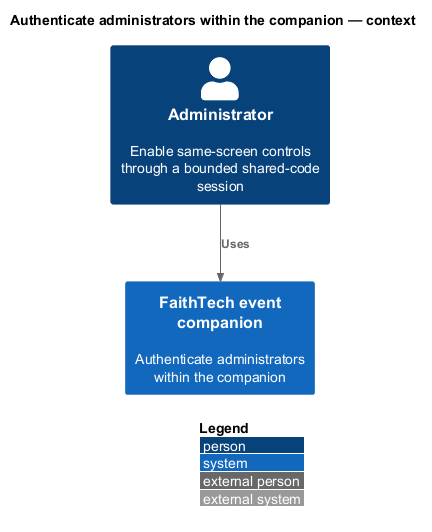
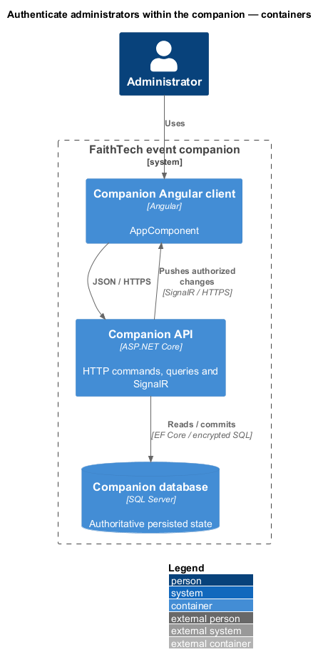
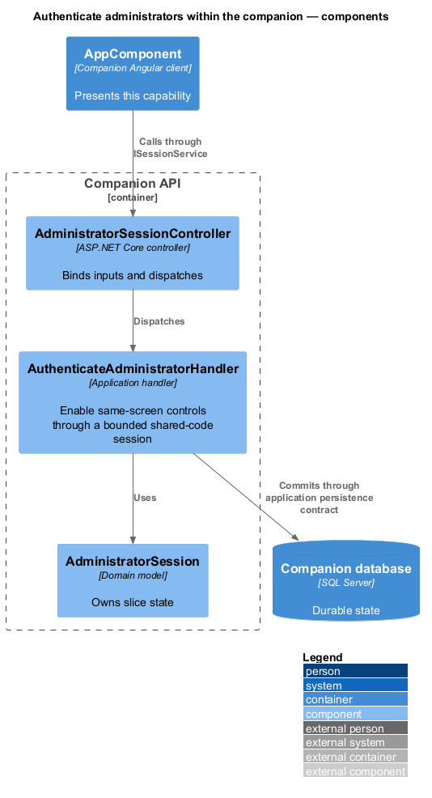
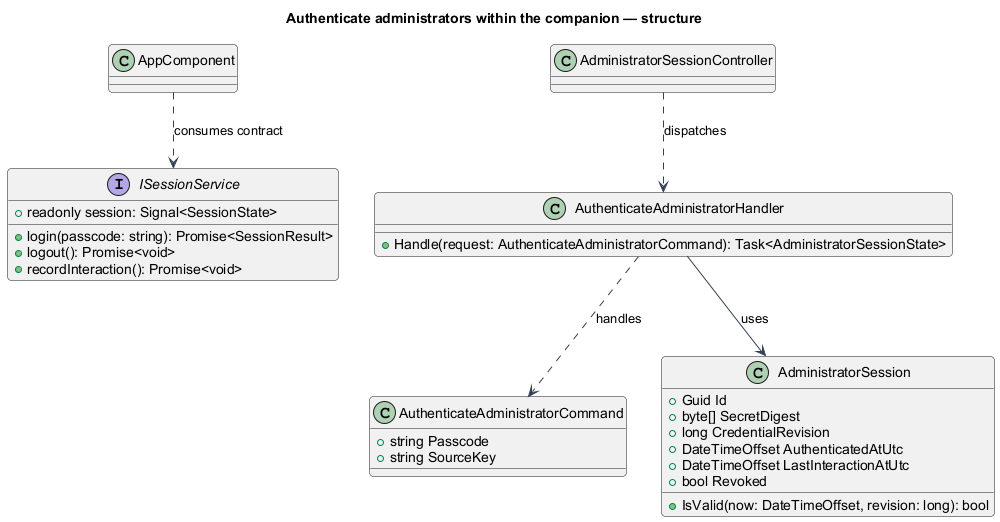
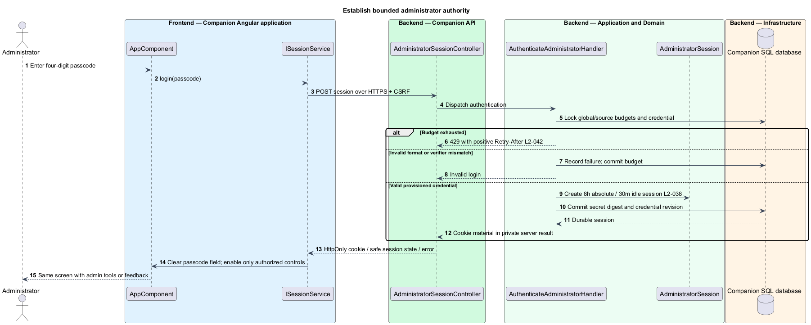
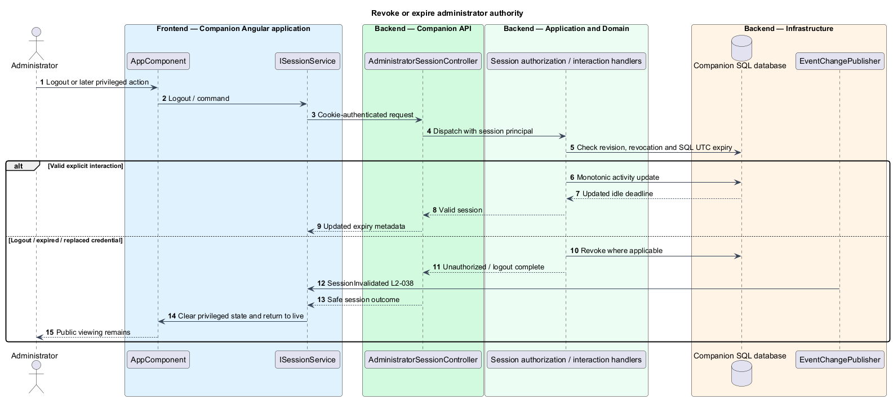

# Authenticate administrators within the companion

## Overview

An administrator session is server authority to use privileged controls in the same four-screen app. The shared passcode identifies an authorized session, not a named person. Login requires exactly four ASCII digits and no username or participant entry.

## Description

`AppComponent` opens the approved Cornerstone login overlay from any screen. `ISessionService` / `SESSION_SERVICE` and `SessionService` replace mock `login()` with asynchronous HTTP and readonly signals. Existing `AdministratorSessionController`, `AuthenticateAdministratorHandler`, cookie-event hooks, and interaction handler retain their responsibilities but replace Identity username/password contracts with the proposed shared credential model.

`POST /api/admin/session` accepts `{passcode}` over HTTPS with antiforgery and strict origin validation. No trimming or numeric conversion is applied: “0042” is distinct from “42”. Validation enforces four ASCII digits. The SQL-backed budget checks five failures/source and twenty/deployment per rolling five minutes before comparing the verifier; invalid-format attempts count as failed checks as well. No provisioned credential returns a redacted configuration failure without a fallback code. The protected verifier format and locking are defined in [passcode replacement](../replace-passcode/README.md).

A successful login commits a session with 256-bit random credential digest and current credential revision, then issues a Secure/HttpOnly/SameSite=Strict cookie scoped `/api/admin`. Only an opaque random secret travels in the cookie. Absolute expiry is login+8 hours; idle expiry is LastInteractionAtUtc+30 minutes. `GET /api/admin/session` returns capabilities and expiry metadata without session ID or secret. `POST /api/admin/session/interaction` records explicit keyboard/pointer-driven app interaction, coalesced to at most once per 30 seconds and sent immediately if the prior report is older. The client uses trusted user events, not timers; background snapshot reads and SignalR messages never call it. The server refuses to revive an already-expired session. Concurrent reports update activity monotonically.

`DELETE /api/admin/session` revokes that session and expires its cookie. Session loss closes private streams, removes roster/drafts/capabilities, and routes the app to the public live screen. New login replaces any old session cookie. Other browsers receive no authority; same-profile tabs sharing the production cookie observe login/logout through reauthorization, unlike the mock's tab isolation.

Every privileged handler rechecks revocation, revision and SQL UTC expiry. A 250 ms `SessionInvalidationWatcher` checks connected sessions and sends content-free invalidation within the two-second target. Default SignalR connection authentication is insufficient for later credential changes: Microsoft documents that the principal is captured at connection establishment. The proposed watcher and per-request checks supplement it. [SignalR authentication lifecycle](https://learn.microsoft.com/en-us/aspnet/core/signalr/authn-and-authz?view=aspnetcore-10.0).

Commands and queries use the [shared architecture and protocol](../../README.md#shared-architecture-and-protocol). The following acceptance scenarios are design obligations, not executed test evidence.

- Given leading zeros, invalid format, or no configured credential, when login is attempted, then only the exact provisioned four-digit value authenticates.
- Given idle/absolute expiry, logout, or revision change, when a privileged action follows, then it fails and connected private views clear.
- Given background updates for 30 minutes without user interaction, when access is attempted, then the session has expired.

## Requirements

The source text below is reproduced verbatim, including its original obligation wording.

| L2 ID | Refines (L1) | Requirement |
|---|---|---|
| [L2-038](../../../specs/L2.md#l2-038-shared-four-digit-administrator-login) | L1-013 | An Admin action must open an inline Cornerstone login panel/dialog from any current screen. Login requires exactly four ASCII digits, including leading zeros, and no username or participant entry. A successful login enables the administrator's controls only in that browser session. The server must validate authority for every privileged read/mutation and SignalR subscription/action. Administrator sessions expire at 30 minutes without explicit user interaction or eight hours after login, whichever occurs first; background updates do not renew activity. Logout returns to the live public screen and clears privileged drafts/data. There is no production default passcode or public setup route. |
| [L2-041](../../../specs/L2.md#l2-041-protect-credentials-and-browser-sessions) | L1-013 | Production must use HTTPS and Secure, HttpOnly, SameSite cookies for private entry/admin sessions, with server-side revocation and cross-site request protection. Session credentials must have at least 128 bits of cryptographic randomness. Passcodes and session secrets must not appear in URLs, logs, analytics, or script-readable persistent storage. Store the four-digit passcode as a salted nonrecoverable verifier; protect database/backups and the verifier from public reads. The short passcode has only 10,000 possible values, so rate limits and restricted verifier access remain required; hashing does not make it a high-entropy password. Direct database replacement must support this storage format without requiring the operator to use the CLI. |
| [L2-042](../../../specs/L2.md#l2-042-bounded-abuse-and-retry-feedback) | L1-013 | Administrator login must allow at most five failed passcode checks per source address in a rolling five minutes and 20 across the deployment in a rolling five minutes. After either limit is exhausted, reject further checks with a positive Retry-After value until failures age out. Throttled attempts do not extend the window. Counters must survive service restart and be shared by instances. Public email submissions must be limited to 60 attempts per source per minute, with syntax/duplicate attempts included and no permanent lockout. Shared-venue IPs must support the normal event-entry burst. These limits are specification defaults and must be documented in the operator runbook. |

## Diagrams

The context identifies the actor and the capability within the companion.

The container view distinguishes browser or operator execution from durable server state.

The component view scopes the named building blocks to this feature.

The class view shows the proposed contract, request, state, and dependencies.

The persistent failure budget runs before verification and session creation.

Active connections and subsequent requests both respond to authority loss.

