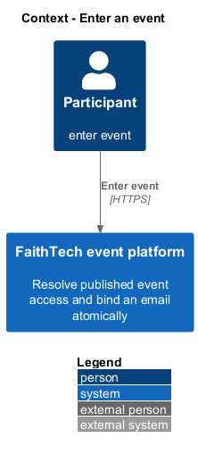
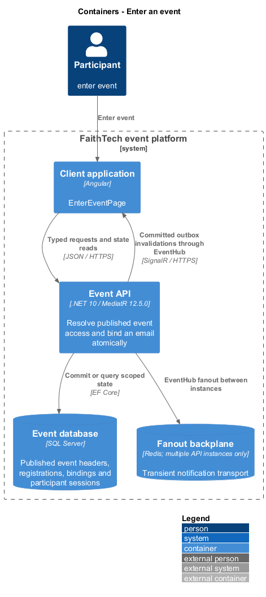
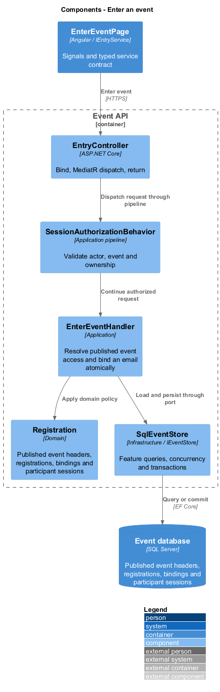
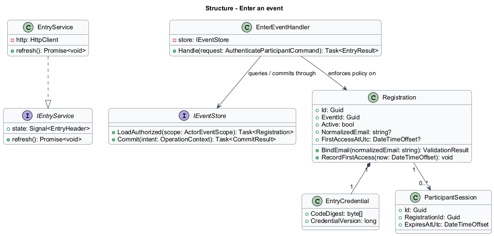
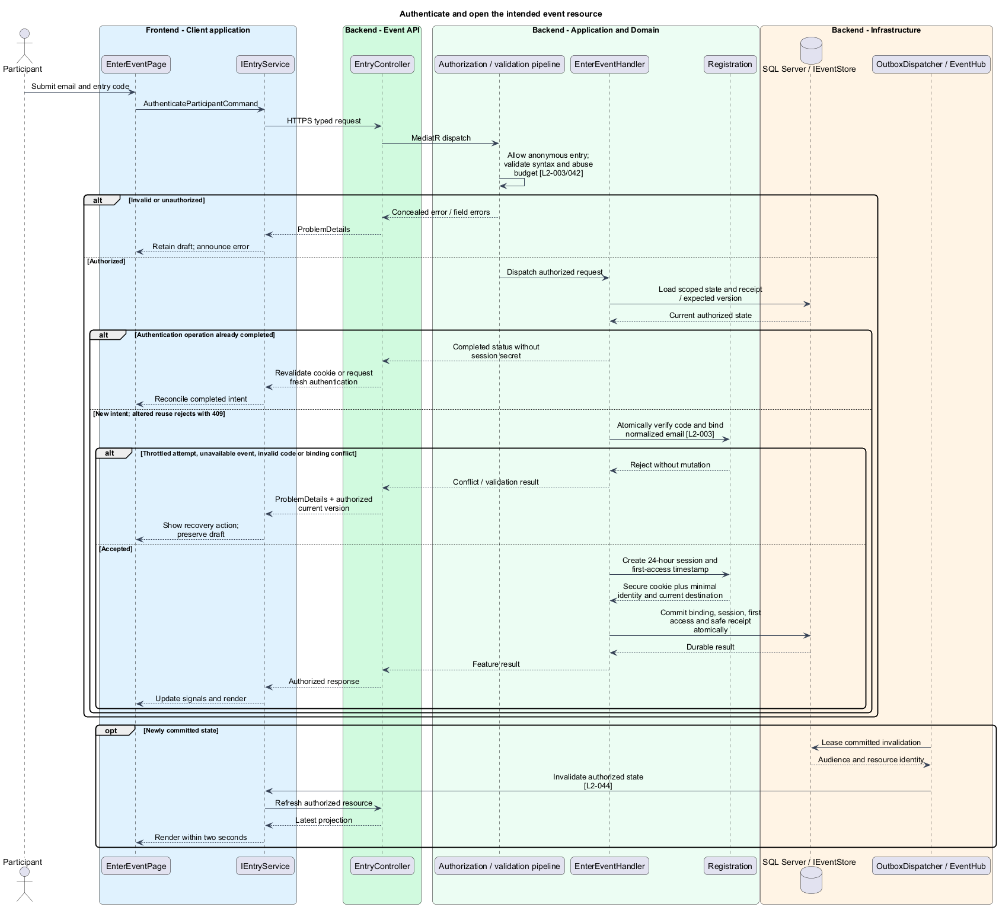
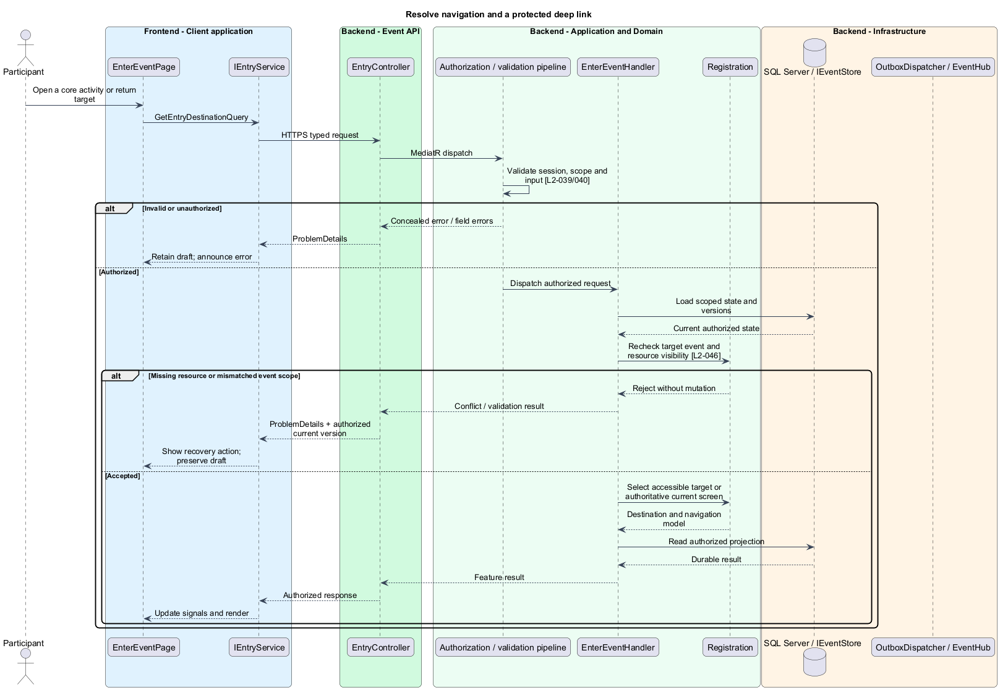

# Enter an event

## Overview

An event link identifies one gathering before authentication. An entry code is an administrator-issued secret belonging to one roster entry. Successful access binds that entry to an email and opens either the intended protected destination or the authoritative current event screen.

## Description

This proposed slice follows the [shared architecture contracts](../../README.md). `EnterEventPage` owns routing and dialogs; domain components consume `IEntryService` through `ENTRY_SERVICE`. `EntryService` implements HTTP access in `api`.

`/events/:eventId/access` hosts `EnterEventPage`. Anonymous `GET /api/events/{eventId}/entry` returns only `EntryHeader { eventId, title }` for published events. Unknown and draft IDs return the same unavailable response. There is no public event-directory endpoint.

`POST /api/events/{eventId}/session` accepts `AuthenticateParticipantCommand { email, entryCode, operationId }` over HTTPS. `IEntryService.authenticate` sends secrets in the body and clears the code control after completion. `EmailNormalizer` trims and case-folds consistently before lookup; syntax validation remains distinct from generic credential denial. No verification email is sent.

`EnterEventHandler` first checks shared rolling failure limits, then verifies the event-scoped credential digest. A transaction locks the matching registration and applies active-state, credential-version, and existing-binding checks. An unbound entry receives the normalized email; the filtered active-email index prevents another active entry in that event from claiming it. Two different emails racing on one code produce exactly one binding. A matching bound email resumes the same identity. Denials reveal no other name or email.

The successful transaction records `FirstAccessAtUtc` only once and creates a participant session. Authentication completion receipts contain no email, code, or session secret. A lost cookie response is resolved by checking the current session and otherwise authenticating afresh; an old receipt never recreates a bearer credential. The event-scoped cookie path is `/api/events/{eventId}`, including that event's hub route. Separate event paths permit simultaneous sessions without confusing event identities.

`EntryResult` contains participant ID, event ID, absolute expiry, and the authorized initial route. `ReturnTargetPolicy` accepts only recognized relative routes within the selected event; external URLs and another event's route are rejected. The target is reauthorized after authentication. Missing or inaccessible resources show a generic unavailable state with a current-event action. Without a target, the snapshot selects countdown, current stage/waiting, or recap.

The client shell provides current event, schedule, teams/projects, people/profile, messages, quizzes, raffle, showcase, and sign-out. Navigation never grants mutation eligibility; the target activity reads the current server window. A change of event clears the prior view before checking the destination event session.

Acceptance verification races first bindings, varies email casing/whitespace, tests wrong-event and replaced codes, and checks generic unavailable responses. Page objects cover direct entry, protected deep-link return, an unavailable return target, event switching, and after-event recap entry.

## Requirements

The following verbatim primary excerpts link to their complete normative definitions and Given–When–Then acceptance criteria. Shared constraints apply as specified in the [architecture contracts](../../README.md).

| L2 ID | Refines (L1) | Requirement excerpt |
|---|---|---|
| [L2-003](../../../specs/L2.md#l2-003-first-access-and-email-binding) | `L1-002` | The access screen must accept an email and individual entry code for the selected event. First successful access must atomically bind a trimmed, case-insensitive email to that roster entry. Each normalized email must identify at most one active roster entry per event. No email-verification or email-delivery service is required by this version. |
| [L2-046](../../../specs/L2.md#l2-046-event-entry-and-participant-navigation) | `L1-002` | An event-specific link must identify the selected event before participant authentication and show its published title and access form. A public directory of events is not required. After authentication, entry must open the countdown, current stage/waiting content, or recap according to authoritative event time. Protected deep links must recheck the selected event's session; after authentication they must return to the requested accessible resource. Core navigation must offer the current event screen, schedule, teams/projects, people/profile, messages, quizzes, raffle, showcase, and sign-out without changing mutation windows. |

## Diagrams

Participant uses the event platform to enter event. The context isolates this capability from unrelated event activities.

The Client application calls the API for authoritative state. SQL Server retains published event headers, registrations, bindings and participant sessions; SignalR invalidations prompt authorized reads.

`EntryController` exposes the explicitly anonymous event header and authentication endpoints. `EnterEventHandler` applies throttling, credential verification, and atomic binding; protected destination resolution applies session authorization.

`Registration` carries stable identity and feature state. The service interface separates Angular consumers from HTTP; `IEventStore` represents the application persistence boundary. Method shapes are slice-specific views of the shared contracts.

Authenticate and open the intended event resource applies atomically verify code and bind normalized email [l2-003]. Throttled attempt, unavailable event, invalid code or binding conflict leaves committed state unchanged; the client retains enough context to recover.

Resolve navigation and a protected deep link applies recheck target event and resource visibility [l2-046]. Missing resource or mismatched event scope leaves committed state unchanged; the client retains enough context to recover.

