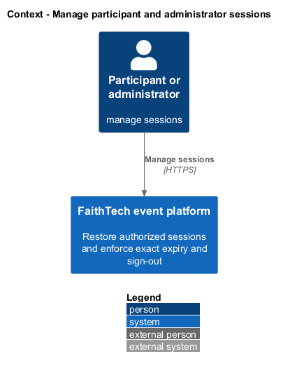
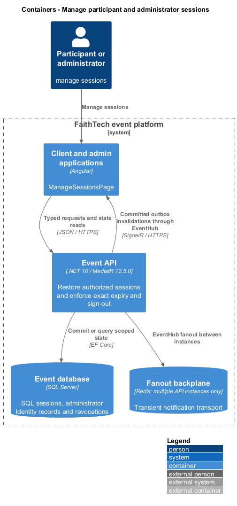
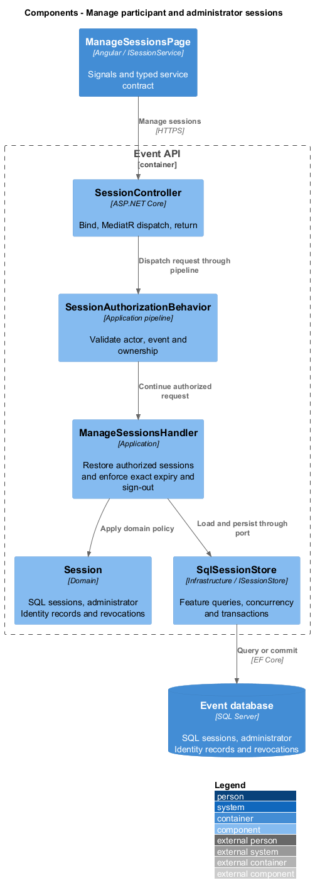
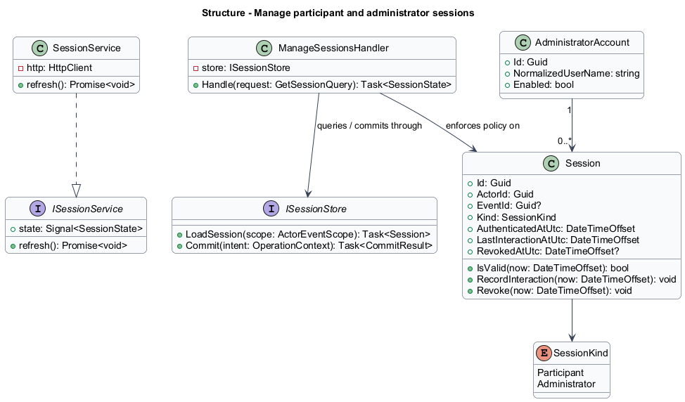
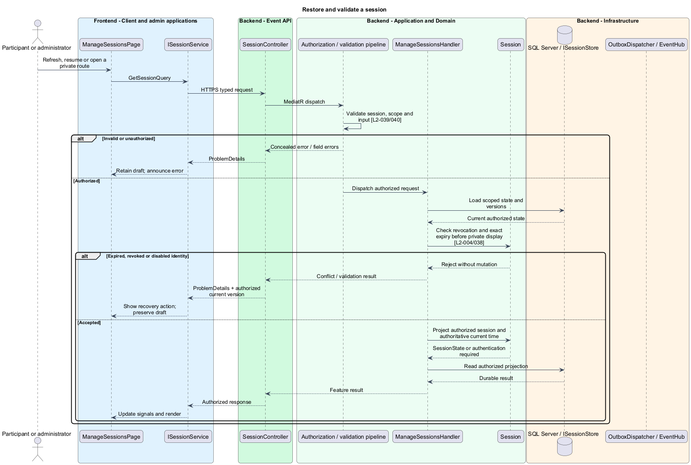
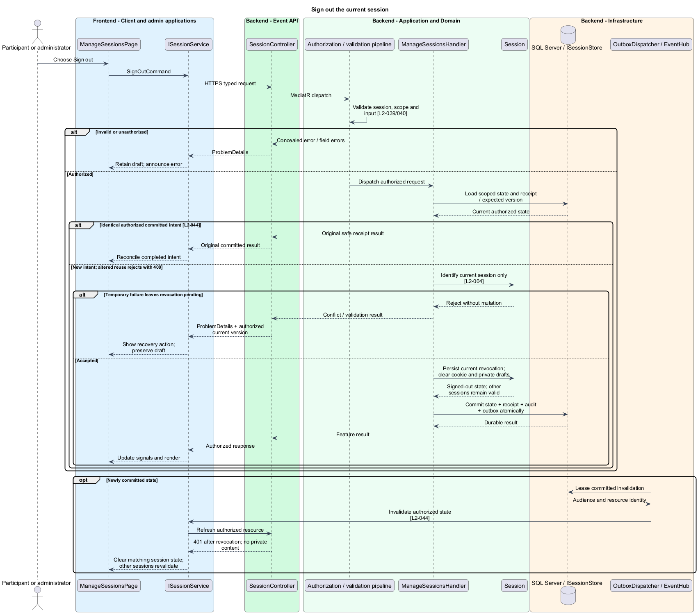
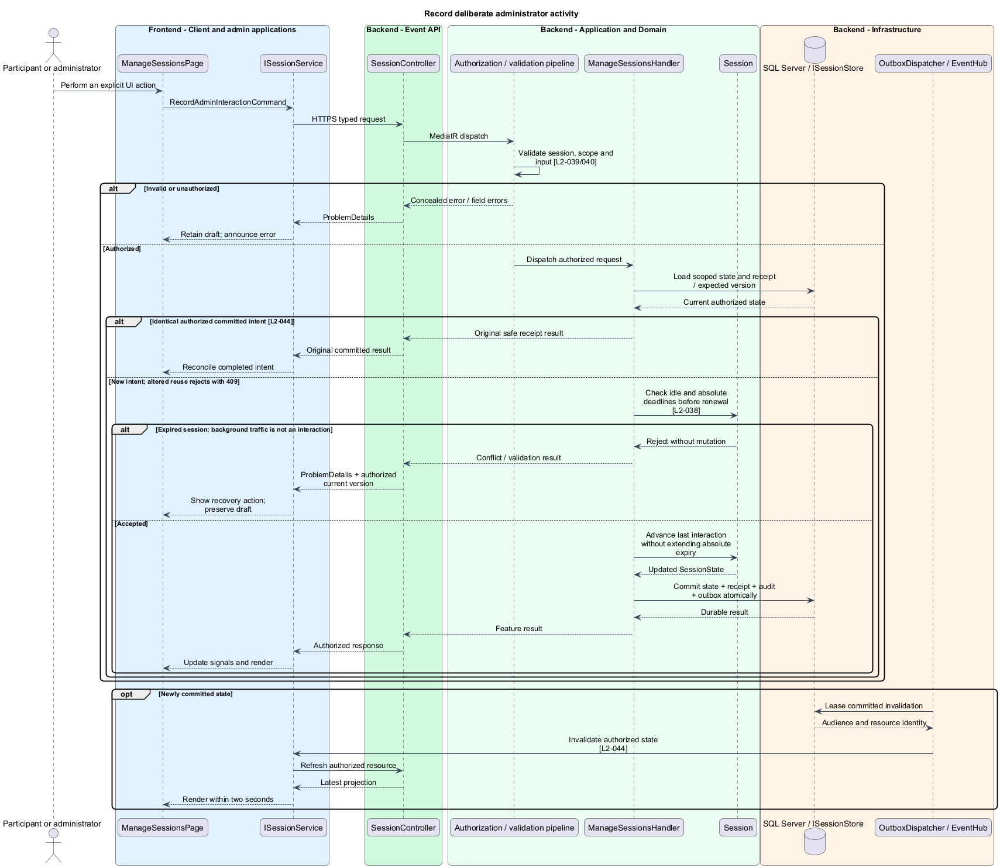
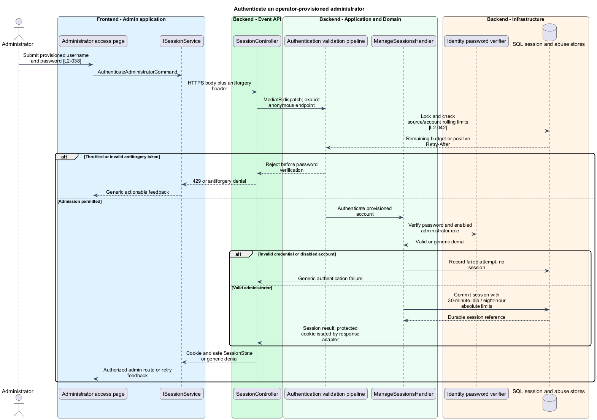

# Manage participant and administrator sessions

## Overview

A session represents one authenticated browser context. Participant sessions grant access to a selected event; administrator sessions grant the deployment-wide administrator role. Expiry and sign-out remove access without deleting durable event history.

## Description

This proposed slice follows the [shared architecture contracts](../../README.md). `ManageSessionsPage` owns routing and dialogs; domain components consume `ISessionService` through `SESSION_SERVICE`. `SessionService` implements HTTP access in `api`.

`ManageSessionsPage` denotes the access/session screens in both applications. The client shell injects `ISessionService` through `SESSION_SERVICE`; the administrator composition binds the same contract to its administrator endpoint scope. `SessionState` contains authentication state, actor ID, selected event ID, server time, and absolute/idle expiry instants, without a bearer secret.

Participant routes are `GET` and `DELETE /api/events/{eventId}/session`. Administrator routes are `POST`, `GET`, and `DELETE /api/admin/session`, plus `POST /api/admin/session/interaction`. `AuthenticateAdministratorCommand` accepts username/password; `GetSessionQuery`, `SignOutCommand`, and `RecordAdminInteractionCommand` handle continuity. `ManageSessionsHandler` uses `ISessionStore`; `SessionAuthorizationBehavior` checks SQL-backed validity on every protected request.

ASP.NET Core Identity stores provisioned administrator accounts and password hashes. An operator CLI under `backend/src/FaithTechTorontoAiBuildEvent.Provisioning` accepts secret input without echo and provisions or disables named accounts through application services. No default account, public registration, or role-elevation endpoint exists. Disabled accounts revoke their sessions. Authentication uses the shared generic failure and SQL throttling policies.

Participant expiry is `AuthenticatedAtUtc + 24 hours`. Administrator expiry is the earlier of `AuthenticatedAtUtc + 8 hours` and `LastInteractionAtUtc + 30 minutes`. Equality is expired. Explicit navigation, form actions, or other deliberate input may post a coalesced interaction request; polling, SignalR, restored-tab checks, and automatic transitions never extend idle time. An expired interaction request cannot revive a session.

`ISessionStore` persists the protected-cookie reference, actor, kind, event scope, expiry inputs, and revocation state. Participant cookies use the selected event API path; administrator cookies use `/api/admin`. Refresh resolves the existing record rather than issuing a sliding participant lifetime. A login creates a new session; reauthentication after the event restores the recap without reopening mutations.

Sign-out revokes the current session atomically and expires its cookie. The browser immediately hides private content and clears signals and drafts for that session, including open tabs sharing it. Other valid sessions remain authorized. The UI may clear itself during an offline sign-out attempt, but reports server revocation as pending until contact confirms it; a local clear alone is not a claimed server revocation.

`SessionGuard` conceals private routes before initial, history, pageshow, and restored-tab validation. An in-memory expiry timer uses the last server sample and clears content at known expiry even offline. Remote invalidation clears connected private views within two seconds after receipt. No credential or private draft enters localStorage, sessionStorage, IndexedDB, or cached HTML responses.

Acceptance scenarios exercise exact 24-hour, 30-minute, and eight-hour boundaries; repeated background traffic; explicit interaction; two independent sessions; shared-session tabs; revoked credentials; browser back; and after-event reauthentication. Administrator tests prove anonymous/non-admin denial for every protected route and verify that invalid credentials remain generic.

## Requirements

The following verbatim primary excerpts link to their complete normative definitions and Given–When–Then acceptance criteria. Shared constraints apply as specified in the [architecture contracts](../../README.md).

| L2 ID | Refines (L1) | Requirement excerpt |
|---|---|---|
| [L2-004](../../../specs/L2.md#l2-004-session-continuity-and-sign-out) | `L1-002` | Participant sessions must survive refresh and remain valid for 24 hours after authentication unless revoked. Participants must be able to authenticate again after the event to view its recap. Sign-out must revoke the current session and clear private client state. |
| [L2-038](../../../specs/L2.md#l2-038-administrator-authentication-and-authorization) | `L1-013` | Administration must require authentication to an operator-provisioned account with the admin role. There must be no public admin registration, default production password, or participant-driven role grant. Authorization must be enforced for every administration read and mutation, including direct requests. Administrator sessions must expire after 30 minutes of inactivity or eight hours total and support sign-out. |

## Diagrams

Participant or administrator uses the event platform to manage sessions. The context isolates this capability from unrelated event activities.

The Client and admin applications calls the API for authoritative state. SQL Server retains sql sessions, administrator identity records and revocations; SignalR invalidations prompt authorized reads.

`SessionController` dispatches through the application pipeline. `ManageSessionsHandler` owns the feature policy and uses the persistence port.

`Session` carries stable identity and feature state. The service interface separates Angular consumers from HTTP; `IEventStore` represents the application persistence boundary. Method shapes are slice-specific views of the shared contracts.

Restore and validate a session applies check revocation and exact expiry before private display [l2-004/038]. Expired, revoked or disabled identity leaves committed state unchanged; the client retains enough context to recover.

Sign out the current session applies identify current session only [l2-004]. Temporary failure leaves revocation pending leaves committed state unchanged; the client retains enough context to recover.

Record deliberate administrator activity applies check idle and absolute deadlines before renewal [l2-038]. Expired session; background traffic is not an interaction leaves committed state unchanged; the client retains enough context to recover.

Administrator authentication checks the provisioned account and abuse budget before creating a session. Passwords and session secrets remain outside diagnostic and receipt projections.

