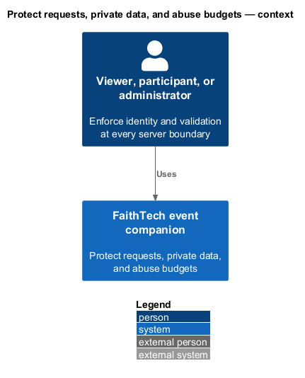
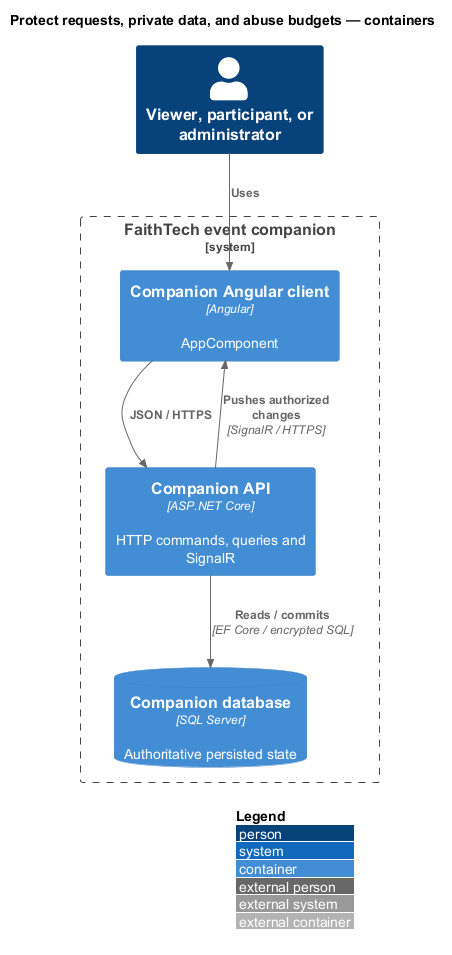
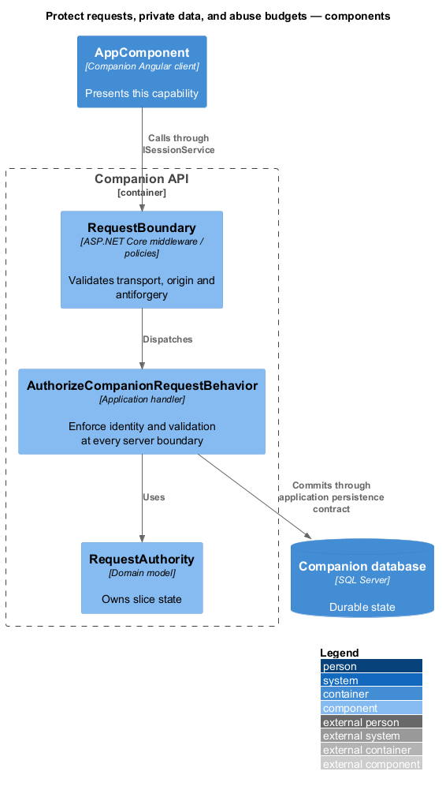
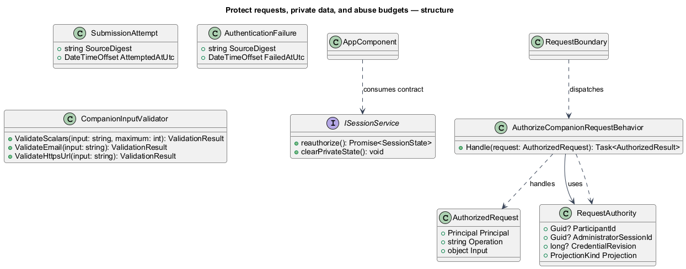
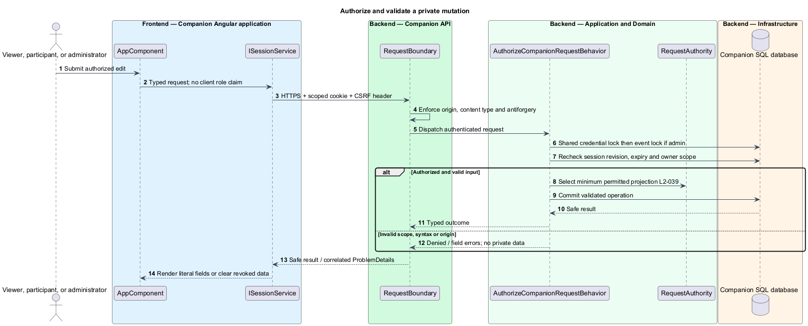
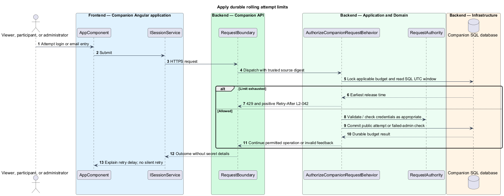

# Protect requests, private data, and abuse budgets

## Overview

Public projections are safe for the venue display; private projections contain only data authorized for the requesting session. Request protection combines server-derived identity, input validation, cross-site protection, and durable attempt budgets. Client flags and knowledge of IDs never grant access.

## Description

Proposed `RequestBoundary` denotes configured middleware and endpoint policies, not a controller containing business logic. `AuthorizeCompanionRequestBehavior` and `CompanionInputValidator` execute around MediatR handlers. Existing `ApiExceptionHandler`, antiforgery endpoints, `HttpRequestSource`, cookie events, and `AuthenticationBudget` supply reusable patterns, with revised contracts and thresholds.

A request-authority matrix applies uniformly: anonymous viewers read public event/project/team/raffle projections; a participant session reads/updates only its derived owner identity; an administrator session reads the roster and executes admin commands. No request accepts a client-supplied role. Private SignalR endpoints authenticate their cookie scheme and exact configured HTTPS origin on negotiate and connection; no arbitrary subscription/group method exists. A reverse proxy forwards source addresses only from explicitly configured trusted proxies. Public responses exclude private fields, all session identifiers, verifier metadata, and raw errors.

All mutations, including receipt bootstrap and login, require antiforgery cookie/header pairs from `GET /api/event/antiforgery`, exact same-origin checks, and JSON content type. Private cookies are Secure, HttpOnly, SameSite=Strict with `/api/admin` or `/api/participant` scope. HTTPS-only hosting, no-store responses, no persistent client private caches, and clearing on pagehide/resume validation protect history restoration. Secret-bearing body/SQL parameter logging, EF sensitive-data logging, and production browser diagnostics are disabled. Cookies and SQL connection strings are redacted. The app does not put credentials in query parameters or use bearer access-token URLs.

All privileged transactions acquire a transaction-owned shared `CompanionCredential` application lock before the event-row lock, then verify revision/expiry. Credential replacement takes the exclusive version of that lock. This ordering linearizes replacement against in-flight authority checks without deadlock. Public event transactions take only the event lock. Read transactions similarly check authority while capturing a coherent private projection. A response already delivered cannot be recalled, but later requests and resynchronization cannot recover revoked data.

`SqlAbuseBudget` uses durable rows and transaction-owned locks, with SQL UTC rolling windows. Admin checks serialize on the deployment budget (then source and credential); five failed checks/source or twenty/deployment in five minutes block further checks before verification. Invalid syntax counts as failure. Positive Retry-After is the ceiling until enough failures expire, with minimum one second. Throttled checks add no row and do not prolong a window. Successful checks do not erase prior failures. Public submission budgets serialize per source: every syntactic, duplicate, stale, or valid email submission consumes one of sixty attempts/minute. Private receipt bootstrap has a separate sixty/source/minute budget to bound abandoned receipt allocation; this design default permits the specified seventeen-entry burst. Counters persist across instances/restarts; cleanup deletes only expired rows.

Source digests use HMAC-SHA256 with a protected stable deployment key; this key stays unchanged across ordinary restarts and is shared across instances. Receipt cleanup retains valid recovery for its original eight-hour period. All text is trimmed with LF line endings, measured in Unicode scalars, and rendered literally. Email syntax uses a single @, nonempty parts, syntactically valid domain, and no whitespace/control characters. URLs require absolute HTTPS without userinfo; the server never dereferences them.

Commands and queries use the [shared architecture and protocol](../../README.md#shared-architecture-and-protocol). The following acceptance scenarios are design obligations, not executed test evidence.

- Given substituted participant IDs or guessed SignalR groups, when requested, then no private content is disclosed.
- Given exact scalar limits and one-over inputs including supplementary Unicode characters, when saved, then only valid boundaries pass.
- Given five source or twenty deployment failures, when another instance/restart checks a correct code, then it is still throttled before verification.
- Given seventeen valid entries from one venue address in ten seconds, when submitted, then all fit the budget.
- Given cross-site mutation or privileged transport, when processed, then it is rejected without a state change.

## Requirements

The source text below is reproduced verbatim, including its original obligation wording.

| L2 ID | Refines (L1) | Requirement |
|---|---|---|
| [L2-039](../../../specs/L2.md#l2-039-public-and-private-data-boundaries) | L1-013 | Public HTTP/SignalR responses must contain only event copy, projects, team public labels/memberships, and public raffle state. Participant email and optional answers are visible only to that participant's valid entry session and administrators. Full roster access is administrator-only; administrator capability must not be inferred from public group membership. Name/public-label display must be explained before entry/profile save. Public responses must exclude passcodes, verifiers, session identifiers, and internal failure details. |
| [L2-040](../../../specs/L2.md#l2-040-validate-text-emails-and-links) | L1-013 | The server must validate all inputs. Email is required, at most 254 characters, with one nonempty local part and domain separated by @, no whitespace/control characters, and a syntactically valid domain; plus-tags and subdomains are accepted. Optional name and required project title are limited to 200 characters; each optional answer and required project description to 2,000; optional repository/demo URLs to 2,048. Text is trimmed and line endings normalized to LF; limits count Unicode scalar values. Optional blank values clear a field. All free text is rendered literally, never executable HTML. URLs must be absolute HTTPS without embedded credentials. The API must never fetch submitted project URLs. No file upload feature is required. |
| [L2-041](../../../specs/L2.md#l2-041-protect-credentials-and-browser-sessions) | L1-013 | Production must use HTTPS and Secure, HttpOnly, SameSite cookies for private entry/admin sessions, with server-side revocation and cross-site request protection. Session credentials must have at least 128 bits of cryptographic randomness. Passcodes and session secrets must not appear in URLs, logs, analytics, or script-readable persistent storage. Store the four-digit passcode as a salted nonrecoverable verifier; protect database/backups and the verifier from public reads. The short passcode has only 10,000 possible values, so rate limits and restricted verifier access remain required; hashing does not make it a high-entropy password. Direct database replacement must support this storage format without requiring the operator to use the CLI. |
| [L2-042](../../../specs/L2.md#l2-042-bounded-abuse-and-retry-feedback) | L1-013 | Administrator login must allow at most five failed passcode checks per source address in a rolling five minutes and 20 across the deployment in a rolling five minutes. After either limit is exhausted, reject further checks with a positive Retry-After value until failures age out. Throttled attempts do not extend the window. Counters must survive service restart and be shared by instances. Public email submissions must be limited to 60 attempts per source per minute, with syntax/duplicate attempts included and no permanent lockout. Shared-venue IPs must support the normal event-entry burst. These limits are specification defaults and must be documented in the operator runbook. |

## Diagrams

The context identifies the actor and the capability within the companion.

The container view distinguishes browser or operator execution from durable server state.

The component view scopes the named building blocks to this feature.

The class view shows the proposed contract, request, state, and dependencies.

Identity comes from server session state and remains checked within the transaction boundary.

A throttled request neither verifies a passcode nor extends the failure window.

