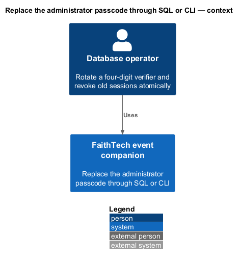
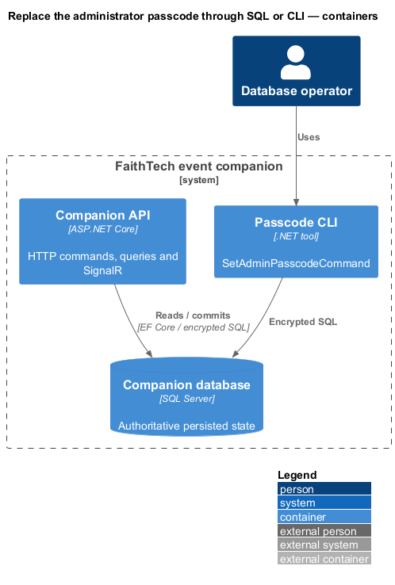
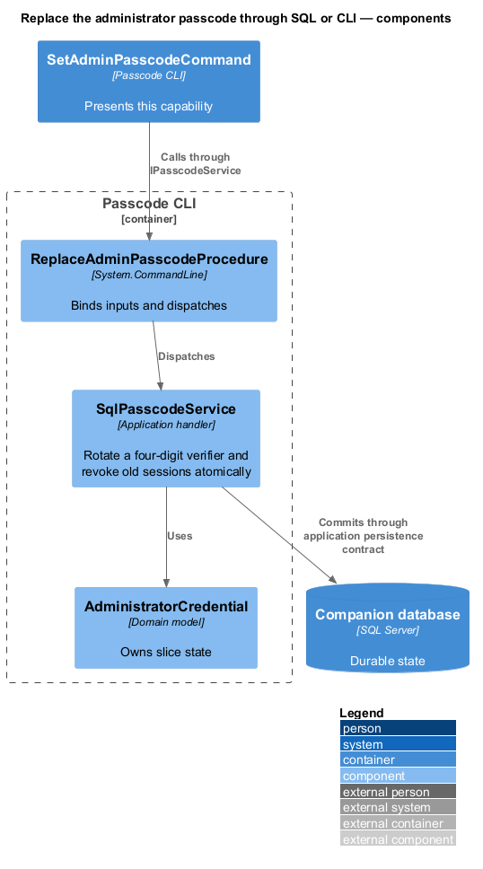
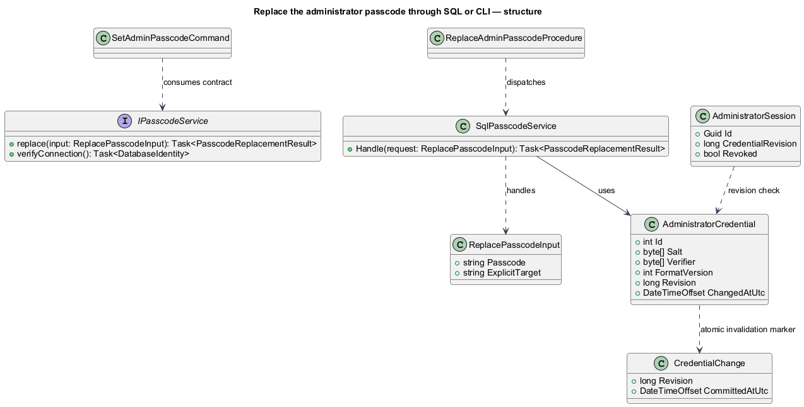
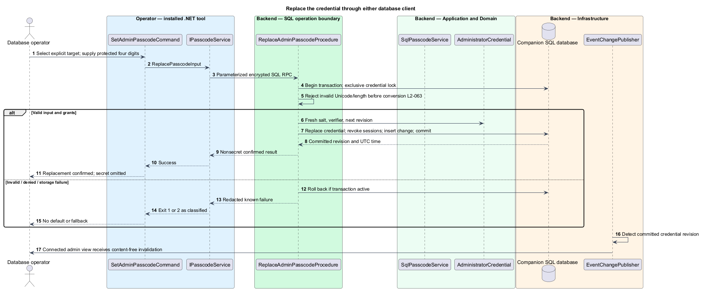
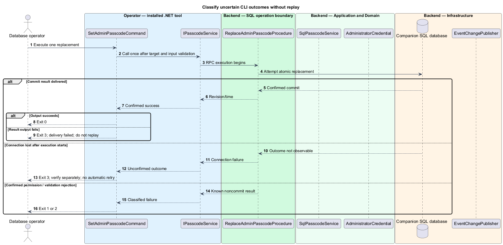

# Replace the administrator passcode through SQL or CLI

## Overview

Passcode replacement is a database-authorized operation, independent of browser login and the previous passcode. Direct SQL and the installed tool perform the same atomic change. Every successful replacement, including the same value, creates a new credential revision and invalidates existing administrator sessions.

## Description

The fresh database exposes proposed `dbo.ReplaceAdminPasscode @Passcode nvarchar(max)` with no default. A deliberately unbounded input parameter avoids implicit truncation before validation. The procedure rejects NULL, any DATALENGTH other than eight bytes, and any of the four Unicode code units outside ASCII 48–57. It never trims or converts to a number, preserving leading zeros. It runs with XACT_ABORT and TRY/CATCH rollback, takes the exclusive transaction-owned `CompanionCredential` application lock, and rejects an unsupported/malformed existing credential format rather than selecting a fallback.

Proposed format version 1 stores a fresh 32-byte salt from `CRYPT_GEN_RANDOM(32)` and `HASHBYTES('SHA2_512', domainBytes + salt + asciiDigits)`, where domainBytes is ASCII `FaithTech.Companion.Passcode.v1:` and asciiDigits is exactly four bytes after validation. Salt is binary(32), verifier binary(64). SQL and .NET use those identical bytes; .NET comparison uses FixedTimeEquals. This is a salted verifier for the expressly limited 10,000-value credential space, not a claim of password-KDF strength or resistance to offline enumeration after verifier theft. Restricted database/backups and online limits are essential parts of the specified model. SQL's SHA2_512 and cryptographic byte generator are documented primitives; the encoding/format above is this design's choice. [HASHBYTES](https://learn.microsoft.com/en-us/sql/t-sql/functions/hashbytes-transact-sql?view=sql-server-ver17), [CRYPT_GEN_RANDOM](https://learn.microsoft.com/en-us/sql/t-sql/functions/crypt-gen-random-transact-sql?view=sql-server-ver17).

The procedure inserts the initial singleton credential or replaces its salt/verifier, increments Revision, records ChangedAtUtc, revokes all administrator sessions, and inserts a content-free CredentialChange in one transaction. It returns only revision and UTC commit time. No participant/event row changes. Concurrent replacements serialize; the last commit wins. An empty credential store has no valid login until this operation provisions it. Unsupported raw edits neither initialize a default nor bypass validation.

The direct operation is a parameterized RPC from a normal SQL client over encrypted, certificate-validated transport: procedure name `dbo.ReplaceAdminPasscode`, input parameter `@Passcode`, SQL type NVarChar(MAX). The operator binds a protected temporary input rather than saving a literal EXEC statement with the secret. SQL-client history, clipboard retention, parameter tracing, and diagnostic capture are disabled or protected for this operation; the result grid contains revision/time only. The procedure performs all conversion without the API or CLI, so it works while the app is stopped. Deployment documentation includes a parameter-binding walkthrough for the chosen database client without recording the entered value.

Database grants are the authority. Existing app or operator principals with the necessary EXECUTE/underlying rights are sufficient; no app allowlist, browser account, old code, or special operator identity is added. Verifier reads remain restricted to authentication infrastructure and authorized database principals. Database-side records contain principal/action/revision/time, never parameters; app logs alone do not attribute direct changes.

The existing Provisioning project gains `SetAdminPasscodeCommand` and `IPasscodeService` / `SqlPasscodeService`. `faithtech-admin set-admin-passcode --target <name> --interactive` uses a masked prompt; `--passcode-stdin` is the mutually exclusive alternate. Missing/both modes fail before connecting. The command resolves and displays the actual server/database, validates transport and input, then calls the same stored operation once. Read-only `verify-connection` does not authenticate a guessed passcode. The CLI has no secret argument, old-code option, or automatic write retry.

Exit codes are 0 confirmed success, 1 confirmed operational/permission failure, 2 syntax/config/input or cancellation before execution, and 3 unconfirmed commit or result delivery. A lost connection after execution begins is uncertain unless a rollback is positively confirmed. Output failure after known commit also returns 3 and identifies that success delivery failed without repeating the write. Later connection verification and any intentional new replacement are separate operator actions. All subsequent privileged requests compare the new revision; the watcher clears connected private views within two seconds. No restart or redeployment is needed.

Commands and queries use the [shared architecture and protocol](../../README.md#shared-architecture-and-protocol). The following acceptance scenarios are design obligations, not executed test evidence.

- Given the API stopped, when direct SQL sets a valid leading-zero code, then that exact code works on startup without any default credential.
- Given same-value or different-value replacement, when committed, then every old administrator session is invalid and event data is unchanged.
- Given invalid length, non-ASCII digits, whitespace, NULL, denied grants, or rollback, when attempted, then verifier and revision remain unchanged.
- Given SQL then CLI then SQL replacements, when API login is checked, then only the latest value works.
- Given connection loss after execution, when completion is unknown, then the CLI exits 3 without automatic replay.

## Requirements

The source text below is reproduced verbatim, including its original obligation wording.

| L2 ID | Refines (L1) | Requirement |
|---|---|---|
| [L2-063](../../../specs/L2.md#l2-063-replace-the-passcode-directly-through-the-database) | L1-016 | The database must expose a documented, supported direct SQL operation accepting a new four-digit value and performing any necessary verifier conversion and credential-revision update atomically. An operator must be able to execute it from a normal database client without the web API, CLI, or old passcode. The database operation must reject invalid format, preserve leading zeros, and leave event/participant data unchanged. A committed different passcode must invalidate all existing administrator sessions; using the same value deliberately must also rotate the credential revision and revoke sessions. No redeploy/restart is required. Raw unsupported edits must not create a fallback/default admin credential. |
| [L2-064](../../../specs/L2.md#l2-064-replace-the-passcode-through-the-installed-cli) | L1-016 | The CLI must provide `set-admin-passcode` with exactly one of masked interactive input or `--passcode-stdin`, and an explicit database target. It must use the same database replacement behavior as L2-063. Empty input, EOF, cancellation, invalid format, or invalid target must never select a default. Success confirms replacement without printing the passcode. Exit codes must be 0 confirmed success, 1 confirmed operation/authentication/permission failure, 2 invalid syntax/configuration/input or cancellation before execution, and 3 unconfirmed commit/result delivery. Connection loss after execution must not be reported as confirmed rollback or trigger automatic replay; verification and any deliberate replacement are separate operator actions. |
| [L2-051](../../../specs/L2.md#l2-051-database-operator-access-and-protected-input) | L1-013 | Database grants are the authority for direct/CLI replacement. Anyone with the necessary grants must be able to perform it without a browser login, old passcode, application account, or additional app-specific operator allowlist. Browser admin status alone grants no database rights. SQL connections must use encryption and server-certificate validation. The CLI must accept the new passcode through a masked prompt or explicit stdin mode, never command-line secret arguments. Direct SQL guidance must explain protected parameter input, verifier conversion, session invalidation, and avoiding saved plaintext SQL/history artifacts. |
| [L2-041](../../../specs/L2.md#l2-041-protect-credentials-and-browser-sessions) | L1-013 | Production must use HTTPS and Secure, HttpOnly, SameSite cookies for private entry/admin sessions, with server-side revocation and cross-site request protection. Session credentials must have at least 128 bits of cryptographic randomness. Passcodes and session secrets must not appear in URLs, logs, analytics, or script-readable persistent storage. Store the four-digit passcode as a salted nonrecoverable verifier; protect database/backups and the verifier from public reads. The short passcode has only 10,000 possible values, so rate limits and restricted verifier access remain required; hashing does not make it a high-entropy password. Direct database replacement must support this storage format without requiring the operator to use the CLI. |

## Diagrams

The context identifies the actor and the capability within the companion.

The container view distinguishes browser or operator execution from durable server state.

The component view scopes the named building blocks to this feature.

The class view shows the proposed contract, request, state, and dependencies.

Both entry points invoke the same atomic SQL operation; no browser authentication is involved.

Transport and output failures preserve the distinction between known rejection and an unconfirmed result.

