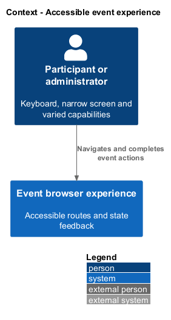
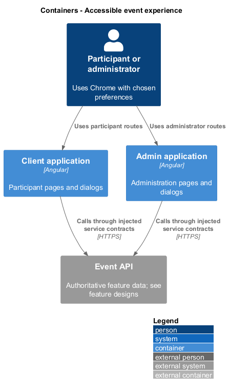
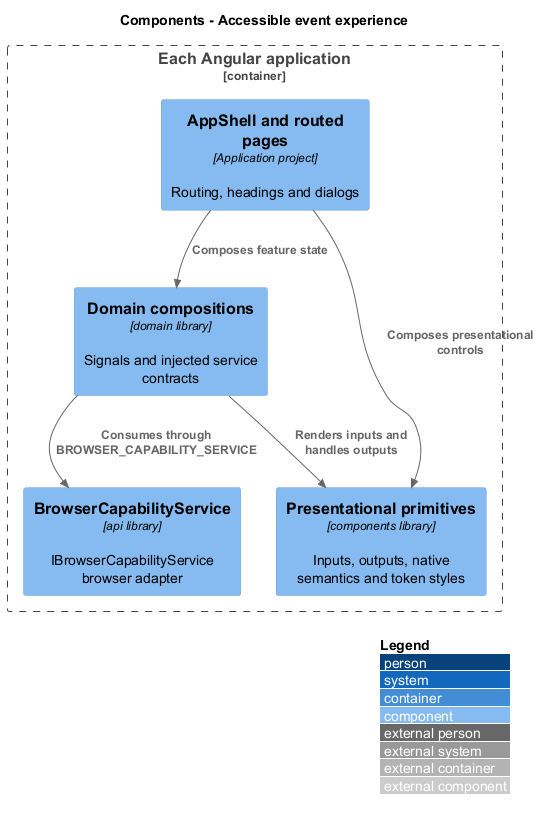
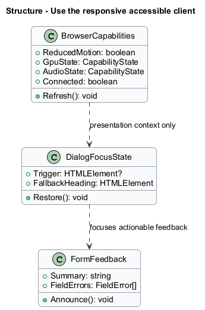
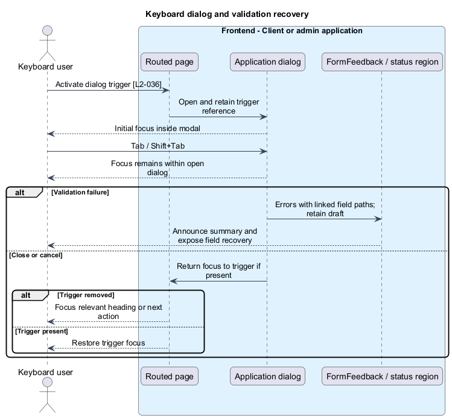
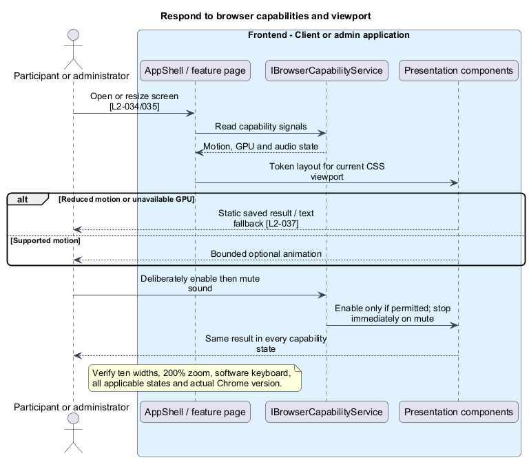

# Use the responsive accessible client

## Overview

The browser experience makes every event capability usable across the specified screen widths, keyboard interaction, motion preferences, and available hardware. Accessibility behavior belongs to each actual screen and state; a gallery result does not establish application acceptance.

## Description

This proposed slice composes shared behavior into each routed page in both Angular applications. `UseAccessibleClientPage` denotes that screen composition, not an additional product route. `IBrowserCapabilityService`, reached through `BROWSER_CAPABILITY_SERVICE`, exposes readonly capability signals and deliberate sound operations. Its browser adapter owns `matchMedia`, WebGPU probing, and audio lifecycle; domain components receive no direct HTTP dependency.

`AppShell` owns compact/wide navigation, routed headings, and a polite status region. `FormFeedback` maps server field paths to named controls and an announced error summary with focusable field links. Inputs retain submitted values after validation failure. Presentational primitives accept labels, values, error text, busy/disabled states, and emit typed intents; application dialogs own open/close decisions.

Native buttons, links, inputs, tables, and dialog semantics provide keyboard operation. Dialog focus enters on opening, stays within the open modal, and returns to the invoking control on close. If that control disappeared, `DialogFocusState` targets the relevant heading or next meaningful action. Errors and save outcomes announce once; countdown ticks remain silent. Automatic scheduled changes move focus only if the old focused content was removed. User navigation with an unsaved draft offers keep/discard; automatic stage changes preserve non-event activity drafts.

Every screen and relevant loading, empty, populated, saving, validation, failure, and unavailable state receives the ten-width matrix: 320, 575, 576, 767, 768, 991, 992, 1199, 1200, and 1440 CSS pixels. Below 576 pixels, primary composition is single-column with compact navigation. Tables may use a labeled local scroll region; the page itself does not overflow horizontally. At 200% zoom and with the software keyboard visible, primary actions, focused controls, and error recovery remain reachable. Layout dimensions come from authoritative `--cs-*` tokens.

Text contrast is at least 4.5:1 for ordinary text and 3:1 for large text; controls and focus indicators meet the required 3:1 distinction. Names and state labels supplement colour. Reduced motion suppresses nonessential movement and raffle effects while retaining state information. Audio starts muted, requires a deliberate enable gesture, fails silently without blocking the action, and stops immediately on mute.

Acceptance runs in the latest stable Chrome and records the actual browser version, OS, device scale, viewport, GPU/audio state, and motion preference. Unsupported or denied GPU/audio uses the defined text/CSS fallback. Restored tabs validate authentication before private display and render current state within two seconds after successful synchronization.

Playwright scenarios use one page object per screen, with selectors and interactions inside page objects. Tests bind service tokens to mocks and express user intent; real transport and synchronization receive separate integration evidence. Keyboard/focus, overflow, zoom, announced errors, motion, audio, and capability-denial cases are behavior checks. No test scans folder names or specification traceability.

## Requirements

The following verbatim primary excerpts link to their complete normative definitions and Given–When–Then acceptance criteria. Shared constraints apply as specified in the [architecture contracts](../../README.md).

| L2 ID | Refines (L1) | Requirement excerpt |
|---|---|---|
| [L2-034](../../../specs/L2.md#l2-034-chrome-and-capability-support) | `L1-012` | Acceptance must target the latest stable Google Chrome available on the verification date, recording its exact version and test operating system. Optional GPU and audio capabilities must be detected at runtime; access to event functionality must not depend on a successful GPU initialization or an audio permission grant. |
| [L2-035](../../../specs/L2.md#l2-035-responsive-screens-and-states) | `L1-012` | Every client, admin, and design-system screen must work in XS (<576px), S (576-767px), M (768-991px), L (992-1199px), and XL (>=1200px) widths. Below 576px, primary content must use one column and navigation must remain accessible in a compact form. Layout must preserve access to content and actions at larger widths without requiring a particular column count. |
| [L2-036](../../../specs/L2.md#l2-036-keyboard-semantics-and-readable-feedback) | `L1-012` | All interactive controls must have accessible names, visible focus, and keyboard operation. Dialogs must contain focus and return it to their trigger on dismissal. Errors must be associated with fields and announced; status changes must use accessible announcements without repeatedly reading every countdown tick. Normal text must have at least 4.5:1 contrast and large text and meaningful control boundaries at least 3:1. |
| [L2-037](../../../specs/L2.md#l2-037-motion-and-sound-controls) | `L1-012` | The site and applications must honor reduced-motion preferences and provide a participant-visible mute control for event effects. Sound must begin only after a deliberate enable-sound action and stop when muted. Essential information must never be conveyed only through motion, sound, or colour. |

## Diagrams

Participants and administrators operate the same event capabilities under different input, viewport, and hardware conditions.

Both Angular applications own their routed accessibility behavior. Existing feature APIs supply data; this slice introduces no new backend endpoint.

The application owns routing and dialogs, domain owns feature composition, and presentational primitives remain independent leaves. Browser capability access uses an injected contract.

In-memory capability, focus, and feedback types describe browser behavior. They persist no credential or private draft.

Dialog and validation behavior keeps the next action reachable. Focus recovery has an explicit fallback when the original trigger disappears.

Presentation responds to live preferences and capabilities without changing the saved feature result. Browser verification records the actual environment.

