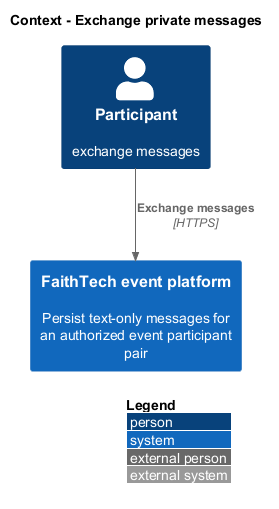
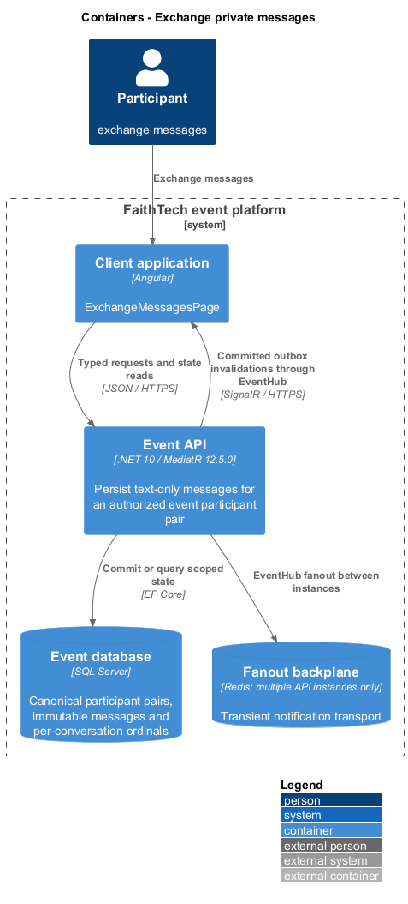
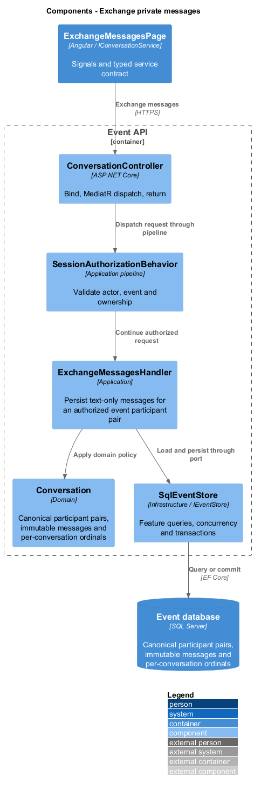
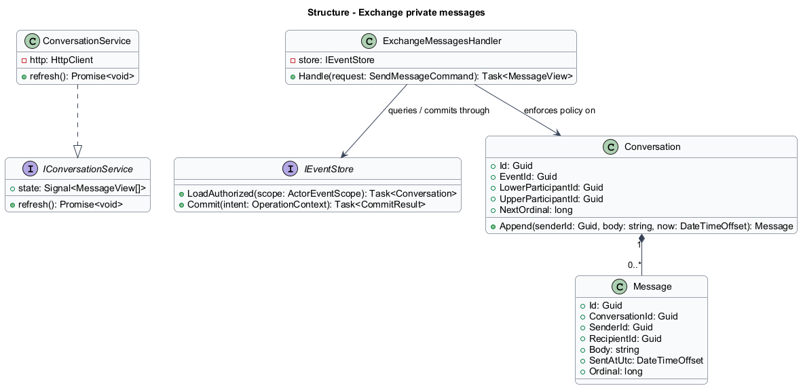
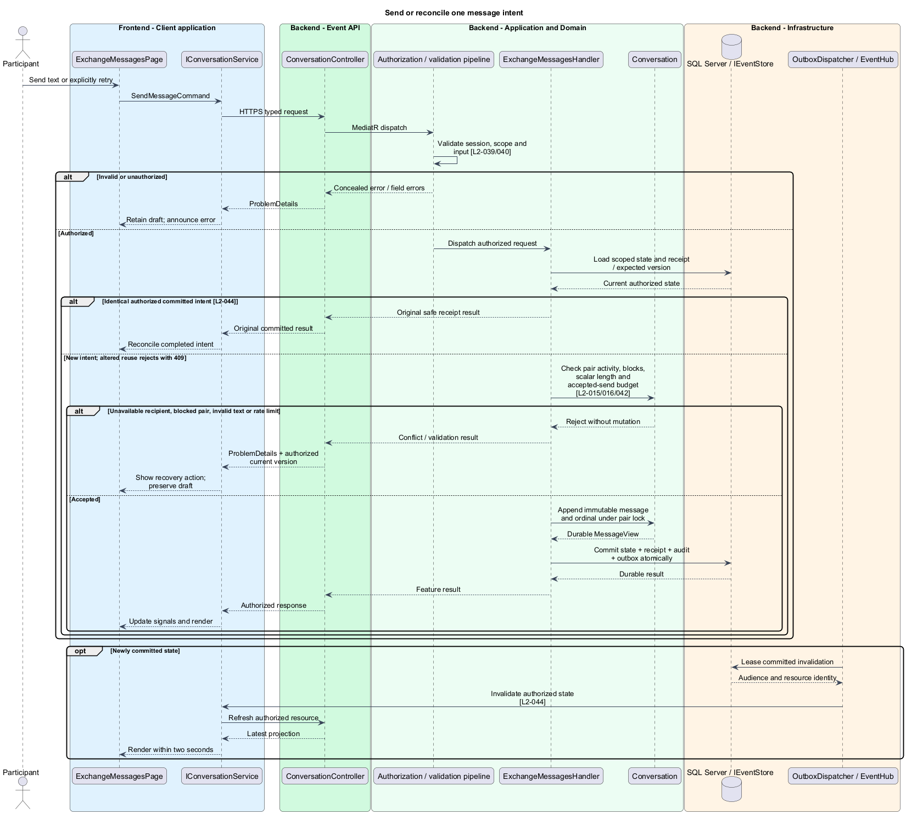
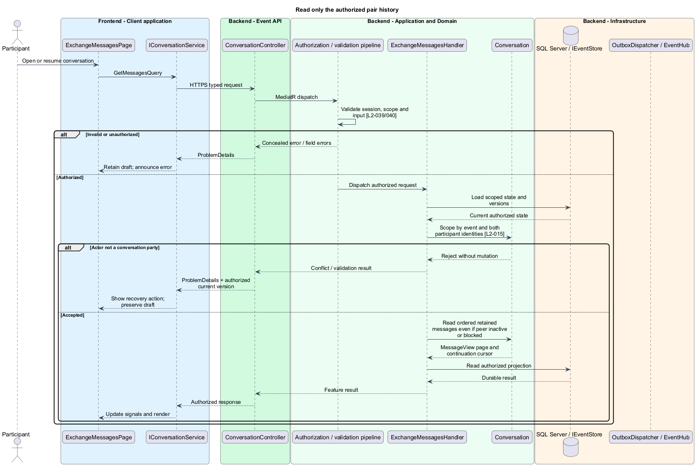

# Exchange private messages

## Overview

A conversation belongs to exactly two participant identities within one event. Each message has a stable identity, server timestamp, and ordering value. Sent status means durable acceptance; it does not indicate that the recipient read the message.

## Description

This proposed slice follows the [shared architecture contracts](../../README.md). `ExchangeMessagesPage` owns routing and dialogs; domain components consume `IConversationService` through `CONVERSATION_SERVICE`. `ConversationService` implements HTTP access in `api`.

`/events/:eventId/messages` lists the owner's conversations; `/:peerId` opens a pair. `GET /api/events/{eventId}/conversations` returns `ConversationSummary[]`. `GET/POST /conversations/{peerId}/messages` dispatch `GetMessagesQuery` and `SendMessageCommand { text, operationId }`. `IConversationService` exposes list, load, send, and explicit retry. `MessageView` contains IDs, body, event-local date/time display inputs, ordinal, and durable acceptance state.

`ExchangeMessagesHandler` derives the sender from the session and canonicalizes the pair by stable ID order. Unique `(EventId, LowerParticipantId, UpperParticipantId)` identifies the conversation; reads include both parties, never recipient alone. The owner may read retained history when the peer is inactive or either party has blocked the other. A sender's inactive registration or revoked session still denies access.

New sends require distinct active same-event identities, no block in either direction, and trimmed text of 1–2,000 Unicode scalar values. A pair guard serializes sends with block changes. The SQL transaction rechecks recipient activity and block state, applies the sender's distributed 30-per-minute accepted-send limit, increments the conversation ordinal, and stores the message, receipt, and private outbox invalidations. Message uniqueness and the intent receipt deduplicate a retry; a fresh operation ID permits a deliberate identical second message.

History uses ordered cursor pages by `(SentAtUtc, Ordinal)` with an index scoped to the conversation. Pair serialization assigns ordinals consistently when timestamps match. Display includes a date and time in the event timezone. Authorized receipts refer to the saved message ID; they do not become a separate broadly accessible copy of message text.

`MessageDraft` stays in memory under event, sender, and peer identity. Sending shows pending state; only a committed acknowledgement shows sent. A timeout leaves an unknown outcome that explicit retry reconciles with the same intent. A confirmed precommit failure preserves the draft and failure explanation. Reconnection refreshes history but never silently transmits an unsent draft. Profile sharing is unrelated to send eligibility.

Private invalidations target only the two parties; their adapters refetch authorized history within the connected deadline. No group chat, attachments, editing, deletion, delivery-to-device status, or read receipts are introduced. Administrators have no ordinary conversation browsing endpoint.

Acceptance checks isolate A/B from C/B, race a block against a send, deactivate a peer while a draft is open, retry after a committed response is lost, and send identical text as two new intents. Browser checks cover event-local timestamp ties, reconnect behavior, long text, and no unauthorized transcript in history navigation.

## Requirements

The following verbatim primary excerpts link to their complete normative definitions and Given–When–Then acceptance criteria. Shared constraints apply as specified in the [architecture contracts](../../README.md).

| L2 ID | Refines (L1) | Requirement excerpt |
|---|---|---|
| [L2-015](../../../specs/L2.md#l2-015-private-participant-chat) | `L1-006` | Active participants must exchange persistent, text-only, one-to-one messages with other active participants in the same event. Messages must contain 1-2,000 characters after trimming. Conversations must show sender, server timestamp, chronological order, and sending/sent/failed state. Attachments, group chat, and cross-event conversations are outside this version. |

## Diagrams

Participant uses the event platform to exchange messages. The context isolates this capability from unrelated event activities.

The Client application calls the API for authoritative state. SQL Server retains canonical participant pairs, immutable messages and per-conversation ordinals; SignalR invalidations prompt authorized reads.

`ConversationController` dispatches through the application pipeline. `ExchangeMessagesHandler` owns the feature policy and uses the persistence port.

`Conversation` carries stable identity and feature state. The service interface separates Angular consumers from HTTP; `IEventStore` represents the application persistence boundary. Method shapes are slice-specific views of the shared contracts.

Send or reconcile one message intent applies check pair activity, blocks, scalar length and accepted-send budget [l2-015/016/042]. Unavailable recipient, blocked pair, invalid text or rate limit leaves committed state unchanged; the client retains enough context to recover.

Read only the authorized pair history applies scope by event and both participant identities [l2-015]. Actor not a conversation party leaves committed state unchanged; the client retains enough context to recover.

