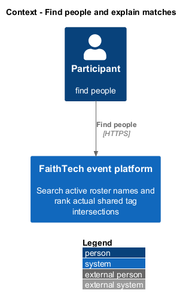
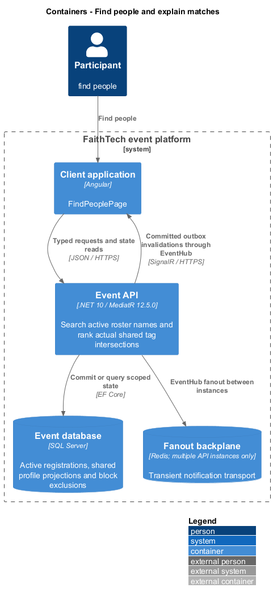
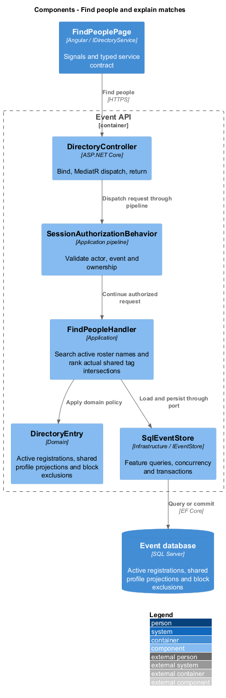
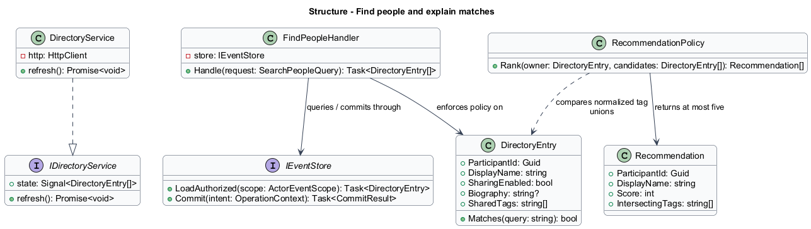
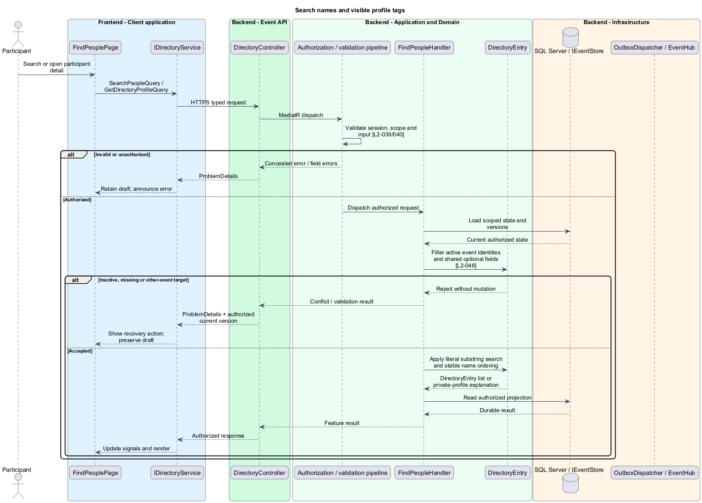
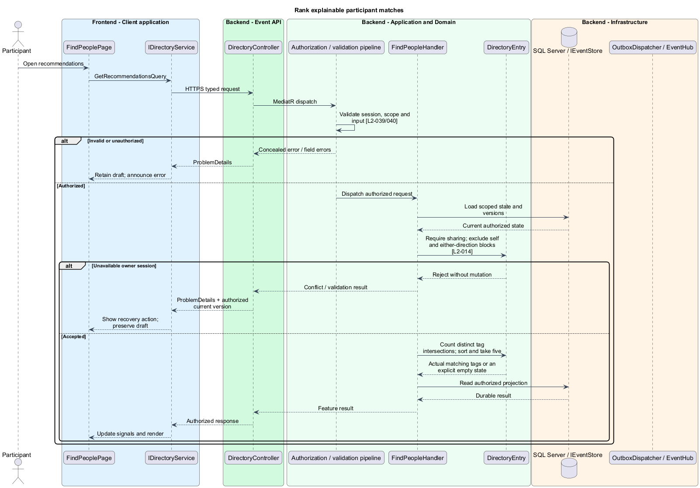

# Find people and explain matches

## Overview

The directory makes active same-event roster names discoverable even when optional profiles are private. Recommendations are a narrower list of shared-profile participants with actual overlapping tags. Their explanations identify those tags rather than infer personal similarities.

## Description

This proposed slice follows the [shared architecture contracts](../../README.md). `FindPeoplePage` owns routing and dialogs; domain components consume `IDirectoryService` through `DIRECTORY_SERVICE`. `DirectoryService` implements HTTP access in `api`.

`/events/:eventId/people` hosts `FindPeoplePage`; `/:participantId` opens a detail route. `GET /api/events/{eventId}/people?query=...`, `/people/{participantId}`, and `/recommendations` dispatch `SearchPeopleQuery`, `GetDirectoryProfileQuery`, and `GetRecommendationsQuery`. `IDirectoryService` exposes search, detail, and recommendations as typed signal results. Search text is ordinary query data, not a credential.

`FindPeopleHandler` filters active registrations by event before projecting optional fields. A blank trimmed query returns all active entries. Name and shared-tag matching use case-insensitive substrings; private tags neither match nor appear. Parameterized SQL handles search text literally, escaping SQL wildcard characters where LIKE is used. Results order by normalized display name then stable participant ID. Duplicate names remain independently selectable.

`DirectoryEntry` contains identity and roster name for a private profile, plus `SharingEnabled=false` and a not-shared explanation. Biography and tags are omitted. Direct requests for inactive, missing, or other-event identities return concealed unavailability. Directory presence alone does not establish send permission; private profiles remain potential recipients, while either-direction blocks prevent sending.

`RecommendationPolicy` requires the owner and candidate to be active and sharing. It excludes self and either-direction blocks before scoring. For each profile it unions trimmed, case-folded skill, interest, and help tags. Score equals the distinct intersection size. Zero-score candidates are omitted; positive candidates sort by descending score, then the directory's normalized-name and stable-ID order. The first five are returned. `Recommendation` includes only the actual intersecting tags as its explanation. No external AI or embedding service participates.

For the 200-participant baseline, one scoped query loads eligible IDs, normalized tags, and relevant block edges; an in-process deterministic policy ranks the small result. It avoids per-person database calls and shares normalization with profile saving. SQL read consistency prevents a query from combining pre- and post-opt-out fields. Profile, activity, name, and block invalidations refresh the affected directory/recommendation view; late responses for an old search are discarded.

Acceptance checks cover private-tag non-matches, duplicate names, trimmed/case-varied substrings, stable tie ordering across six candidates, repeated tags across categories, zero matches, owner opt-out, and both block directions. Browser tests verify clearing search, useful empty states, private-detail explanations, and connected removal of optional fields.

## Requirements

The following verbatim primary excerpts link to their complete normative definitions and Given–When–Then acceptance criteria. Shared constraints apply as specified in the [architecture contracts](../../README.md).

| L2 ID | Refines (L1) | Requirement excerpt |
|---|---|---|
| [L2-014](../../../specs/L2.md#l2-014-explainable-people-recommendations) | `L1-006` | Recommendations must rank other active, sharing participants in the same event by the number of distinct shared normalized tags across skills, interests, and help tags. Normalization trims whitespace and ignores case. Return at most five matches, exclude self and blocked participants in either direction, and break equal scores by display name then stable participant identity. No external AI service is required. |
| [L2-048](../../../specs/L2.md#l2-048-participant-directory-and-profile-discovery) | `L1-006` | Authenticated participants must browse active same-event roster names and search by name or shared skills, interests, and help tags. Search must trim the query and match case-insensitive substrings; a blank query lists all active entries, ordered by case-insensitive display name then stable identity. Optional fields must appear only while sharing is enabled. A private profile must show the roster name and a not-shared explanation, never generated personal details. Sharing is not a prerequisite for being a chat recipient; either-direction blocks still prevent sending under L2-016. |

## Diagrams

Participant uses the event platform to find people. The context isolates this capability from unrelated event activities.

The Client application calls the API for authoritative state. SQL Server retains active registrations, shared profile projections and block exclusions; SignalR invalidations prompt authorized reads.

`DirectoryController` dispatches through the application pipeline. `FindPeopleHandler` owns the feature policy and uses the persistence port.

`DirectoryEntry` carries stable identity and feature state. The service interface separates Angular consumers from HTTP; `IEventStore` represents the application persistence boundary. Method shapes are slice-specific views of the shared contracts.

Search names and visible profile tags applies filter active event identities and shared optional fields [l2-048]. Inactive, missing or other-event target leaves committed state unchanged; the client retains enough context to recover.

Rank explainable participant matches applies require sharing; exclude self and either-direction blocks [l2-014]. Unavailable owner session leaves committed state unchanged; the client retains enough context to recover.

