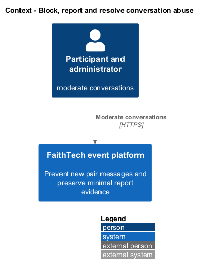
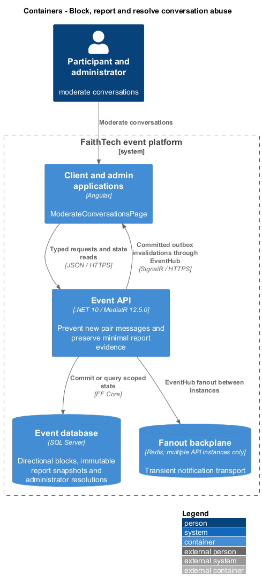
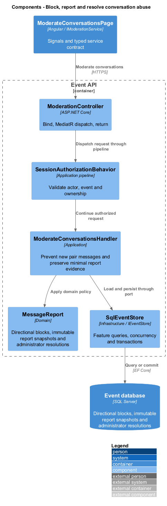
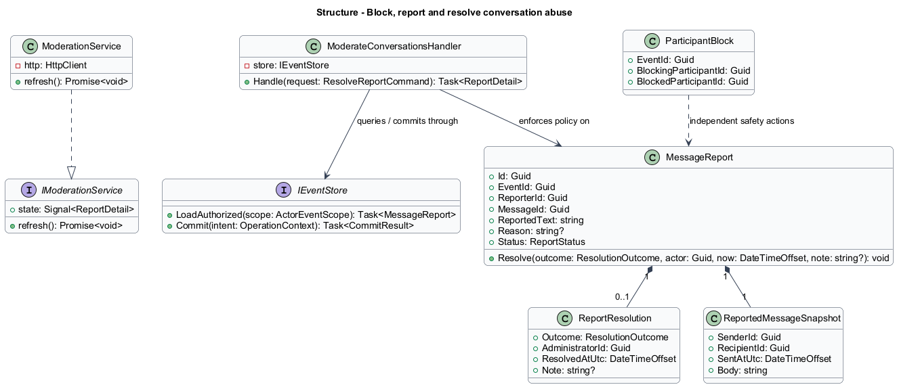
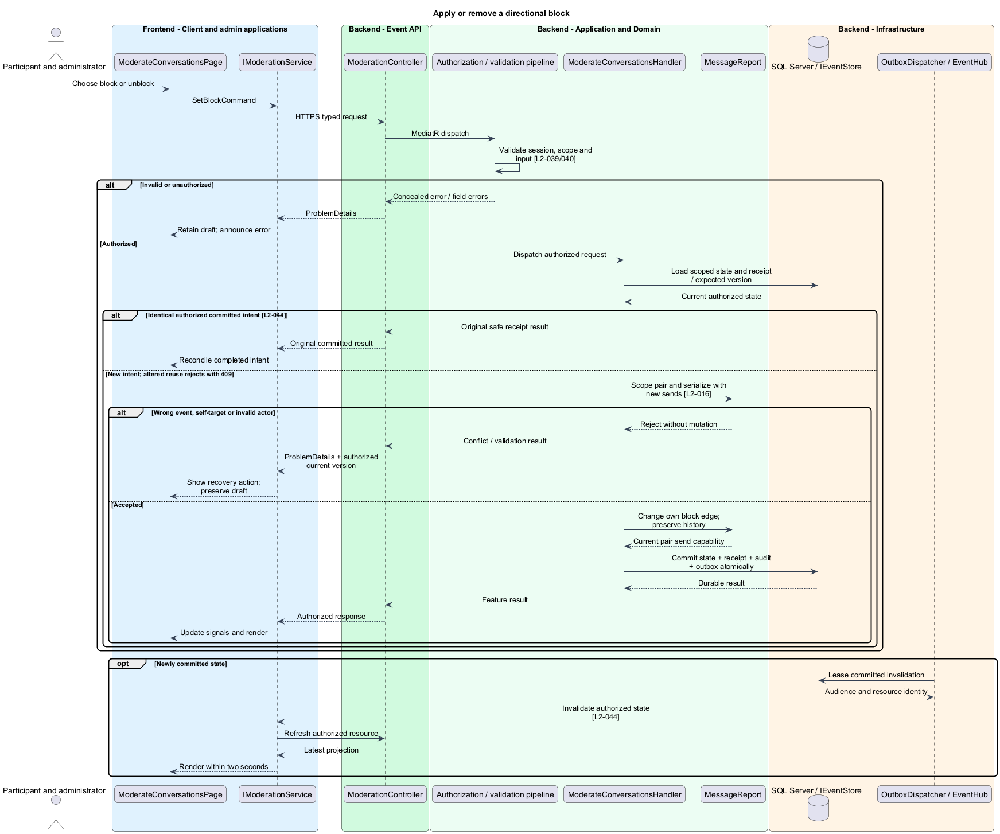
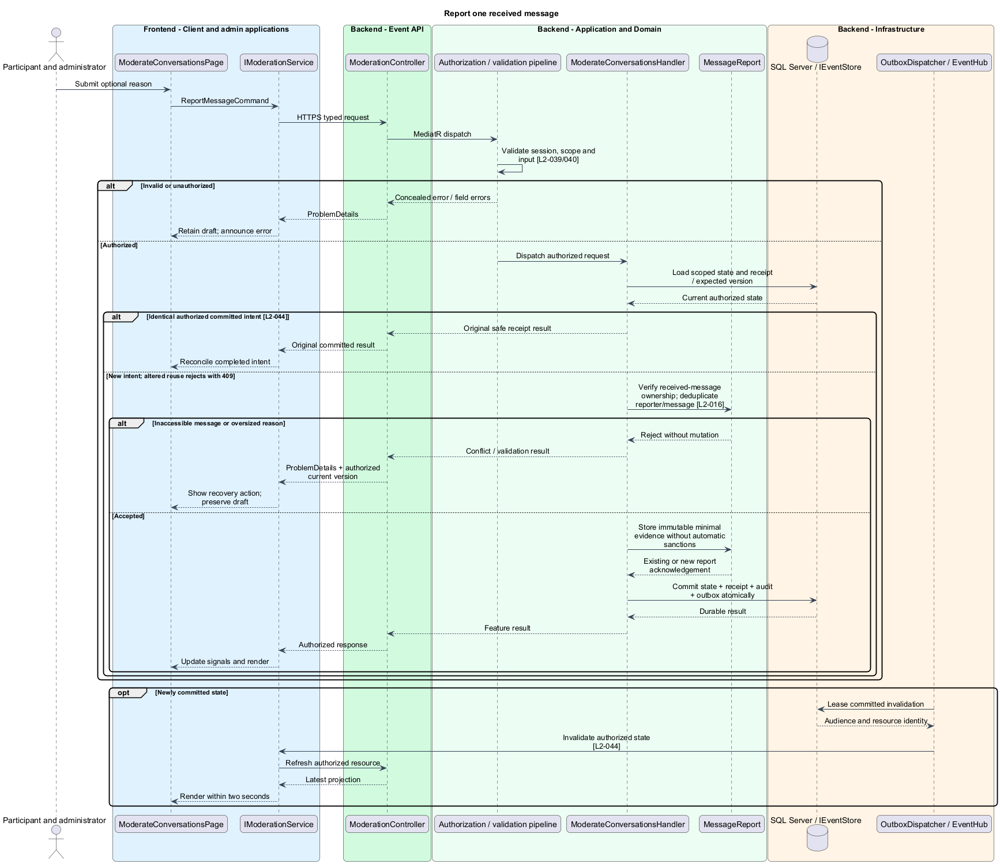
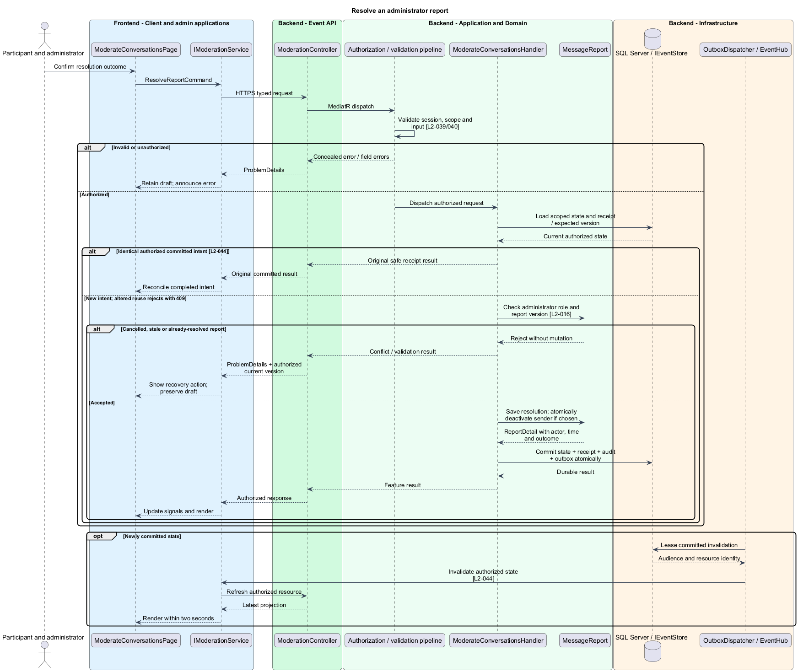

# Block, report and resolve conversation abuse

## Overview

A block is a participant-controlled restriction on new communication in both directions. A report records one received message for administrator review. A resolution records an explicit outcome; reporting alone does not restrict another participant.

## Description

This proposed slice follows the [shared architecture contracts](../../README.md). `ModerateConversationsPage` owns routing and dialogs; domain components consume `IModerationService` through `MODERATION_SERVICE`. `ModerationService` implements HTTP access in `api`.

Conversation controls invoke `IModerationService.block`, `unblock`, and `report`. `PUT/DELETE /api/events/{eventId}/blocks/{peerId}` dispatch `SetBlockCommand`. `POST /api/events/{eventId}/message-reports` dispatches `ReportMessageCommand { messageId, reason }`. The administrator page `/admin/events/:eventId/reports` calls `GET /api/admin/events/{eventId}/reports`, `GET /reports/{reportId}`, and `POST /reports/{reportId}/resolution`.

`ModerateConversationsHandler` derives the blocker/reporter from the session. Unique `(EventId, BlockingParticipantId, BlockedParticipantId)` represents a directional block. Either directional row denies a new send; removing one row restores sending only if the reverse row is absent. Block mutations share the conversation-pair guard with sends. They preserve history and invalidate recommendations without hiding the roster name.

Report authorization requires that the requester received the referenced message. Retained history remains reportable while blocked or while the sender is inactive. Unique `(ReporterId, MessageId)` returns the existing report on repeated submission, preserving its original evidence/reason. A report captures message text, sender, recipient, server timestamp, optional reason, and submission time transactionally. Reason and resolution note are optional literal text up to 5,000 characters.

`ReportDetail` exposes that snapshot and report fields only to administrators. List queries include pending/resolved status and safe summary fields; opening a report never loads neighboring messages. No report notification discloses the reporter to the reported participant. Audit records reference report/message IDs without copying text or notes.

`ResolveReportCommand` contains report ID, expected version, outcome (`ResolvedWithoutAction` or `ParticipantDeactivated`), and optional note. Confirmation identifies the affected report and participant; cancellation sends no command. Deactivation calls the roster policy for the reported sender in the same transaction as the resolution, revoking sessions while preserving history. The result records administrator/time/outcome. Stale or already-resolved edits return current authorized status; an identical committed retry returns the existing resolution.

Acceptance tests cover both block directions, reverse-block persistence after unblock, inaccessible message reports, duplicate reports with different retry intents, retained-history reporting, and administrator report-only access. Resolution checks prove cancellation leaves pending state and deactivation plus resolution commit atomically.

## Requirements

The following verbatim primary excerpts link to their complete normative definitions and Given–When–Then acceptance criteria. Shared constraints apply as specified in the [architecture contracts](../../README.md).

| L2 ID | Refines (L1) | Requirement excerpt |
|---|---|---|
| [L2-016](../../../specs/L2.md#l2-016-blocking-reporting-and-moderation) | `L1-006` | Participants must block or unblock another participant and report a specific received message with an optional reason. Either-direction blocking must prevent new messages between the pair and exclude recommendations, without deleting history. Administrators must review reports with the reported message and reason and resolve them or deactivate an abusive participant; ordinary chat history is not an administrator browsing feature. |

## Diagrams

Participant and administrator uses the event platform to moderate conversations. The context isolates this capability from unrelated event activities.

The Client and admin applications calls the API for authoritative state. SQL Server retains directional blocks, immutable report snapshots and administrator resolutions; SignalR invalidations prompt authorized reads.

`ModerationController` dispatches through the application pipeline. `ModerateConversationsHandler` owns the feature policy and uses the persistence port.

`MessageReport` carries stable identity and feature state. The service interface separates Angular consumers from HTTP; `IEventStore` represents the application persistence boundary. Method shapes are slice-specific views of the shared contracts.

Apply or remove a directional block applies scope pair and serialize with new sends [l2-016]. Wrong event, self-target or invalid actor leaves committed state unchanged; the client retains enough context to recover.

Report one received message applies verify received-message ownership; deduplicate reporter/message [l2-016]. Inaccessible message or oversized reason leaves committed state unchanged; the client retains enough context to recover.

Resolve an administrator report applies check administrator role and report version [l2-016]. Cancelled, stale or already-resolved report leaves committed state unchanged; the client retains enough context to recover.

