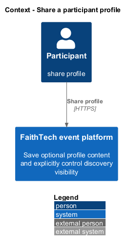
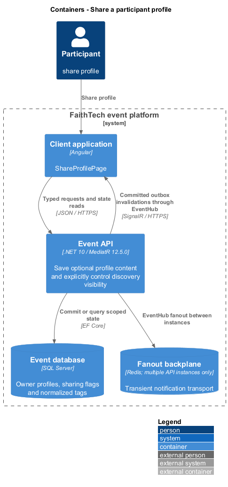
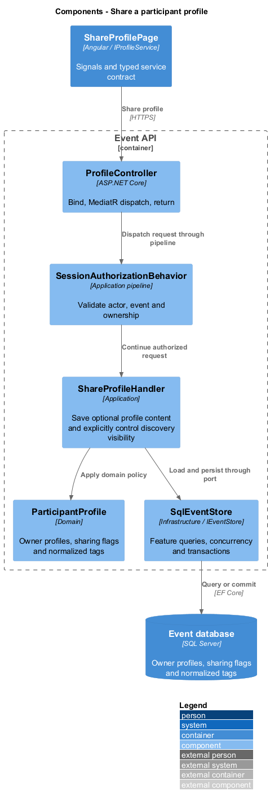
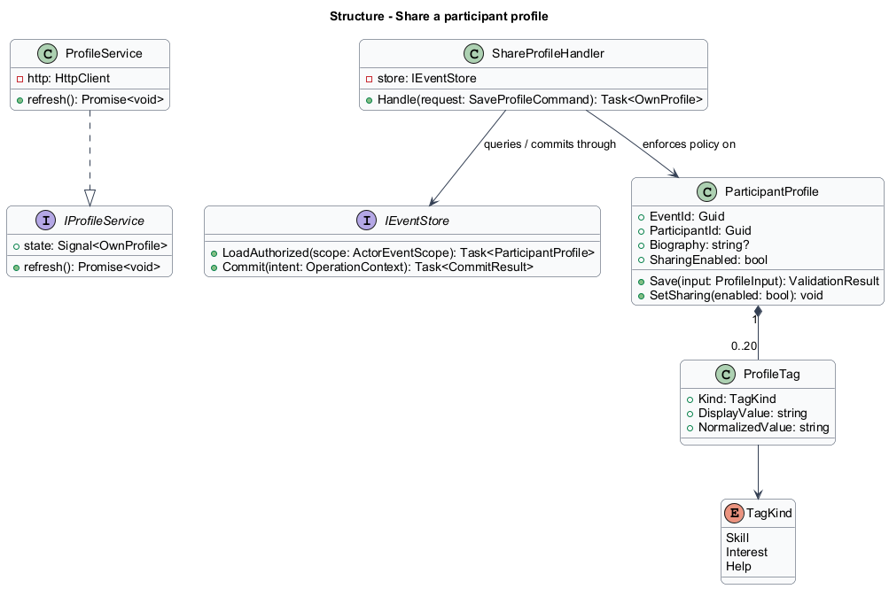
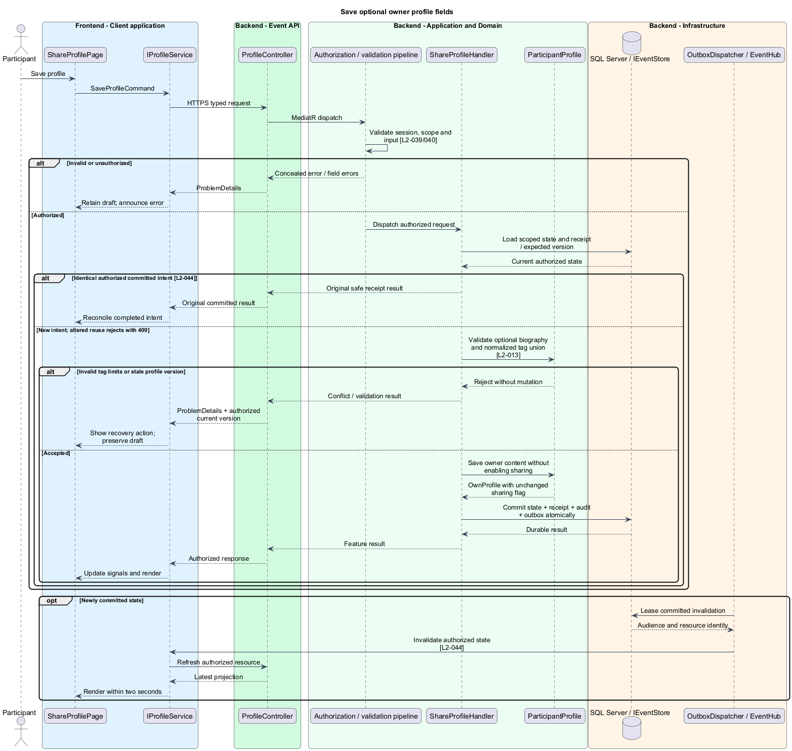
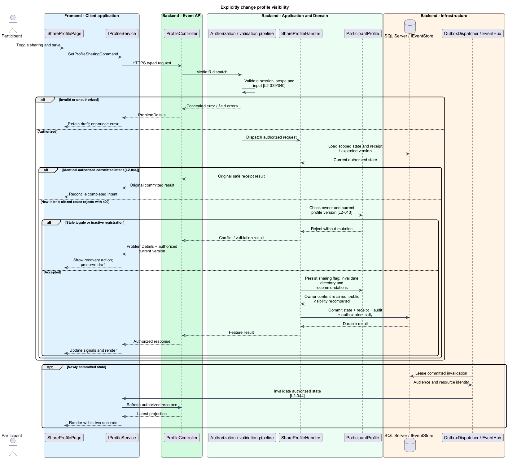

# Share a participant profile

## Overview

A profile contains optional biography, skills, interests, and areas of help for one event registration. Sharing controls whether other participants can discover that content. Saving a profile and enabling sharing are separate actions.

## Description

This proposed slice follows the [shared architecture contracts](../../README.md). `ShareProfilePage` owns routing and dialogs; domain components consume `IProfileService` through `PROFILE_SERVICE`. `ProfileService` implements HTTP access in `api`.

`/events/:eventId/profile` hosts `ShareProfilePage`. `GET/PUT /api/events/{eventId}/profile` dispatch `GetOwnProfileQuery` and `SaveProfileCommand`; `PUT /profile/sharing` dispatches `SetProfileSharingCommand { enabled }`. `IProfileService` exposes `getOwn`, `save`, and `setSharing`. `ProfileInput` contains optional biography and three tag arrays. `OwnProfile` adds readonly administrator-controlled display name, sharing state, and version.

`ShareProfileHandler` derives participant identity from the session. Unique `(EventId, ParticipantId)` identifies the profile. Absent profiles project empty optional fields and `SharingEnabled=false`, with no fictional biography. Saving text leaves the existing sharing flag unchanged. The sharing command is explicit and uses the profile version; a stale toggle never silently overwrites a later save.

`ProfileValidator` trims text, normalizes line endings, and applies the 5,000-character biography limit. Tags trim and case-fold for distinctness, retain display spelling, and enforce at most 20 distinct normalized values across all three arrays, each at most 40 characters. A tag appearing in different categories counts once for distinct-union limits and recommendation overlap. Empty optional fields remain valid.

Profile rows, tag changes, safe receipt, and outbox invalidation commit atomically. The owner read returns retained text regardless of sharing. Discovery queries require both active registration and sharing before returning biography or tags. Disabling sharing preserves owner content but removes it from other participants' directory details and recommendations. Invalidations carry only affected identity/version; connected readers refetch and clear private profile content within two seconds of the save.

`ProfileEditor` holds the draft in memory under event/participant identity. Stage changes preserve it; deliberate navigation offers keep/discard through an application dialog. Validation and stale conflicts retain proposed values. Session loss clears the draft under the shared privacy contract.

Acceptance checks distinguish saving from sharing, test repeated/case-varied tags, deactivate a shared registration, and disable sharing while another participant views detail. Browser tests check the empty profile, readonly name, dirty navigation, errors, and owner retention after opt-out.

## Requirements

The following verbatim primary excerpts link to their complete normative definitions and Given–When–Then acceptance criteria. Shared constraints apply as specified in the [architecture contracts](../../README.md).

| L2 ID | Refines (L1) | Requirement excerpt |
|---|---|---|
| [L2-013](../../../specs/L2.md#l2-013-participant-profiles) | `L1-006` | Participants must edit an event-specific profile containing an optional biography, skills, interests, and looking-for-help tags. The roster name identifies the participant. Profile sharing must default off; choosing to share makes those fields visible only to authenticated participants in that event. Email must never become a public profile field. |

## Diagrams

Participant uses the event platform to share profile. The context isolates this capability from unrelated event activities.

The Client application calls the API for authoritative state. SQL Server retains owner profiles, sharing flags and normalized tags; SignalR invalidations prompt authorized reads.

`ProfileController` dispatches through the application pipeline. `ShareProfileHandler` owns the feature policy and uses the persistence port.

`ParticipantProfile` carries stable identity and feature state. The service interface separates Angular consumers from HTTP; `IEventStore` represents the application persistence boundary. Method shapes are slice-specific views of the shared contracts.

Save optional owner profile fields applies validate optional biography and normalized tag union [l2-013]. Invalid tag limits or stale profile version leaves committed state unchanged; the client retains enough context to recover.

Explicitly change profile visibility applies check owner and current profile version [l2-013]. Stale toggle or inactive registration leaves committed state unchanged; the client retains enough context to recover.

