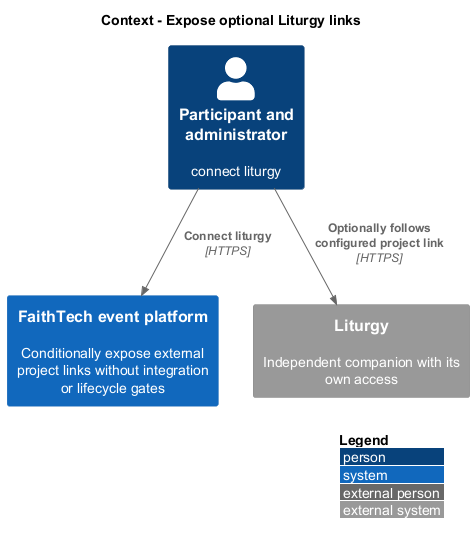
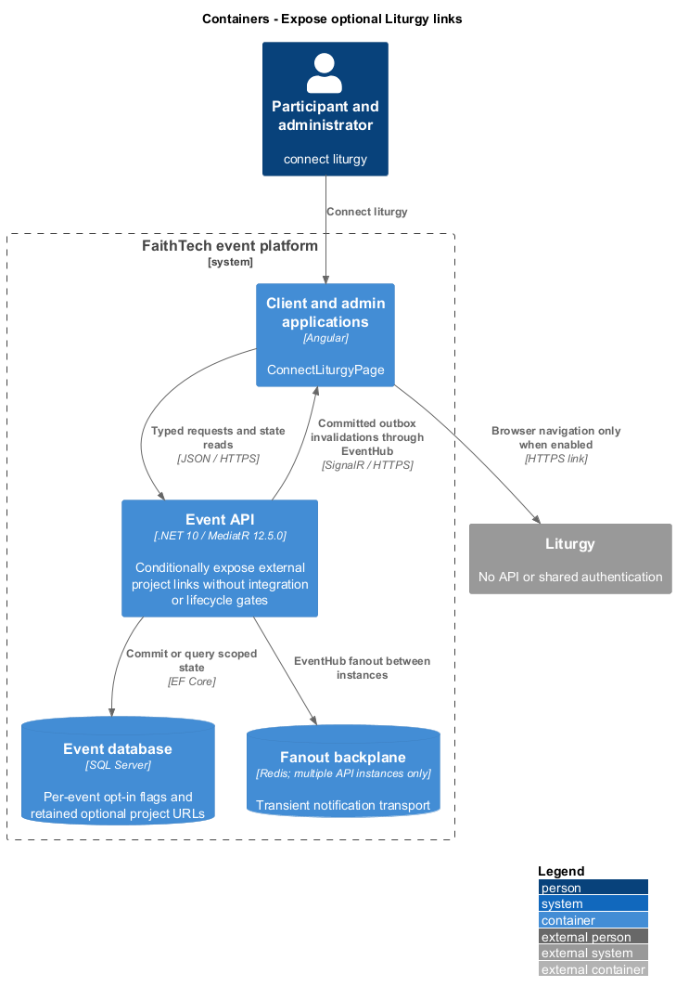
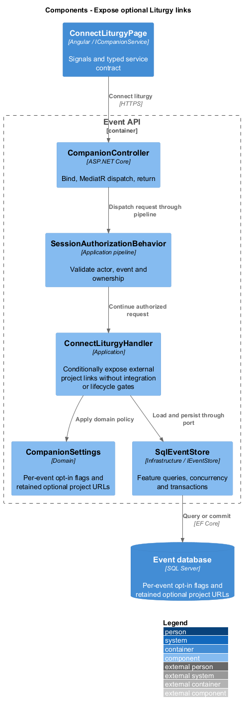
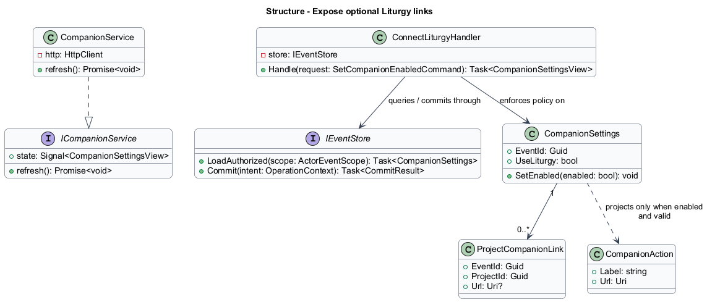
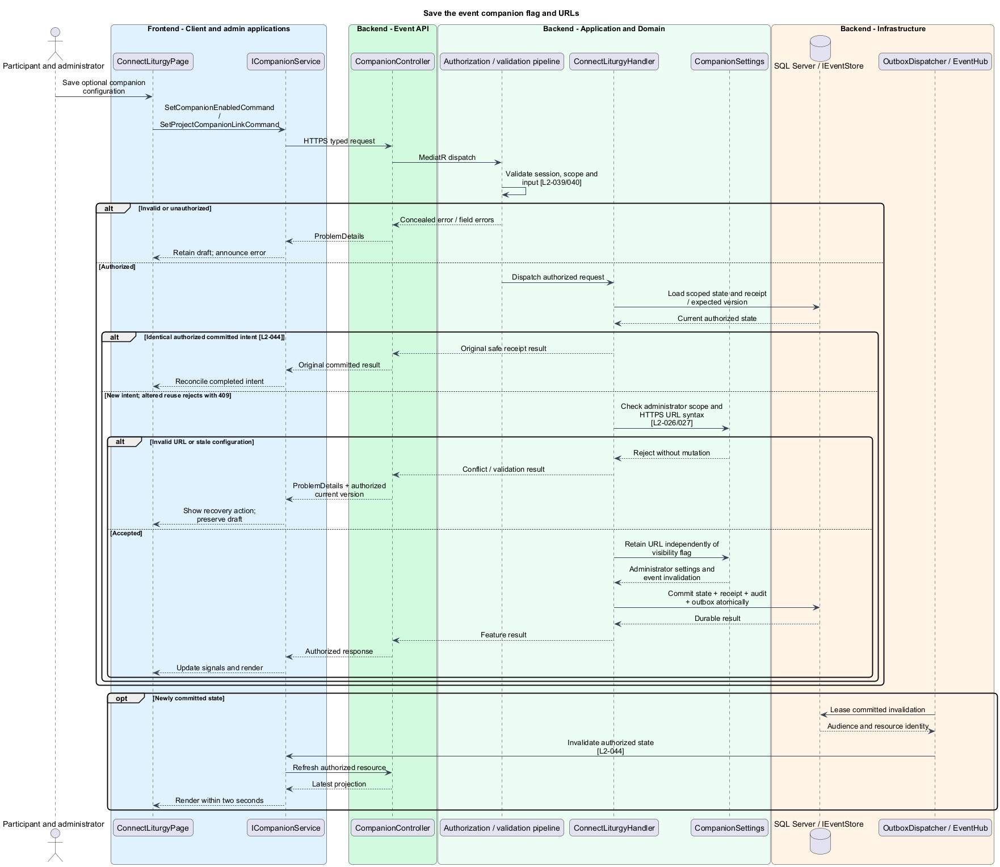
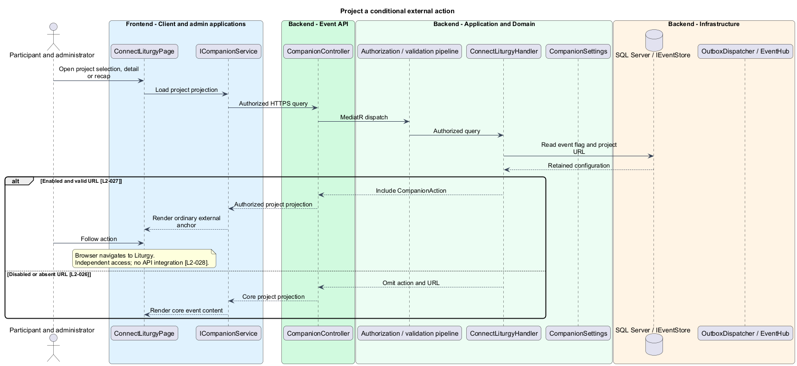

# Expose optional Liturgy links

## Overview

Liturgy is an independent external companion. The event platform optionally presents links to its project pages. Enabling these actions creates no shared account, workspace, project, synchronization, or development gate.

## Description

This proposed slice follows the [shared architecture contracts](../../README.md). `ConnectLiturgyPage` owns routing and dialogs; domain components consume `ICompanionService` through `COMPANION_SERVICE`. `CompanionService` implements HTTP access in `api`.

Administrator event/project editors compose `ConnectLiturgyPage` settings. `GET/PUT /api/admin/events/{eventId}/companion-settings` dispatch `GetCompanionSettingsQuery` and `SetCompanionEnabledCommand { enabled }`. `PUT /api/admin/events/{eventId}/projects/{projectId}/companion-link` dispatches `SetProjectCompanionLinkCommand { url }`. `ICompanionService` exposes these administrator methods; participant project/showcase DTOs receive only a conditional `CompanionAction`.

`ConnectLiturgyHandler` defaults `UseLiturgy=false` for blank events, copies, and the September reference. Only administrators change it. `ProjectCompanionLink` stores an optional validated absolute HTTPS URL without user information, scoped by event/project. The same URL may appear in different events; no global URL uniqueness or external project lookup is imposed.

Participant projection includes the action only when the flag is true and the project has a valid URL. When false, the field and URL are omitted from API responses, templates, and client state. Disabling does not delete retained administrator configuration. The setting transaction emits an event invalidation; connected selection/detail/recap views remove actions within two seconds after the save. A stale participant projection never authorizes an API operation on Liturgy.

The action is an ordinary safe external anchor. Liturgy determines its own access and may show its own sign-in or unavailable page. The API never fetches the configured URL, creates a workspace or project, sends invitations, calls Liturgy APIs, shares cookies, or synchronizes progress. Event stages and timed mutations never depend on Liturgy state. No external outage blocks event entry, team selection, quiz, raffle, or recap.

Acceptance checks toggle the flag while three participant views are connected, inspect responses for omitted URLs, and verify re-enabling restores valid retained actions. Other tests cover malformed URLs, duplicate URLs across events, default-disabled copies, missing links, and an unavailable external destination. The core suite runs with both flag values and no Liturgy service available.

## Requirements

The following verbatim primary excerpts link to their complete normative definitions and Given–When–Then acceptance criteria. Shared constraints apply as specified in the [architecture contracts](../../README.md).

| L2 ID | Refines (L1) | Requirement excerpt |
|---|---|---|
| [L2-026](../../../specs/L2.md#l2-026-event-level-liturgy-opt-out) | `L1-010` | Use Liturgy must default to false for every new event and the September 9 preset. Only administrators must be able to change it. Disabling it must hide all participant-facing companion links, actions, onboarding, and recap content and omit Liturgy URLs from participant responses while retaining saved URLs for administrators. |
| [L2-027](../../../specs/L2.md#l2-027-optional-project-links-to-liturgy) | `L1-010` | Administrators must attach or clear an optional HTTPS Liturgy project URL for each event project. When enabled, linked projects must expose an "Open project in Liturgy" action on project-selection and project-detail screens and a companion link beside repository/demo links in recap. Link targets must not require a server-side connectivity check to save or display. |
| [L2-028](../../../specs/L2.md#l2-028-companion-responsibility-boundaries) | `L1-010` | The connection must consist of navigation links only. The event platform must not create Liturgy projects, synchronize membership, share authentication, advance gated phases, complete requirements, or store ongoing boards, work items, assignments, or 5R progress. Event guidance can describe the process without recording project progress. |

## Diagrams

Participant and administrator uses the event platform to connect liturgy. The context isolates this capability from unrelated event activities.

The Client and admin applications calls the API for authoritative state. SQL Server retains per-event opt-in flags and retained optional project urls; SignalR invalidations prompt authorized reads.

`CompanionController` dispatches through the application pipeline. `ConnectLiturgyHandler` owns the feature policy and uses the persistence port.

`CompanionSettings` carries stable identity and feature state. The service interface separates Angular consumers from HTTP; `IEventStore` represents the application persistence boundary. Method shapes are slice-specific views of the shared contracts.

Save the event companion flag and URLs applies check administrator scope and https url syntax [l2-026/027]. Invalid URL or stale configuration leaves committed state unchanged; the client retains enough context to recover.

The API omits disabled links entirely. Following an enabled link leaves the event platform; Liturgy supplies its own independent access behavior.

