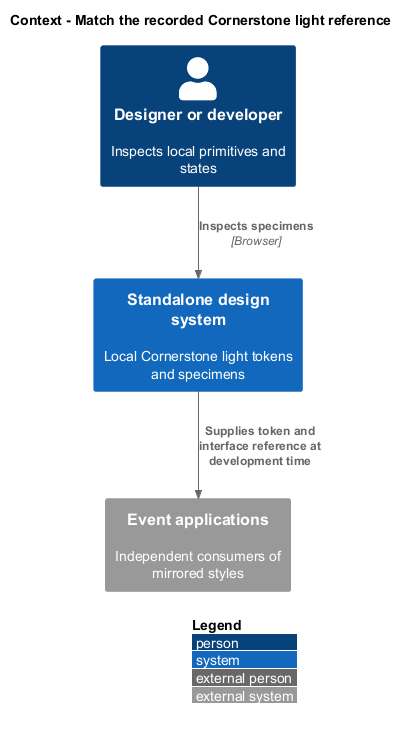
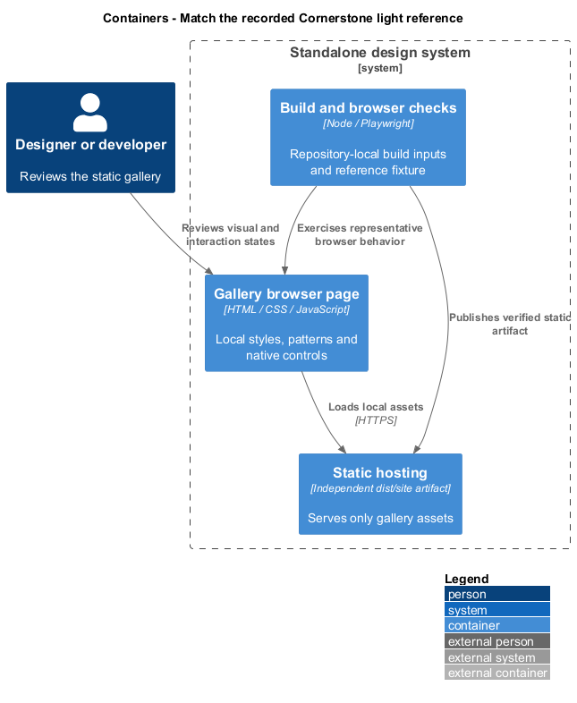
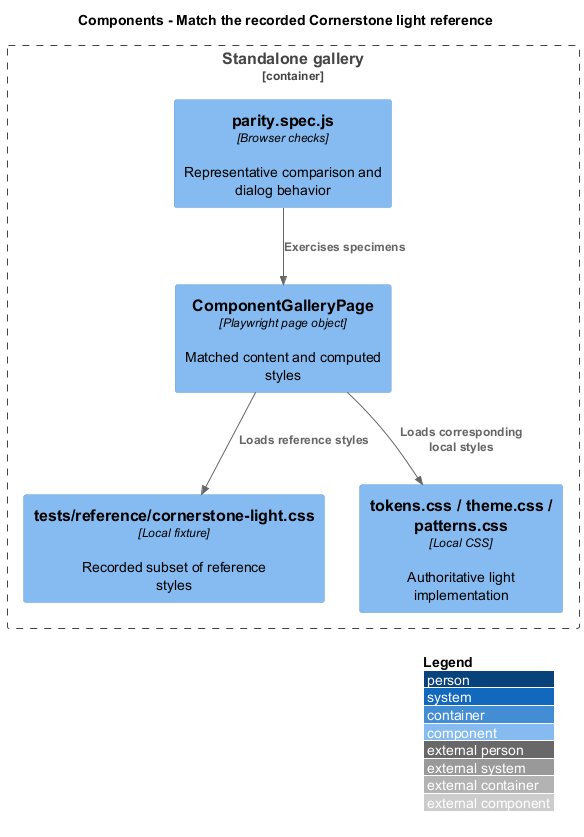
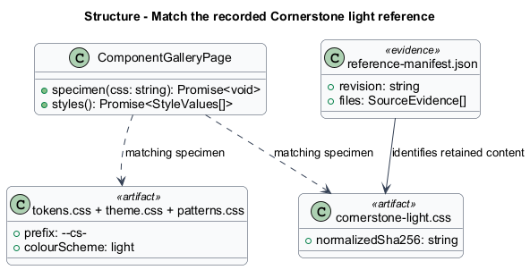
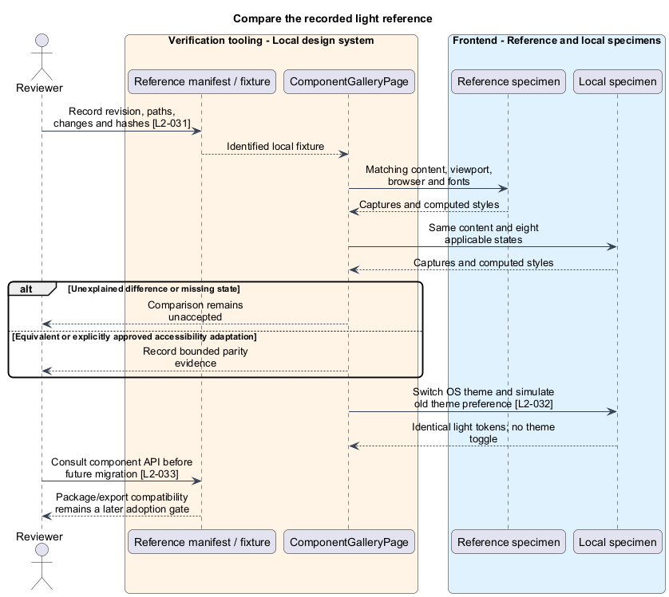

# Match the recorded Cornerstone light reference

## Overview

The local event design system follows a recorded Cornerstone light reference. Visual parity compares equivalent content and interaction states under the same browser conditions. Future npm adoption is a separate migration decision; the current gallery and applications use independent local implementations.

## Description

The adopted revision is `554636edf74af788e83aa33a4380a05b031db16a`. The [source manifest](reference-manifest.json) records consulted paths, working-tree status, and raw/LF-normalized SHA-256 hashes. Untracked card and choice-card sources are identified by content, not attributed solely to that commit. Modified reference README and migration guidance are likewise identified separately.

The retained local specimen is [cornerstone-light.css](../../../../design-system/tests/reference/cornerstone-light.css). Its LF-normalized SHA-256 is `3678174ba58e048318b4ad7ccb574fdf78e5cfa5b6708fe18a850667032e236a`; raw Windows newline bytes have a different hash recorded in the manifest. Existing [reference capture](../../../mocks/screenshots/cornerstone-reference.png) and [local capture](../../../mocks/screenshots/local-components.png) support representative comparison only. No build requires the external checkout.

`ComponentGalleryPage.specimen` renders matched markup with reference or local CSS, and `styles` reads computed values. `parity.spec.js` compares representative colour, type, spacing, borders, radii, shadow, dimensions, opacity, and disabled treatments. Full acceptance additionally covers default, hover, focus, active, disabled, loading, error, and selected states wherever applicable. Matching captures record content, CSS viewport, browser/version, operating system, device scale, and locally loaded fonts. Unexplained visual or behavior differences fail review.

`index.html` fixes `cs-theme-light` and the native colour scheme. The proposed Angular global styles and document roots do the same. OS theme changes and historical browser-storage values never change tokens or add a theme toggle. Light-reference dark ink accents remain valid. Event phase identification uses text and local tokens; the all-light host navigation is the recorded deliberate adaptation from Cornerstone's inverted shell. Any further accessibility adaptation receives explicit comparison evidence.

The consulted [Cornerstone API guidance](https://github.com/QuinntyneBrown/Cornerstone#readme) names standalone button/card imports and optional migration styles. The inspected local `CsButtonDirective` accepts `csButton` appearance, size, loading, and disabled inputs on native buttons/anchors. `CardComponent` accepts tone, presentation, interactive, and emits activated. `ChoiceCardComponent` accepts selected/disabled and emits selectedChange. Local Angular equivalents retain these input/output concepts while using separate template/style/class files and no application-service dependency. Native keyboard activation and disabled behavior receive independent acceptance checks; source API similarity alone does not prove them.

The existing [component migration map](../../../../design-system/README.md#component-migration-map) remains the counterpart inventory. Current work installs no Cornerstone package or compatibility stylesheet. A later migration first verifies actual package availability, exported names, Angular/CDK peer compatibility, both application builds, and visual/interaction parity. The inspected checkout's `CardComponent` name differs from the public README's `CsCardComponent` example; future adoption resolves that export difference explicitly. Liturgy opt-in has no effect on component adoption.

Acceptance evidence spans the gallery, mocks, and each future application with both Liturgy flag values and light/dark OS settings. Current representative evidence is retained without claiming that the complete future application/state matrix has already passed.

## Requirements

The following verbatim primary excerpts link to their complete normative definitions and Given–When–Then acceptance criteria. Shared constraints apply as specified in the [architecture contracts](../../README.md).

| L2 ID | Refines (L1) | Requirement excerpt |
|---|---|---|
| [L2-031](../../../specs/L2.md#l2-031-cornerstone-light-visual-and-interaction-parity) | `L1-011` | Design review must use the recorded Cornerstone light reference: its token/theme styles and equivalent rendered components from `C:/projects/Cornerstone`. It must record the source revision, relevant file paths and any working-tree differences, and local comparison captures. Compare token values, typography, colour, spacing, sizing, borders, radii, shadows, icons, component states, and motion; the deck and Liturgy are not styling overrides. |
| [L2-032](../../../specs/L2.md#l2-032-light-theme-in-every-experience) | `L1-011` | All participant, administration, design-system, and mockup screens must use the recorded Cornerstone light-theme reference regardless of browser or operating-system theme. No dark mode or theme toggle must be offered. Dark ink accents that belong to the light reference are not a separate dark theme. |
| [L2-033](../../../specs/L2.md#l2-033-prepare-for-later-cornerstone-adoption) | `L1-011` | The agreed future direction is npm-based `@cornerstone/ui` adoption by both applications. Current component interface design must consult the [Cornerstone API and migration guidance](https://github.com/QuinntyneBrown/Cornerstone#readme), while retaining independent local implementations. Cornerstone publication, installation, and migration are outside this version. Package availability and compatibility must be verified before a future migration, independently of Use Liturgy. |

## Diagrams

The gallery supplies local design evidence to independently built applications. No application API or external companion participates in gallery runtime.

The gallery deploys as its own static artifact. Repository-local build and browser tools verify it without requiring an application deployment.

The component view names the existing gallery sources and their dependencies. Proposed Angular mirrors remain separate consumers of the authoritative styles.

Module and artifact stereotypes describe existing JavaScript/CSS sources without claiming they are application domain entities. Relationships show composition and review dependencies.

Matched specimens compare reference and local behavior under recorded conditions. Missing evidence or an unexplained difference prevents a parity claim.

