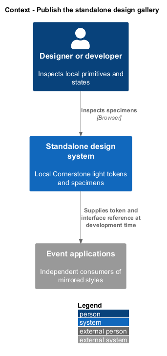
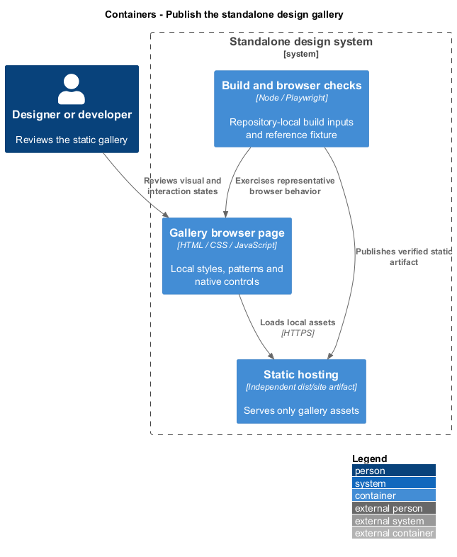
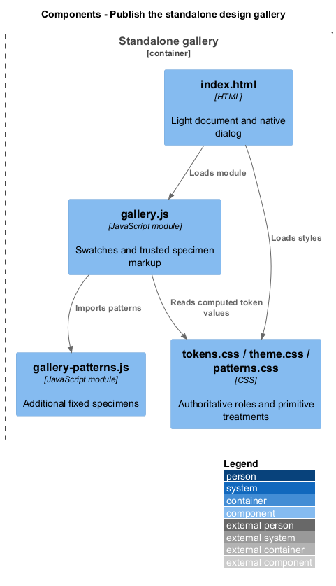
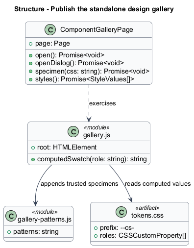
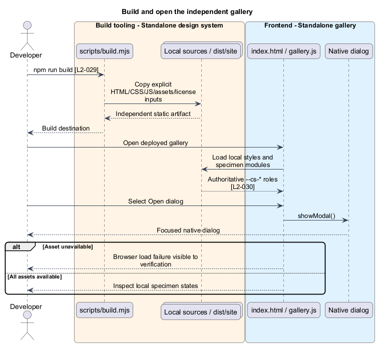

# Publish the standalone design gallery

## Overview

The design system is an independent static site that owns the event's local visual primitives. Tokens are named CSS custom properties that express colour, typography, spacing, radius, and other visual roles. The applications mirror these tokens without making the gallery depend on either application.

## Description

The existing [design-system package](../../../../design-system/package.json) owns its manifest, build, tests, and local assets. `index.html` loads `tokens.css`, `theme.css`, and `patterns.css`, then `gallery.js`. The gallery module inserts trusted fixed specimen markup and appends the exported `patterns` string from `gallery-patterns.js`. It reads computed `--cs-*` colour values for swatches and opens a native dialog from `[data-dialog]` controls. No user input is inserted as markup.

`tokens.css` is authoritative; `theme.css` applies base treatment and `patterns.css` composes primitives using tokens. The fixed specimens demonstrate colours, type, actions, inputs, feedback, people/choices, tables/navigation, empty/busy states, and spacing. Assets and the retained Cornerstone license live in this package. Local system-font stacks avoid a runtime font-service dependency.

`scripts/build.mjs` uses Node filesystem operations to copy the explicit site inputs into `dist/site`. Its optional `--mocks` branch creates a separate combined review bundle; the ordinary build requires no mock files. `scripts/serve.mjs` is a local repository preview server on loopback port 4317; `/design-system/` opens the gallery. Deployment serves the independently built `dist/site` through an ordinary static host with relative asset paths.

`npm ci`, `npm test`, and `npm run build` are the existing package commands. `ComponentGalleryPage` owns browser selectors and provides `open`, `openDialog`, `specimen`, and `styles`. Existing tests check a gallery dialog, representative computed-style parity, and axe findings. Their limited specimens do not establish full L2-031 state coverage. Existing comparison screenshots are written under `docs/mocks/screenshots`; they are review outputs, not gallery build inputs.

The proposed Angular `components` library mirrors `tokens.css` as a checked-in stylesheet under its own source styles. Application global composition loads that mirror with local base styling; no runtime fetch targets the gallery. A token change starts in `design-system/tokens.css`, updates the mirror in the same implementation increment, and receives rendered specimen review. Component styles read semantic `var(--cs-...)` roles; missing dimensions, font stacks, or colours receive an authoritative token before component use. Existing token values are not overridden by event phase palettes.

Acceptance verification builds and serves `dist/site` in isolation with application and companion services absent. Browser checks exercise local assets, keyboard dialog operation, specimen states, and the independent package commands. Token review compares rendered local and mirrored consumers; it is an editorial/build responsibility, not a new test that scans source layout.

## Requirements

The following verbatim primary excerpts link to their complete normative definitions and Given–When–Then acceptance criteria. Shared constraints apply as specified in the [architecture contracts](../../README.md).

| L2 ID | Refines (L1) | Requirement excerpt |
|---|---|---|
| [L2-029](../../../specs/L2.md#l2-029-standalone-design-system-delivery) | `L1-011` | The repository must deliver a self-contained design-system static site alongside the applications, with its own package manifest, tests, build, and deployment. Runtime assets, icons, styles, and any distributed font files must be licensed local copies owned here; the Cornerstone system-font stacks require no remote font service. No shared source, package, asset mount, or build/runtime dependency on Cornerstone or Liturgy is allowed in this version. Structural constraints are verified by review, not architecture tests. |
| [L2-030](../../../specs/L2.md#l2-030-authoritative-local-design-tokens) | `L1-011` | The design-system site must own authoritative CSS custom properties under the local prefix `--cs-`, preserving the recorded Cornerstone light primitive values; the frontend must mirror those values. Every component stylesheet must consume tokens for colours, dimensions, fonts, spacing, radii, borders, shadows, and motion. Missing event-composition values must be added to the local design system first under the same prefix without changing reference primitive values. Token naming and absence of hard-coded values are review constraints. |

## Diagrams

The gallery supplies local design evidence to independently built applications. No application API or external companion participates in gallery runtime.

The gallery deploys as its own static artifact. Repository-local build and browser tools verify it without requiring an application deployment.

The component view names the existing gallery sources and their dependencies. Proposed Angular mirrors remain separate consumers of the authoritative styles.

Module and artifact stereotypes describe existing JavaScript/CSS sources without claiming they are application domain entities. Relationships show composition and review dependencies.

The static build copies only declared gallery inputs. The browser loads those local artifacts and opens the native specimen dialog without an API call.

