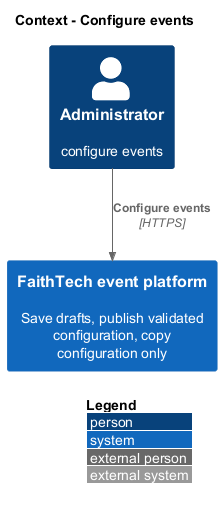
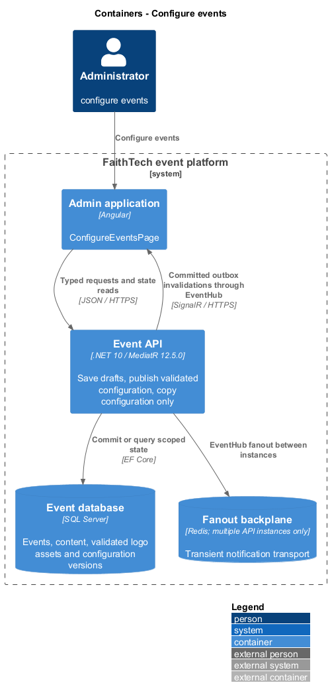
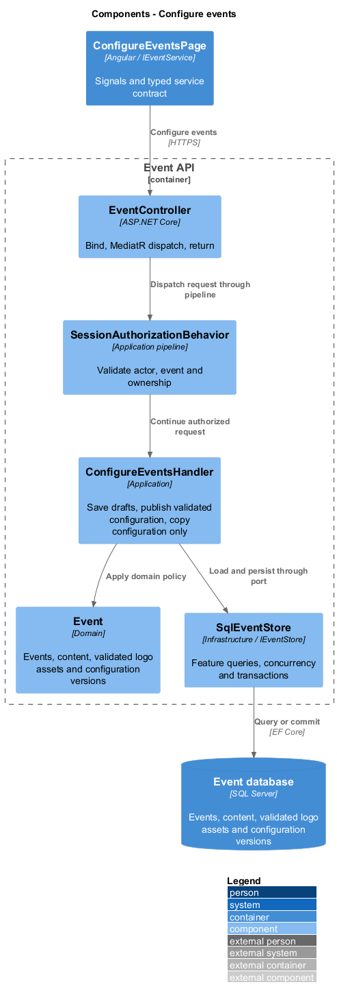
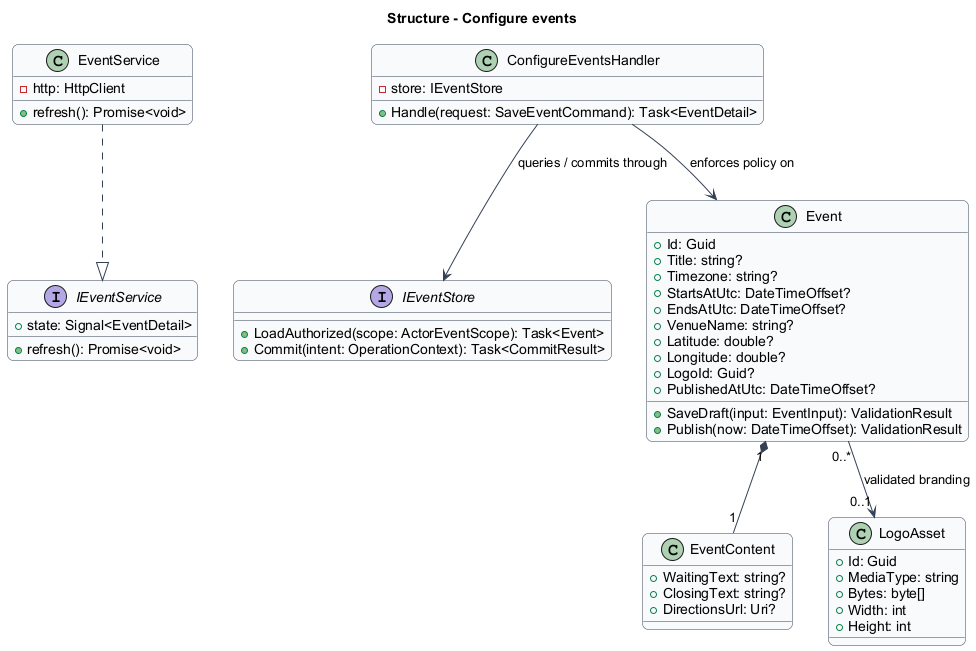
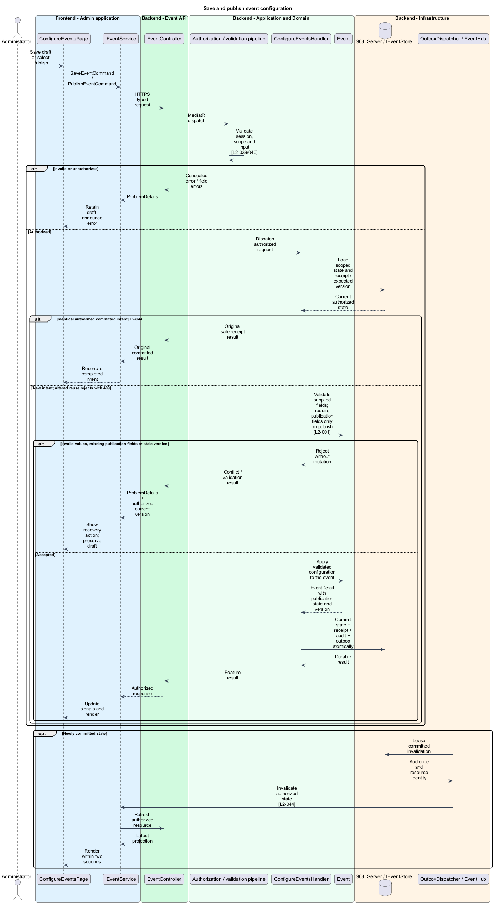
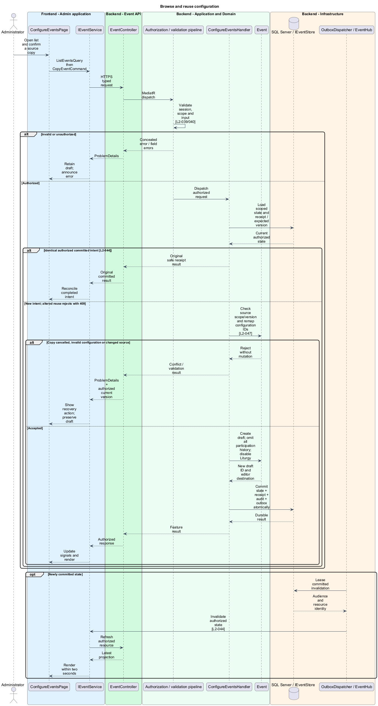

# Configure events

## Overview

An event is an independently configured gathering with its own participants, schedule, and activities. Administrators save incomplete drafts, explicitly publish ready events, and reuse configuration without copying participation history. The event list is the administration entry point.

## Description

This proposed slice follows the [shared architecture contracts](../../README.md). `ConfigureEventsPage` owns routing and dialogs; domain components consume `IEventService` through `EVENT_SERVICE`. `EventService` implements HTTP access in `api`.

`/admin/events` hosts `ConfigureEventsPage`; `/admin/events/:eventId` opens the editor. `IEventService` exposes `list`, `get`, `saveDraft`, `getLogo`, `uploadLogo`, `publish`, and `copy` in the completed design; publication and copying remain planned. `EventSummary` contains ID, title, local start/end, timezone, publication state, companion setting, and version. The list offers create/open/copy actions and a useful empty state.

| Endpoint | Application request | Result |
|---|---|---|
| `GET /api/admin/events` | `ListEventsQuery` | `EventSummary[]` |
| `GET /api/admin/events/{eventId}` | `GetEventQuery` | `EventDetail` |
| `POST /api/admin/events` | `CreateEventCommand` | New draft ID/version |
| `PUT /api/admin/events/{eventId}` | `SaveEventCommand` | `EventDetail` |
| `POST /api/admin/events/{eventId}/publication` | `PublishEventCommand` | Published detail |
| `POST /api/admin/events/{eventId}/copies` | `CopyEventCommand` | New draft ID/version |
| `POST /api/admin/events/{eventId}/logo` | `SetEventLogoCommand` | Validated logo ID/version |
| `GET /api/admin/events/{eventId}/logo` | `GetEventLogoQuery` | Private validated image bytes |

`ConfigureEventsHandler` handles the configuration requests through typed MediatR handler interfaces. `EventInput` contains nullable title, timezone, dated local start/end with offset, venue name, coordinates, waiting/closing text, directions URL, and activity settings. `EventDetail` adds logo metadata, publication state, and validation messages. Separate slice handlers own roster, schedule, and activity mutations.

`SaveEventValidator` checks every supplied value even in drafts. `PublishEventValidator` additionally requires nonblank title/venue, resolved positive event interval, valid schedule, finite bounded coordinates, and an accepted logo. Empty stages are valid. Published edits validate the complete resulting configuration before replacing the live version. No event-delete or unpublish endpoint exists. Waiting and closing text fall back to neutral messages; an omitted address displays coordinates. Directions remain usable when the map fails.

`LogoAsset` stores a decoded and re-encoded PNG in SQL with the event reference, keeping publication and backup consistency in one durable store. Upload processing validates the original PNG/JPEG/WebP format against its filename and declared MIME type, rejects incomplete decoding, and enforces the 2 MiB and 4,096-pixel limits before commit. Re-encoding applies EXIF orientation and removes original metadata and trailing content. The serving endpoint returns the stored `image/png` media type with `X-Content-Type-Options: nosniff` and private no-store caching. Administrator reads require the administrator session; future participant serving must also check publication and session scope.

Logo replacement uses the event version and a durable operation receipt in the same transaction as the asset reference and audit record. The browser saves pending text edits before submitting a selected logo, retains the selected file after rejection, and freezes the file/version/operation identity while a result is uncertain. A stale upload requires explicit loading of current event values before resubmission. Preview reads go through the injected event service and support retry without another upload. Original uploads are decoded using SkiaSharp; orientation transforms follow [Skia's encoded-origin definitions](https://github.com/google/skia/blob/main/include/codec/SkEncodedOrigin.h).

`CopyEventCommand` takes the source ID/version and a new title/date configuration. A single transaction creates fresh IDs for the copied settings, content, teams, project choices, prizes, draft quizzes, and remapped stage references. Reused logo bytes remain an immutable asset. The administrator supplies a resolved new event start. Every configured interval shifts by the same elapsed duration from the resolved source start; timezone resolution is validated before saving. Copying dated intervals from an unresolved source start fails. Absent source intervals remain absent. The result is an unpublished draft. New quizzes remain inactive until validated activation. Registrations, memberships, team/project selections, credentials, bindings, profiles, messages, blocks, reports, answers, awards, closure records, operation receipts, demo slots, and team build links are absent. Configured companion URLs are retained. `UseLiturgy` defaults to false. Source configuration remains unchanged.

Each save/copy/publication uses the shared receipt and concurrency contracts. Publication and schedule/activity references validate in the same transaction; a stale version preserves the editor draft. A committed live edit emits an event configuration invalidation. Participant projections omit administrator-only fields.

Acceptance verification covers incomplete draft saves, invalid supplied fields, publication with an empty schedule, invalid live edits retaining the last valid state, and independent changes in two events. Copy checks populate every historical table first, then confirm only permitted configuration survives under new identities. Playwright uses event-list/editor page objects and verifies copy cancellation, recovery, and all applicable viewport states.

## Requirements

The following verbatim primary excerpts link to their complete normative definitions and Given–When–Then acceptance criteria. Shared constraints apply as specified in the [architecture contracts](../../README.md).

| L2 ID | Refines (L1) | Requirement excerpt |
|---|---|---|
| [L2-001](../../../specs/L2.md#l2-001-independent-event-configuration) | `L1-001` | Administrators must create and edit events with a title, timezone, start/end, venue name and location, logo, participant-facing content and links, and team/project/activity settings. Incomplete configuration must be saveable as a draft; only published events admit participants. A publishable event must have a title, valid schedule, venue location, and logo. |
| [L2-047](../../../specs/L2.md#l2-047-event-list-and-configuration-reuse) | `L1-001` | Administrators must list and open saved events with title, date, timezone, and draft/published status; blank creation and copying an existing event's configuration must be available. A copy must receive a new event identity, remain a draft, and default Use Liturgy to false while retaining configured companion URLs. Copy content, venue configuration, team definitions, project choices, stage/activity definitions, quiz questions, and prize definitions without their awards. Never copy registrations, credentials, profiles, memberships, team/project selections or build links, messages, blocks, reports, submissions, awards, or demo slots. Copies must reset activity lifecycle state, make quizzes inactive, and remap all copied references to new event-local identities. Administrators must supply the new event start; shift configured intervals by the same elapsed duration and validate timezone resolution before saving. Absent source intervals remain absent; copying dated intervals requires a resolved source event start, otherwise show a configuration error. Quiz activation before publication follows L2-017. |

## Diagrams

Administrator uses the event platform to configure events. The context isolates this capability from unrelated event activities.

The Admin application calls the API for authoritative state. SQL Server retains events, content, validated logo assets and configuration versions; SignalR invalidations prompt authorized reads.

`EventController` dispatches through the application pipeline. `ConfigureEventsHandler` owns the feature policy and uses the persistence port.

`Event` carries stable identity and feature state. The service interface separates Angular consumers from HTTP; `IEventStore` represents the application persistence boundary. Method shapes are slice-specific views of the shared contracts.

Save and publish event configuration applies validate supplied fields; require publication fields only on publish [l2-001]. Invalid values, missing publication fields or stale version leaves committed state unchanged; the client retains enough context to recover.

Browse and reuse configuration applies check source scope/version and remap configuration ids [l2-047]. Copy cancelled, invalid configuration or changed source leaves committed state unchanged; the client retains enough context to recover.

