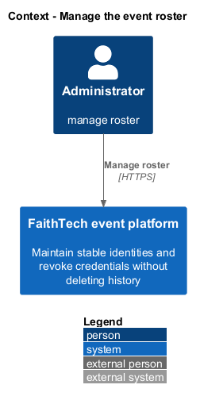
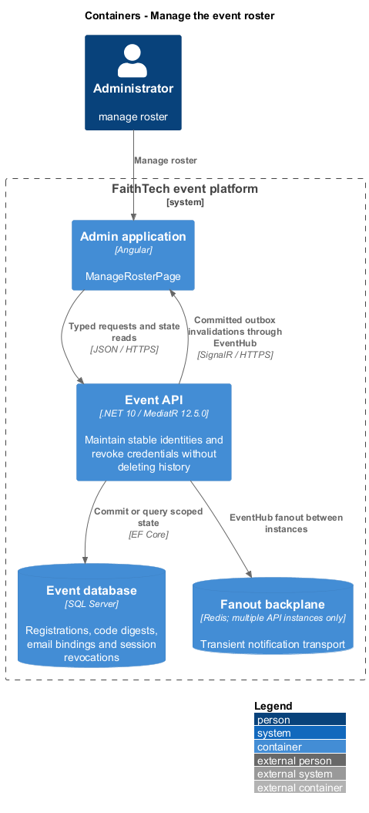
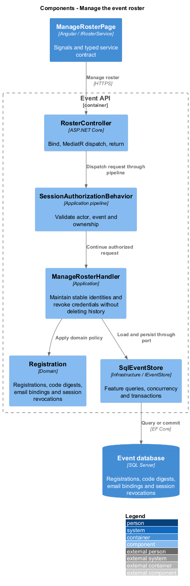
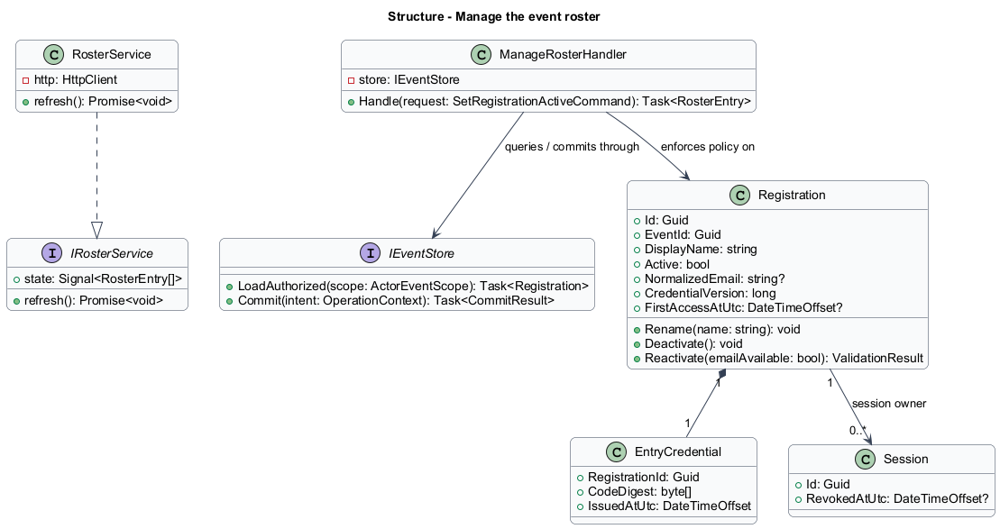
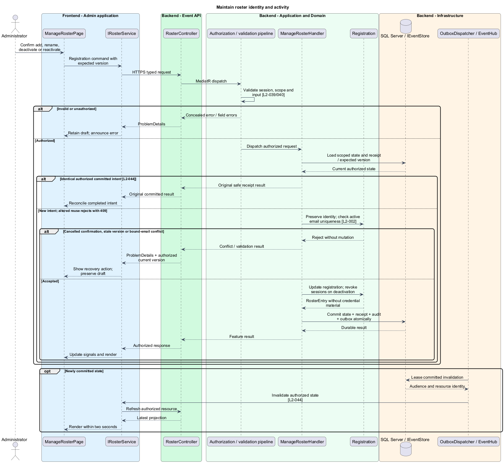
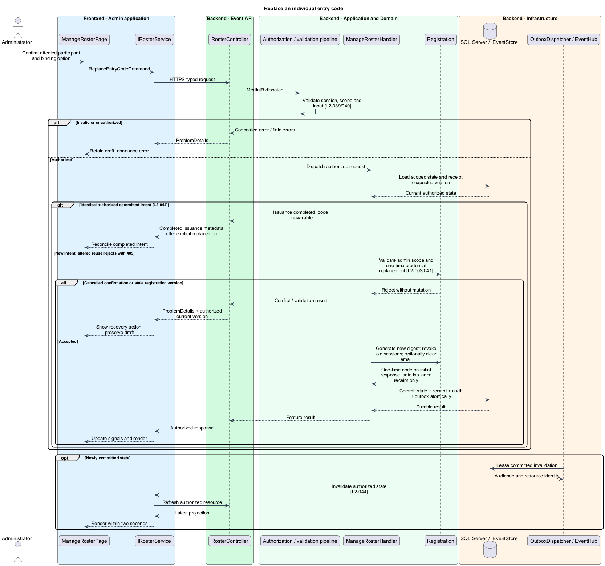

# Manage the event roster

## Overview

A registration is a stable participant identity within one event. The roster associates that identity with a display name and one current entry credential. Renaming, deactivation, and credential replacement preserve the participant's historical activity.

## Description

This proposed slice follows the [shared architecture contracts](../../README.md). `ManageRosterPage` owns routing and dialogs; domain components consume `IRosterService` through `ROSTER_SERVICE`. `RosterService` implements HTTP access in `api`.

`/admin/events/:eventId/roster` lists `RosterEntry` values: ID, display name, active state, whether an email is bound, first-access status, and version. Authorized administration detail may expose the bound email for account recovery; participant lists never expose it. Codes are absent from every roster projection.

`RosterController` dispatches `ListRosterQuery`, `AddRegistrationCommand`, `RenameRegistrationCommand`, `SetRegistrationActiveCommand`, and `ReplaceEntryCodeCommand`. Routes use `/api/admin/events/{eventId}/roster`, with `/{registrationId}`, `/{registrationId}/active`, and `/{registrationId}/entry-code` for targeted operations. `IRosterService` exposes matching typed methods. `RegistrationInput` contains a display name; the active-state command contains the desired boolean; replacement contains `ClearEmailBinding` and expected version.

`ManageRosterHandler` uses `RegistrationId` as identity across all relationships. Names need not be unique. A unique filtered SQL index on `(EventId, NormalizedEmail)` applies to active bound registrations. Reactivation checks the index transactionally and rejects a retained email already bound to another active registration. The recovery action explicitly replaces the credential with `ClearEmailBinding=true`; renaming or ordinary reactivation never silently clears it.

`IEntryCodeGenerator` produces at least 128 random bits using a cryptographic generator. `EntryCredential` stores a keyed digest, with unique `(EventId, CodeDigest)` and collision regeneration. The response reveals the code once in the completed administrator action. Confirmation names the affected registration; cancellation sends no mutation. Replacement updates the digest and credential version, optionally clears the email binding, revokes all existing sessions, and records the change atomically. It emits private invalidations after commit.

No code-retrieval endpoint exists. An issuance receipt records completion and credential version without secret material. A lost issuance response leads to a clearly labeled explicit replacement, never an automatic retry that issues another code. Old codes fail immediately. Reactivation requires fresh authentication and leaves prior session revocations intact.

Deactivation sets `Active=false` and revokes sessions in one transaction. Memberships, profile, answers, messages, reports, and awards remain referenced by registration ID. Discovery, recommendations, new sends, and raffle eligibility filter active registrations; historical displays retain the identity. The audience invalidations refresh relevant lists without broadcasting email or code values.

Acceptance checks create duplicate display names, rename after participation, replace credentials while two tabs are connected, and deactivate an existing prize winner. Reactivation checks both free and conflicting retained email bindings. Browser scenarios verify confirmation cancellation, one-time reveal, unknown issuance outcomes, keyboard focus return, and stale editor recovery.

## Requirements

The following verbatim primary excerpts link to their complete normative definitions and Given–When–Then acceptance criteria. Shared constraints apply as specified in the [architecture contracts](../../README.md).

| L2 ID | Refines (L1) | Requirement excerpt |
|---|---|---|
| [L2-002](../../../specs/L2.md#l2-002-participant-roster-and-credentials) | `L1-001` | Administrators must add, rename, deactivate, and reactivate event roster entries and issue or replace individual entry codes. Names need not be unique; participant identity must not depend on a name. A replacement code must invalidate the prior code and sessions without deleting participation history. |

## Diagrams

Administrator uses the event platform to manage roster. The context isolates this capability from unrelated event activities.

The Admin application calls the API for authoritative state. SQL Server retains registrations, code digests, email bindings and session revocations; SignalR invalidations prompt authorized reads.

`RosterController` dispatches through the application pipeline. `ManageRosterHandler` owns the feature policy and uses the persistence port.

`Registration` carries stable identity and feature state. The service interface separates Angular consumers from HTTP; `IEventStore` represents the application persistence boundary. Method shapes are slice-specific views of the shared contracts.

Maintain roster identity and activity applies preserve identity; check active email uniqueness [l2-002]. Cancelled confirmation, stale version or bound-email conflict leaves committed state unchanged; the client retains enough context to recover.

Replace an individual entry code applies validate admin scope and one-time credential replacement [l2-002/041]. Cancelled confirmation or stale registration version leaves committed state unchanged; the client retains enough context to recover.

