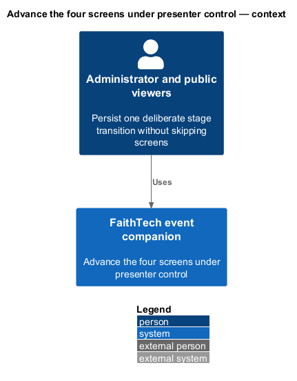
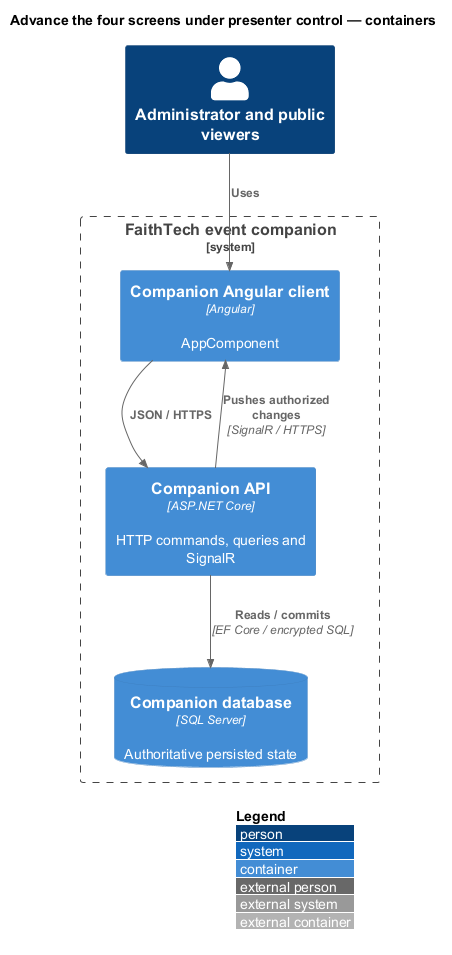
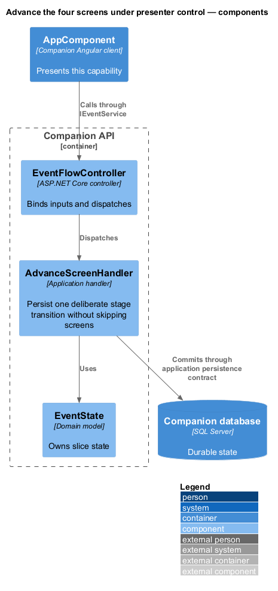
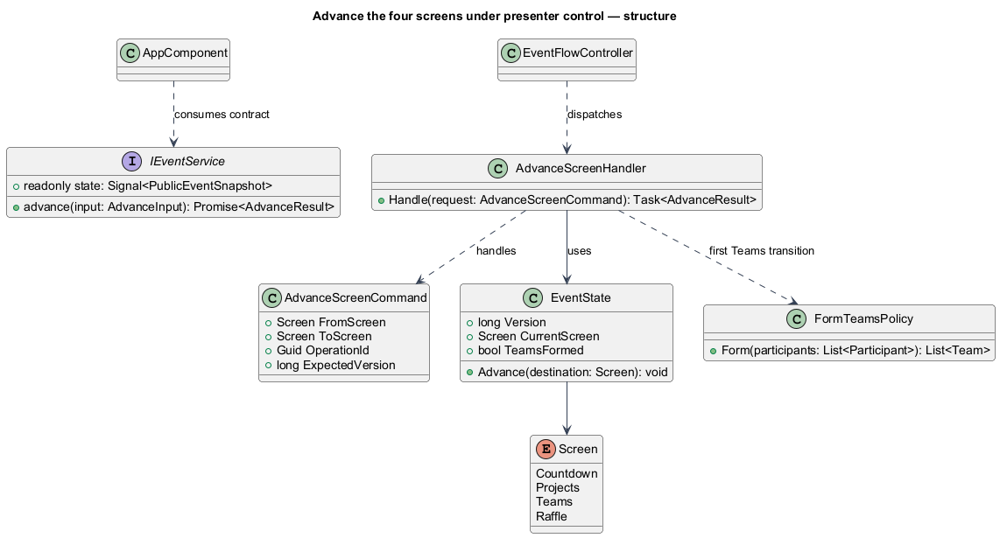
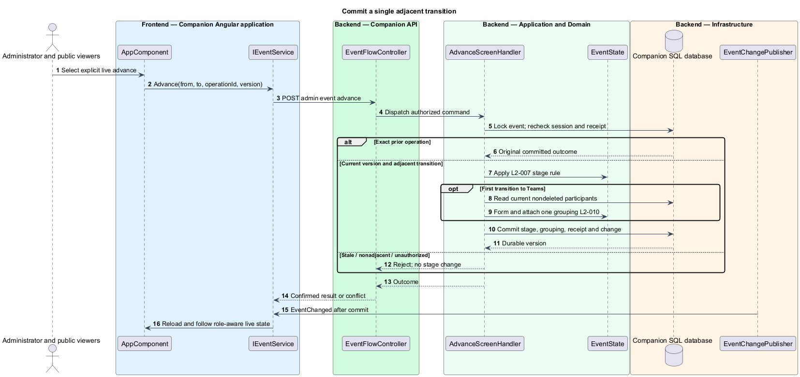
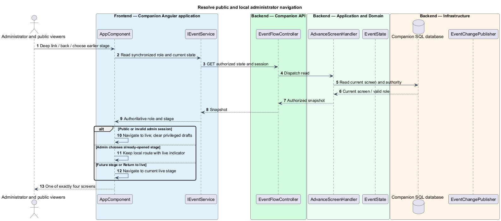

# Advance the four screens under presenter control

## Overview

The live screen is the single persisted stage all public viewers follow. Local administrator navigation visits previously opened screens for corrections without changing that live stage. The presenter, not the countdown or PowerPoint, advances the event.

## Description

`AppComponent` preserves the mock's progression navigation, explicit destination button, live indicator, and Return to live action. Production routes are `/countdown`, `/projects`, `/teams`, and `/raffle`; login and edits remain overlays. An unknown route resolves to the saved live screen rather than an extra not-found screen. Administrator role is server session state, never a local flag.

`POST /api/admin/event/advance` carries fromScreen, toScreen, operationId, and expectedVersion. Proposed `EventFlowController` dispatches `AdvanceScreenHandler` using `IEventStateStore`. Under the singleton event lock it rechecks administrator revision/expiry, original receipt, version, and exact adjacent stage pair. The state graph allows Countdown→Projects→Teams→Raffle only. Closing Countdown and denying subsequent public entry are the same state change. First opening Teams invokes `FormTeamsPolicy` inside the same transaction. Opening Raffle does not invoke a draw.

After commit, SignalR invalidation causes public clients to fetch the latest snapshot. `LiveScreenCoordinator` applies role-aware routing: public deep links, refresh, history/back, and future links all converge on CurrentScreen. Administrators may select any ordinal at or below the live stage; that selection is memory-local and survives public updates until Return to live, logout, or invalidation. A reload defaults to live. No global back/reset command exists. A locally browsing administrator cannot advance from an old stage; the advance action is offered only on the live stage.

Concurrent advances using one version yield one transition and one conflict, or the original receipt outcome for a retry. A delayed request cannot skip a screen even after the first transition finishes. Rejected edits retain local drafts except owner-profile closure; removed focus targets fall back to the new heading. A valid current focus is not moved merely because a notification arrives.

Commands and queries use the [shared architecture and protocol](../../README.md#shared-architecture-and-protocol). The following acceptance scenarios are design obligations, not executed test evidence.

- Given two administrators advancing the same version, when both requests finish, then one transition commits and no stage is skipped.
- Given an old/future public deep link or browser back, when synchronized, then the saved live stage wins.
- Given local admin corrections on Countdown after closure, when event state changes, then public viewers remain live and admin corrections remain available.
- Given Projects→Teams storage failure, when read again, then Projects remains live with no partial grouping.

## Requirements

The source text below is reproduced verbatim, including its original obligation wording.

| L2 ID | Refines (L1) | Requirement |
|---|---|---|
| [L2-007](../../../specs/L2.md#l2-007-exactly-four-screens-and-manual-progression) | L1-004 | The server must persist one current screen, initially Countdown. An administrator must explicitly advance Countdown → Projects → Team selection → Raffle. Countdown's action must clearly close public entry and open Projects. Other advances must identify their destination. Public clients must follow the current screen; deep links/refresh/back cannot open a future stage or regress the event. Administrators can browse any already-opened screen locally for corrections and return to the live screen; local browsing never broadcasts a transition. Login, profile editing, roster/project editing, and feedback are inline or overlays, not extra screens. There is no global back/reset or automatic timed progression in this scope. |
| [L2-010](../../../specs/L2.md#l2-010-form-random-teams-once-on-first-opening) | L1-005 | The first successful global transition from Projects to Team selection must uniformly shuffle all currently entered, nondeleted participants and partition them into teams of three, with one final team of one or two for any remainder. No attendee is omitted, duplicated, or inferred from the run sheet's registration count. Optional answers do not influence selection. Team identities/memberships and the opened stage must commit together once. Later page loads, reconnects, and additional viewers must never reshuffle. Later administrator-added participants remain unassigned until an explicit move. |
| [L2-044](../../../specs/L2.md#l2-044-signalr-synchronization-persistence-and-conflicts) | L1-014 | SignalR must deliver screen changes, roster-derived public changes, private administrator roster changes, project edits, team updates, draws, and session invalidation to authorized connected clients. HTTP can load snapshots and submit commands, but polling alone does not satisfy realtime delivery. State must be durable before success/broadcast. Snapshots and events must carry ordering/version information so duplicate/out-of-order messages cannot regress state. Reconnect/resume must reauthorize and obtain a current snapshot. Show connection loss within ten seconds of a confirmed transport failure; while disconnected/synchronizing, disable server-changing controls and never claim fresh authority. Do not queue mutations for silent replay.  All mutations must reject stale conflicting versions. Retries retain operation identity and input, and return the original saved outcome after authorization without applying it again; changed input under that identity fails. Rejected edits retain drafts for explicit reapply, except privacy/session invalidation and the participant draft closure rule in L2-013. Initial-entry retries must retain an unguessable pre-submission operation receipt scoped to the creating browser so a lost response can recover that entry without letting knowledge of an email claim it. The receipt is a private session credential under L2-041, not a user-entered code. |

## Diagrams

The context identifies the actor and the capability within the companion.

The container view distinguishes browser or operator execution from durable server state.

The component view scopes the named building blocks to this feature.

The class view shows the proposed contract, request, state, and dependencies.

The same transaction closes entry or forms teams where the destination requires it.

Local administrator browsing has no mutation or broadcast path.

