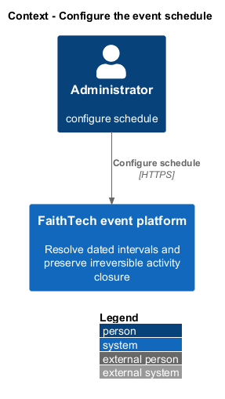
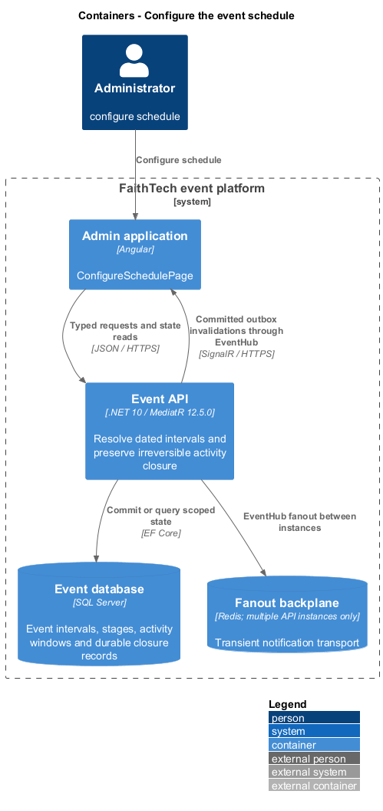
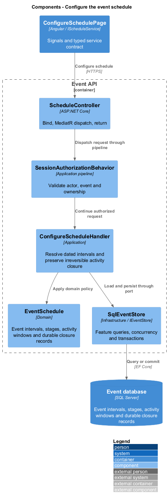
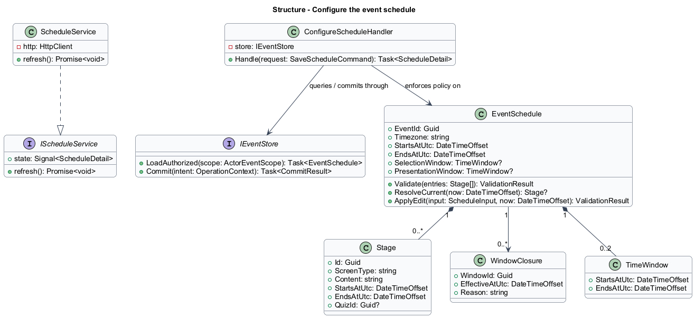
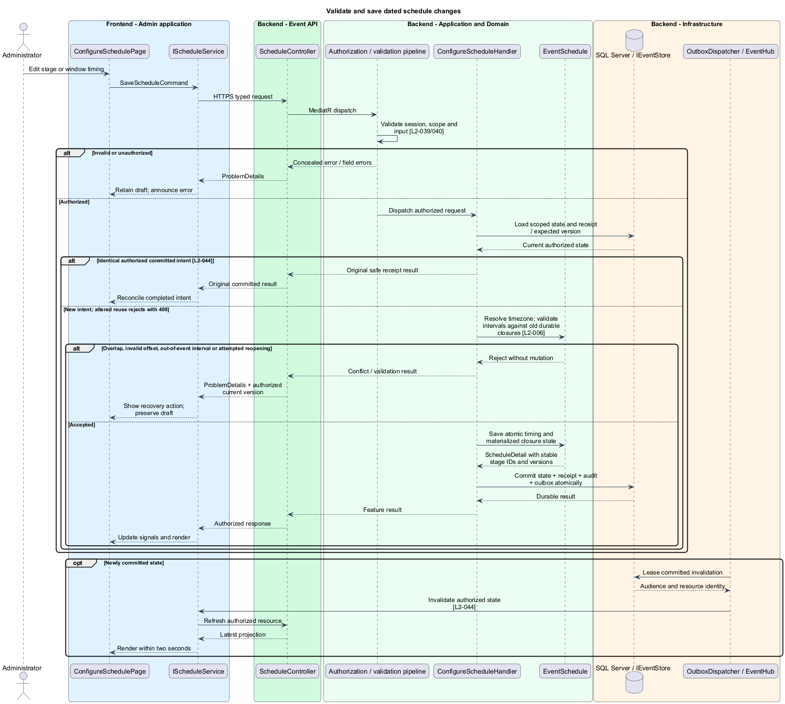
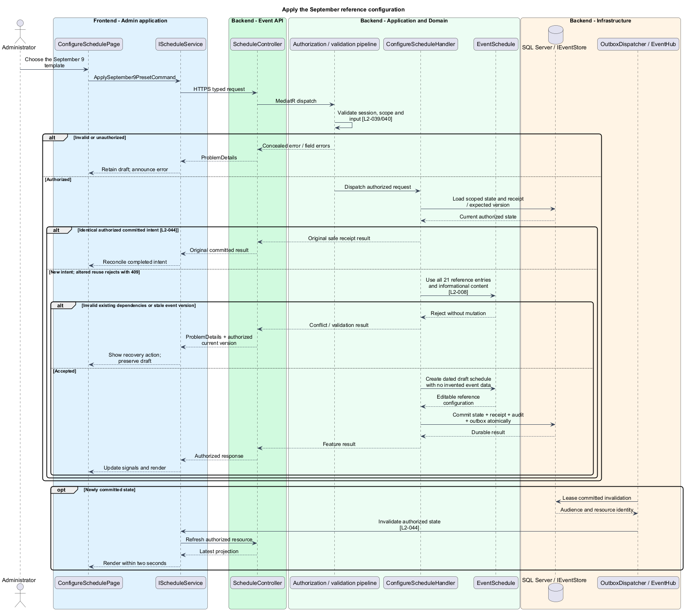

# Configure the event schedule

## Overview

A stage is one timed screen entry with its own identity and content. The selection window controls participant team/project changes independently of the visible stage. The presentation window bounds demo slots. Intervals use inclusive starts and exclusive ends.

## Description

This proposed slice follows the [shared architecture contracts](../../README.md). `ConfigureSchedulePage` owns routing and dialogs; domain components consume `IScheduleService` through `SCHEDULE_SERVICE`. `ScheduleService` implements HTTP access in `api`.

`/admin/events/:eventId/schedule` hosts the schedule editor. `GET/PUT /api/admin/events/{eventId}/schedule` dispatch `GetScheduleQuery` and `SaveScheduleCommand`; `POST /api/admin/events/{eventId}/reference-schedule` dispatches `ApplySeptember9PresetCommand`. `IScheduleService` exposes `get`, `save`, and `applyReference`. `ScheduleInput` contains the timezone, dated event endpoints, ordered stage inputs, and enabled/disabled selection and presentation intervals. Every existing entry carries its stable ID; repeated screen types do not merge entries.

`LocalTimeResolver` accepts local date/time, timezone, and explicit offset when ambiguous. It rejects nonexistent daylight-saving times and offsets inconsistent with the selected zone. Resolved instants remain UTC alongside the event timezone. `ScheduleValidator` sorts by start, enforces positive stage lengths and nonoverlap, and requires stages/windows inside the event interval. Dates, rather than time-of-day comparisons, support overnight events. The same transaction validates quiz references and demo containment.

`ConfigureScheduleHandler` locks the event schedule guard, loads the old committed schedule, samples authoritative time, and materializes its due closures before evaluating edits. `WindowClosure` has a unique event/window key. Once selection or a quiz closes, extending dates never changes that closure. Disabling currently open selection closes it permanently. Once opened, the selection or quiz opening instant cannot move to reset it. Once the old event end has passed, extending the event to reopen participant link editing or timed activities is rejected. Closed quiz keys/scores remain fixed. These checks run even if no browser or boundary worker was online at the old closing instant.

The handler commits schedule changes, closure records, receipt, audit, and invalidation together. Invalid edits preserve all previous live timing. A version conflict returns authorized current timing and retains the administrator draft. The boundary worker uses the same policy, so it cannot race an edit into reopening an activity.

`September9Preset` is an application-owned informational template matching the complete L2-008 table: September 9, 2026, 17:00–21:00, America/Toronto (UTC−04:00), Stone Church, and 21 distinct screen entries. Its selection interval is 18:05–18:15 and presentation interval 20:30–20:50. The 20:00 reminder remains content inside the 19:45 build entry. The template supplies no invented project descriptions, quiz questions, roster, prizes, coordinates, or logo. Missing required venue branding/location leaves the event a draft. Administrator edits create ordinary event configuration rather than altering the template.

Acceptance checks cover adjacency at exact boundaries, gaps, repeated screen types, overnight intervals, ambiguous/nonexistent local times, stale edits, and invalid cross-activity references. A restart test advances beyond an old closing instant without a worker, then attempts an extension and verifies closure persists. Preset verification checks all 21 rows against the normative table and verifies every administrator-supplied field remains unpopulated.

## Requirements

The following verbatim primary excerpts link to their complete normative definitions and Given–When–Then acceptance criteria. Shared constraints apply as specified in the [architecture contracts](../../README.md).

| L2 ID | Refines (L1) | Requirement excerpt |
|---|---|---|
| [L2-006](../../../specs/L2.md#l2-006-schedule-validation-and-exact-boundaries) | `L1-004` | Administrators must configure event and stage start/end times, named stages, and their screen content or activity. Start is inclusive and end exclusive. Stages must have positive durations, be within the event interval, and not overlap. Event timezone and offset must resolve each scheduled instant unambiguously. |
| [L2-008](../../../specs/L2.md#l2-008-september-9-reference-configuration) | `L1-004` | The platform must provide an editable reference event for September 9, 2026, 17:00-21:00 America/Toronto at Stone Church, with Use Liturgy disabled. The presentation supplies these contiguous phase intervals: Gather 17:00-17:28, Discover 17:28-18:05, Discern 18:05-18:15, Develop 18:15-20:10, Demonstrate 20:10-20:50, and Send 20:50-21:00. |

## Diagrams

Administrator uses the event platform to configure schedule. The context isolates this capability from unrelated event activities.

The Admin application calls the API for authoritative state. SQL Server retains event intervals, stages, activity windows and durable closure records; SignalR invalidations prompt authorized reads.

`ScheduleController` dispatches through the application pipeline. `ConfigureScheduleHandler` owns the feature policy and uses the persistence port.

`EventSchedule` carries stable identity and feature state. The service interface separates Angular consumers from HTTP; `IEventStore` represents the application persistence boundary. Method shapes are slice-specific views of the shared contracts.

Validate and save dated schedule changes applies resolve timezone; validate intervals against old durable closures [l2-006]. Overlap, invalid offset, out-of-event interval or attempted reopening leaves committed state unchanged; the client retains enough context to recover.

Apply the September reference configuration applies use all 21 reference entries and informational content [l2-008]. Invalid existing dependencies or stale event version leaves committed state unchanged; the client retains enough context to recover.

