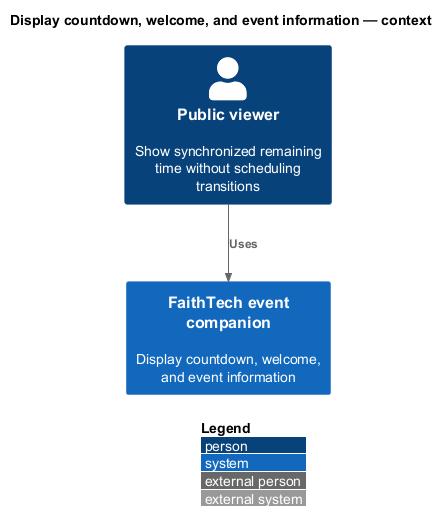
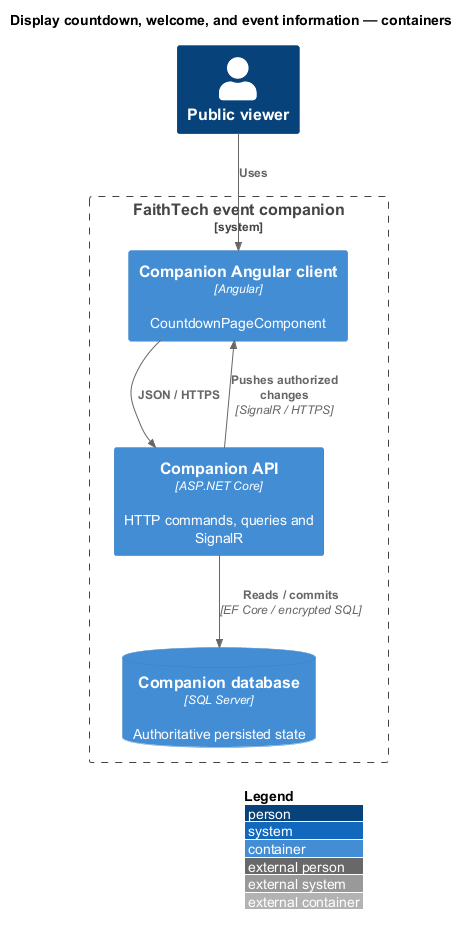
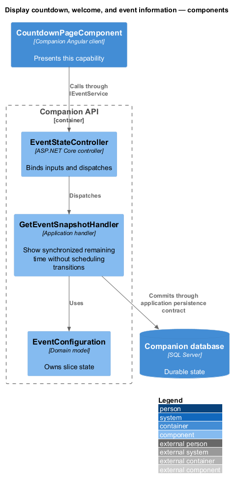
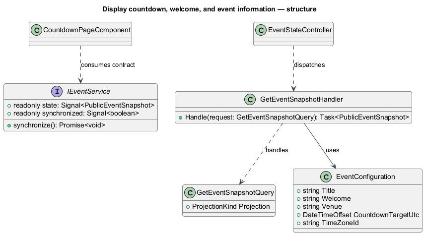
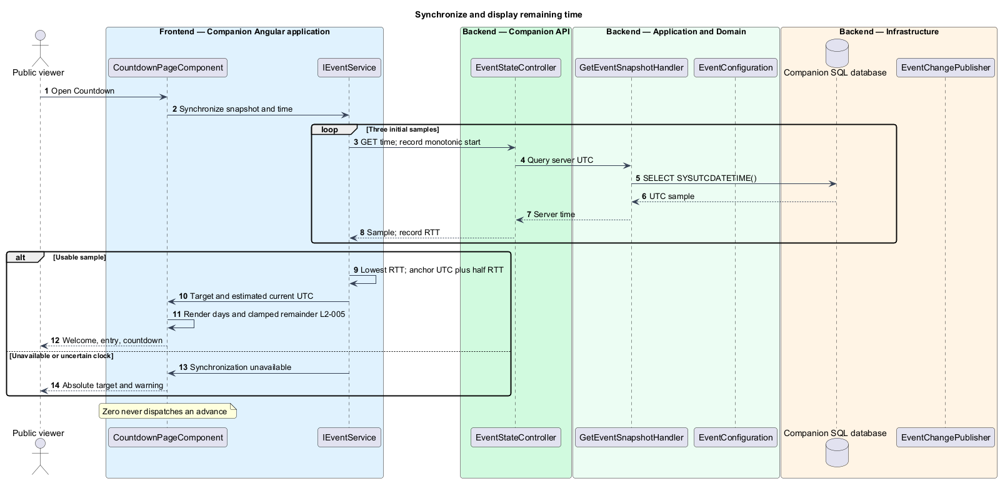

# Display countdown, welcome, and event information

## Overview

Countdown welcomes everyone and explains the evening's team-build and demo purpose. Its time display measures the remaining interval to the configured welcome time. Reaching zero does not close entry or advance the event.

## Description

The approved `CountdownPageComponent` supplies content to Cornerstone's proposed `CountdownComponent`. Production `IEventService` / `EVENT_SERVICE` is narrower than the mock's combined service: `EventService` supplies public state, synchronization status, and server-time estimates. `GET /api/event/state` dispatches `GetEventSnapshotQuery`; `GET /api/event/time` supplies a lightweight SQL UTC sample through the same proposed `EventStateController`.

Deployment Options contain title, welcome, brief purpose, venue, time zone, and `CountdownTargetUtc=2026-09-09T21:20:00Z`. Display copy says September 9, 2026, 5:00–9:00 PM America/Toronto and Stone Church — Davenport Community Campus, 45 Davenport Rd, Toronto. Initial target is the 17:20 welcome, distinct from 17:00 doors. The API validates configuration at startup; configuration changes use deployment configuration, with no editing screen.

`ServerClock` uses monotonic `performance.now()` elapsed time, never the device wall clock. At synchronization it takes three time samples, selects the lowest round-trip sample, and estimates server time at receipt as reported UTC plus half RTT. It retains that UTC/monotonic anchor and refreshes on resume, reconnect, and every 30 seconds while visible. The browser treats failed samples or a best RTT above two seconds as unavailable, shows the absolute target with a warning, and withholds a claim of current remaining time. The reference acceptance network verifies at most one-second residual error; arbitrary asymmetric latency cannot be promised away.

Cornerstone displays max(0, target minus estimated server time), including days. Ticks are not live-region announcements. Time sampling is not event-state delivery: SignalR still drives screen and content changes. Before authority is synchronized, changing controls remain disabled; zero with valid synchronization leaves email entry enabled while Countdown remains live.

Commands and queries use the [shared architecture and protocol](../../README.md#shared-architecture-and-protocol). The following acceptance scenarios are design obligations, not executed test evidence.

- Given a device clock ten minutes wrong, when synchronization succeeds, then the countdown error is at most one second in the acceptance environment.
- Given zero or more than 24 hours remaining, when displayed, then time clamps or includes days without changing the stage.
- Given time synchronization failure, when viewed, then the absolute target and warning remain without a false current countdown.

## Requirements

The source text below is reproduced verbatim, including its original obligation wording.

| L2 ID | Refines (L1) | Requirement |
|---|---|---|
| [L2-005](../../../specs/L2.md#l2-005-countdown-welcome-and-brief-event-information) | L1-003 | Countdown must show the event title, welcome, September 9, 2026, 5:00–9:00 PM America/Toronto, and Stone Church — Davenport Community Campus, 45 Davenport Rd, Toronto, as supplied by the run sheet. Brief copy must explain email raffle entry and the evening's team build/demo purpose. Initial countdown target is the 17:20 welcome (21:20 UTC), a specification default distinct from 17:00 doors. Deployment configuration supplies this target and copy without adding a configuration screen. Countdown uses server time, includes days when needed, and never falls below zero. |
| [L2-034](../../../specs/L2.md#l2-034-supported-browser-and-capabilities) | L1-012 | Acceptance must use the latest stable Google Chrome available on the verification date and record its version and OS. Browser/GPU support must be detected at runtime. Basic participation, administrator actions, and winner text must work without WebGPU. |
| [L2-036](../../../specs/L2.md#l2-036-keyboard-semantics-and-feedback) | L1-012 | All controls must have accessible names, visible focus, and keyboard operation. Dialogs must contain focus and restore it to their trigger or current heading if the trigger is gone. Validation must preserve entered values and associate/announce field errors. Stage changes and winner results must be announced once; countdown ticks and cycling names must not create repeated screen-reader announcements. Text contrast must reach 4.5:1, or 3:1 for large text; meaningful control boundaries/focus indicators must reach 3:1. Fix missing accessibility upstream in Cornerstone. |

## Diagrams

The context identifies the actor and the capability within the companion.

The container view distinguishes browser or operator execution from durable server state.

The component view scopes the named building blocks to this feature.

The class view shows the proposed contract, request, state, and dependencies.

A monotonic clock advances a server-time anchor; the countdown has no stage-mutation path.

