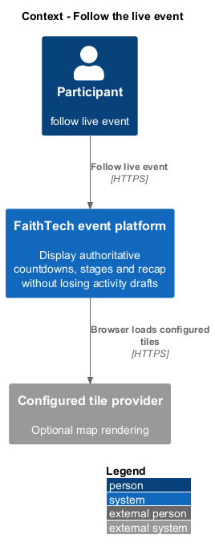
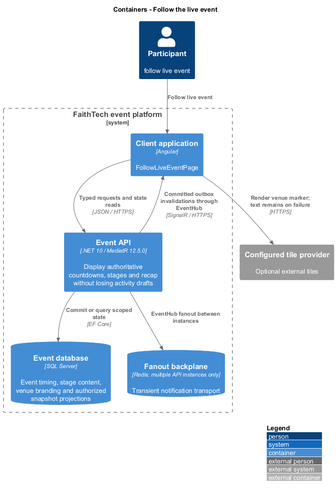
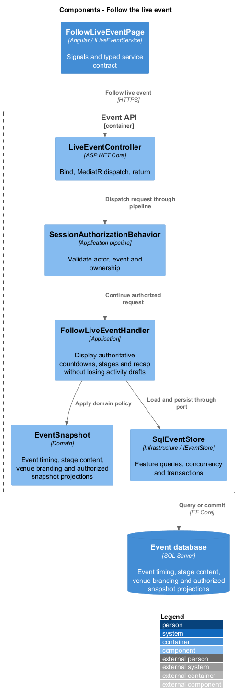
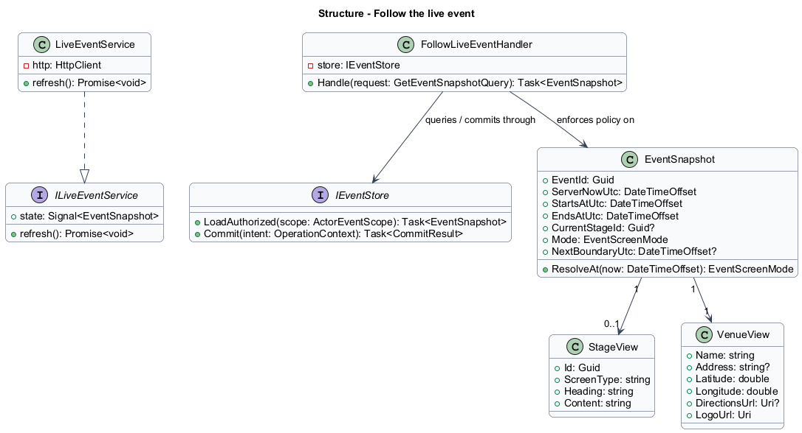
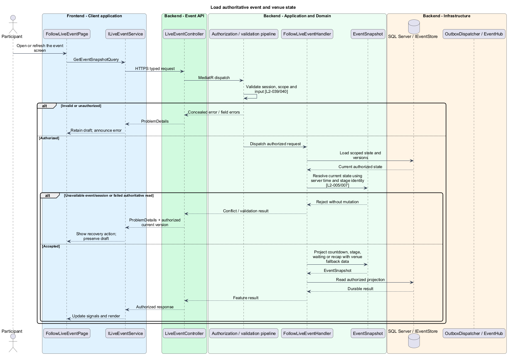
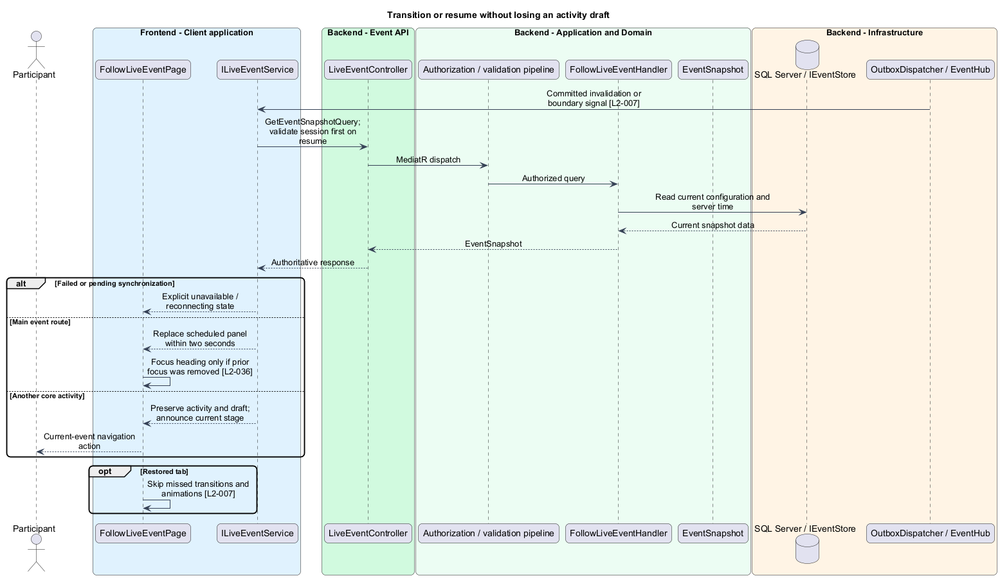

# Follow the live event

## Overview

The live event screen follows the gathering's authoritative schedule. Before the start it presents a countdown and venue; during the gathering it shows the current stage or waiting content; at completion it opens the recap. Other activities stay accessible independently of this screen.

## Description

This proposed slice follows the [shared architecture contracts](../../README.md). `FollowLiveEventPage` owns routing and dialogs; domain components consume `ILiveEventService` through `LIVE_EVENT_SERVICE`. `LiveEventService` implements HTTP access in `api`.

`/events/:eventId` hosts `FollowLiveEventPage`. `GET /api/events/{eventId}/snapshot` dispatches `GetEventSnapshotQuery` through `LiveEventController`. `ILiveEventService` provides a readonly `EventSnapshot` signal, `refresh`, and `connect`. Its HTTP/SignalR adapter owns transport and synchronization; the domain `LiveEventStore` owns presentation state.

`FollowLiveEventHandler` samples server time and reads a consistent event configuration projection. `EventSnapshot` includes current/next stage, start/end, event timezone, navigation capabilities, window closure states, venue, public content, resource versions, and sample time. It excludes credentials and other participants' private fields. `StageResolver` uses start-inclusive/end-exclusive instants and stable stage IDs; identical screen types can therefore advance content correctly.

`CountdownModel` subtracts a monotonic elapsed duration from the last server-sampled remaining interval. Days, hours, minutes, and seconds derive from the nonnegative remainder. Device clock changes never change authority. At the start boundary, the page requests fresh state and changes within two seconds under the connected acceptance conditions. Empty stage lists and gaps show waiting content; event end takes precedence and selects recap.

`VenueMapComponent` consumes validated latitude/longitude and operator-configured map tiles, rendering one marker. It accepts no arbitrary embed HTML or user-provided tile URL. The venue name, saved address or coordinates, logo alternative text, and independent HTTPS directions action remain outside the map canvas. Tile or image failure shows a textual fallback without disabling directions. Provider credentials and permitted tile origins are operator configuration; no specific provider or location is fabricated.

`EventHub` invalidations, boundary timers, and resumed-tab events call `refresh`. Each response belongs to the current event/session; older requests cannot replace later accepted state. On the main event page a stage change replaces the scheduled panel without an unsaved-form confirmation. On another activity it preserves the view and draft and announces the current stage with a return action. Focus moves to the new heading only if the removed panel contained focus. Countdown ticks do not produce repeated live announcements.

On reconnect the guard hides private state until session validation completes, then renders only the current snapshot. Missed transitions and celebrations are not replayed. Pending or failed synchronization shows an explicit reconnecting/unavailable state. Known expiry clears local drafts; ordinary stage changes do not.

Acceptance checks move the device wall clock, cross exact boundaries, use repeated screen types, remove stages, fail map/logo loads, and resume after several missed stages. Multi-client checks measure save/boundary-to-render latency. Page objects verify navigation with a dirty profile/message draft and conditional focus behavior.

## Requirements

The following verbatim primary excerpts link to their complete normative definitions and Given–When–Then acceptance criteria. Shared constraints apply as specified in the [architecture contracts](../../README.md).

| L2 ID | Refines (L1) | Requirement excerpt |
|---|---|---|
| [L2-005](../../../specs/L2.md#l2-005-countdown-and-venue-display) | `L1-003` | Before the configured start, authenticated participants must see the event title, venue name, configured logo, location map, textual address or coordinates, and a nonnegative days/hours/minutes/seconds countdown derived from server time. Configured external directions must remain usable independently of the embedded map. |
| [L2-007](../../../specs/L2.md#l2-007-live-stage-transitions-and-content) | `L1-004` | The client must follow the server's current configured stage automatically, including on initial login, refresh, resumed tabs, and reconnection. Administrators must be able to configure timed informational screens and interactive activities within the evening, including multiple screens within a named phase by using consecutive schedule entries. Saved schedule edits must take effect atomically. |

## Diagrams

Participant uses the event platform to follow live event. The context isolates this capability from unrelated event activities.

The Client application calls the API for authoritative state. SQL Server retains event timing, stage content, venue branding and authorized snapshot projections; SignalR invalidations prompt authorized reads.

`LiveEventController` dispatches through the application pipeline. `FollowLiveEventHandler` owns the feature policy and uses the persistence port.

`EventSnapshot` carries stable identity and feature state. The service interface separates Angular consumers from HTTP; `IEventStore` represents the application persistence boundary. Method shapes are slice-specific views of the shared contracts.

Load authoritative event and venue state applies resolve current state using server time and stage identity [l2-005/007]. Unavailable event/session or failed authoritative read leaves committed state unchanged; the client retains enough context to recover.

A timer or committed invalidation requests authoritative state. The current route determines whether the client replaces the scheduled panel or retains the activity and announces the change.

