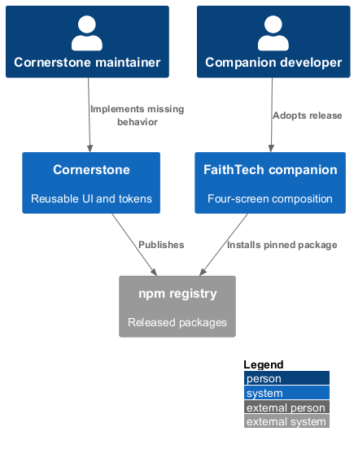
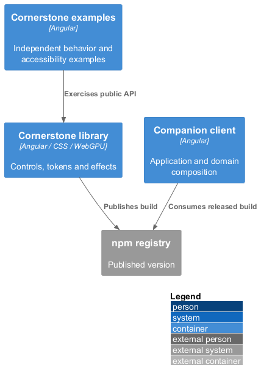
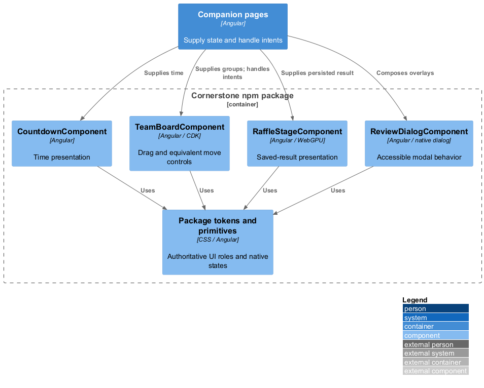
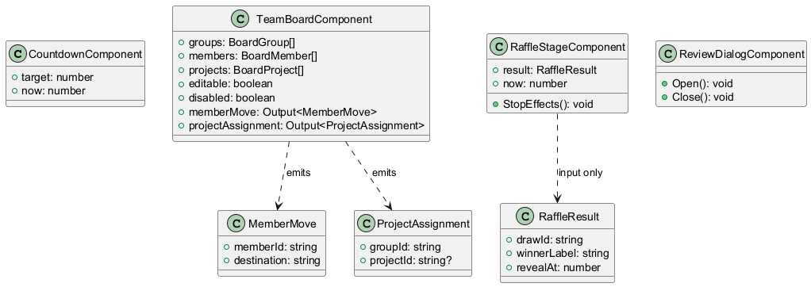
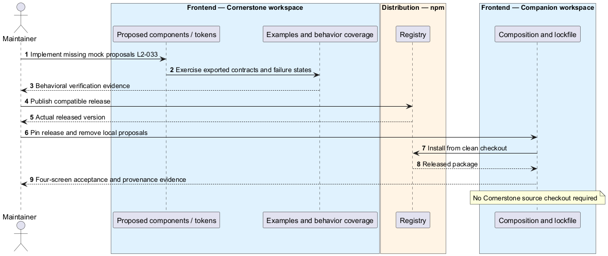

# Adopt completed Cornerstone components and tokens

## Overview

Cornerstone is the npm-delivered owner of every control, design token, and reusable visual behavior in the companion. The mock's components library is a proposal for upstream additions. Its local alias is permitted for design review but is not a production delivery mechanism.

## Description

The approved workspace uses `@quinntyne/cornerstone@0.1.3` and Angular 21. Production starts from the inspected package API, implements missing behavior in Cornerstone, publishes a compatible release, and pins that actual released version in the app lockfile. No future version number is invented here. The release is a delivery dependency, not an unresolved product requirement.

| Mock proposal | Upstream contract and responsibility |
|---|---|
| `CountdownComponent` | Inputs target/current time and synchronized status; displays days and clamped remaining time without scheduling |
| `TeamBoardComponent` | Inputs groups, members, projects, editable, disabled, current member; emits `MemberMove` and `ProjectAssignment`; CDK interaction stays inside Cornerstone |
| `RaffleStageComponent` | Inputs saved result/timestamps, synchronized now and motion state; owns cycling, WebGPU/fallback, cleanup and Stop effects; never chooses a winner |
| `ReviewDialogComponent` | Modal shell with unique accessible heading, focus containment, dismissal, and focus restoration |
| `NativeControlStateDirective` | Upstream correction to native button disabled behavior and select value/disabled synchronization; fix original primitives rather than ship a parallel production patch |
| `proposal-tokens.scss` | Missing spacing/layout/motion roles migrate to package tokens; application consumes them without copying |

The mock's `ReviewDialogComponent` uses native dialog around `DialogShellComponent`; the upstream public API may retain that composition, but behavior is covered and exported from the npm package. Published buttons, inputs, selects, field/error/status UI, cards, badges, tables, and dialogs supply the rest. App `components` contains only presentation composition, with inputs/outputs and no service or imports from sibling app projects. Any service-aware component belongs in `domain`. All class/template/style files remain separate.

`provideCsTheme('light')` is bound at composition. OS theme changes and stale browser preferences do not override it. The app uses only supported package styling APIs and token roles for color, spacing, dimensions, typography, borders, focus, icons and motion. Missing roles are implemented upstream; run-sheet styles do not become app tokens.

The upstream release gate includes examples for loading, disabled, error, empty, keyboard, touch, dialog focus, reduced motion and GPU failure. Consumer verification records package version, exported API and provenance, then builds a clean application checkout without a Cornerstone checkout. Local aliases, copied primitives and unpublished workspace links leave production delivery incomplete. This documentation task publishes no npm release and claims no upstream tests have passed.

The following acceptance scenarios are design obligations, not executed test evidence.

- Given a clean app checkout without the upstream repository, when dependencies install and the four journeys run, then all controls/effects come from the adopted npm release.
- Given a missing native disabled/value behavior, when the upstream correction is released, then examples and the companion agree.
- Given dark OS preference and restored old settings, when all screens render, then the package light theme remains.

## Requirements

The source text below is reproduced verbatim, including its original obligation wording.

| L2 ID | Refines (L1) | Requirement |
|---|---|---|
| [L2-029](../../../specs/L2.md#l2-029-consume-the-published-cornerstone-ui) | L1-011 | All rendered application UI must be composed from `@quinntyne/cornerstone` npm components and styles, including forms, buttons, cards, tables/lists, dialogs, countdown presentation, team-board interactions, validation/status UI, and raffle animation/effects. Application code supplies data, actions, and screen composition. A clean install must resolve a pinned released package version through the lockfile without a local Cornerstone checkout. Existing local control implementations are not an alternative delivery path. |
| [L2-030](../../../specs/L2.md#l2-030-package-owned-tokens-and-styling) | L1-011 | Cornerstone must be the authoritative source of colour, spacing, dimensions, typography, borders, radii, shadows, icons, and motion tokens. Application composition must consume package tokens and supported styling APIs. Missing tokens must be added upstream; no locally mirrored token catalogue, copied stylesheet, hard-coded visual replacement, or independent design-system site satisfies this requirement. |
| [L2-032](../../../specs/L2.md#l2-032-consistent-light-theme) | L1-011 | Every application screen, overlay, native-control treatment, and status must use Cornerstone's light theme regardless of operating-system/browser theme preference. No dark mode or theme toggle is required. The run sheet's fonts, colours, theme switches, and images are not application styling requirements. |
| [L2-033](../../../specs/L2.md#l2-033-complete-missing-ui-in-cornerstone-first) | L1-011 | For each missing component, behavior, token, or accessibility capability, implementation must extend Cornerstone with its own behavioral coverage and examples, release `@quinntyne/cornerstone` to npm, then update and verify the app against that released version. This includes drag-and-drop with an accessible alternative and WebGPU/fallback raffle presentation if absent. Local source aliases, copied primitives, unpublished workspace links, or another UI library cannot satisfy completion. Package availability and APIs must be inspected during implementation; this specification makes no claim that the necessary capabilities already exist. |

## Diagrams

The context identifies the actor and the capability within the companion.

The container view distinguishes browser or operator execution from durable server state.

The component view scopes the named building blocks to this feature.

The class view shows the proposed contract, request, state, and dependencies.

Production adoption follows upstream behavior verification and publication; mock aliases do not cross that boundary.

