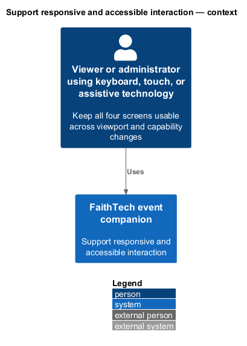
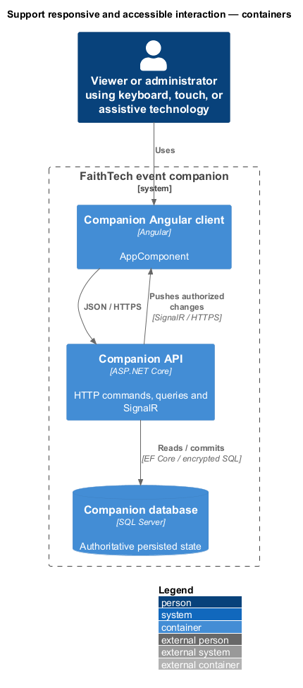
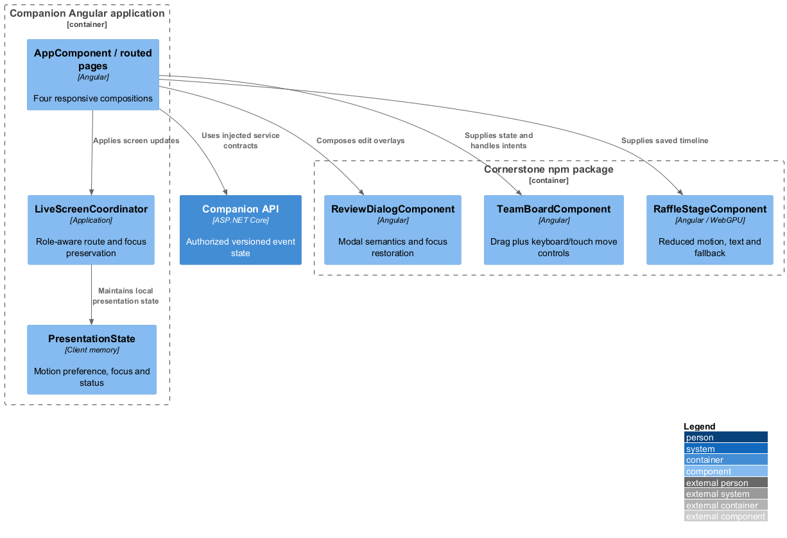
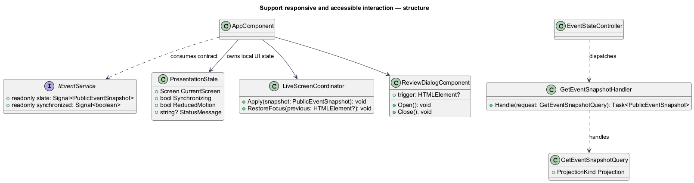
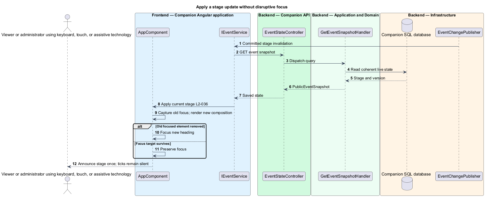
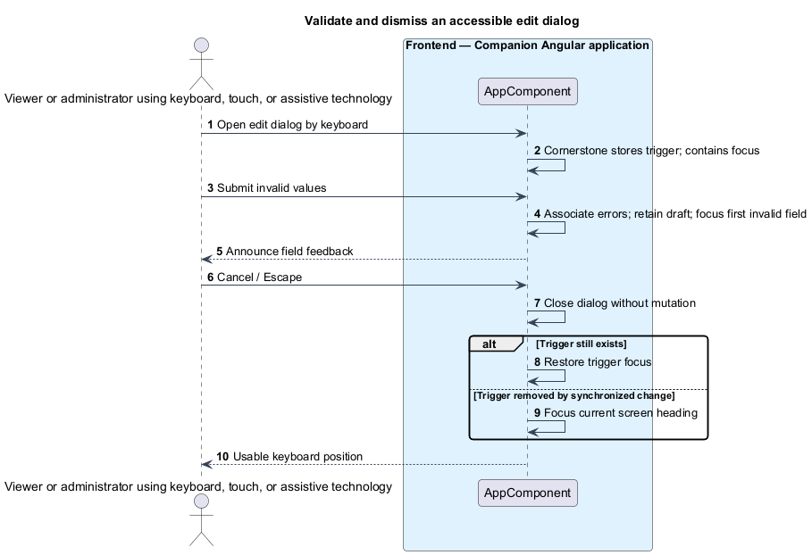

# Support responsive and accessible interaction

## Overview

Accessible interaction preserves meaning and control when the viewport, input method, motion preference, or graphics capability changes. The four screens share the same Cornerstone light theme, status patterns, and focus rules. Accessibility corrections are upstream Cornerstone work rather than local replacement controls.

## Description

The responsive composition uses package layout tokens at XS below 576px, S 576–767, M 768–991, L 992–1199, and XL from 1200. Below 576px the primary content is one column. Countdown places event/entry content in reading order; Projects cards stack; Teams groups and the unassigned area stack with Move to controls; Raffle keeps winner text ahead of secondary history. Larger layouts use package-supported grids, with no reordered reading sequence. At 1920×1080 the winner and label are visible without scrolling.

The roster may use its own labeled horizontal-scroll region, but the page itself does not scroll sideways. On phones, actions wrap into reachable rows and dialogs use constrained, internally scrollable content. Software keyboards and 200% zoom cannot hide the only Save/Cancel action. Verification uses 320, 575, 576, 767, 768, 991, 992, 1199, 1200, 1440 and 1920 CSS pixels across populated, empty, loading, error and dialog states.

`LiveScreenCoordinator` records whether the active DOM element survives a state change. It focuses the new heading only when the prior focus target disappears; otherwise focus remains. Each stage change is announced once. `ReviewDialogComponent` contains focus, associates a unique heading, supports Escape/cancel where allowed, and restores focus to its trigger or the current heading if the trigger was removed. Forms associate labels/errors and focus the first invalid field on submission. Errors retain drafts except privacy invalidation or owner-profile closure. Status text explains disabled controls rather than relying on color.

Published team controls expose both drag handles and equivalent keyboard/touch Move to options, including New team and Unassigned. Native disabled/value fixes live upstream. `RaffleStageComponent` observes reduced motion at runtime, provides Stop effects, hides cycling labels from assistive announcement, and announces the final winner once. Countdown ticks are silent. Text and persistent labels convey every outcome even without motion or color.

Package examples and app acceptance establish text contrast at least 4.5:1 (3:1 for large text), with meaningful boundaries/focus indicators at least 3:1. Acceptance records latest stable Chrome version and OS on the actual verification date; no specific future browser version is assumed. GPU feature detection is runtime-based and basic entry/admin/winner text require no WebGPU. Hidden-tab return first resynchronizes state and authority before exposing private content.

The mock supplies layouts and interactions for review, but its README explicitly does not claim a browser-testing pass. Future Playwright coverage binds service tokens to mocks, one page object per screen; real SignalR/privacy acceptance remains an independent integration obligation. This document adds neither tests nor claimed execution evidence.

Commands and queries use the [shared architecture and protocol](../../README.md#shared-architecture-and-protocol). The following acceptance scenarios are design obligations, not executed test evidence.

- Given keyboard-only input, when completing all participant/admin journeys, then no action requires pointing or dragging.
- Given listed viewport boundaries, software keyboard, or 200% zoom, when forms and dialogs render, then controls remain reachable and page-level horizontal overflow is absent.
- Given a removed focus target or closed modal, when state changes, then focus lands predictably without duplicate announcements.
- Given motion/GPU capabilities change during a draw, when the result arrives, then accessible winner text remains correct.

## Requirements

The source text below is reproduced verbatim, including its original obligation wording.

| L2 ID | Refines (L1) | Requirement |
|---|---|---|
| [L2-034](../../../specs/L2.md#l2-034-supported-browser-and-capabilities) | L1-012 | Acceptance must use the latest stable Google Chrome available on the verification date and record its version and OS. Browser/GPU support must be detected at runtime. Basic participation, administrator actions, and winner text must work without WebGPU. |
| [L2-035](../../../specs/L2.md#l2-035-responsive-four-screen-layouts) | L1-012 | Every public screen and administrator form must work at XS (<576px), S (576–767px), M (768–991px), L (992–1199px), and XL (>=1200px). Below 576px, primary content must use one column. Cards, roster actions, team groups, entry, and winner text must remain usable through desktop/projector dimensions. |
| [L2-036](../../../specs/L2.md#l2-036-keyboard-semantics-and-feedback) | L1-012 | All controls must have accessible names, visible focus, and keyboard operation. Dialogs must contain focus and restore it to their trigger or current heading if the trigger is gone. Validation must preserve entered values and associate/announce field errors. Stage changes and winner results must be announced once; countdown ticks and cycling names must not create repeated screen-reader announcements. Text contrast must reach 4.5:1, or 3:1 for large text; meaningful control boundaries/focus indicators must reach 3:1. Fix missing accessibility upstream in Cornerstone. |
| [L2-037](../../../specs/L2.md#l2-037-reduced-motion-and-resilient-presentation) | L1-012 | The app must honor reduced-motion preferences throughout. Essential meaning must also appear in text rather than colour or movement alone. Long animations must offer a stop-effects control within Raffle without affecting the selected winner. No audio feature, permission prompt, or mute UI is required. |
| [L2-032](../../../specs/L2.md#l2-032-consistent-light-theme) | L1-011 | Every application screen, overlay, native-control treatment, and status must use Cornerstone's light theme regardless of operating-system/browser theme preference. No dark mode or theme toggle is required. The run sheet's fonts, colours, theme switches, and images are not application styling requirements. |

## Diagrams

The context identifies the actor and the capability within the companion.

The container view distinguishes browser or operator execution from durable server state.

The component view scopes the named building blocks to this feature.

The class view shows the proposed contract, request, state, and dependencies.

Routing and focus use the synchronized stage and the lifetime of the previous focused element.

Field errors preserve input and modal dismissal restores a reachable focus target.

