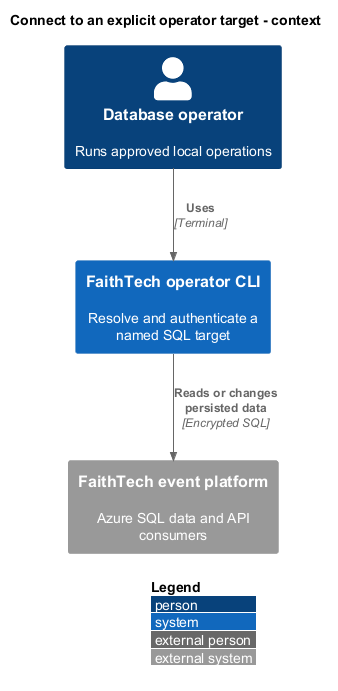
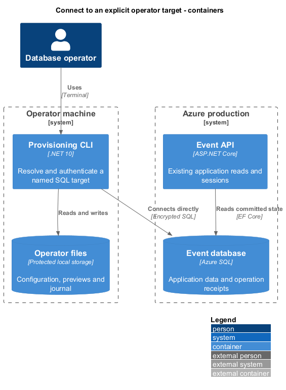
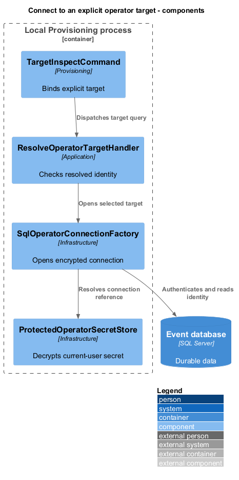
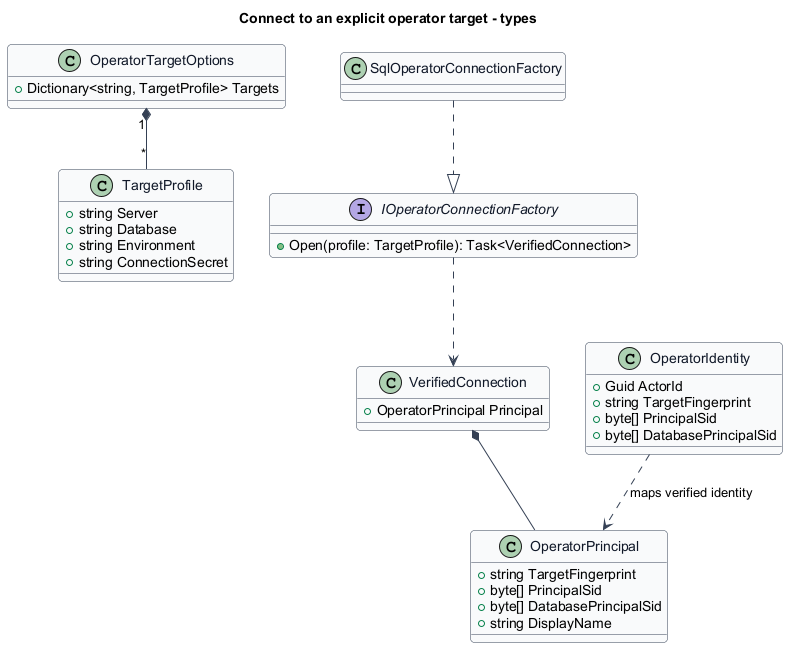
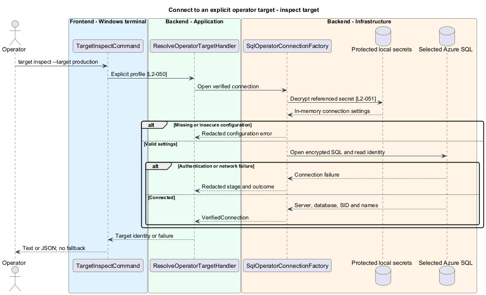
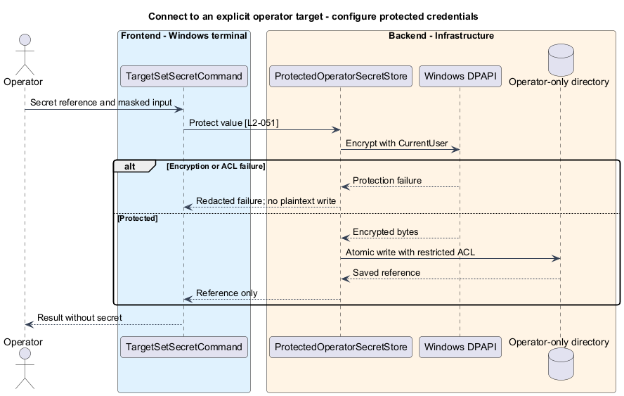
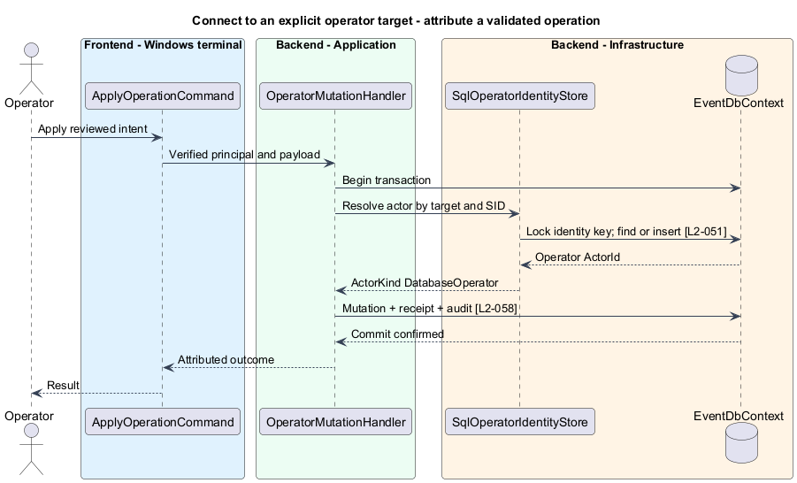

# Connect to an explicit operator target

## Overview

A target is a named connection profile that identifies one SQL server, database, and environment. The Super admin is the database principal authenticated on that connection, independently of web administrator accounts.

This feature resolves a target, protects its credentials, and reports its verified identity. It performs no event mutation and creates no Azure resources.

## Description

The current `DatabaseOptions` binds `ConnectionStrings:EventDatabase`; `AddEventInfrastructure` configures `EventDbContext` and application ports. The proposed `OperatorTargetOptions` adds named profiles, while `ResolveOperatorTargetHandler` and `IOperatorConnectionFactory` resolve an explicit profile before creating a scoped connection. `SqlOperatorConnectionFactory` implements the port in Infrastructure. The API retains its existing configuration path.

`faithtech-admin target inspect --target production` returns the resolved server, database, environment, current database principal, and original login display name. All database commands use this same verification. The default configuration location is `%LOCALAPPDATA%/FaithTechTorontoAiBuildEvent/operator/targets.json`; `--config` selects another explicit absolute path. There is no working-directory configuration discovery and no implicit target. Profile names use ordinal case-insensitive comparison, with duplicate names rejected. The profile schema is version 1:

```json
{"schemaVersion":1,"targets":{"production":{"server":"<server>.database.windows.net","database":"FaithTech","environment":"production","connectionSecret":"production-sql","digestSecret":"production-digest"}}}
```

Profiles contain secret references, not passwords. `target configure --target production --server <server> --database FaithTech --environment production` creates or replaces a local profile after showing its nonsecret target. `target set-secret --name production-sql` accepts a masked connection string. `--secret-stdin` explicitly accepts redirected secret input for automation. It never accepts a secret argument. `ProtectedOperatorSecretStore` encrypts secret blobs using Windows DPAPI CurrentUser in the same operator directory. Files use an operator-only ACL, excluding inherited broad read/write access; system administrators remain outside this protection boundary. DPAPI and its Windows-only scope are documented by [Microsoft](https://learn.microsoft.com/en-us/dotnet/api/system.security.cryptography.protecteddata?view=windowsdesktop-10.0).

`SqlConnectionStringBuilder` parses the protected connection string. Its server/database shall match the selected profile after documented normalization of case, `tcp:` prefix, and the default SQL port. It rejects attached files and alternate-server/failover configuration. Production requires encryption, certificate validation, and MARS disabled. Timeouts default to 30 seconds for connection and 60 seconds for commands. The factory sets a distinct application name and does not reuse the API's runtime connection by fallback. Database grants authorize each requested operation; target classification is a trusted operator setting, not a security boundary against that operator.

A newly opened connection executes a fixed identity query before any supplied SQL. `SERVERPROPERTY('ServerName')`, `DB_NAME()`, `USER_NAME()`, `ORIGINAL_LOGIN()`, `SUSER_SID()`, and the current row from `sys.database_principals` supply the resolved target, authenticated session SID, and database-principal SID. Null or unavailable identity data fails closed. The immutable `OperatorPrincipal` holds target fingerprint, authenticated session SID, database-principal SID, and display names. Its stable key hashes the length-prefixed verified server/database and both SIDs; renaming a user does not grant another identity. A dropped/recreated user with a different SID is a new actor; distinct authenticated logins remain distinct even when both map to dbo. SQL impersonation in a later repair script does not change the originally captured invoker. [SQL identity functions](https://learn.microsoft.com/en-us/sql/t-sql/functions/suser-sid-transact-sql?view=sql-server-ver17) distinguish security identifiers from display names.

Target inspection does not write an actor registry. During a validated apply, `SqlOperatorIdentityStore` finds or inserts an `OperatorIdentity` row keyed by verified target and both SIDs inside the mutation transaction. The row receives a GUID used as `ActorId` by existing receipts/audits. An additive `ActorKind` discriminator on `OperationReceipt` and `AuditRecord` defaults existing rows to `Application`; CLI writes use `DatabaseOperator`. Unique receipt keys include that kind, actor, event, and operation ID. No Identity user or Administrator role is provisioned. Browser queries continue filtering application actors; operator outcome reads resolve only database-operator identities. Concurrent first use is serialized by the principal key and a unique constraint.

Missing profiles, decryption failures, identity mismatch, unavailable SQL, and insufficient grants return redacted typed failures. Network errors expose stage and retry guidance, not connection strings. Digest secrets are resolved only for credential operations; inspect and SQL repairs do not require the application digest key. `target inspect` and configuration commands do not change firewall rules. Behavioral acceptance covers absent targets, two distinct databases, encrypted connection rejection, changed principals, secret redaction, and inspection with the API offline.

## Requirements

The following normative excerpts retain their exact source wording. Acceptance criteria remain at the linked requirements.

| L2 ID | Refines (L1) | Requirement |
|---|---|---|
| [L2-050](../../../specs/L2.md#l2-050-explicit-database-target-and-connection-verification) | `L1-015` | Every database command must explicitly select a named target with server, database, and environment classification. Connection verification must report the resolved server/database and authenticated database principal without credentials. Apply must reject disagreement with the reviewed target. Missing settings or failed connections must never select a default, development, or alternate database. Connection verification must perform no requested data mutation and must not create databases or change Azure firewall rules. |
| [L2-051](../../../specs/L2.md#l2-051-privileged-operator-authentication-and-secret-handling) | `L1-013` | Super admin authority must come from database grants to a privileged operator identity separate from the web application's runtime identity. Possession of a participant credential, browser admin session, or local role flag must not grant database privileges. Production connections must require encryption and certificate validation. SQL credentials and the existing application digest key, when needed for credential operations, must come from protected configuration or masked input, never command-line secret arguments. The CLI must not provision default credentials, elevate its database grants, retrieve original entry codes, or rotate the digest key implicitly. |

## Diagrams

The operator authenticates directly to SQL; no browser account participates.



Local profiles and protected secrets select the same database used by the deployed API.



The factory resolves one secret and verifies identity on the opened connection.



An operator SID maps to a separate actor record only during validated mutation.



A missing target or failed connection stops before any database mutation.



Secret values enter through masked or explicitly redirected input, never command arguments.



The verified principal receives an operator actor ID inside the transaction; no web role is created.


