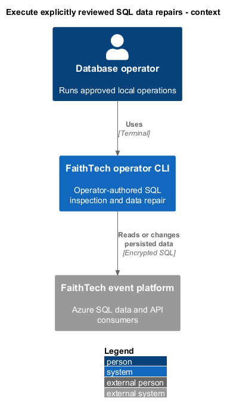
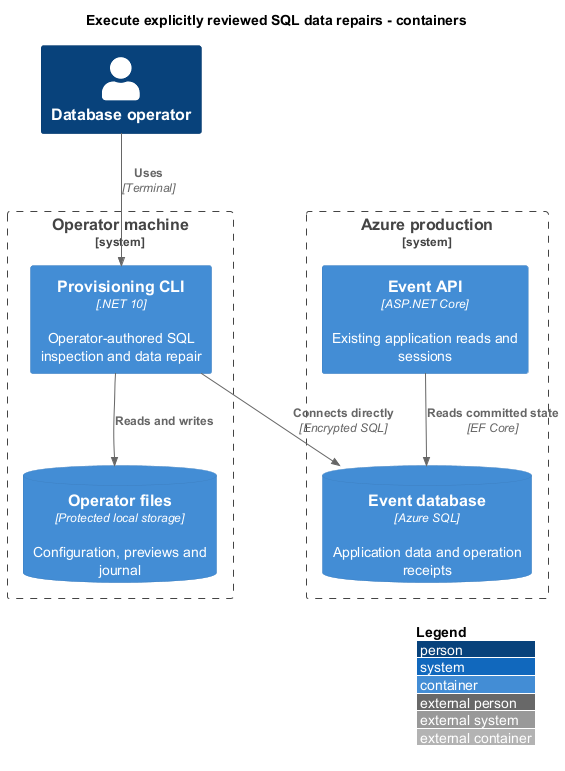
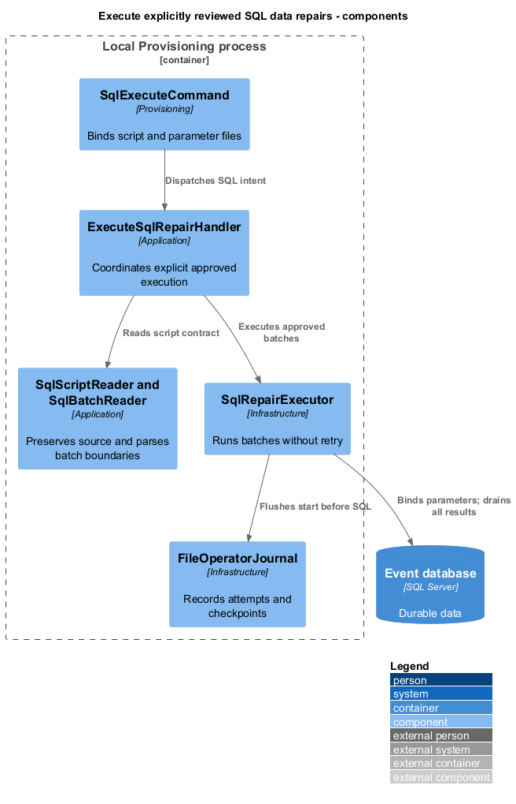
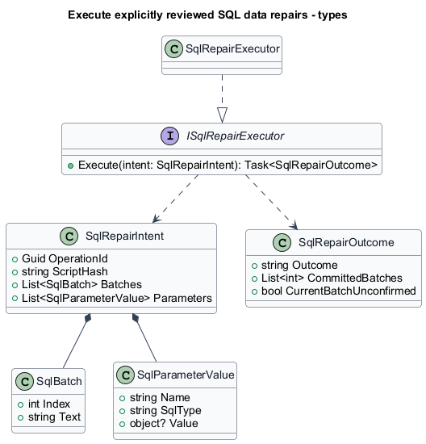
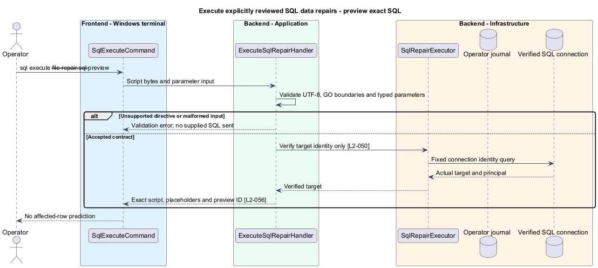
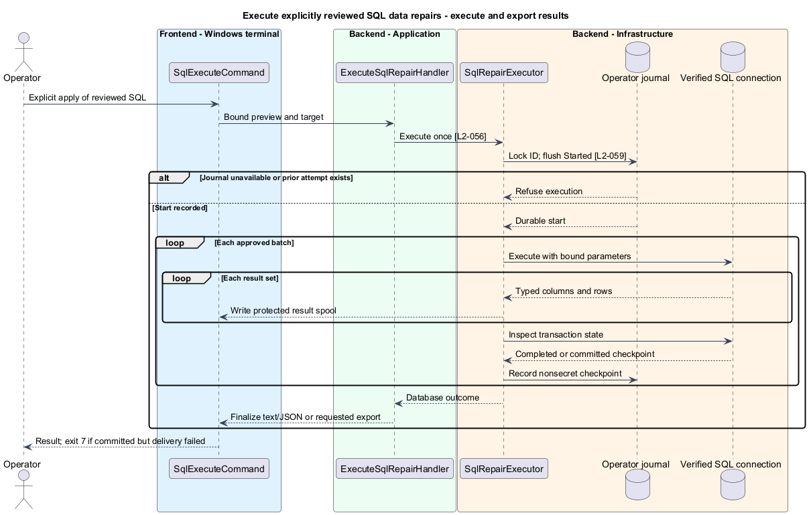
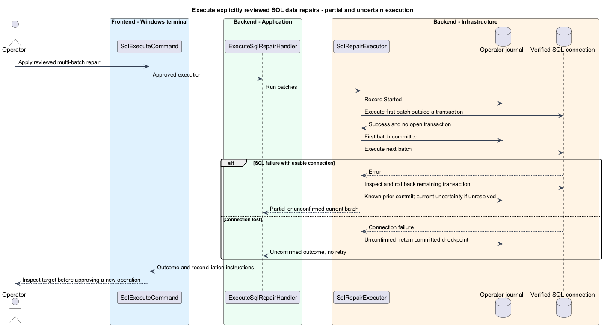

# Execute explicitly reviewed SQL data repairs

## Overview

A SQL repair is an operator-authored script executed directly against the selected database. It permits inspection and data changes that have no dedicated CLI command or deliberately bypass application lifecycle validation.

A batch is the SQL text submitted in one database command. Batch completion, transaction commit, and successful result delivery are distinct events.

## Description

`SqlExecuteCommand`, `ExecuteSqlRepairHandler`, `ISqlRepairExecutor`, and `SqlRepairExecutor` are proposed components. The handler uses the same verified target and preview artifacts as validated commands. The executor uses Microsoft.Data.SqlClient directly, outside EF's tracked mutation path and without an automatic execution strategy. It does not invoke application validators, wrap scripts in a transaction, impersonate an application administrator, or grant database permissions.

Syntax is `faithtech-admin sql execute --file <repair.sql> --parameters <parameters.json> --target production --preview --operation-id <guid>`. The parameters file is optional. Queries use this command too; the CLI does not label arbitrary submitted SQL read-only. The preview shows the exact script text and nonsecret parameter values but never executes a trial query, compilation batch, or rollback rehearsal. Apply uses `operations apply <preview-id>` with explicit target and approval. An external query session remains available for independent recovery; the CLI exposes no SQL HTTP endpoint.

`SqlScriptReader` requires UTF-8, accepts a UTF-8 BOM, rejects invalid encoding, and retains source bytes for fingerprinting. `SqlBatchReader` recognizes only a case-insensitive `GO` on its own line outside SQL strings, quoted identifiers, bracket identifiers, line comments, and nested block comments. The lexical reader tracks escaped quotes and brackets. It rejects `GO` repeat counts, sqlcmd `:` directives, and sqlcmd variable substitution outside literals/comments. It rejects an unterminated lexical construct before execution. It never splits at a semicolon, rewrites statements, or expands includes. A script without `GO` is one batch; empty batches are ignored. Syntax errors inside valid lexical batches remain SQL errors at apply, not preflight guarantees.

Parameter JSON is a case-sensitive array of `{name, sqlType, value}` or `{name, sqlType, secretRef}` records, with `size`, `precision`, and `scale` where required. Names begin with `@`, are unique ignoring case, and contain only ASCII letters, digits, or underscores after an initial letter. `sqlType` accepts `bit`, `int`, `bigint`, `decimal`, `nvarchar`, `varbinary`, `uniqueidentifier`, `datetime2`, and `datetimeoffset`; explicit JSON null becomes SQL NULL. Big integers and decimals use invariant strings; binary values use base64 and dates use ISO 8601. Required size/precision/scale are validated against the chosen SQL type before preview. Parameters bind through `SqlParameter` on every batch. They represent data values, never identifiers or executable SQL. Unknown fields, duplicate names, incompatible values, and simultaneous value/secretRef fail before apply.

`SqlRepairExecutor` uses one verified connection for all batches, preserving operator-supplied transaction controls. Before the first supplied batch, `FileOperatorJournal` durably records Started and the script/parameter fingerprints without values. A per-operation local lock prevents simultaneous invocation from the same journal; an existing Started or terminal SQL execution ID never executes again. This guard is scoped to this machine's intact journal, not an exactly-once claim across machines or against its owner. Each new attempt after reconciliation has a new approved operation ID.

The executor drains every `SqlDataReader` result set and records driver-reported affected-row information when available. It checks `@@TRANCOUNT` and `XACT_STATE()` between batches after the reader closes. A normally completed batch with no remaining transaction establishes a committed checkpoint. A batch that leaves a transaction open records completion without claiming durable commit. Explicit transactions can span GO boundaries. If the script ends with an open transaction, the executor rolls it back on that connection and reports failure; it does not silently commit unrequested work.

A later batch failure after a confirmed committed checkpoint reports known partial completion. On an error within a batch, the executor does not infer which statements committed. It rolls back a remaining transaction where possible, retains previously confirmed checkpoints, and reports an unconfirmed current-batch outcome whenever earlier effects inside that batch cannot be established. Connection loss or failed transaction-state inspection likewise yields unconfirmed outcome, preserving any known prior commits in the result. Rollback confirmation applies only to the tracked open transaction; it never undoes an earlier commit. The executor issues no automatic SQL retry.

Result rows and script content are explicit operator output and never diagnostic data. `--output <path>` writes an operator-restricted file using a temporary sibling and final atomic replacement after complete delivery. Existing output files require `--overwrite`. Text output prints labelled result sets. JSON uses the bounded-output delivery protocol in [operation results](../review-and-reconcile-operations/README.md). If the database commits but output fails, result delivery fails with exit 7 and no replay. SQL rows use ordered column descriptors plus value arrays so duplicate column names remain distinguishable. SQL types are retained in descriptors; null, decimal/bigint strings, ISO times, and base64 binary prevent silent precision loss.

The script is a privileged escape hatch, not a SQL sandbox. Database grants and constraints limit it. It can change event lifecycle or delete rows, and the operator owns resulting application coherence. No automatic outbox messages or participant session repairs are inferred from raw SQL. A repair that requires application invalidation includes that work deliberately or is followed by explicit fresh-read verification. The runbook distinguishes those obligations from validated commands.

Acceptance covers scalar and multi-result queries, DML on tables without dedicated commands, quoted/injection-like parameter values, GO inside comments/literals, unsupported directives, multi-batch partial completion, open-transaction rollback, permission and constraint failures, dropped connections, repeated execution IDs, cancellation, and failed exports. SQL assertions use disposable data; no acceptance script targets production.

## Requirements

The following normative excerpts retain their exact source wording. Acceptance criteria remain at the linked requirements.

| L2 ID | Refines (L1) | Requirement |
|---|---|---|
| [L2-056](../../../specs/L2.md#l2-056-sql-inspection-and-unrestricted-data-repair) | `L1-017` | The CLI must execute explicitly supplied SQL files against the selected database and return query result sets and affected-row information when available. It must support querying, inserting, updating, and deleting data in any application table allowed by the operator's database grants, without an application-entity allowlist. Bulk corrections, event deletion, and exceptional lifecycle corrections must therefore be possible without adding dedicated commands. The SQL path must be clearly identified as bypassing application validation; database constraints and grants remain authoritative. The tool must not expose a remotely callable SQL endpoint or silently modify the script. General schema/grant administration is not a promised command capability or a SQL sandbox guarantee.  SQL files must use UTF-8. Named parameters must be bound as values rather than interpolated as executable text; secret values must use protected input and appear as placeholders in preview. Query execution uses the same explicit review workflow as other SQL execution, because arbitrary scripts are not guaranteed read-only. The CLI must document its batch syntax and reject unsupported batch directives before execution rather than partially interpret them. |

## Diagrams

SQL repairs deliberately exceed ordinary application command rules.

The operator process connects directly to SQL and keeps a separate local execution journal.

Source parsing precedes approval; the executor records its attempt before sending SQL.

Batch checkpoints and current-batch uncertainty remain separate in the outcome.

Preview reads and validates local syntax contracts; it does not submit the script to SQL.

The durable Started record precedes execution; all result sets are consumed.

A failed batch does not erase confirmed earlier commits or imply rollback of all script effects.

