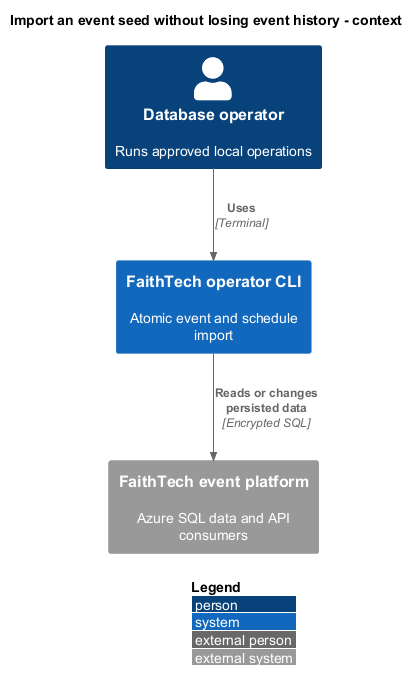
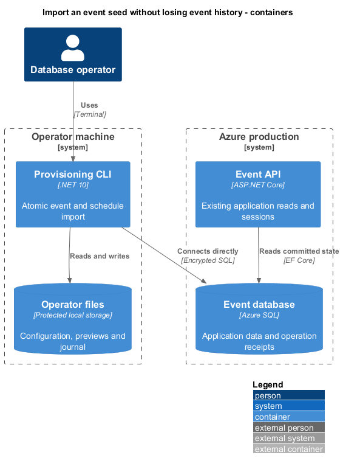
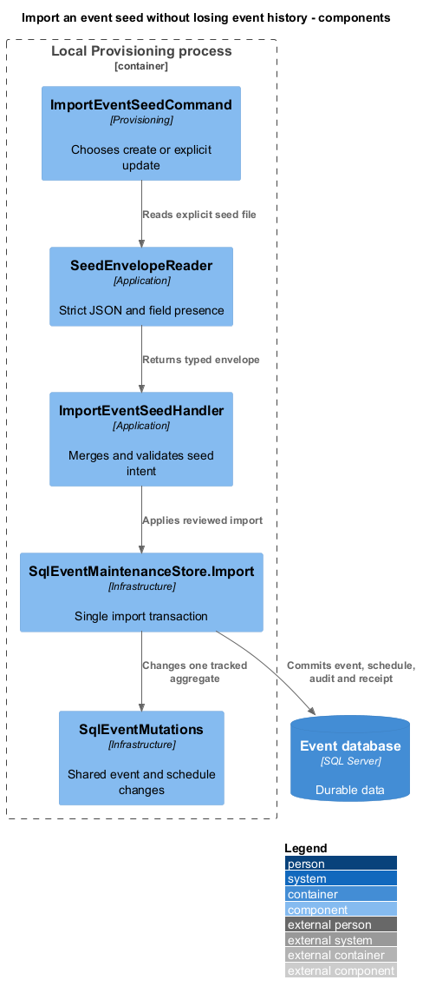
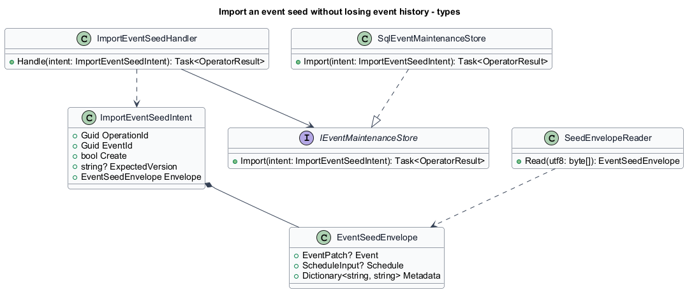
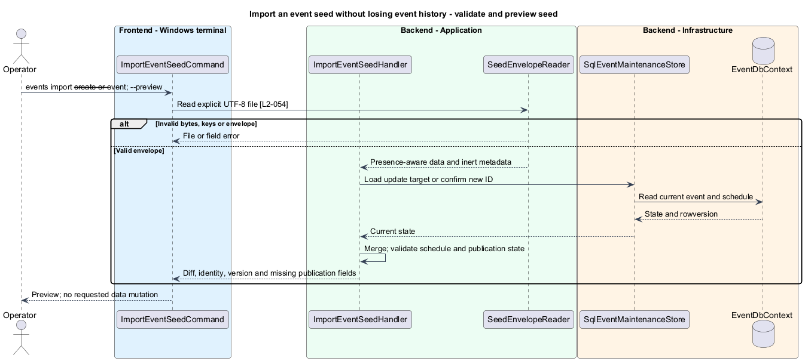
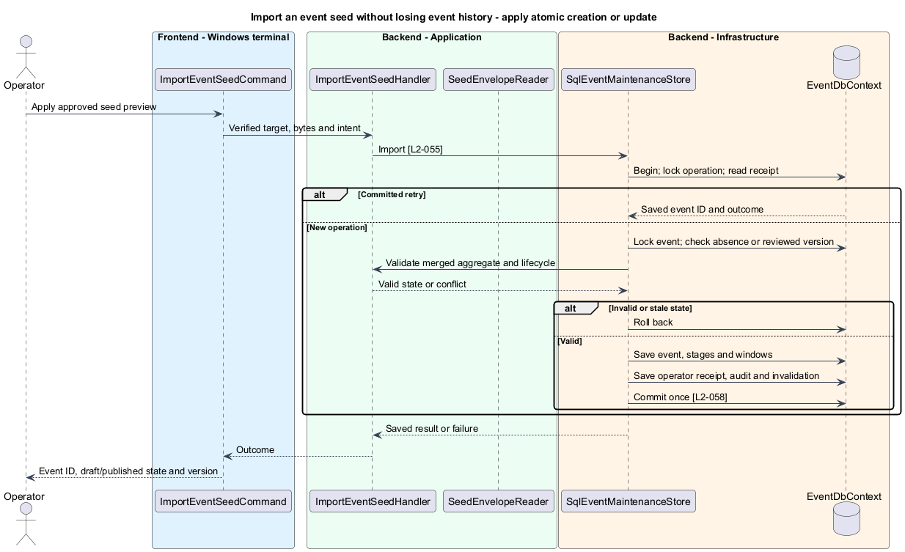
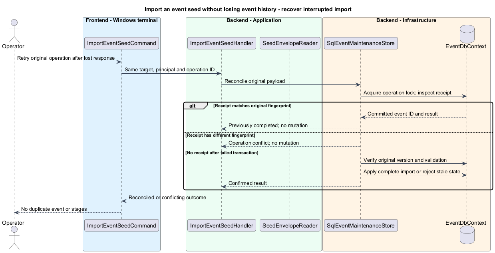

# Import an event seed without losing event history

## Overview

An event seed is a JSON document containing event settings and a timed schedule. Import creates a new draft or updates a specifically identified event; it does not provision participants or reset participation history.

The September 9 preview is the compatibility example. Its metadata describes preparation status and source material, while its event and schedule objects carry the data to import.

## Description

`ImportEventSeedCommand` is proposed in Provisioning. `ImportEventSeedHandler`, `SeedEnvelopeReader`, `EventSeedEnvelope`, and `ImportEventSeedIntent` are proposed Application types. `SqlEventMaintenanceStore.Import` adds one feature-specific persistence operation using the shared event mutation helpers. Existing `SaveEventValidator`, `ScheduleValidator`, `ScheduleMapping`, and `ScheduleClosurePolicy` remain authoritative. The import does not call create, save, and schedule wrappers that commit independently.

Creation syntax is `faithtech-admin events import --create --file <seed.json> --target production --preview --operation-id <guid>`. Update uses `events import --event <guid> --version <base64-version> --file <seed.json> --target production --preview --operation-id <guid>`. Exactly one of `--create` and `--event` is accepted. Creation rejects `--version`; update requires it. The preview allocates a new event ID for creation and returns it alongside its operation and preview IDs. Apply uses `operations apply <preview-id> --target production`; noninteractive approval follows the shared protocol.

`SeedEnvelopeReader` decodes UTF-8 with invalid byte rejection and accepts an optional UTF-8 BOM. It scans JSON tokens before typed deserialization to reject duplicate keys at every object level. Property names are case-sensitive and use the existing camelCase contracts. The envelope accepts only `event`, `schedule`, `publication`, `status`, `source`, `timetable`, and `operatorRunSheet`. The five metadata values are strings and have no side effects. Unknown fields produce field-path errors, including unknown envelope fields. No metadata path or URL is opened. Creation requires both data objects; update requires at least one. Data-object null is invalid.

`EventSeedEnvelope.Event` uses field-presence tracking for the `EventInput` fields plus `useLiturgy`. Supplied values overlay defaults for creation or saved state for update. Explicit null clears only nullable fields. The schedule object uses `ScheduleInput`: timezone, start, end, stages, selection, and presentation are required when replacing a schedule; disabled windows are explicit null and no stages is an explicit empty array. Omitted individual stages are removals. When both data objects supply timezone/start/end, normalized values shall agree. A schedule-only update also updates the event timing it describes; an event-only timing edit retains and validates the existing schedule. Invalid combined state fails as one operation.

The seed's stage GUIDs are preserved. Duplicate IDs, empty GUIDs, and an ID already attached to another event fail; the CLI never silently remaps them. Reusing a previously imported seed for a deliberately separate event requires fresh stage IDs, which the conflict identifies. This differs from retrying the same operation, which returns the same event. Title equality never selects a target. References from existing activities are checked before stage deletion; a dependent removal fails instead of cascading participant data loss.

`SqlEventMaintenanceStore.Import` starts one operator unit of work. It locks the operation key, resolves an existing committed receipt before checking current state, then locks the target event and checks its reviewed rowversion. Creation requires the allocated event ID to remain absent. Update loads the complete event aggregate and merges field presence. SQL UTC time and the previously committed schedule determine closed lifecycle facts. Validation and dependency checks precede tracked changes. Event settings, stages, windows, operator audit, nonsecret receipt, and event invalidation commit together. A thrown validation/persistence error rolls back the whole import. Receipt uniqueness and the event lock handle simultaneous imports; no preflight read substitutes for checks under the write lock.

New imports set `Published=false` independently of metadata. Updates retain publication state and existing logo, credentials, registrations, teams, selections, messages, submissions, and awards. Published-state validation rejects clearing required data. Any field outside the allowed seed contract fails instead of granting hidden access to these records. A replay uses the same normalized payload fingerprint and operation identity; a changed payload conflicts. A fresh preview of deliberately edited input uses a new operation identity and current version.

The local example path is `C:/projects/faith-tech-toronto-ai-build-event/.local/run/september-9-seed-preview.json`. Preview displays 21 stages, September 9, 2026, 17:00-21:00 America/Toronto at offset -240; selection 18:05-18:15; demos 20:30-20:50; and Liturgy disabled. The supplied address and participant-facing text remain input. Missing logo and coordinates keep the new event a draft. A separate publication preview reports those missing fields. Source/status metadata does not publish or fetch the run sheet.

Acceptance uses a checked-in synthetic copy of that envelope shape, not the untracked operator file. Scenarios cover malformed UTF-8/JSON, duplicate and unknown fields, contradictory timing, metadata paths, draft import, source stage IDs, targeted update, omitted/null fields, cross-event IDs, referenced-stage removal, published invalidation, failed mid-import persistence, and concurrent/lost-response retries. Fresh SQL and API reads verify retained history and one complete saved schedule.

## Requirements

The following normative excerpts retain their exact source wording. Acceptance criteria remain at the linked requirements.

| L2 ID | Refines (L1) | Requirement |
|---|---|---|
| [L2-054](../../../specs/L2.md#l2-054-september-9-seed-file-compatibility) | `L1-016` | The CLI must accept the UTF-8 JSON envelope in `.local/run/september-9-seed-preview.json` through an explicit file path, including paths containing spaces. The `event` and `schedule` objects carry data; `publication`, `status`, `source`, `timetable`, and `operatorRunSheet` are descriptive metadata and must not trigger publication, file traversal, commands, or network requests. Preserve supplied text, stage identities/order, local times and offsets, activity windows, and Liturgy setting subject to application normalization and validation. Import must not invent participants, credentials, projects, prizes, coordinates, or logos. The supplied address is operator input, not a new built-in default for L2-008. |
| [L2-055](../../../specs/L2.md#l2-055-targeted-seed-updates-and-duplicate-prevention) | `L1-016` | Import must distinguish creation from update explicitly. Creation must use an operation identity retained across retries and return the created event ID. Update must require an existing event ID and reviewed version; titles must never locate or merge events. Supplied event fields replace those fields, omitted fields remain unchanged, and explicit null clears only nullable fields. A supplied schedule replaces its stages and windows together; omitted stages are removed from that schedule, not from participation history. Cross-event stage IDs must be rejected. Preserve the target's publication state, unsupplied logo, registrations, credentials, and all participant/activity history. References that prevent safe schedule replacement must produce a conflict, not cascading data loss. |

## Diagrams

Import affects event configuration through the local operator tool.

Source input and preview artifacts remain on the operator machine.

Parsing and merging precede a single feature-specific persistence operation.

The intent distinguishes creation from explicit update and retains field presence.

Metadata is inert; preview loads and validates the full proposed event without saving it.

The import commits settings and schedule together while leaving participation records untouched.

A receipt establishes completion; changed input cannot reuse its identity.

