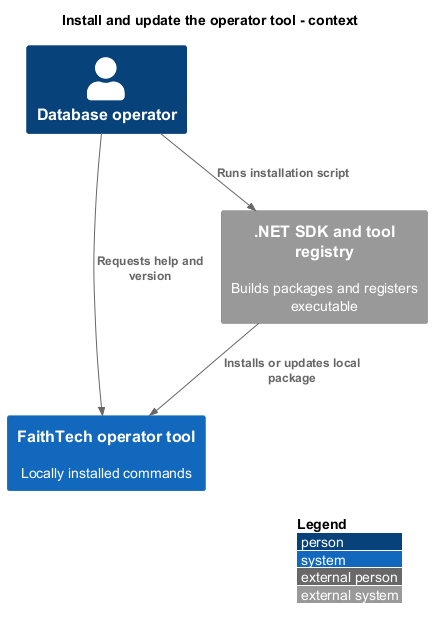
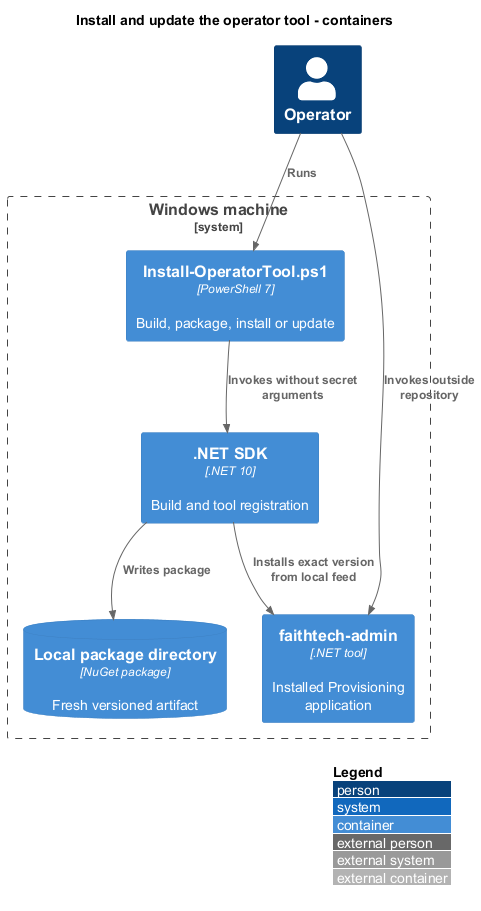
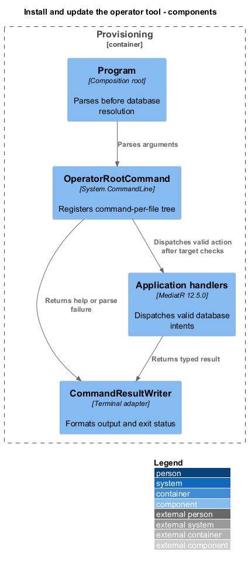
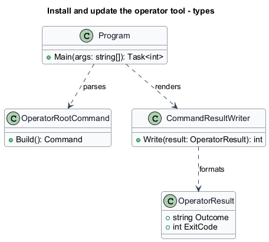
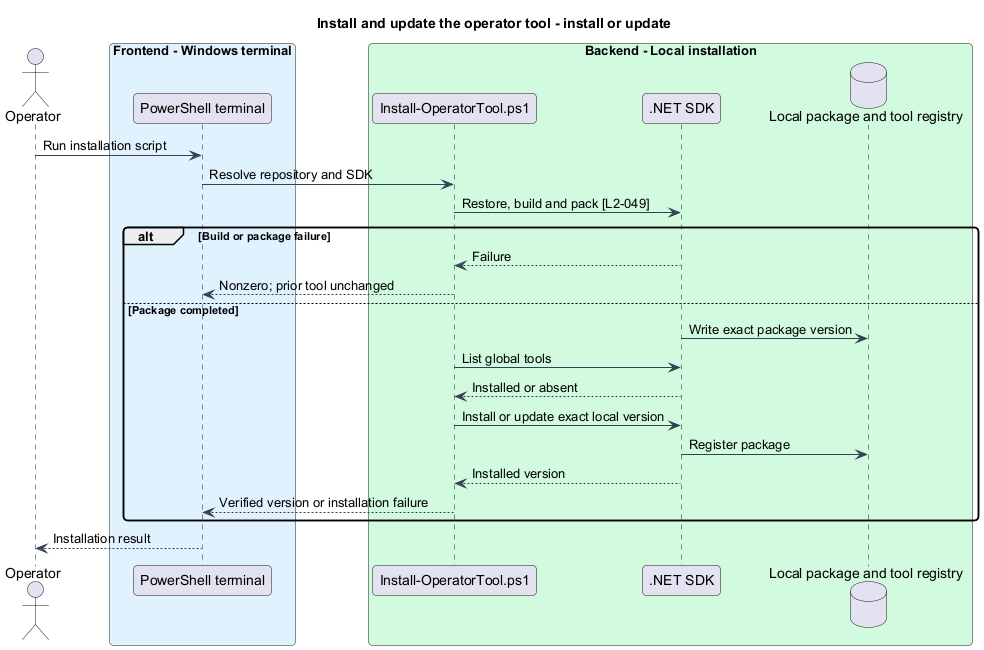
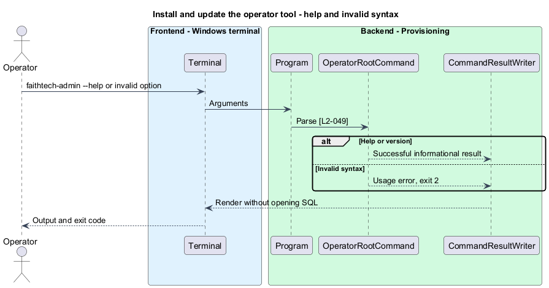

# Install and update the operator tool

## Overview

The operator tool is a local executable for maintaining FaithTech event data. This feature packages the existing provisioning application for installation on a Windows machine.

An installation is the registered .NET tool package that exposes `faithtech-admin` outside the repository. Installation and help do not require database access.

## Description

The existing `FaithTechTorontoAiBuildEvent.Provisioning.Program` manually parses three commands. Its project currently lacks .NET tool packaging. This design introduces System.CommandLine command types under `Provisioning.Commands`, one type per file. `Program` composes Microsoft.Extensions services after successful parsing; `--help`, `--version`, and syntax errors return before database service resolution. [System.CommandLine](https://learn.microsoft.com/en-us/dotnet/standard/commandline/) supplies parsing and help generation.

The proposed package ID is `FaithTechTorontoAiBuildEvent.Provisioning`, with `PackAsTool=true` and `ToolCommandName=faithtech-admin`. The existing .NET 10 target and MediatR 12.5.0 remain. The package includes the runtime dependency graph and native assets needed by existing logo decoding. It excludes the API deployment ZIP and operator configuration. [The .NET tool model](https://learn.microsoft.com/en-us/dotnet/core/tools/global-tools) supplies installation and invocation.

`eng/scripts/Install-OperatorTool.ps1` resolves the repository from its own location and verifies the SDK from `global.json`. It restores locked dependencies, builds Release, and packages to a fresh directory under `.local/packages/operator`. A generated local package version includes UTC build time; the package metadata records the source commit. Packaging finishes before the installed tool is touched. The script lists global tools, chooses install or update for this package ID, and uses the exact local package version and source. It does not uninstall first. An installation failure returns nonzero with the previous installation status reported; build/package failure leaves it unchanged. A version check confirms the installed artifact. PowerShell 7, the repository-selected SDK for building, and the .NET 10 runtime for execution are prerequisites.

`OperatorRootCommand` exposes `target`, `events`, `roster`, `sql`, `operations`, `migrate`, `create-admin`, and `disable-admin`. Existing command names and username positions remain; database commands now require `--target` and the [review/apply protocol](../review-and-reconcile-operations/README.md). There is no legacy production-write bypass. Common options are `--config`, `--target`, `--format text|json`, `--connect-timeout`, and `--command-timeout`. Mutation commands also expose `--preview` and `--operation-id`; apply is a separate command. Domain work passes through MediatR Application handlers.

`CommandResultWriter` renders text or JSON and maps outcomes to L2-059 exit codes. Parse failures return 2. Help and version return 0. Help names secret-input mechanisms instead of accepting password arguments. Package acceptance invokes the installed executable from an unrelated directory, checks first installation and update, verifies invalid syntax performs no connection, and exercises the retained provisioning capabilities against disposable SQL.

## Requirements

The following normative excerpts retain their exact source wording. Acceptance criteria remain at the linked requirements.

| L2 ID | Refines (L1) | Requirement |
|---|---|---|
| [L2-049](../../../specs/L2.md#l2-049-installable-local-operator-tool) | `L1-015` | The existing provisioning project must become a .NET tool runnable on the operator's Windows machine outside the repository. Its local installation script must build and package current source, then install or update that package. Migration, create-admin, and disable-admin capabilities must remain available. Help must describe commands, inputs, target selection, and required runtime prerequisites. Invalid command syntax must not connect to the database. |

## Diagrams

The installation path contains no database connection.

The SDK installs the package independently of the API deployment.

Parsing precedes target resolution and Application dispatch.

The composition root delegates parsing and rendering to separate types.

A completed package precedes changes to the installed tool. Failed builds stop before installation.

Help and syntax errors finish without resolving database dependencies.

