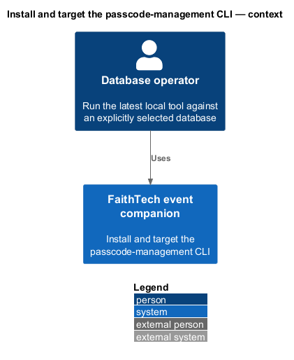
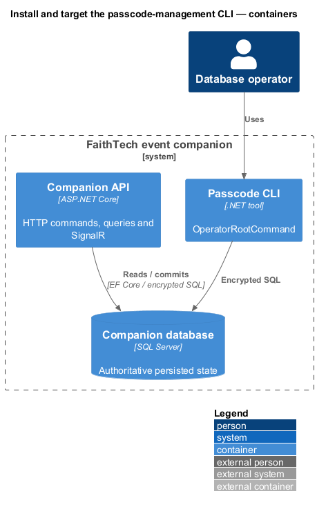
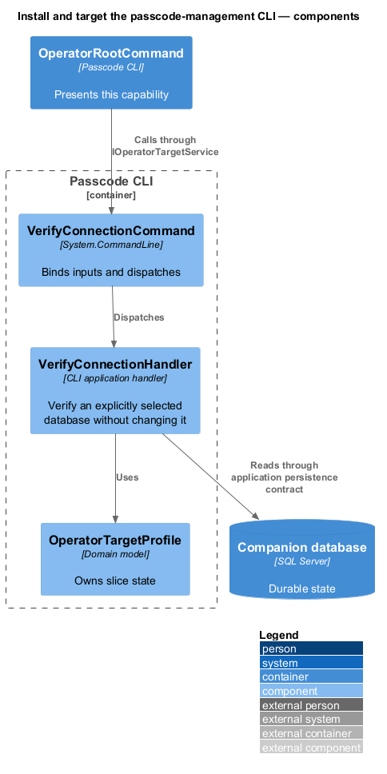
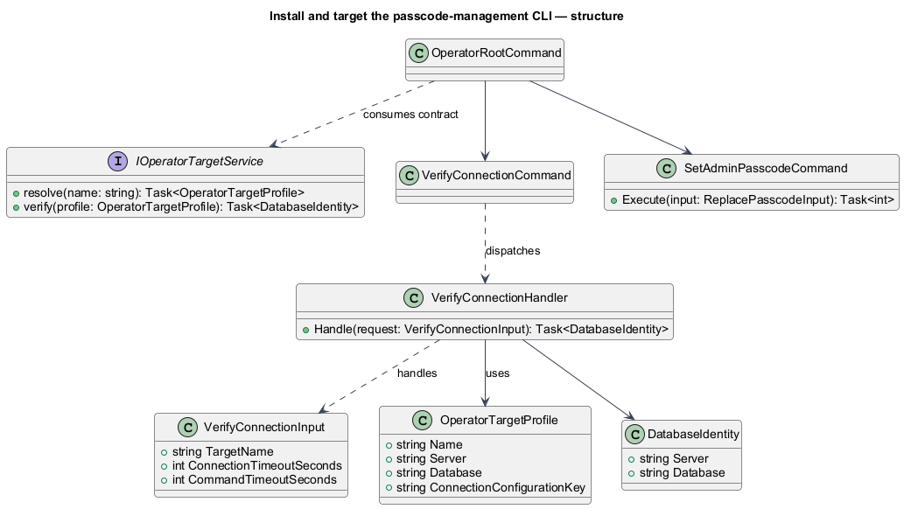
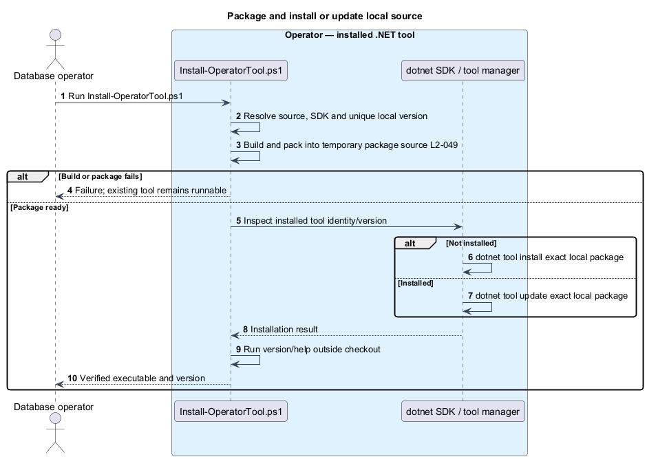
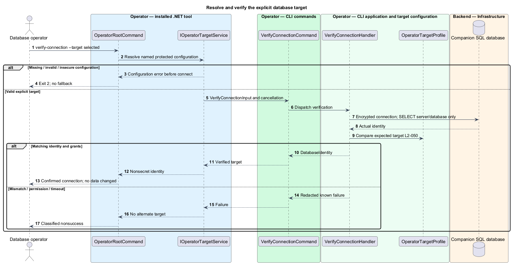

# Install and target the passcode-management CLI

## Overview

The operator tool is an installable .NET executable for verifying a database connection and replacing its administrator passcode. An explicit target is a named protected connection configuration, never an inferred environment. The tool runs outside the repository after installation.

## Description

The existing `FaithTechTorontoAiBuildEvent.Provisioning` project remains a .NET tool with executable `faithtech-admin` and package ID `FaithTechTorontoAiBuildEvent.Provisioning`. Proposed command scope is `verify-connection` and `set-admin-passcode`, plus help/version. Existing `OperatorRootCommand`, `SecretInput`, target-profile types and committed-output handling supply reusable structure; generic account/password/migration commands are not exposed by the companion tool. `System.CommandLine` remains the repository-pinned 2.0.11; Microsoft.Extensions supplies host, DI, Configuration, Options, and redacted logging. Command types live in separate files.

`eng/scripts/Install-OperatorTool.ps1` is adapted to build and pack the latest local source into a unique temporary package source before touching an installed tool. The package version includes a unique local prerelease suffix derived from UTC timestamp and commit ID, passed as an MSBuild property without rewriting tracked version files. The script checks installed global tools: absent uses `dotnet tool install`, present uses `dotnet tool update`, both with exact package ID/version/source; update permits the explicit local-version downgrade where needed. Build/package failure leaves the existing installation runnable. Post-install it invokes `faithtech-admin --version` and help from outside the checkout. The .NET CLI exposes version/source and downgrade controls for this workflow. [dotnet tool installation](https://learn.microsoft.com/en-us/dotnet/core/tools/dotnet-tool-install).

Help records Windows, the repository `global.json` SDK (currently 10.0.400 with latest patch roll-forward) for local packaging, and the matching .NET 10 runtime for execution. It documents the user's global tool path, target selection, both protected-input modes, finite timeouts, cancellation, and exit codes. An isolated package cache avoids stale same-version content. The script never uninstalls the old tool as a prerequisite to a successful package build.

`--target <name>` is mandatory on both database commands. Proposed `OperatorOptions.Targets[name]` selects an explicit protected connection-string configuration key and expected server/database. The existing `OperatorTargetProfileStore` can load nonsecret names and expected identities; credentials come from Microsoft.Extensions protected environment/configuration providers, not command-line values. No working-directory default or implicit production target exists. `SqlConnectionStringBuilder` rejects encryption disabled or TrustServerCertificate=true before opening. Windows integrated authentication may use existing grants; separate operator credentials are not required.

`verify-connection --target <name>` opens a read-only command to obtain actual `@@SERVERNAME` and `DB_NAME()`, validates the expected identity, and displays those values without credentials. Server aliases require an explicit configured resolved identity, not silent acceptance. Replacement performs that same check before the write; target mismatch aborts. Default connection timeout is 30 seconds, command timeout 60 seconds; overrides are positive finite integer seconds within Int32 range. Ctrl+C cancels pending work, and no network permission or SQL grant is modified.

`set-admin-passcode --target <name> --interactive` and `--passcode-stdin` are mutually exclusive modes. Masked input preserves leading zeros. Stdin reads one line, strips only the terminal CR/LF, and rejects blank/EOF/extra non-newline content without trimming digits or spaces. The command uses the [shared SQL replacement](../../access/replace-passcode/README.md) once. Exit 0 means confirmed success, 1 known operation/access failure, 2 invalid syntax/config/input or pre-execution cancellation, and 3 uncertain commit/result delivery. Existing legacy exit 6/7 behavior is replaced, not treated as satisfying these criteria.

Commands and queries use the [shared architecture and protocol](../../README.md#shared-architecture-and-protocol). The following acceptance scenarios are design obligations, not executed test evidence.

- Given no installed tool, when the installer succeeds, then help/version run outside the checkout.
- Given an older installation, when latest source builds/packages, then update installs that build; build failure leaves the old tool intact.
- Given missing target, conflicting input modes, insecure transport or invalid input, when invoked, then no database write occurs.
- Given target mismatch, timeout or cancellation, when diagnosed, then no fallback target or automatic write retry is attempted.

## Requirements

The source text below is reproduced verbatim, including its original obligation wording.

| L2 ID | Refines (L1) | Requirement |
|---|---|---|
| [L2-049](../../../specs/L2.md#l2-049-install-and-update-the-passcode-cli) | L1-015 | Deliver the CLI with the application as a .NET tool runnable outside the repository on Windows. Its `eng/scripts/` installer must build/package the latest local source and install or update that build. Help must document runtime prerequisites, database selection, passcode input, results, and error codes. This version's operator scope is passcode replacement and connection verification; historical generic provisioning/account/SQL commands are not acceptance obligations. |
| [L2-050](../../../specs/L2.md#l2-050-explicit-database-target) | L1-015 | Database commands must require an explicitly selected connection configuration and display the resolved server/database without credentials before changing the passcode. The application's existing database connection and grants are sufficient when they authorize the operation; a separate special operator account is not required. Connection verification is read-only. Missing/invalid settings or connection failure must not select another database or change network permissions. Default connection and command timeouts are respectively 30 and 60 seconds, configurable to positive finite seconds. |
| [L2-051](../../../specs/L2.md#l2-051-database-operator-access-and-protected-input) | L1-013 | Database grants are the authority for direct/CLI replacement. Anyone with the necessary grants must be able to perform it without a browser login, old passcode, application account, or additional app-specific operator allowlist. Browser admin status alone grants no database rights. SQL connections must use encryption and server-certificate validation. The CLI must accept the new passcode through a masked prompt or explicit stdin mode, never command-line secret arguments. Direct SQL guidance must explain protected parameter input, verifier conversion, session invalidation, and avoiding saved plaintext SQL/history artifacts. |
| [L2-064](../../../specs/L2.md#l2-064-replace-the-passcode-through-the-installed-cli) | L1-016 | The CLI must provide `set-admin-passcode` with exactly one of masked interactive input or `--passcode-stdin`, and an explicit database target. It must use the same database replacement behavior as L2-063. Empty input, EOF, cancellation, invalid format, or invalid target must never select a default. Success confirms replacement without printing the passcode. Exit codes must be 0 confirmed success, 1 confirmed operation/authentication/permission failure, 2 invalid syntax/configuration/input or cancellation before execution, and 3 unconfirmed commit/result delivery. Connection loss after execution must not be reported as confirmed rollback or trigger automatic replay; verification and any deliberate replacement are separate operator actions. |

## Diagrams

The context identifies the actor and the capability within the companion.

The container view distinguishes browser or operator execution from durable server state.

The component view scopes the named building blocks to this feature.

The class view shows the proposed contract, request, state, and dependencies.

The installed executable is changed only after a successful local build and package.

The read-only identity check precedes replacement and never grants permissions.

