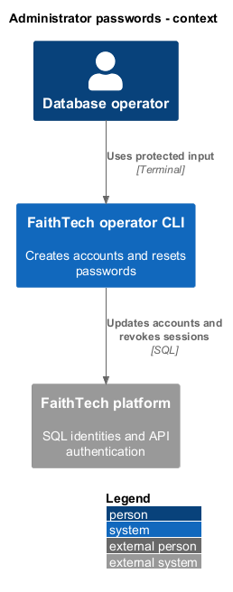
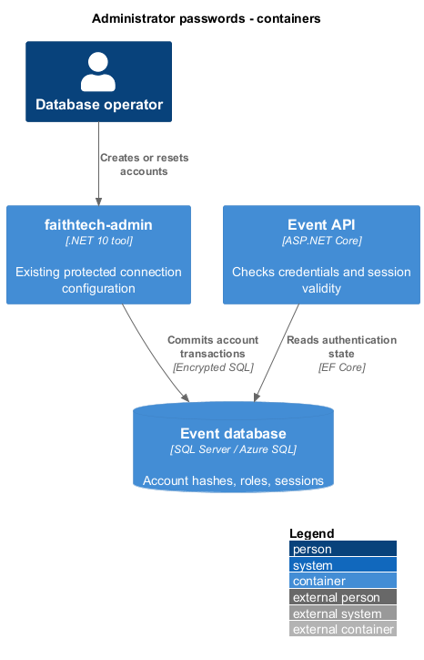
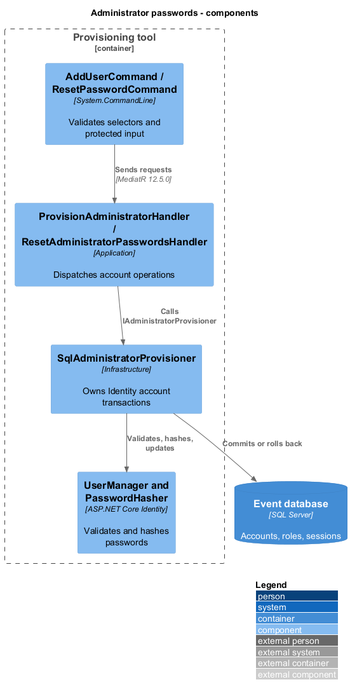
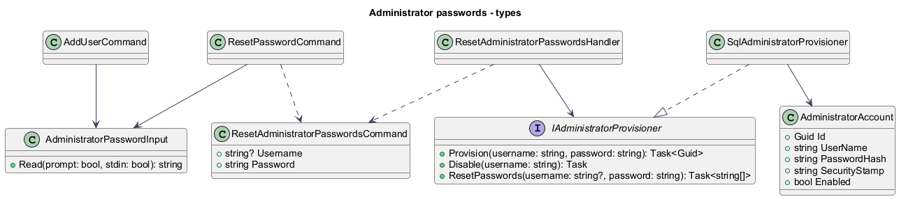
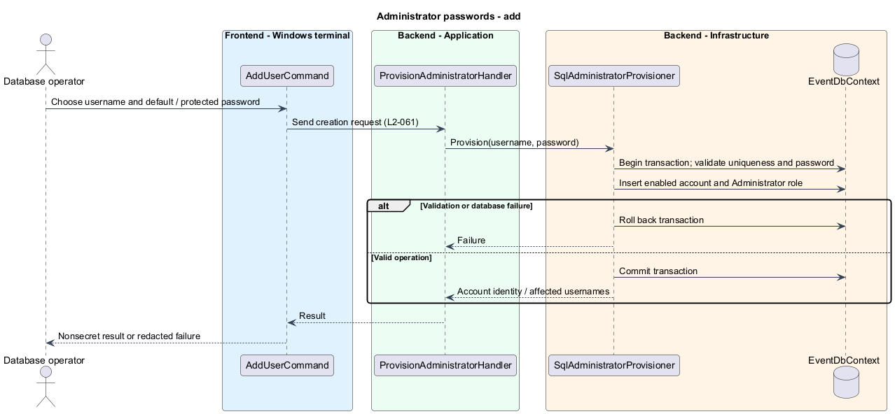
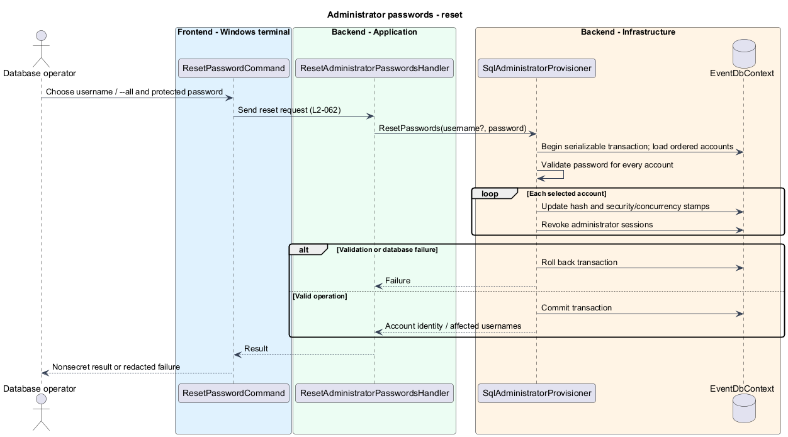

# Manage administrator passwords

## Overview

An administrator account is an application identity with a username and hashed password. A database operator creates accounts and resets passwords through the local .NET tool. Participants use separate entry codes.

The account commands use the existing protected connection configuration and immediate transactional execution. Named targets, previews, durable receipts, and journals belong to the separate planned operator framework.

## Description

`AddUserCommand` dispatches `ProvisionAdministratorCommand` through MediatR. Omitted password options select the documented default. `AdministratorPasswordInput` accepts an explicit masked prompt or redirected stdin. Empty explicit input never selects the default. `create-admin` retains its existing mandatory prompt/stdin behavior.

`ResetPasswordCommand` requires one username or `--all` and one protected password-input option. `ResetAdministratorPasswordsHandler` calls `IAdministratorProvisioner.ResetPasswords`. `SqlAdministratorProvisioner` loads accounts in username order under a serializable transaction. Identity validators check the supplied password before mutation. Identity hashing generates a separate salted hash for each account. Updates refresh security and concurrency stamps and revoke stored administrator sessions. A failed update rolls back the whole transaction. Disabled accounts and removed roles remain disabled or removed. An empty bulk selection still validates the password and returns zero.

The shared Identity configuration requires six characters, lowercase, a digit, and a symbol; uppercase is optional. Application input rejects passwords longer than 1,024 characters. Existing deployed API password verification accepts the new hashes without an API deployment or schema migration.

`OperatorExecution` identifies the connected SQL server, database, and principal before account mutation. It disables application logging and reports redacted errors. `WriteCommittedResult` distinguishes output failure after a committed operation. Connection interruption and cancellation return an unconfirmed outcome requiring inspection; the CLI does not replay mutations. Account commands do not modify firewall rules or database grants.

The installed tool uses `ConnectionStrings__EventDatabase` supplied through protected process configuration. The existing application connection is sufficient when its database grants permit account creation, disabling, or password reset. A separate provisioner login is not required for these account commands. Account operations do not require the participant digest key. Passwords never appear in command arguments, ordinary output, or diagnostic records. The documented default is an explicit product default, not an automatically created account.

## Requirements

The source criteria are [L2-061 and L2-062](../../../specs/L2.md#l2-061-add-an-administrator-with-protected-password-input).

| L2 ID | Refines (L1) | Requirement |
|---|---|---|
| L2-061 | L1-016 | The CLI shall offer `add-user <username> [--prompt-password \| --password-stdin]`. Omission of both password options shall select exactly `faithtech2026!`. Explicit password input shall never fall back to that default. Identity shall require at least six characters, a lowercase character, a digit, and a non-alphanumeric character; uppercase shall be optional. Passwords over 1,024 characters shall be rejected to match API sign-in. New accounts shall be enabled members of the Administrator role. Existing create-admin, disable-admin, and migrate commands shall remain available. |
| L2-062 | L1-016 | The CLI shall offer `reset-password [<username> \| --all] [--prompt-password \| --password-stdin]`, requiring exactly one selector and one password option. A reset shall validate and hash the password through Identity, refresh security/concurrency stamps, and revoke existing administrator sessions in the same transaction. Bulk reset shall include disabled and role-revoked administrator accounts without changing their enabled status, roles, identity, or history. Participant entry codes shall remain unchanged. Bulk reset shall commit all selected changes or none. Successful output shall identify affected usernames and count without credentials. Empty bulk selection shall succeed with count zero. Unknown usernames shall fail without implicit creation. |

## Diagrams

The database operator uses the local CLI to change application identities.

The CLI and deployed API share SQL access state; the CLI has no dependency on an HTTP administration endpoint.

Commands dispatch through Application ports to the Identity-backed transaction.

The provisioning port supplies account creation, disabling, and password reset.

Creation selects the default only when neither protected password option is supplied.

Reset commits account updates and session revocation together; failure rolls the transaction back.

