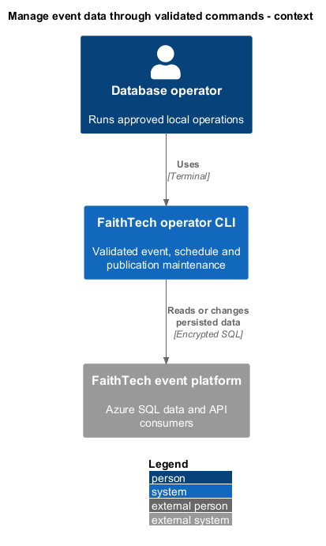
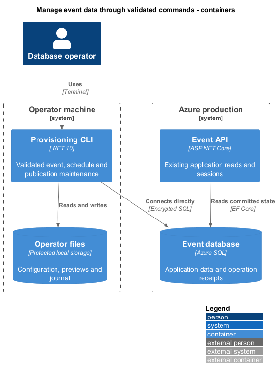
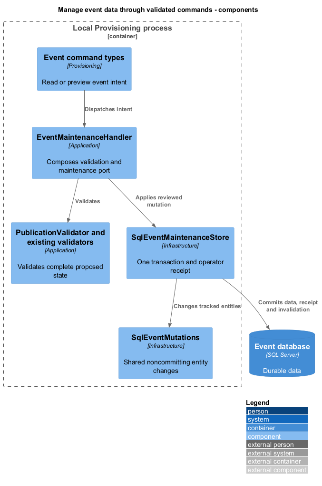
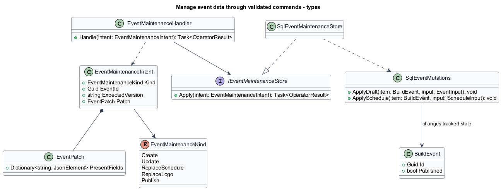
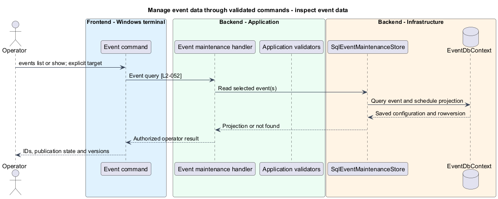
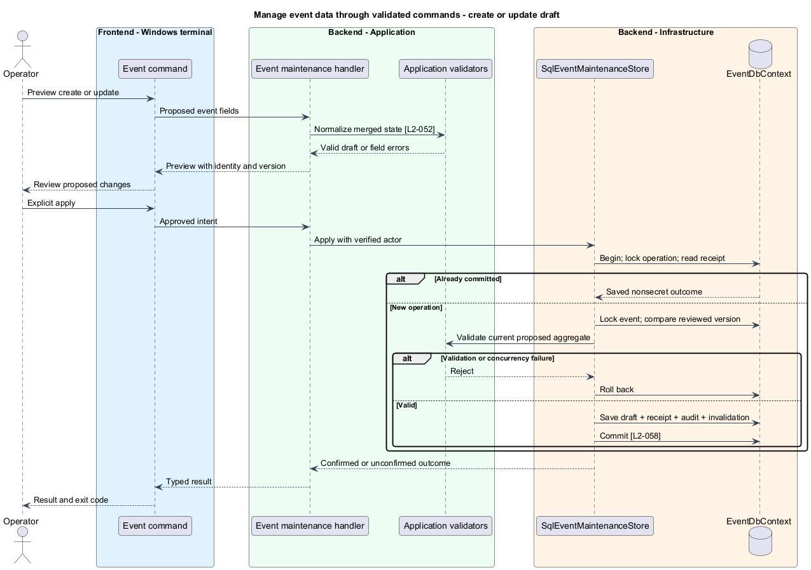
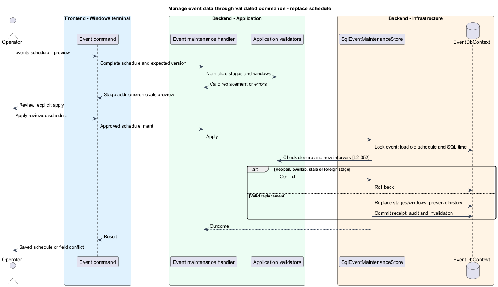
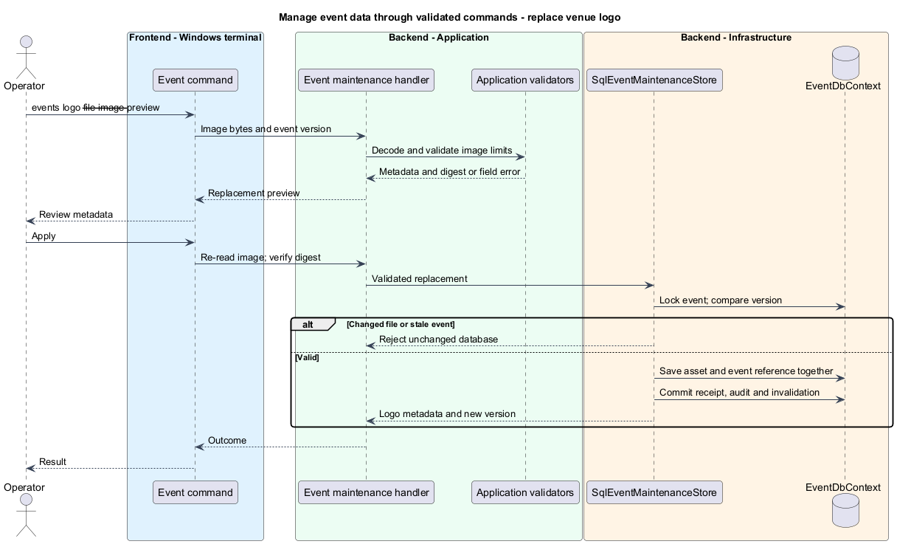
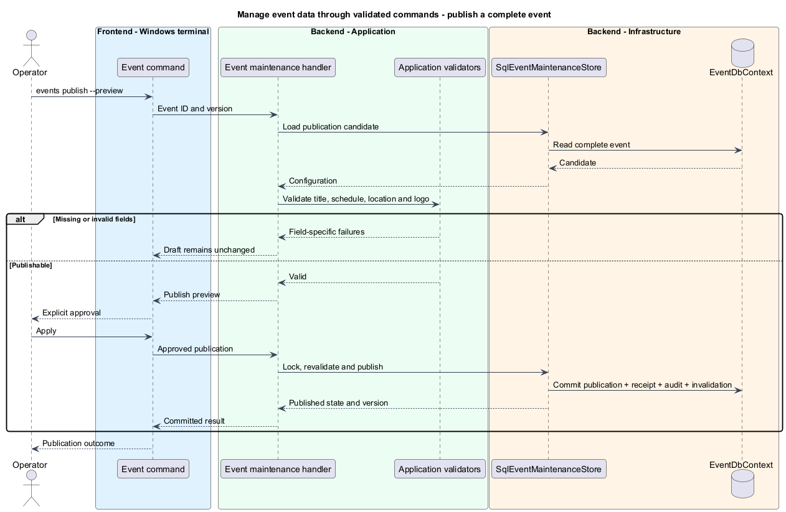

# Manage event data through validated commands

## Overview

Event maintenance changes an event's configuration while preserving its participant history. A draft is an incomplete saved event; publication is the explicit transition that admits participants after validation.

The CLI uses the same application rules as browser administration. Direct SQL exceptions belong to the separate repair feature.

## Description

Existing `IEventStore`, `SqlEventStore`, `SaveEventValidator`, `ScheduleValidator`, `ScheduleClosurePolicy`, `IEventLogoStore`, and `SkiaLogoDecoder` provide event persistence and validation. `EventDbContext` stores `BuildEvent`, `EventStage`, and `LogoAsset`, with a shadow SQL rowversion on each event. The current source does not provide the complete operator command tree or publication operation. `PublishEventHandler`, `EventMaintenanceHandler`, `IEventMaintenanceStore`, and `SqlEventMaintenanceStore` are proposed additions.

The command surface is `events list`, `events show <event-id>`, `events create --file <event.json> --preview`, `events update <event-id> --file <event.json> --version <version> --preview`, `events schedule <event-id> --file <schedule.json> --version <version> --preview`, `events logo <event-id> --file <image> --version <version> --preview`, and `events publish <event-id> --version <version> --preview`. Each database command takes an explicit target. Apply uses the returned preview ID under the [operation protocol](../review-and-reconcile-operations/README.md). Reads return event ID, title, draft/published state, timezone, local/UTC endpoints, venue fields, logo metadata, schedule, and version. Lists order by resolved start then ID, with undated drafts last.

`EventMaintenanceIntent.Kind` is `Create`, `Update`, `ReplaceSchedule`, `ReplaceLogo`, or `Publish`; its payload is the corresponding typed input and never an arbitrary entity name. `EventPatch` represents field presence separately from null and value. Update overlays supplied fields on current configuration; omission preserves and explicit null clears only nullable fields. Creation overlays on a blank draft with Liturgy false. Unknown/duplicate fields fail. The normalized proposed aggregate is validated before preview and revalidated at apply. No command identifies an event by title. `EventPatch` stores present fields as `JsonElement` values within Application; Domain receives normalized typed values only. The input property names reuse `EventInput`; `published` and credential fields are rejected. Schedule JSON uses `ScheduleInput` and replaces all stages/windows, including explicit null for disabled windows. If `events update` changes event endpoints or timezone, validation considers the existing schedule; an incompatible change directs the operator to combined seed update.

`SqlEventMaintenanceStore` opens one `SqlOperatorUnitOfWork` for apply. It resolves the verified operator actor, serializes the operation identity, checks an existing receipt before current versions, then locks `event:<id>`. It loads the aggregate, samples SQL UTC time, checks rowversion and closure rules, mutates, and commits data, receipt, audit, and invalidation together. An `events create` intent allocates its event ID during preview, so retries retain identity. A conflicting creation ID fails; it does not update the existing event.

The current `SqlEventStore` and `SqlScheduleStore` each own transactions and receipts. Implementation extracts transaction-free event/schedule mutation methods into `SqlEventMutations`, used by their existing API wrappers and the operator store. The wrapper owns commit and receipt handling; the helper never commits. This avoids nested independent transactions and duplicate receipt rows. Existing API authorization remains at its original boundary. Microsoft documents explicit [EF Core transactions](https://learn.microsoft.com/en-us/ef/core/saving/transactions); the shared-unit-of-work choice is this design's application of that mechanism.

`PublicationValidator` composes the existing field/schedule validators with title, venue name, coordinate pair, and accepted logo requirements. `PublishEventHandler` requests an explicit state transition using the same unit of work. Incomplete drafts return field paths and remain drafts. Published edits pass publication validation again. Schedule edits apply `ScheduleClosurePolicy.CheckAndRecord` against previous committed times before changing them. Content corrections remain available after completion; reopening remains rejected.

Logo preview decodes bounded bytes and records the file digest, MIME type, size, dimensions, and proposed replacement. Apply rechecks the file bytes and event version. The existing decoder validates PNG/JPEG/WebP; mutation saves the accepted asset and event reference in the same transaction. No old shared logo is deleted as part of replacement. Schedule replacement checks duplicate/cross-event IDs and dependent activity references before removing stages.

Fresh API reads see committed changes directly. The existing platform design's `OutboxMessage` and `OutboxDispatcher` are proposed dependencies for the two-second connected-update requirement, not currently delivered source behavior. Operator mutations write the same event invalidation in their transaction when that subsystem is implemented. The CLI does not host a second dispatcher or call an HTTP mutation endpoint. Behavioral acceptance covers draft creation, stale writes, logo limits, exact schedule boundaries, publication failure/success, and post-commit API/connected-client visibility.

## Requirements

The following normative excerpts retain their exact source wording. Acceptance criteria remain at the linked requirements.

| L2 ID | Refines (L1) | Requirement |
|---|---|---|
| [L2-052](../../../specs/L2.md#l2-052-validated-event-and-schedule-administration) | `L1-016` | The CLI must list and inspect events, create drafts, update event fields and venue/logo settings, replace schedules and activity windows, and explicitly publish complete events. Validated commands must reuse the application rules in L2-001, L2-005, L2-006, and L2-040, including draft validation, publication prerequisites, schedule closure, and field limits. Inspection must expose identifiers, publication status, and concurrency versions needed for subsequent operations. Event deletion, unpublishing, and lifecycle overrides are not validated commands. |

## Diagrams

Validated maintenance changes the event platform through SQL.

The CLI and API share durable state; the CLI makes no HTTP mutation call.

The operator wrapper owns the transaction while mutation helpers share behavior with API stores.

Field presence, reviewed versions, and a feature-specific persistence port describe the mutation contract.

Inspection returns saved versions without opening a mutation transaction.

Apply checks a committed receipt before rejecting a stale version, preserving safe retries.

Previous committed time determines closure before a schedule replacement is accepted.

The reviewed file digest and event version prevent applying a different image or overwriting a newer edit.

Publication is an explicit transition; draft saving never substitutes for it.

