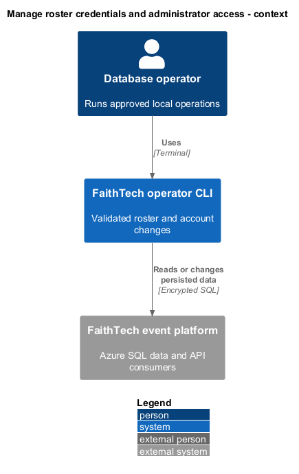
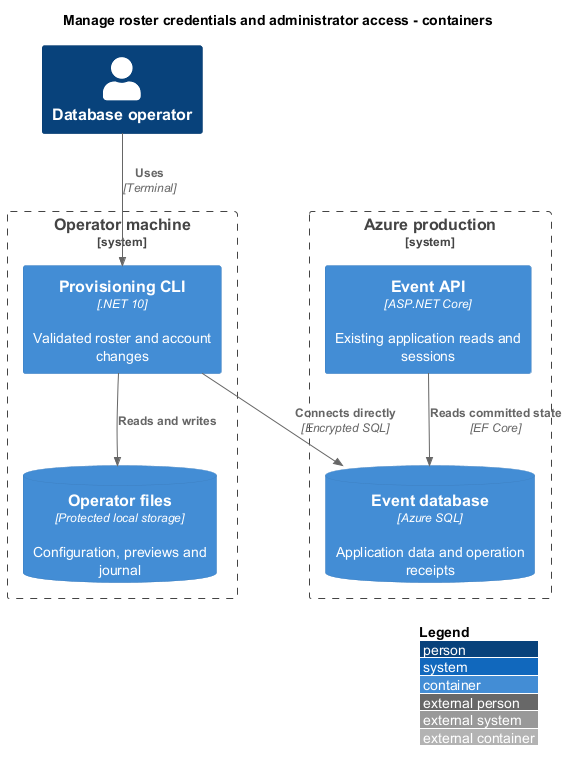
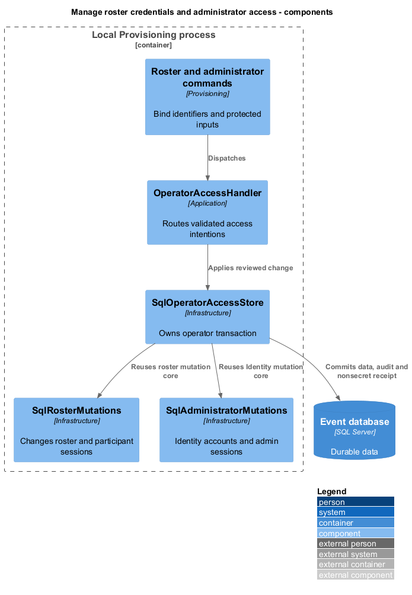
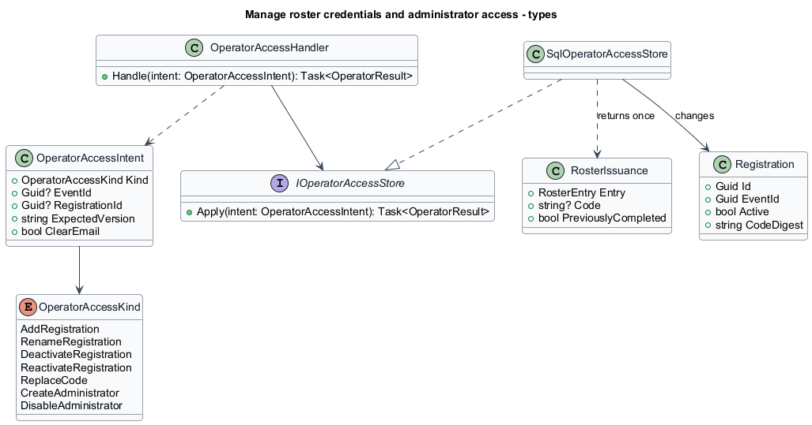
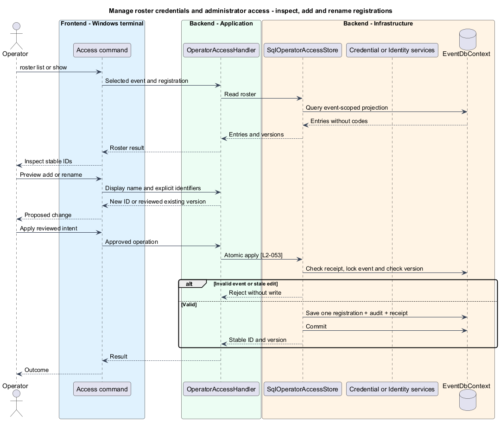
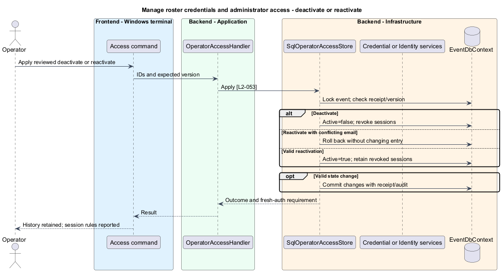
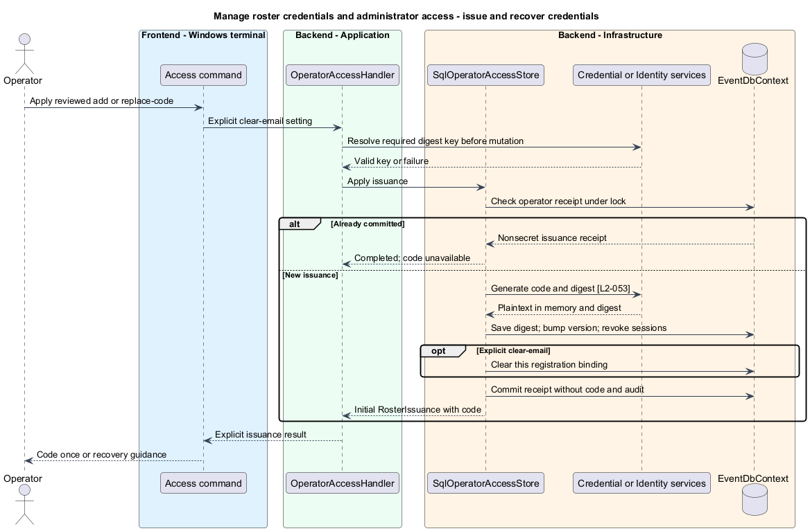
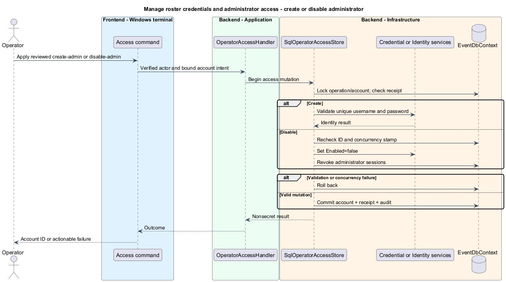

# Manage roster credentials and administrator access

## Overview

A registration is an event-scoped participant identity with an individual entry credential. An administrator account is an application login provisioned by an operator; it is distinct from the database identity running this CLI.

This feature changes roster and administrator access while retaining participation history. Credentials appear only in an explicitly requested issuance result.

## Description

The current account-command implementation is documented in [Manage administrator passwords](../manage-administrator-passwords/README.md). L2-061 and L2-062 use the existing connection configuration. The shared preview/receipt orchestration described below remains planned.

Existing `IRosterStore` and `SqlRosterStore` implement list, add, rename, deactivate, reactivate, and code replacement. `IEntryCodeGenerator` creates and digests participant codes. Existing `ProvisionAdministratorHandler`, `DisableAdministratorHandler`, and `SqlAdministratorProvisioner` use ASP.NET Core Identity. Those real components supply the policies reused here. `OperatorAccessHandler`, `IOperatorAccessStore`, and `SqlOperatorAccessStore` are proposed operator orchestration additions.

Commands are `roster list --event <id>`, `roster show <registration-id> --event <id>`, `roster add --event <id> --file <registration.json> --preview`, and `roster rename|deactivate|reactivate|replace-code <registration-id> --event <id> --version <version> --preview`. Rename takes `--file` containing `displayName`; replacement alone accepts `--clear-email`. Administrator commands retain `create-admin <username> --preview` and `disable-admin <username> --preview`. All database commands select a target and apply through the [shared operation protocol](../review-and-reconcile-operations/README.md). The file names and IDs are command arguments; passwords and code values are not.

`OperatorAccessIntent.Kind` is `AddRegistration`, `RenameRegistration`, `DeactivateRegistration`, `ReactivateRegistration`, `ReplaceCode`, `CreateAdministrator`, or `DisableAdministrator`. Each kind binds its corresponding typed input; it does not accept arbitrary table or property names. Roster read results use `RosterEntry` and include registration ID, event ID, display name, active status, current email binding, and version. They exclude code digests and secrets. `show` resolves the requested event and registration together. Add input contains only `displayName`; duplicate names are valid. Missing entities return a typed not-found failure, never implicit creation. New registration IDs are allocated during preview. The preview contains credential-issuance intent but does not generate a code.

`SqlOperatorAccessStore` uses the same `SqlOperatorUnitOfWork` described in [operation recovery](../review-and-reconcile-operations/README.md). Transaction-free mutation methods extracted as `SqlRosterMutations` are shared with existing API wrappers. They retain per-event locks, rowversion checks, active-email uniqueness, code digest uniqueness, and credential-version increments. `SqlAdministratorMutations` similarly shares Identity account/password validation and session invalidation. The existing API wrappers keep their application actor and receipt behavior. Operator wrappers commit one database-operator receipt and audit outcome instead of invoking independently committing wrappers.

Deactivation sets the selected registration inactive, revokes its participant sessions, and preserves all membership/activity records. Reactivation verifies the retained email is not bound to another active entry and does not revive revoked sessions. Replacement generates a new code only during apply, digests it with the selected deployment's protected digest key, updates credential version, and revokes sessions atomically. `--clear-email` additionally clears the selected binding; it is not inferred from a conflict. Digest-secret resolution and validation happen before starting this mutation. Failed validation generates no committed credential.

`RosterIssuance` already supports `Code=null` and `PreviouslyCompleted=true` for reconciled issuance. That behavior is preserved. First success sends the code through an explicit terminal/JSON issuance result or restricted output file; the database receipt stores only registration identity, version, and completion. A lost issuance result returns completion with `codeUnavailable=true`, requiring a new reviewed replacement. It never reveals the old plaintext or automatically generates another credential. Previews, ordinary roster results, and audit records omit codes.

Create-admin preview accepts its password through masked input or the explicit protected stdin mechanism. The preview stores only a secret binding as defined by the shared protocol. Apply requires the same supplied password and persists only Identity's password hash. Duplicate normalized usernames and password-policy failures reject atomically. Disable preview resolves the username to its stable account ID and Identity concurrency stamp. Apply rechecks both, disables the account, and revokes all administrator sessions in the same transaction. A missing account fails; disabling an already disabled account produces an unchanged result rather than a new account. No command assigns the database operator an application role.

Acceptance uses synthetic roster/account data and real API authentication. It proves duplicate-name independence, cross-event ID rejection, stale edits, email conflicts, invalid passwords, revoked-session failure, fresh authentication after reactivation, one-time credential output, and recovery after lost responses. Data invalidations share the proposed platform outbox; the API enforces session revocation from SQL even before a client receives an invalidation.

## Requirements

The following normative excerpts retain their exact source wording. Acceptance criteria remain at the linked requirements.

| L2 ID | Refines (L1) | Requirement |
|---|---|---|
| [L2-053](../../../specs/L2.md#l2-053-validated-roster-and-administrator-operations) | `L1-016` | The CLI must list and inspect rosters, add and rename registrations, deactivate/reactivate registrations, and issue/replace entry codes with explicit email-binding clearing when requested. It must create and disable administrator accounts. These operations must preserve the identity, uniqueness, password policy, digest, history, and session-revocation rules of L2-002, L2-003, L2-038, and L2-041. Roster mutations must use event and registration identifiers, not display-name matching. Issued codes must be returned only through the explicit issuance result, never previews, ordinary roster reads, or diagnostics. |

## Diagrams

The database operator maintains application accounts without becoming one.

The CLI writes SQL access state that the API checks on authentication and session use.

Shared mutation helpers preserve the existing API's access behavior.

The issuance result carries plaintext only for the initial committed response.

Registration identity is independent of display name; reviewed edits use the saved version.

Reactivation preserves history but does not restore revoked sessions; conflicting active emails prevent it.

Only first completion returns the new code; a committed retry never rotates credentials.

Account mutation and session revocation share one operator transaction.

