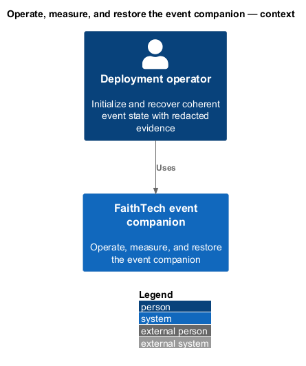
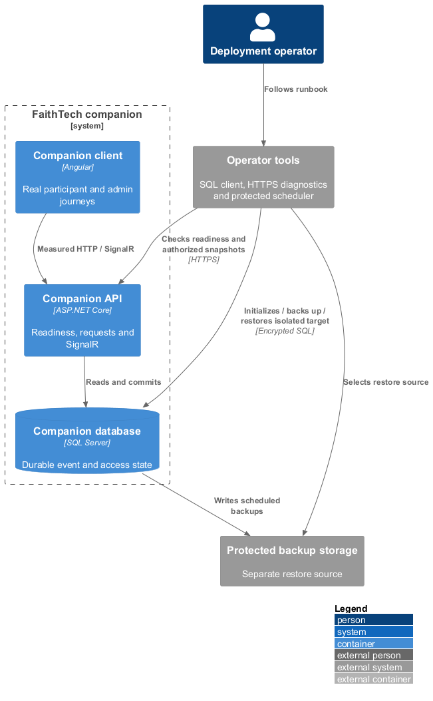
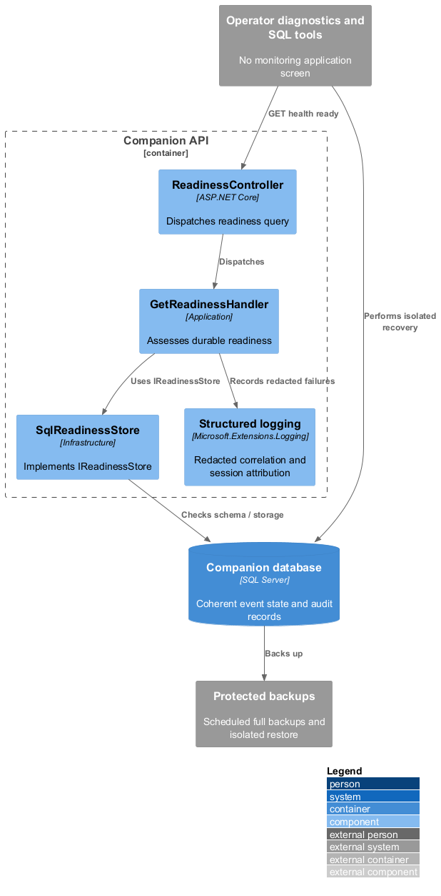
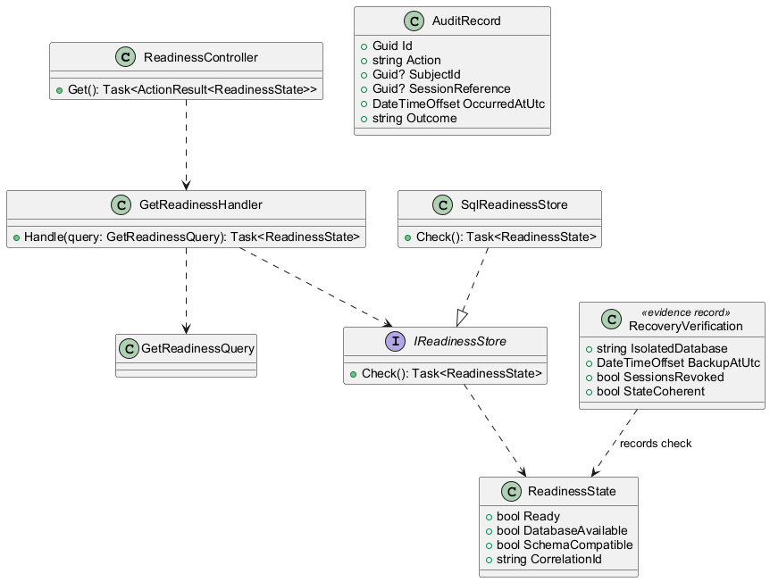
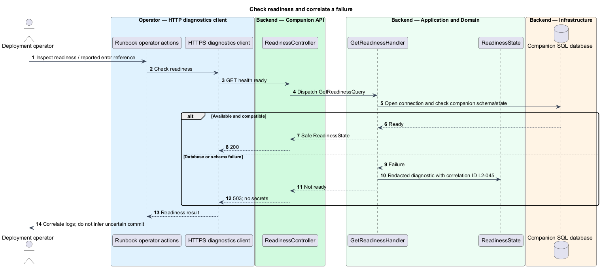
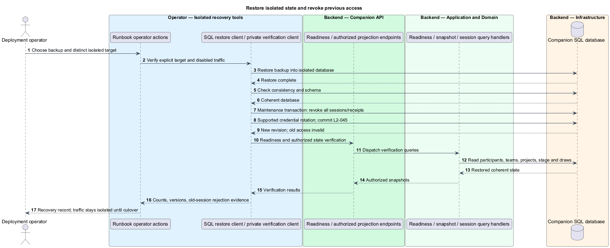
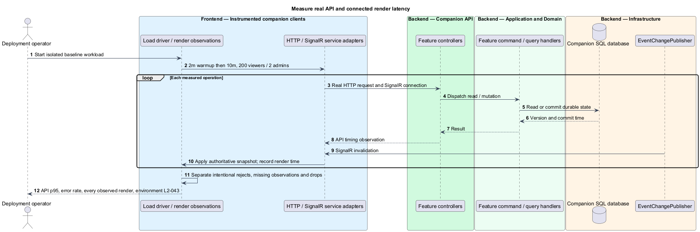

# Operate, measure, and restore the event companion

## Overview

The operator runbook defines setup, event-time checks, and isolated recovery. Readiness indicates that required durable storage and schema are usable; it does not prove an uncertain action committed. Audit records attribute privileged actions to sessions rather than named people.

## Description

Existing `ReadinessController`, `GetReadinessHandler`, `IReadinessStore` and `SqlReadinessStore` are adapted to `CompanionDbContext`. `GET /api/health/ready` reports 200 for usable schema/event state and 503 for storage/schema failure, with no connection details. Protected operator diagnostics distinguish a missing passcode from public-event readiness: no provisioned passcode disables administrator login but public viewing can remain ready. Liveness is separate from readiness and does not query private data.

**Fresh setup sequence.** (1) Provision an empty SQL Server database with encrypted transport and a valid certificate; enable ALLOW_SNAPSHOT_ISOLATION. Use deployment credentials to apply only the new CompanionDbContext migration bundle. A nonempty incompatible target fails rather than applying legacy migrations. (2) Initialize singleton event state at Countdown, version zero, monotonic label counters, no participants, and the supplied RTR card without links. Record initialization so restart never reseeds deletions. (3) Configure the API's protected connection, stable HMAC digest key, allowed HTTPS origin/trusted proxies, and event Options. Use the run-sheet copy and UTC target stated in the root design. No production fixture attendees or default code are provisioned. (4) Run the local tool installer, select the explicit target, verify actual server/database, and provision a passcode through protected SQL RPC or masked CLI. Record only revision/time. (5) Publish one Angular client plus API; serve HTTPS, enable WebSocket upgrade through the proxy, preserve cookie paths, and map the three scoped SignalR endpoints. Do not deploy the legacy separate admin build. (6) Check readiness, public snapshot, time, private authorization and two-browser SignalR updates. (7) Perform entry, grouping, draw, SQL/CLI rotation, and restore rehearsal against a disposable database using synthetic data. Production has no reset/undo; the rehearsal draw does not consume a live winner. (8) Capture a protected baseline backup and enable the schedule before opening entry.

**Event-time operation.** Monitor readiness and structured correlated errors through host logs, with no separate monitoring screen. Record action, stable subject ID, SQL UTC, nonsecret admin-session reference and outcome. Public error references correlate to redacted details. Disable body/parameter/secret logging, retain no private answers or email in telemetry, and restrict log access. Direct SQL replacement adds database-principal/revision diagnostics or a protected operator verification record. Shared-code sessions never establish named-person accountability.

**Backup default.** For this single event, take a database-native full backup before doors, every 15 minutes until close, and immediately after close. Windows Task Scheduler may invoke the protected SQL backup job where SQL Agent is unavailable. Keep backups on protected storage separate from the live database, with access limited like the verifier itself, and record completion/failure times. Retain rehearsal backups only for verification; retain event backups for seven days as an operational default, then delete them through the deployment's retention job. This backup schedule permits up to 15 minutes of data loss after total database loss; it does not weaken the requirement that API restart alone loses no acknowledged commit. No zero-loss disaster-recovery guarantee is claimed.

**Isolated restore sequence.** (1) Keep participant/admin traffic disabled for the restore target and retain the original database/backup. (2) Restore the chosen backup into a distinct explicitly named database; never restore over the live database as a verification step. Run database consistency checks and verify schema version. (3) In one maintenance transaction revoke every AdministratorSession, ParticipantSession and EntryReceipt and rotate the credential through the supported operation before access opens. Revoke receipts even though their participant records remain. (4) Point a private verification instance at the isolated target and read saved participants, projects, teams, stage, draw IDs/times and redacted labels coherently. Verify old browser cookies and recovery receipts fail. (5) Check readiness and authenticated SignalR resynchronization, using new sessions. (6) Compare the restore timestamp and recorded counts with the backup manifest; record any known interval of lost database changes. (7) Only a separately chosen operational cutover points event traffic at the restored target. Readiness is never used as proof that an uncertain CLI or HTTP action committed.

**Failure response.** A database outage makes readiness fail and changing controls unavailable. After storage returns, reconnect/snapshots establish authority and the saved stage without replaying commands or completed effects. An uncertain admin save is inspected or explicitly retried using its original receipt; an uncertain CLI replacement is not retried automatically. Credential verification and a deliberate new rotation are separate actions. Rollback of a bad application deployment selects a compatible prior build against the same companion schema; it never starts the old multi-event app on the new schema.

**Measurement protocol.** The reference deployment record includes actual CPU/RAM/storage, SQL version, app/runtime/package versions, browser/OS, proxy, network latency, and all raw observations. Use disposable persistence and sufficient synthetic entrants. Warm up two minutes, then measure ten minutes with 200 SignalR viewers and two administrators. Each viewer reads state every 30 seconds; administrators collectively perform one roster/project/team mutation every ten seconds, three adjacent screen advances, and three sequential draws. Record API p95≤1,000 ms, unexpected request failures≤1%, and every connected observed render within two seconds of its commit. Separately submit seventeen distinct emails from one source in ten seconds while Countdown is live. Record intentionally rejected requests, dropped connections and missing observations separately. Restart and reread acknowledged state after the run. Repeat the shared-budget/change-feed cases with two API instances; performance evidence reports the actual topology rather than assuming an instance count proves capacity.

Production acceptance combines real API/SQL/SignalR, installed CLI/direct SQL, mocked-contract Playwright page objects, upstream Cornerstone examples, and this isolated load/restore evidence. The legacy implementation record describes prior scope and is not current completion evidence.

Commands and queries use the [shared architecture and protocol](../../README.md#shared-architecture-and-protocol). The following acceptance scenarios are design obligations, not executed test evidence.

- Given storage fails then returns, when readiness is queried, then it reports not ready then ready without asserting an uncertain write committed.
- Given a synthetic populated backup, when isolated restore completes, then all saved relations/results are coherent and every old private/recovery session is invalid.
- Given a clean deployment, when setup is followed, then copy, target, RTR, passcode, HTTPS, SignalR and CLI are verifiable without fixture attendees.
- Given the prescribed workload, when measured, then raw timing and missing/dropped observation counts support the stated thresholds rather than a mock-only claim.

## Requirements

The source text below is reproduced verbatim, including its original obligation wording.

| L2 ID | Refines (L1) | Requirement |
|---|---|---|
| [L2-045](../../../specs/L2.md#l2-045-minimal-operational-diagnostics-and-recovery) | L1-014 | Operators must have a documented setup/recovery runbook, readiness check covering durable storage, and redacted structured errors correlated with user-visible error references. Record administrator mutations with action, subject ID, UTC time, session ID reference (not the session credential), and outcome. The shared passcode identifies an administrator session, not an individual person; do not claim named-person attribution. Direct database changes require database-side diagnostics or an operator verification record; app logs alone cannot establish who performed them. No separate monitoring UI is required. |
| [L2-043](../../../specs/L2.md#l2-043-measurable-live-event-performance) | L1-014 | The baseline must support 200 simultaneous SignalR viewers and two administrators. After two minutes of warm-up, measure for ten minutes on a recorded reference deployment with real API/persistence: each viewer reads state once per 30 seconds; administrators perform one valid roster/project/team mutation every ten seconds, the three screen advances, and three sequential raffle draws. Seed sufficient synthetic participants before measurement. Record deployment resources, browser/OS, network conditions, raw API timings, update receipt/render timings, and dropped connections. This baseline retains headroom above the run sheet's 13 registrants plus four organizers without requiring invented attendees in production. |
| [L2-050](../../../specs/L2.md#l2-050-explicit-database-target) | L1-015 | Database commands must require an explicitly selected connection configuration and display the resolved server/database without credentials before changing the passcode. The application's existing database connection and grants are sufficient when they authorize the operation; a separate special operator account is not required. Connection verification is read-only. Missing/invalid settings or connection failure must not select another database or change network permissions. Default connection and command timeouts are respectively 30 and 60 seconds, configurable to positive finite seconds. |

## Diagrams

The context identifies the actor and the capability within the companion.

The container view distinguishes browser or operator execution from durable server state.

The component view scopes the named building blocks to this feature.

The class view shows the proposed contract, request, state, and dependencies.

Readiness measures storage availability while redacted error references support diagnosis.

Recovery preserves event data but invalidates every previously issued private credential before reopening.

The load run records actual commit-to-render observations, including gaps and intentional rejections.

