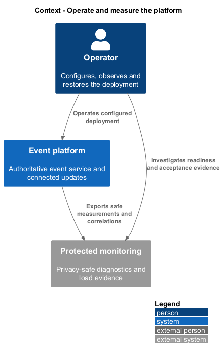
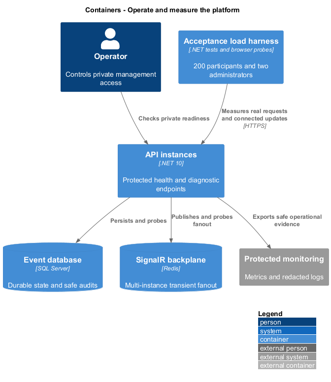
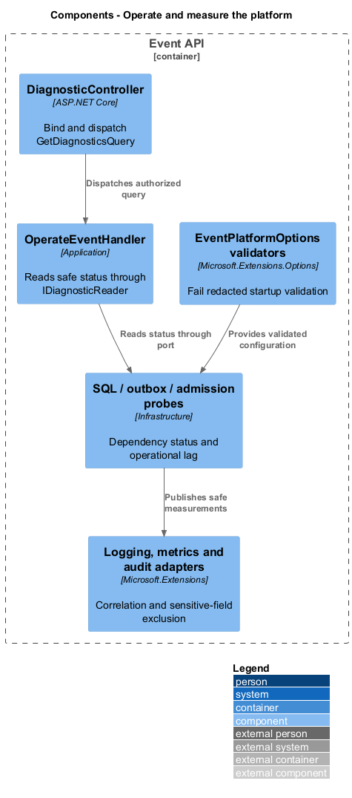
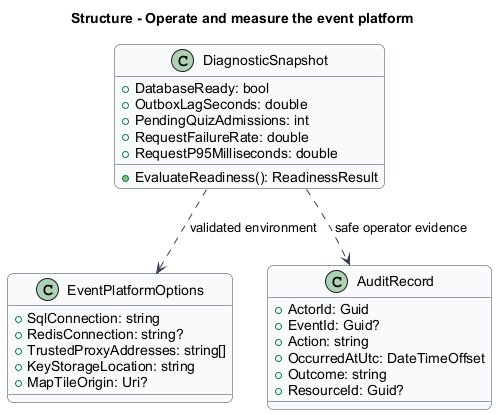
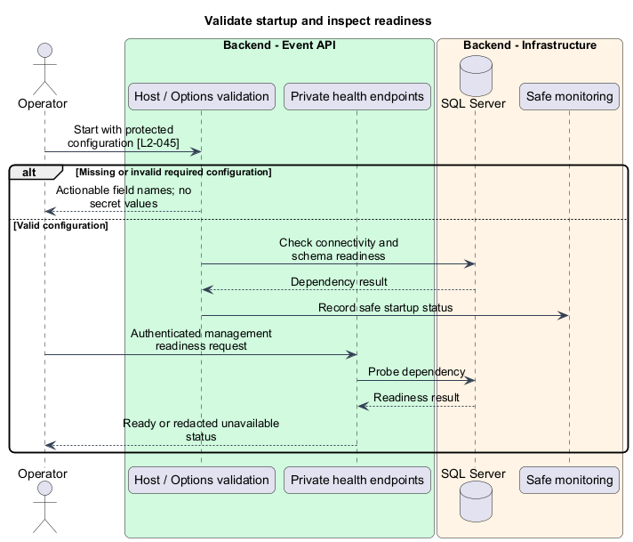
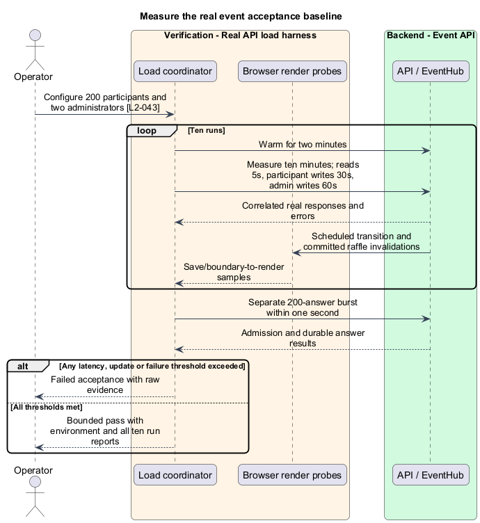

# Operate and measure the event platform

## Overview

Operations keeps the event service diagnosable and recoverable. Readiness describes whether an instance can serve authoritative requests. Performance evidence measures real API and connected-client behavior against the event's explicit load baseline.

## Description

This proposed slice introduces operator tooling and protected diagnostics, not another participant screen. `EventPlatformOptions` binds SQL, multi-instance Redis, trusted proxy/origin settings, protected key storage, and optional map-tile configuration through Microsoft.Extensions Configuration. Startup Options validation reports missing field names and recovery actions without printing values or connection strings.

`GET /health/live` and `/health/ready` run on the private management listener protected by deployment authentication/network policy. Readiness checks SQL connectivity and required schema compatibility. Degraded Redis delivery, outbox lag, unresolved quiz admissions, and notification failures appear separately; operators can distinguish durable API availability from failed connected-update service. An administrator-scoped `/api/admin/diagnostics` projection contains safe status and correlation references, never connection secrets.

`DiagnosticController` binds and dispatches `GetDiagnosticsQuery`; `OperateEventHandler` reads `IDiagnosticReader`. ASP.NET health-check registrations use the same infrastructure probes. Microsoft.Extensions logging and metrics record request duration by route template/status, failures, SQL latency, outbox backlog/age, hub reconnects, admission resolution, and scheduled-boundary lag. Correlation IDs connect client errors, server requests, and safe audit outcomes. High-cardinality raw URLs and submitted content are excluded.

`AuditRecord` stores actor/event/action/time/outcome and stable resource IDs for configuration, roster, selection, moderation, quiz, and draw changes. It excludes codes, passwords, emails, message text, biographies, tags, report reasons, and resolution notes. SQL command logging redacts parameter values. Operator-facing startup and health errors identify the failed dependency without disclosing credentials to application users.

The real-API load harness resides under `backend/tests`; it authenticates 200 participants and two administrators against an isolated deployment. Each of ten runs warms for two minutes, then measures ten minutes. Participants read every five seconds and mutate every 30 seconds; administrators mutate every minute. Runs include a scheduled transition and raffle. Fixtures distribute valid actions rather than measuring repeated validation failures as successful work.

Acceptance requires real API p95 latency at most one second, network failures at most 1%, and connected render/announcement latency at most two seconds. A separate burst admits 200 quiz answers within one second. Server-side timings, browser receive/render marks, a shared measurement clock strategy, and correlation IDs distinguish API duration from save/boundary-to-render latency. Reports retain each run, warm-up exclusion, machine/OS/browser versions, instance count, SQL/Redis configuration, concurrency, raw samples, percentile calculation, and failures. No measurements are claimed by this design.

The operating sequence is: validate protected configuration and backup/key access; run migrations once; start instances; confirm readiness and fanout; execute representative access/save/transition checks; then admit event traffic. Multi-instance hosting configures Redis and affinity. A failed schema/startup check removes the instance from traffic. Delivery degradation prompts outbox/Redis inspection and explicit stale UI, never a fabricated fresh state.

For incident diagnosis, operators locate the correlation ID, compare API/SQL errors with outbox and admission lag, and preserve safe logs. An interrupted process restarts against existing SQL/key storage; no database reseeding occurs. Backup restore follows the isolated procedure in [recover-state](../recover-state/README.md), records its chosen recovery point, and verifies representative durable history before traffic resumes. Rollback uses a schema-compatible prior build or a rehearsed restore; migration rollback is never assumed safe without evidence.

Acceptance tests fail each required configuration input, SQL readiness, Redis publication, and process startup independently. Privacy checks submit recognizable sensitive values and verify their absence from exported diagnostic/audit outputs. Load and restore reports are delivered by production implementation; mock-only browser results do not satisfy these requirements.

## Requirements

The following verbatim primary excerpts link to their complete normative definitions and Given–When–Then acceptance criteria. Shared constraints apply as specified in the [architecture contracts](../../README.md).

| L2 ID | Refines (L1) | Requirement excerpt |
|---|---|---|
| [L2-043](../../../specs/L2.md#l2-043-measurable-performance-baseline) | `L1-014` | The baseline must support 200 connected participants and two administrators in one event. Measure after two minutes of warm-up for ten minutes on a recorded reference deployment, with each participant issuing one read every five seconds and one valid mutation every 30 seconds, administrators making one configuration change per minute, and a scheduled transition and raffle during the run. Measure API latency at the client; include normal network transit and exclude third-party map/link loads. Record deployment resources, database, browser version, network conditions, and raw results for reproducibility. |
| [L2-045](../../../specs/L2.md#l2-045-operational-diagnostics-and-audit) | `L1-014` | Operators must have protected access to application readiness, request latency and failure metrics, and structured failure records with correlation identifiers. Administrative configuration, access revocation, moderation, and raffle actions must record actor, event, action, time, and outcome. Diagnostic records must exclude message bodies, biographies, profile tags, report reasons/resolution notes, participant emails, submitted codes, and authentication secrets; audit records use stable identifiers rather than free-text payloads. Deployment documentation must explain configuration, secret provisioning, startup, backup/restore, and recovery verification. |

## Diagrams

Operators use protected monitoring to diagnose the event deployment. Diagnostic evidence excludes sensitive event content.

Real request and browser probes measure API, SQL, and connected fanout behavior. Redis remains a transient dependency beside the authoritative SQL database.

Validated Options feed infrastructure probes. Thin diagnostic endpoints dispatch queries that expose safe status and correlation data.

Configuration, diagnostic projections, and safe audit records serve distinct purposes. Secret configuration fields never appear in diagnostic or audit serialization.

Startup validates required configuration before serving traffic. Operators receive actionable dependency status through a protected channel.

Ten measured runs and the quiz burst retain raw evidence. Threshold failures remain explicit rather than being replaced with mock results.

