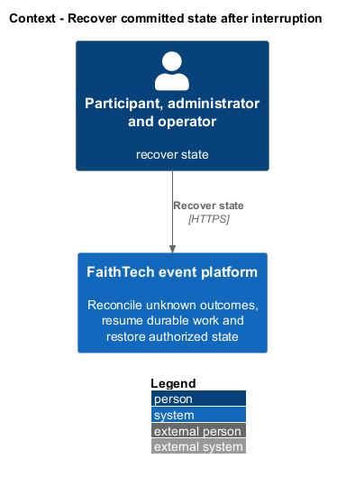
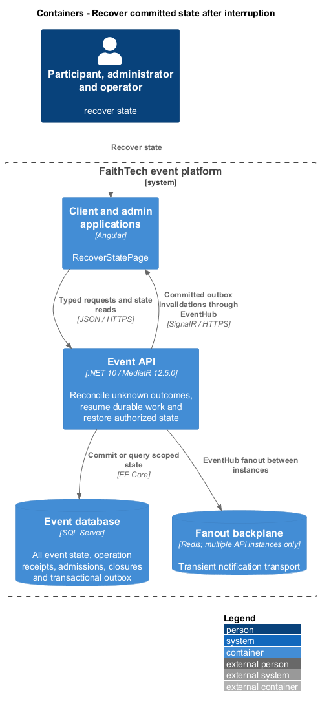
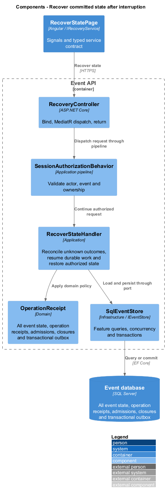
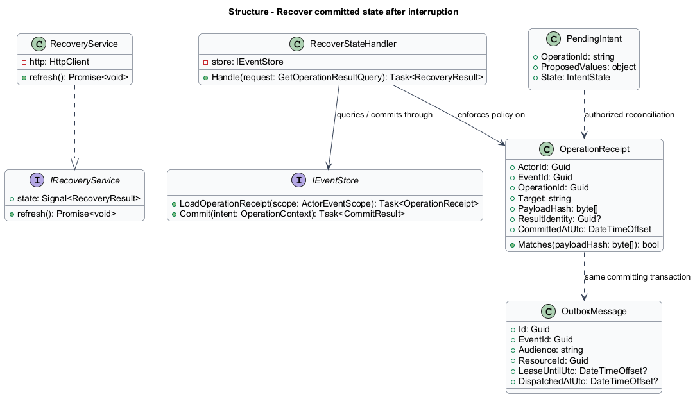
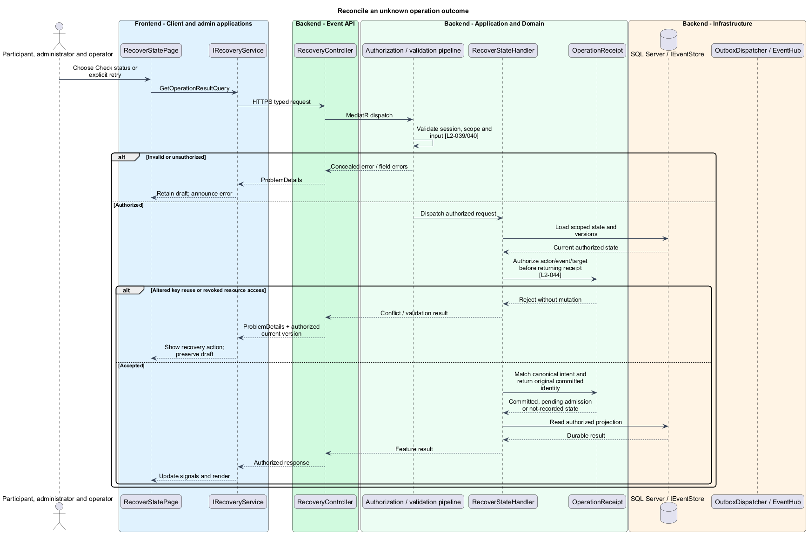
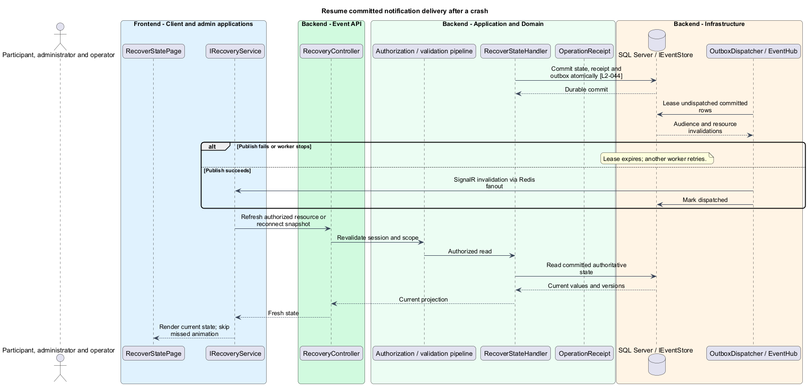

# Recover committed state after interruption

## Overview

An interruption may happen before or after a durable write. Recovery distinguishes a confirmed rejection from an unknown result and returns the original committed outcome for the same intent. Restart and backup restore retain the event's identities, history, and irreversible closures.

## Description

Recovery controls compose the existing feature pages; `RecoverStatePage` in the diagrams denotes this composition, not an additional product route. The proposed `IRecoveryService`, injected through `RECOVERY_SERVICE`, coordinates existing feature adapters; it does not replace their typed commands. `GET /api/events/{eventId}/operations/{operationId}` and the corresponding administrator route dispatch `GetOperationResultQuery` for the current actor only. `RecoveryResult` is `Committed`, `PendingAdmission`, or `NotRecorded`, with safe result identity and no secret material. NotRecorded after a timeout is not proof that a concurrent in-flight request cannot commit; retry uses the original identity.

`RecoverStateHandler` validates current actor/event/resource access before reading a receipt. Unique actor/event/operation identity and canonical payload hashes reject altered reuse with 409. An identical committed retry returns the original result before time-window checks, while a revoked actor receives no private result. Credential issuance/authentication receipts expose completion only and cannot recover one-time codes or cookies.

Each ordinary command commits domain rows, receipt, safe audit, and outbox in one SQL transaction. Quiz admission is separately durable and resolves through the acceptance protocol in the quiz feature. `PendingIntent` retains proposed values in memory under event/actor identity; unknown outcomes show checking/retry status. A stale edit exposes the authorized current version and preserves the proposed draft for deliberate reapplication as a new intent. Reconnect never automatically sends an unsent message or creates a replacement draw.

`OutboxDispatcher` uses bounded SQL row leases with skip-locked semantics, a 100 ms initial poll interval, batches up to 100, and 30-second leases. These are initial tuning values subject to the unchanged latency acceptance targets. A committed invalidation publishes through SignalR and the Redis backplane; successful publication records dispatch, while failure or process death leaves a retryable row. Duplicate publication is harmless because clients refetch authoritative resources. Audience metadata never contains message bodies or optional profile fields.

Client reconnection first validates the session, then reloads a full authorized event snapshot and open activity state. It derives current stage/windows from server time and skips historical animations. SQL session records, Data Protection keys, credential-digest keys, and all persistent entities survive ordinary API restart. Redis loss triggers degraded freshness and reconciliation; it cannot erase SQL state.

The restart acceptance fixture populates events/configuration, registrations/credentials/bindings, sessions, profiles/tags, memberships, selections, every retained build pairing, messages/blocks/reports, quiz admissions/answers/results, prizes/awards, demo slots, receipts, closures, and outbox rows. It interrupts before commit, after commit before response, and after publish before marking dispatch. Subsequent authorized reads retain all committed data, deduplicate retries, and finish eligible admissions once.

Backup recovery uses a SQL backup plus protected application key material. Operators restore to an isolated database and API environment with notification delivery and public ingress disabled, verify the schema/version and the populated recovery fixture, and validate scoped authentication. They compare row identities and durable outcomes through behavioral API reads, test retained closures and original operation receipts, then deliberately enable delivery/traffic. Redis is reconstructed. Backup time, restore duration, chosen recovery point, and any data loss relative to that point are recorded; an untested backup is not accepted recovery evidence.

Acceptance includes an API process restart, Redis interruption, multi-instance duplicate outbox delivery, an interrupted quiz admission, revoked receipt access, and an isolated backup restore. The [operate-event design](../operate-event/README.md) defines deployment diagnostics and operator actions.

## Requirements

The following verbatim primary excerpts link to their complete normative definitions and Given–When–Then acceptance criteria. Shared constraints apply as specified in the [architecture contracts](../../README.md).

| L2 ID | Refines (L1) | Requirement excerpt |
|---|---|---|
| [L2-044](../../../specs/L2.md#l2-044-persistence-interruption-and-recovery) | `L1-014` | The server must acknowledge success only after durable persistence. Roster bindings, event settings, teams/projects, profiles, messages, quiz submissions/results, reports, and raffle awards must survive application restart. The client must identify disconnected or failed states, retain unsent drafts in memory, and reconcile with authoritative state when connectivity returns. Conflicting administrator and shared team edits must reject stale writes with a reload/reapply action rather than silently overwrite newer changes. |

## Diagrams

Participant, administrator and operator uses the event platform to recover state. The context isolates this capability from unrelated event activities.

The Client and admin applications calls the API for authoritative state. SQL Server retains all event state, operation receipts, admissions, closures and transactional outbox; SignalR invalidations prompt authorized reads.

`RecoveryController` dispatches through the application pipeline. `RecoverStateHandler` owns the feature policy and uses the persistence port.

`OperationReceipt` carries stable identity and feature state. The service interface separates Angular consumers from HTTP; `IEventStore` represents the application persistence boundary. Method shapes are slice-specific views of the shared contracts.

Reconcile an unknown operation outcome applies authorize actor/event/target before returning receipt [l2-044]. Altered key reuse or revoked resource access leaves committed state unchanged; the client retains enough context to recover.

The outbox separates durable state from transient SignalR delivery. A lease permits retry after worker failure, and duplicate delivery prompts the same authoritative read.

