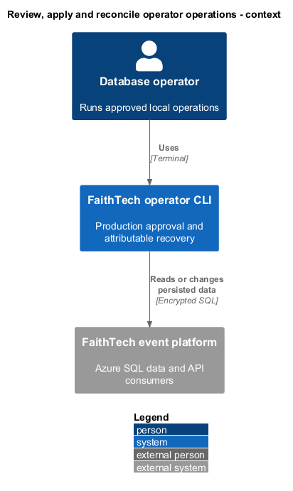
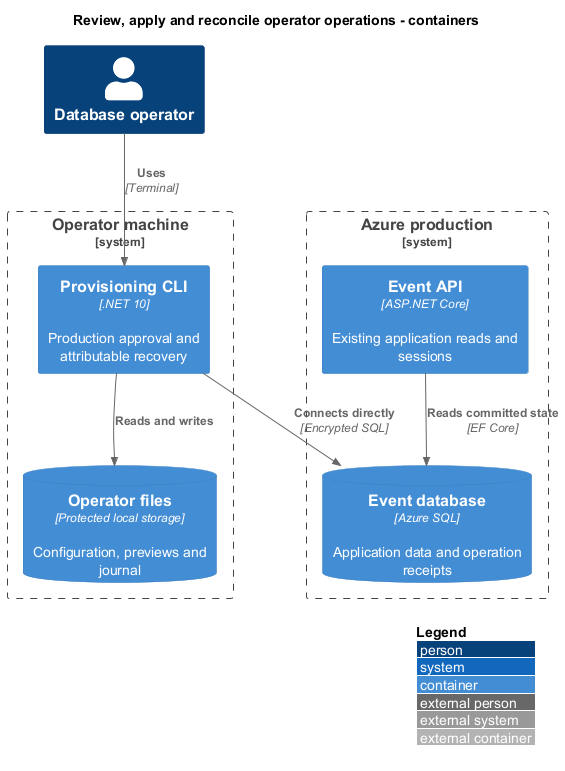
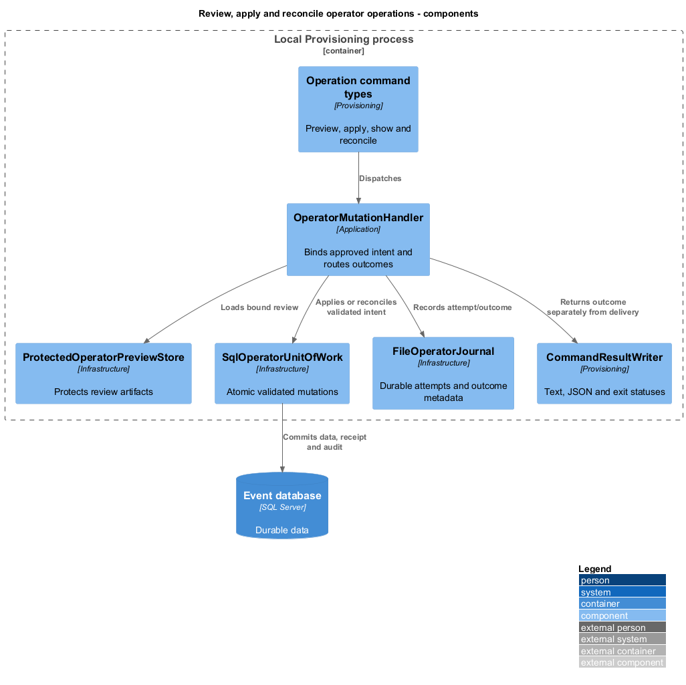
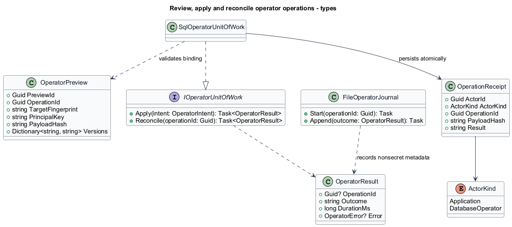
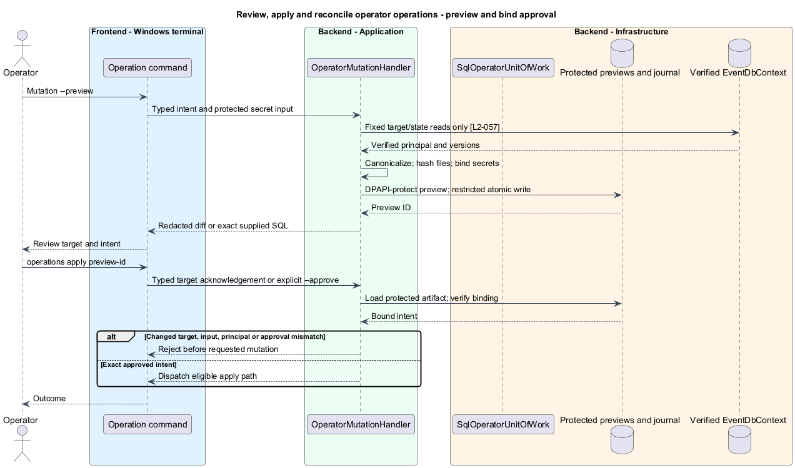
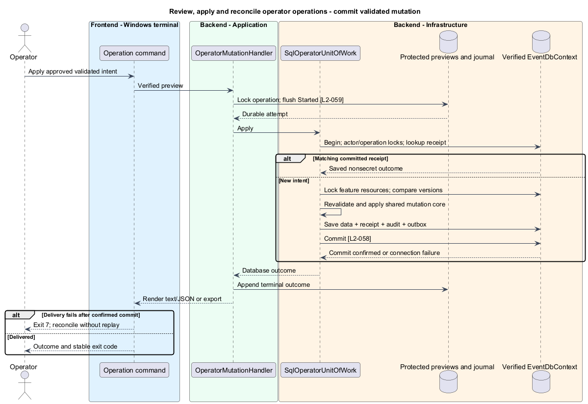
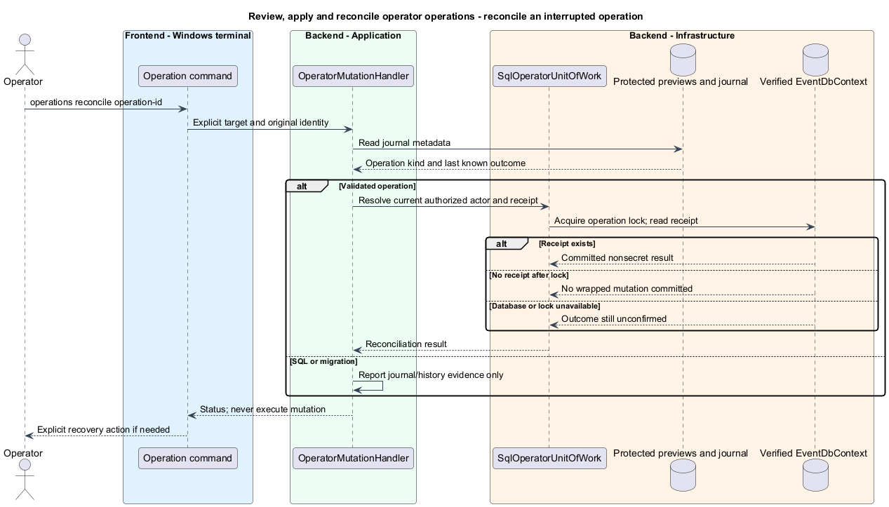
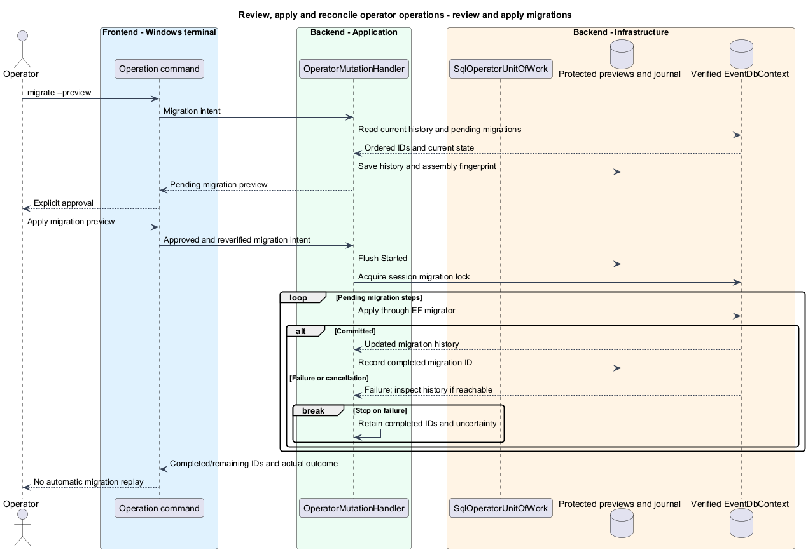
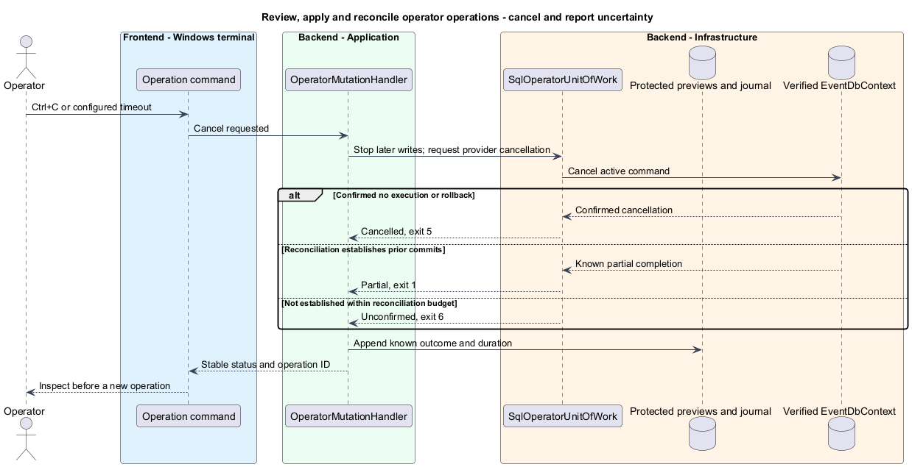
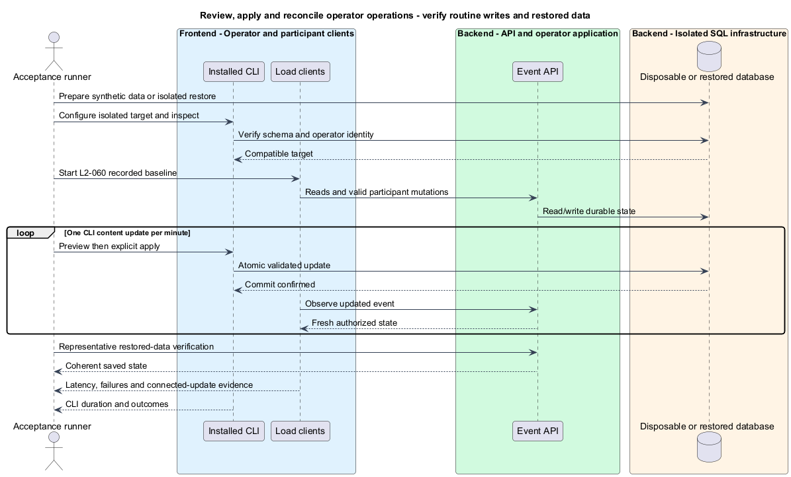

# Review, apply and reconcile operator operations

## Overview

An operation is one deliberate operator intent with a stable GUID. A preview is a saved, reviewable description bound to that intent and its target. A receipt is durable evidence that a validated database mutation committed.

This feature supplies the common production workflow used by event, access, seed, SQL, and migration commands. It separates approval, database completion, and output delivery so interruption does not silently repeat a change.

## Description

The existing `OperationReceipt` and `AuditRecord` provide GUID actor/event identities and saved outcomes. Existing stores implement their own transactions and receipt hashes. The proposed `OperatorMutationHandler`, `IOperatorUnitOfWork`, `SqlOperatorUnitOfWork`, `OperatorPreview`, `IOperatorPreviewStore`, `ProtectedOperatorPreviewStore`, `FileOperatorJournal`, and `CommandResultWriter` supply the operator protocol. Application ports carry data and cancellation tokens; concrete SQL connections, EF contexts, DPAPI calls, and filesystem handles remain in Infrastructure. The CLI composition root resolves implementations. Each proposed type occupies its own file; no generic entity repository or new hosted API is introduced.

The command grammar is `<mutation> ... --preview --operation-id <guid>`, `operations show <operation-id> --target <name>`, `operations apply <preview-id> --target <name>`, and `operations reconcile <operation-id> --target <name>`. Omitting `--operation-id` during preview generates and returns one. A command without the required preview mode cannot mutate. All named targets use this workflow, avoiding environment-dependent command semantics. Interactive apply displays actual server/database and requires typing `<server>/<database>` exactly. Noninteractive apply requires `--approve <preview-id>` matching the selected artifact. A bare `--yes`, redirected terminal, or environment flag is not approval. The additional approval step is tool behavior, not a requirement to ask a human before authoring these designs.

`OperatorPreview` schema version 1 contains preview ID, operation ID, operation kind, target fingerprint, verified principal key, created UTC time, tool/contract version, nonsecret canonical intent bytes, secret bindings, input-file descriptors, reviewed resource versions, and a nonsecret diff. Each file descriptor records absolute source path, length, and SHA-256 digest. UTF-8 file bytes and typed parameter values bind approval. Canonical intent JSON orders property names ordinally, preserves array order and explicit null/presence, and uses invariant values. It excludes descriptive seed metadata from the mutation payload fingerprint but retains the complete file digest in approval binding. Changing metadata therefore requires another preview before first apply without changing an already committed mutation's meaning.

Secrets are re-supplied from the same protected reference or masked/explicit stdin input at apply. The artifact holds a keyed fingerprint, never plaintext. A randomly generated per-operator fingerprint key is DPAPI-protected and receives a stable KeyId. Secret binding uses HMAC-SHA256 over type, parameter/field name, and value; ordinary values use a canonical payload hash. Changing secret value, reference, fingerprint KeyId, principal, target, input bytes, or reviewed versions invalidates an uncommitted preview. Credential generation itself occurs only at apply and is not part of a preview. Loss of the local fingerprint key prevents replay from that preview; operation-ID receipt inspection remains available for reconciliation.

Previews are DPAPI-protected JSON artifacts beneath `%LOCALAPPDATA%/FaithTechTorontoAiBuildEvent/operator/previews/`, written atomically with an operator-only ACL. `operations show` decrypts and renders the selected artifact or nonsecret journal/receipt outcome. It does not treat an arbitrary editable JSON file as approval. Saved references bind the named target's actual server/database and principal on every apply; configuration aliases alone do not establish identity. Files are re-read once, validated against stored digests, and then the in-memory verified bytes are used for mutation. No second unverified file read occurs after approval. A successful preview performs fixed database reads only, including no migrations, actor registration, or closure-state writes.

`SqlOperatorUnitOfWork` owns one EF transaction for each validated mutation. It locks the verified actor key (target plus authenticated-session and database-principal SIDs) and maps it through the operator identity registry, then acquires the operation lock before reading a receipt. The receipt lookup includes ActorKind, actor, operation identity, and target. Before receipt replay, a fixed permission probe verifies the current principal's required operation-specific table permissions; it never executes the original mutation as a probe. A matching committed receipt returns its nonsecret outcome before stale-version or elapsed-window checks. A differing fingerprint conflicts. New intents acquire feature locks in a fixed order: operator identity, operation, event, then registration/account when applicable. They recheck versions and validation under those locks, invoke shared noncommitting mutation methods, and save data, receipt, audit, and outbox invalidations together. SQL rowversion remains an Infrastructure shadow property. Lock acquisition uses the configured command timeout, cancellation, and SQL application-lock result checks.

The operator attribution migration adds `OperatorIdentity`, the ActorKind discriminators, and revised unique receipt indexing described in [target identity](../connect-operator-target/README.md). Existing application rows default to Application. The API wrappers continue their existing result and authorization contracts but explicitly use that discriminator. No operator identity becomes an ASP.NET Identity account. Applying the schema change is a separate reviewed migration before validated operator mutations are available; the CLI checks compatibility and fails actionably on older/newer unsupported schemas. The migration and SQL paths can operate before the operator tables exist. Their initial attempt tracking therefore uses the local journal, not the schema they are about to create.

`FileOperatorJournal` stores one JSON Lines file per operation beneath the protected operator directory. It flushes Started before any requested mutation, then appends stage, UTC time, duration, resolved target, verified invoker, available stable subject IDs, and outcome. It does not store scripts, file contents, parameter values, rows, emails, or credentials. A file lock spans invocation to prevent local concurrent reuse. A torn trailing record or Started without a terminal record is unconfirmed. Missing initial journal persistence prevents execution. A final journal failure after known commit is result-delivery failure, not rollback; the database receipt remains authoritative for validated operations. Journals are operational evidence, not tamper-proof records against their owner.

`operations reconcile` reopens and verifies the target, then reads a database receipt under the operation lock for validated mutations. A matching receipt confirms success. No receipt after obtaining the lock confirms no wrapped commit only within the documented intact-receipt database history; SQL deletion of receipts or restoring an older database invalidates that inference and requires operator inspection. It reports status and never initiates a new mutation. Reapplying a still-valid approved preview is a separate deliberate command. Database unavailability, mismatched identities, missing operation metadata, or an unacquired lock retain an unconfirmed outcome. SQL reconciliation reports journal checkpoints and requires explicit operator inspection; it never infers nonexecution from an absent application receipt. A new approved SQL attempt uses a new operation identity. Credential receipts return completion only; explicit replacement recovers a lost issued code.

`migrate --target <name> --preview` records the ordered pending EF migration IDs, current migration history, and packaged migration assembly fingerprint. Apply rechecks these and serializes migrations through a database session application lock. It uses the EF migrator targeting each next migration on the same connection with command cancellation and no automatic transient retry of an uncertain migration. History is read after each failure or reconnection when possible. A committed earlier migration remains completed; remaining migration IDs are reported separately. Schema migrations do not share the all-or-nothing data-mutation promise. An empty pending list returns unchanged success. No startup path silently migrates production.

Timeouts are positive finite seconds, defaulting to 30 for connect and 60 for database commands. Ctrl+C and timeout stop issuing further mutation work and request provider cancellation. The executor allows a separate five-second best-effort reconciliation budget, then reports unconfirmed if it cannot establish completion. Closing the process/connection is not proof that SQL rolled back. Confirmed cancellation before execution or rollback returns 5; known partial completion returns 1; uncertainty takes precedence and returns 6. A durable success with failed local output/journal delivery returns 7. Operators inspect uncertain outcomes before new intent.

`OperatorResult` uses schema version 1 with `operationId`, `previewId`, `target`, `principal`, `outcome`, `durationMs`, `result`, and `error`. Missing values are JSON null. Target contains environment/server/database; principal contains stable key and display names. Error contains code, redacted message, field paths when applicable, and retry guidance without raw exception text. Outcomes are `previewed`, `succeeded`, `unchanged`, `reconciled`, `rejected`, `partial`, `cancelled`, `unconfirmed`, and `delivery-failed`. Exit mapping is exactly L2-059: 0 success/preview/reconciled, 1 confirmed execution failure or partial, 2 syntax/configuration/validation, 3 authentication/authorization, 4 stale/operation conflict, 5 confirmed cancellation, 6 uncertainty, 7 committed with delivery failure. Help and version use text unless JSON is explicitly selected.

JSON mode spools SQL result arrays to restricted temporary storage with bounded memory, then writes one final result document to stdout. Progress and redacted diagnostics go to stderr. Result-set descriptors retain column ordinals and SQL types; no row is silently truncated. If spooling fails while SQL is running, execution stops and is reconciled before selecting an exit outcome. If final stdout or export delivery fails, stderr gives the operation reference and known database outcome; a nonzero exit identifies any incomplete JSON. Export writes a temporary sibling before atomically moving to its explicit destination. Query rows never enter durable audit/journal records. Temporary files are removed after delivery; failed cleanup is reported with the restricted file location without converting a committed operation into a replayable failure.

Operational acceptance belongs in backend/tests with L2 trace headers and disposable SQL databases. The installed tool is exercised through text/JSON subprocess results; fresh database and real API reads verify mutations. The runbook update covers installation, protected secrets, operator grants, current public-IP firewall setup, migration compatibility, September seed preview/apply, and isolated backup restore. It uses resource placeholders, not assumed deployed names. No firewall opening, backup restore, or production write occurs during document verification.

The performance scenario follows L2-060: 200 participants and two administrators, two-minute warm-up, then two ten-minute intervals. One CLI event-content update per minute replaces the administrator configuration update. API p95 remains at most 1,000 ms, unexpected errors at most 1%, and connected updates within two seconds. SQL script duration is recorded separately without an arbitrary-script latency promise. A restored synthetic database is checked for schema/key compatibility and representative API access before any production recovery decision.

A successful seed apply has the following illustrative output. Identifiers are synthetic; elapsed time is an example, not a performance measurement.

```json
{"schemaVersion":1,"operationId":"11111111-1111-4111-8111-111111111111","previewId":"22222222-2222-4222-8222-222222222222","target":{"environment":"production","server":"<verified-server>","database":"FaithTech"},"principal":{"key":"<verified-principal-key>","displayName":"<database-operator>"},"outcome":"succeeded","durationMs":340,"result":{"eventId":"33333333-3333-4333-8333-333333333333","published":false,"stageCount":21},"error":null}
```

The illustration omits no required top-level fields. Feature-specific result data varies by operation; authorization and receipt reconciliation still apply to the underlying command.

## Requirements

The following normative excerpts retain their exact source wording. Acceptance criteria remain at the linked requirements.

| L2 ID | Refines (L1) | Requirement |
|---|---|---|
| [L2-057](../../../specs/L2.md#l2-057-production-preview-and-explicit-apply) | `L1-014` | Every production mutation, including migration and SQL execution, must require a completed preview and explicit apply approval. Preview must identify the authenticated operator, resolved server/database, operation identity, and operation kind. Validated-command previews must show affected identifiers, additions/removals, and proposed field changes without credentials; migration preview must identify pending migrations. SQL preview must show the exact script and nonsecret parameters without executing the script, including without a trial execution followed by rollback. SQL previews must state that affected rows and application consequences are not computed.<br><br>Approval must bind to the target, principal, operation identity, input contents, parameter values, and applicable reviewed data versions. Protected secret input must not be stored in plaintext preview artifacts. Interactive approval must explicitly acknowledge the displayed production target; cancellation or end-of-input must not apply. Noninteractive apply must supply explicit approval of a specific completed preview, never infer consent from environment variables or absence of a terminal. An unchanged committed retry must reconcile its saved outcome under L2-058 rather than demand that old data versions still exist. |
| [L2-058](../../../specs/L2.md#l2-058-atomic-changes-concurrency-and-interruption-recovery) | `L1-014` | Each validated mutation, including a combined seed event/schedule import, must commit its data changes, attributable audit outcome, and operation receipt atomically. Recheck database authorization on every invocation. Retries must use the same database principal, operation identity, target, and payload fingerprint; a committed retry returns the saved nonsecret outcome without repeating the mutation, and changed payloads conflict. Concurrent edits must compare reviewed versions and reject stale writes rather than overwrite them. A lost credential-issuance response must reconcile the completed issuance without retaining or recovering the plaintext code; recovery requires an explicit new replacement operation.<br><br>Arbitrary SQL and migrations must report their actual transaction boundaries instead of inheriting a blanket atomicity promise. SQL must execute once per approved invocation without automatic transient retries. The CLI must distinguish committed success, confirmed rejection/rollback, known partial completion, and an unconfirmed outcome after connection loss; it must not describe an unknown outcome as rollback. Before deliberately resubmitting uncertain SQL, the operator must inspect/reconcile the target and approve a new execution. Transaction controls supplied by the operator must not be silently stripped or replaced. |
| [L2-059](../../../specs/L2.md#l2-059-attributable-outcomes-and-usable-command-results) | `L1-014` | CLI operations must produce attributable records with operation identity, authenticated database principal when authentication succeeded, resolved target, UTC time, action, duration, and outcome; event/subject identifiers and available affected-row counts must be included when known. Operator identity must not be an unverified free-text actor argument. Validated successful mutations must persist their audit/receipt under L2-058. A local durable operation journal must record attempts and outcomes, including a started SQL execution before sending its script; if that initial record cannot be written, execution must not begin. After interruption, an unfinished journal entry means unconfirmed, not success. These records are not claimed to be tamper-proof against the machine/database operator.<br><br>Diagnostics and audit records must follow L2-045 exclusions and must not contain raw SQL, seed contents, result rows, or credential values. Explicit previews, roster/query results, and requested exports are operator data output, not diagnostic logs; sensitive results must not be copied automatically into logs. Local journals and preview/export artifacts must use access restricted to the operator by default. The tool must report an output/export failure after commit as a delivery failure with the committed outcome retained, never as a failed mutation to be replayed.<br><br>Commands must offer readable text and a structured JSON result with operation ID, target, outcome, duration, result data when requested, and a redacted error code/message when applicable. JSON mode must keep progress/diagnostics off stdout and represent SQL result sets without silently dropping rows; failure after streamed/partial output must be identifiable. Exit codes must be stable: 0 successful completion (including preview or reconciled success), 1 confirmed execution failure or known partial completion, 2 syntax/configuration/validation error, 3 authentication/authorization denial, 4 stale input or operation conflict, 5 cancellation before execution or confirmed rollback on cancellation, 6 unconfirmed database outcome, and 7 committed operation with failed result delivery. Outcomes must distinguish cases sharing an exit code. |
| [L2-060](../../../specs/L2.md#l2-060-operational-runbook-timeouts-and-live-event-verification) | `L1-014` | The tool's runbook must document installation/update, target setup, operator/runtime identity separation, required database grants, protected digest-key setup, and Azure connectivity prerequisites. Implementation must update the CLI instructions in [the Azure production deployment guide](../../../azure-production-deployment.md), including preview/apply examples for the September 9 file, targeted updates, parameterized SQL repair, migration, cancellation, and reconciliation. Use replacement markers for resource names and secrets; a configured production target must never be assumed to exist from the deployment guide's examples. Firewall/network provisioning remains an explicit external operator task. Explain backup/restore verification in an isolated database, application/key compatibility, and fresh-read checks after SQL changes; no automatic undo or restore over production is implied.<br><br>Default connection timeout must be 30 seconds and database command timeout 60 seconds, both configurable to positive finite seconds and reported without secrets. Timeout or Ctrl+C must request cancellation, stop issuing subsequent work, and reconcile or report an unconfirmed outcome under L2-058; elapsed timeout does not prove server rollback. Arbitrary SQL must not inherit the interactive API latency promise. Routine CLI changes must preserve the live-event latency/update targets in L2-043, using its recorded reference deployment and load; elapsed CLI times must be included in the report. |

## Diagrams

The shared operation workflow controls deliberate production writes and their recovery.



Protected local evidence complements SQL receipts; the deployed API remains a separate consumer.



Review storage, atomic mutation, journaling, and output delivery have distinct responsibilities.



The preview binds intent, while the receipt records committed results under a typed actor.



Approval binds verified target, principal, file bytes, parameters, and reviewed versions.



The database receipt, audit, data, and invalidation share a commit; output delivery follows it.



Reconciliation reads evidence without replaying SQL or issuing another credential.



Migration history establishes completed steps without claiming rollback of prior committed migrations.



Cancellation stops further work, then uses a bounded reconciliation attempt; it does not prove rollback.



Disposable database and load evidence establish operational behavior; rendering this document does not.


