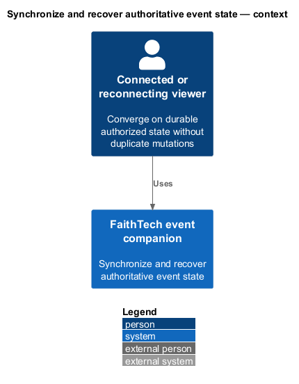
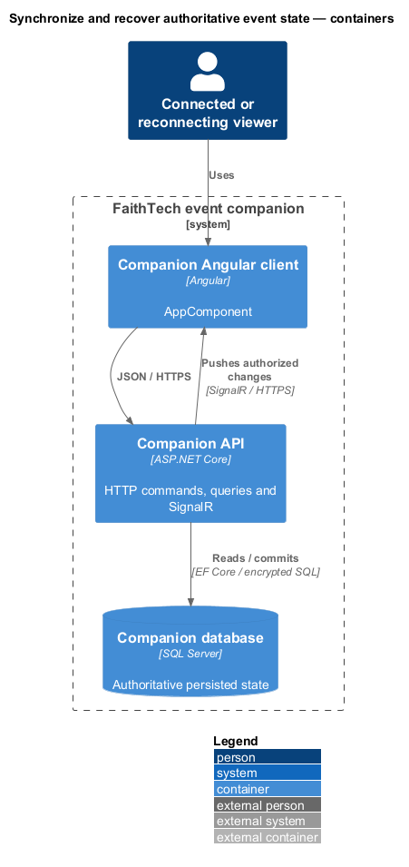
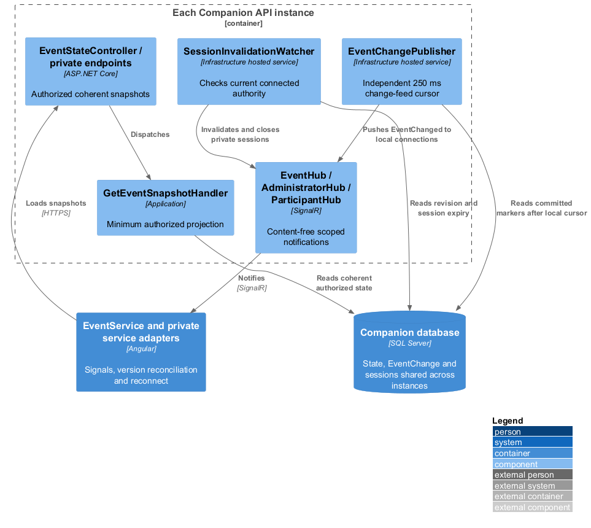
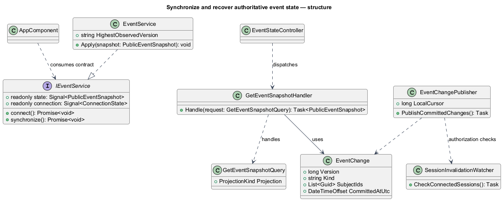
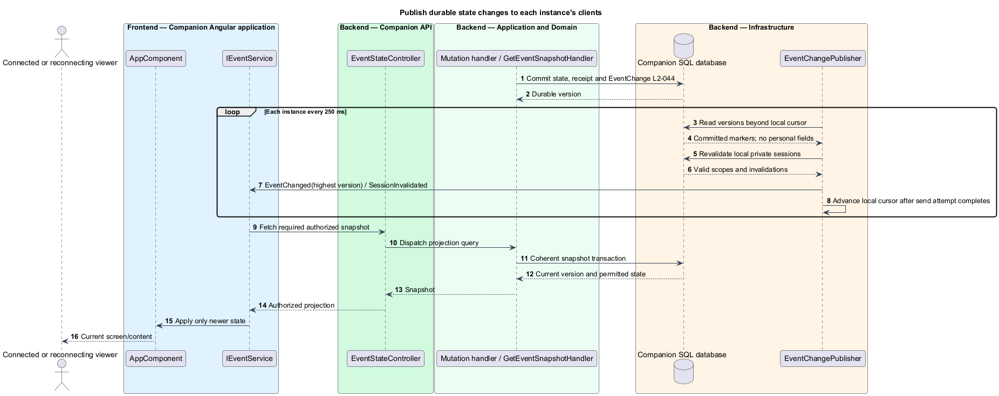
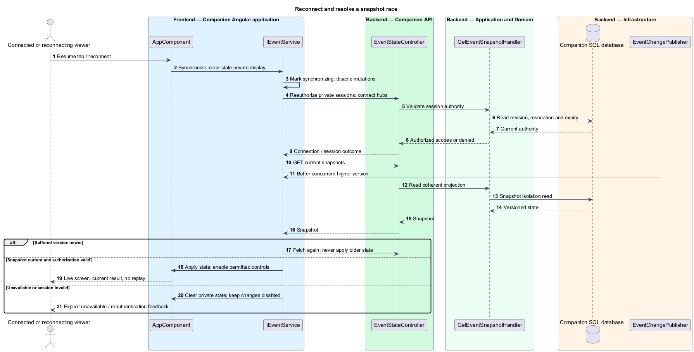
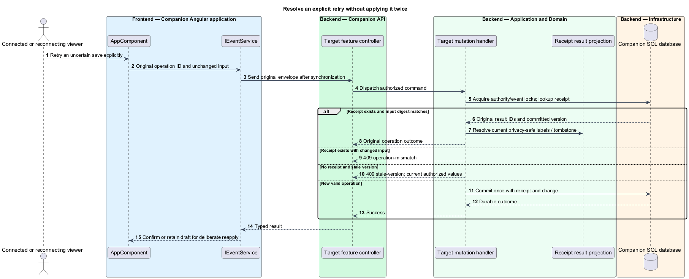

# Synchronize and recover authoritative event state

## Overview

Authoritative state is the committed SQL representation of the event. SignalR notifies connected browsers when that state changes; authorized snapshots reconstruct the current view. Operation receipts distinguish an explicit retry from a new mutation.

## Description

Proposed `EventService` implements `IEventService` / `EVENT_SERVICE`, holds readonly signals, and coordinates three scoped SignalR connections with the session/profile adapters. Public `EventHub` is anonymous; `AdministratorHub` and `ParticipantHub` authenticate their respective cookies. Hubs expose notifications only, no arbitrary JoinGroup or mutation methods. Each connection is registered with its server-derived authorization scope. Private invalidation notifications contain no personal data; the authorized HTTP snapshot supplies private fields.

Every mutation saves an `EventChange` marker in its transaction. `EventChangePublisher` is an Infrastructure hosted service using scoped EF access and IHubContext. Every instance reads markers newer than its own in-memory cursor every 250 ms, batches adjacent notifications to the highest version, and sends only to that instance's local connections. An instance advances its cursor after send attempts complete; failure retains work for retry, whose duplicates are harmless. On process start it captures the latest version before accepting subscriptions; new connections obtain a snapshot. Existing instances consume all later records independently, so no Redis or external backplane is required for this bounded deployment. This custom SQL change feed is a proposed application mechanism, not a claim of built-in SQL Server support in ASP.NET Core SignalR.

An independent `SessionInvalidationWatcher` checks connected session IDs and credential revision in a batched SQL query every 250 ms. It removes invalid subscriptions, sends SessionInvalidated, and aborts the private connection. Private sends recheck validity; payloads carry no roster secrets even during the race. Every HTTP read/command independently validates authority. No cached principal, group membership, or delayed notification bypasses server checks.

The client subscribes before snapshot capture and buffers the largest notified version. A coherent SQL SNAPSHOT-isolation read returns the whole permitted projection and version. SNAPSHOT isolation is enabled during fresh schema setup. After applying a snapshot, if HighestObservedVersion is greater, the adapter fetches again; older or duplicate results are discarded. Version jumps are expected under notification coalescing. Serialized bigint strings compare numerically via BigInt. A private invalidation clears that projection regardless of event version, preventing suppression by an unrelated version comparison.

On confirmed transport failure, the adapter immediately marks disconnected, disables changing controls, and shows an explanation (within the specified ten seconds). It does not silently enqueue mutations. SignalR reconnect delays use 0, 2, 5, and 10 seconds, then remain visibly disconnected with an explicit Retry action. Successful transport reconnection is not yet readiness: session authorization and snapshots finish before controls re-enable. Page resume/history restoration clears private rendered state until that process succeeds. A browser suspended across a draw displays the current saved winner without replay.

An uncertain HTTP result retains the original operation ID/input for an explicit retry after synchronization. On retry the server authorizes first, uses a keyed HMAC digest of canonical command input, and looks up a receipt before version checking. Changed payload fails; already-committed receipts resolve current privacy-safe results. A command that never committed may conflict after other changes and requires explicit reapply. No secret or private payload is copied into EventChange or receipt result JSON.

Rows remain for the duration of this event and its recovery verification; snapshots make indefinite per-client delivery history unnecessary. Event snapshots, rows, and receipts survive API restarts. The design target is under two seconds from commit to connected rendering, measured end to end; the 250 ms scan interval alone is not proof of meeting that target. The deployment load scenario includes a two-instance run to verify independent notification cursors and shared budgets.

Commands and queries use the [shared architecture and protocol](../../README.md#shared-architecture-and-protocol). The following acceptance scenarios are design obligations, not executed test evidence.

- Given reordered notifications and a snapshot racing a commit, when applied, then the client converges on the newest version without regression.
- Given a crash after commit before notification, when a publisher resumes, then the change is still observable and no acknowledged write is lost.
- Given a revoked session, when a delayed event arrives, then no private snapshot is fetched under stale authority.
- Given lost responses and retries, when replayed explicitly, then original committed outcomes return and changed inputs fail.

## Requirements

The source text below is reproduced verbatim, including its original obligation wording.

| L2 ID | Refines (L1) | Requirement |
|---|---|---|
| [L2-044](../../../specs/L2.md#l2-044-signalr-synchronization-persistence-and-conflicts) | L1-014 | SignalR must deliver screen changes, roster-derived public changes, private administrator roster changes, project edits, team updates, draws, and session invalidation to authorized connected clients. HTTP can load snapshots and submit commands, but polling alone does not satisfy realtime delivery. State must be durable before success/broadcast. Snapshots and events must carry ordering/version information so duplicate/out-of-order messages cannot regress state. Reconnect/resume must reauthorize and obtain a current snapshot. Show connection loss within ten seconds of a confirmed transport failure; while disconnected/synchronizing, disable server-changing controls and never claim fresh authority. Do not queue mutations for silent replay.  All mutations must reject stale conflicting versions. Retries retain operation identity and input, and return the original saved outcome after authorization without applying it again; changed input under that identity fails. Rejected edits retain drafts for explicit reapply, except privacy/session invalidation and the participant draft closure rule in L2-013. Initial-entry retries must retain an unguessable pre-submission operation receipt scoped to the creating browser so a lost response can recover that entry without letting knowledge of an email claim it. The receipt is a private session credential under L2-041, not a user-entered code. |
| [L2-043](../../../specs/L2.md#l2-043-measurable-live-event-performance) | L1-014 | The baseline must support 200 simultaneous SignalR viewers and two administrators. After two minutes of warm-up, measure for ten minutes on a recorded reference deployment with real API/persistence: each viewer reads state once per 30 seconds; administrators perform one valid roster/project/team mutation every ten seconds, the three screen advances, and three sequential raffle draws. Seed sufficient synthetic participants before measurement. Record deployment resources, browser/OS, network conditions, raw API timings, update receipt/render timings, and dropped connections. This baseline retains headroom above the run sheet's 13 registrants plus four organizers without requiring invented attendees in production. |
| [L2-039](../../../specs/L2.md#l2-039-public-and-private-data-boundaries) | L1-013 | Public HTTP/SignalR responses must contain only event copy, projects, team public labels/memberships, and public raffle state. Participant email and optional answers are visible only to that participant's valid entry session and administrators. Full roster access is administrator-only; administrator capability must not be inferred from public group membership. Name/public-label display must be explained before entry/profile save. Public responses must exclude passcodes, verifiers, session identifiers, and internal failure details. |

## Diagrams

The context identifies the actor and the capability within the companion.

The container view distinguishes browser or operator execution from durable server state.

The component view scopes the named building blocks to this feature.

The class view shows the proposed contract, request, state, and dependencies.

Every instance observes the committed feed independently and SignalR carries the browser notification.

Subscription precedes snapshot reconciliation; transport reconnection alone does not re-enable mutations.

Receipt lookup follows authorization but precedes stale-version rejection.

