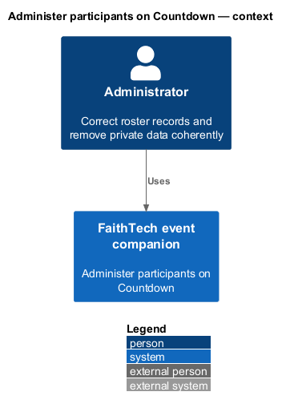
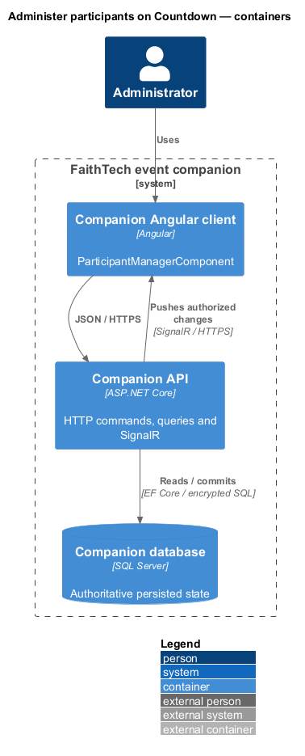
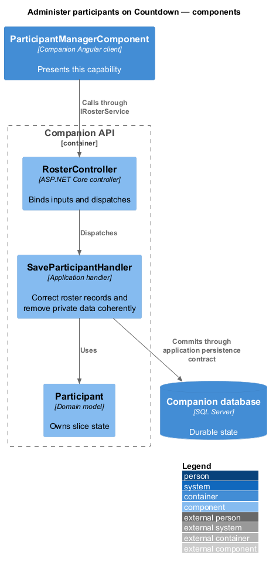
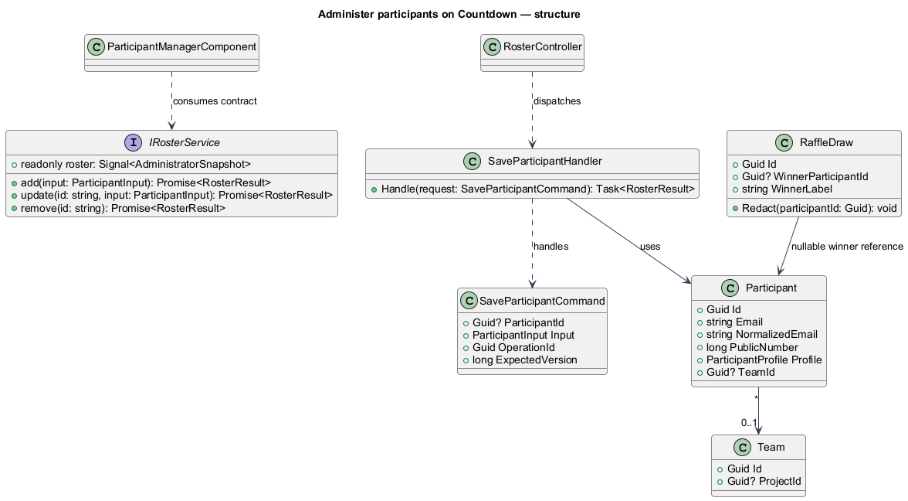
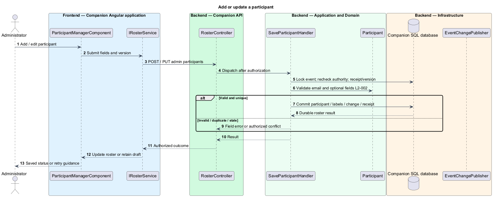
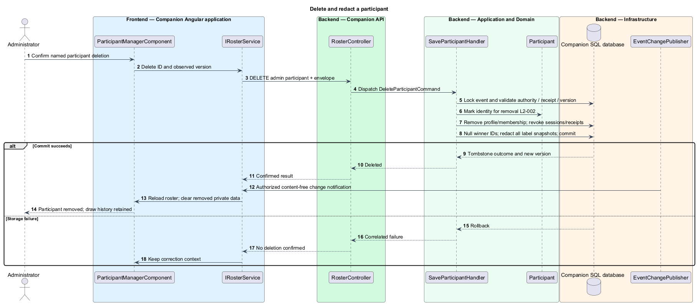

# Administer participants on Countdown

## Overview

The administrator roster is a private view of all current entrants, their optional details, team membership, and raffle status. It appears within Countdown, including when an administrator revisits that screen after the public event advances. Administrator additions do not require a participant browser.

## Description

The mock's `ParticipantManagerComponent` supplies search, table composition, and add/edit/delete dialogs. Production uses `IRosterService` / `ROSTER_SERVICE` with `RosterService`; the existing service/controller names remain, but registration-code and deactivate/reactivate contracts are replaced. Proposed `SaveParticipantHandler` and `DeleteParticipantHandler` dispatch through `IRosterStore` implemented for `CompanionDbContext`.

`GET /api/admin/participants` returns the full authorized roster. `POST /api/admin/participants`, `PUT /api/admin/participants/{id}`, and `DELETE /api/admin/participants/{id}` take operation identity and expected event version; DELETE uses a JSON command body. Add requires only a valid unique email, assigns a new public label, creates no owner session, and is immediately raffle-eligible. After teams form, add leaves TeamId null. Update preserves stable ID, membership, and prior-win exclusion, while checking normalized-email uniqueness and all scalar limits.

Delete opens a Cornerstone confirmation naming the participant and explaining membership removal, session revocation, and raffle-history redaction. Its transaction deletes Participant/profile, nulls winner references, replaces all matching retained candidate/winner snapshots with “Removed participant”, removes or sanitizes receipt data containing personal fields, and revokes session/recovery records. Team containers and other members remain. Audit records retain only nonsecret stable subject ID and outcome. No completed draw is reversed. Re-entering that email through admin add creates a new identity.

The event lock serializes deletion with grouping and drawing. A public/private snapshot is always built from current authorized state, so replayed receipts cannot resurrect removed fields. Search stays client-side over the authorized roster at this event size; no search term containing email is placed in URLs or logs. Save errors retain drafts, cancellation is local, and session invalidation clears all private roster data.

Commands and queries use the [shared architecture and protocol](../../README.md#shared-architecture-and-protocol). The following acceptance scenarios are design obligations, not executed test evidence.

- Given update of a prior winner, when email/name changes, then stable identity and win exclusion remain.
- Given deletion racing with a draw, when serialized, then it either excludes the entrant first or redacts the saved result afterward.
- Given late admin addition, when teams already exist, then the participant is eligible and unassigned.
- Given a cancelled confirmation or failed transaction, when reread, then no partial deletion appears.

## Requirements

The source text below is reproduced verbatim, including its original obligation wording.

| L2 ID | Refines (L1) | Requirement |
|---|---|---|
| [L2-002](../../../specs/L2.md#l2-002-manage-participants-on-countdown) | L1-001 | Countdown must expose an administrator-only roster with email, name/public label, optional answers, team, and raffle status, plus inline add/edit/delete controls. Add requires a unique valid email and immediately enters that participant into the raffle. Updates preserve stable participant identity. Delete requires confirmation, removes personal data and membership, revokes the entry session, and excludes that participant from future grouping/draws. A completed draw retains its nonpersonal draw ID/time and a “Removed participant” result in place of deleted personal labels. Delete does not undo the draw or trigger a new one. |
| [L2-039](../../../specs/L2.md#l2-039-public-and-private-data-boundaries) | L1-013 | Public HTTP/SignalR responses must contain only event copy, projects, team public labels/memberships, and public raffle state. Participant email and optional answers are visible only to that participant's valid entry session and administrators. Full roster access is administrator-only; administrator capability must not be inferred from public group membership. Name/public-label display must be explained before entry/profile save. Public responses must exclude passcodes, verifiers, session identifiers, and internal failure details. |
| [L2-040](../../../specs/L2.md#l2-040-validate-text-emails-and-links) | L1-013 | The server must validate all inputs. Email is required, at most 254 characters, with one nonempty local part and domain separated by @, no whitespace/control characters, and a syntactically valid domain; plus-tags and subdomains are accepted. Optional name and required project title are limited to 200 characters; each optional answer and required project description to 2,000; optional repository/demo URLs to 2,048. Text is trimmed and line endings normalized to LF; limits count Unicode scalar values. Optional blank values clear a field. All free text is rendered literally, never executable HTML. URLs must be absolute HTTPS without embedded credentials. The API must never fetch submitted project URLs. No file upload feature is required. |
| [L2-044](../../../specs/L2.md#l2-044-signalr-synchronization-persistence-and-conflicts) | L1-014 | SignalR must deliver screen changes, roster-derived public changes, private administrator roster changes, project edits, team updates, draws, and session invalidation to authorized connected clients. HTTP can load snapshots and submit commands, but polling alone does not satisfy realtime delivery. State must be durable before success/broadcast. Snapshots and events must carry ordering/version information so duplicate/out-of-order messages cannot regress state. Reconnect/resume must reauthorize and obtain a current snapshot. Show connection loss within ten seconds of a confirmed transport failure; while disconnected/synchronizing, disable server-changing controls and never claim fresh authority. Do not queue mutations for silent replay.  All mutations must reject stale conflicting versions. Retries retain operation identity and input, and return the original saved outcome after authorization without applying it again; changed input under that identity fails. Rejected edits retain drafts for explicit reapply, except privacy/session invalidation and the participant draft closure rule in L2-013. Initial-entry retries must retain an unguessable pre-submission operation receipt scoped to the creating browser so a lost response can recover that entry without letting knowledge of an email claim it. The receipt is a private session credential under L2-041, not a user-entered code. |

## Diagrams

The context identifies the actor and the capability within the companion.

The container view distinguishes browser or operator execution from durable server state.

The component view scopes the named building blocks to this feature.

The class view shows the proposed contract, request, state, and dependencies.

Administrator corrections retain identity and validate uniqueness inside the event transaction.

Personal-data removal and retained raffle-history redaction commit together.

