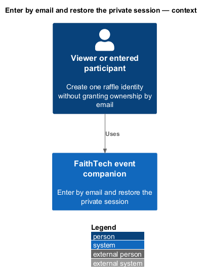
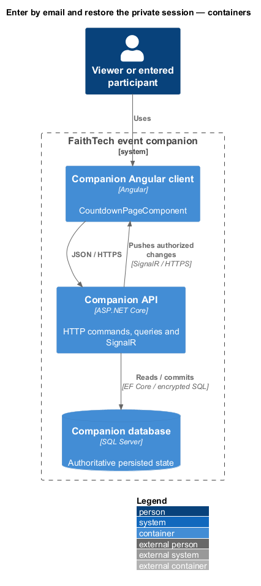
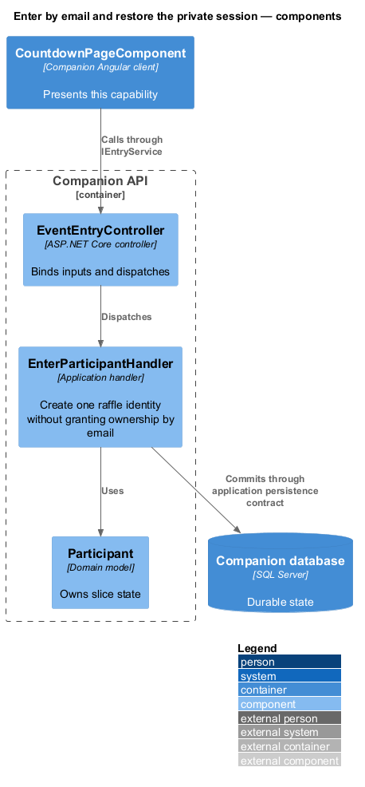
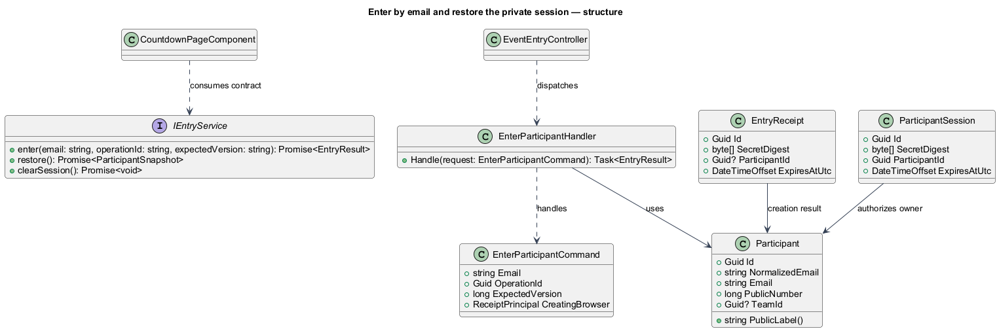
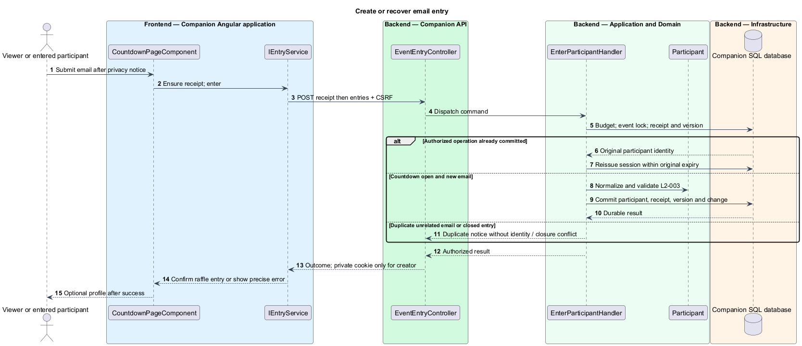
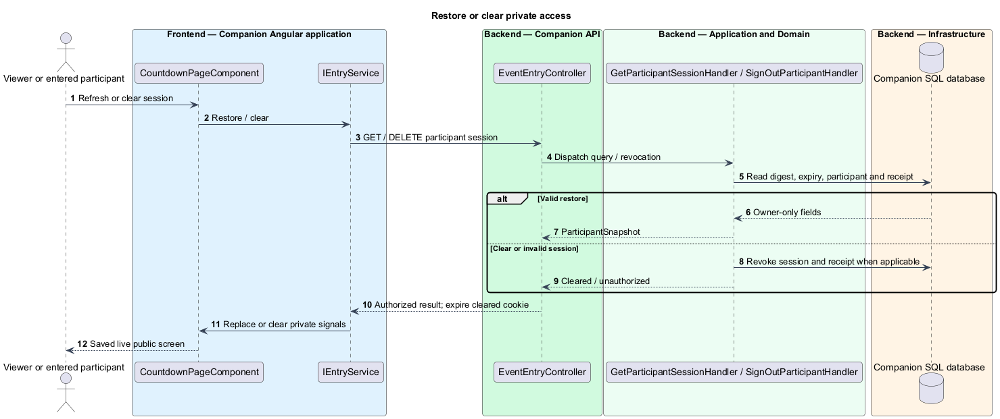

# Enter by email and restore the private session

## Overview

An entry is a durable participant identity that also supplies one raffle chance. An entry session is a private browser credential authorizing only that participant's optional details. Email identifies a roster record but does not prove ownership. Countdown offers entry until the presenter closes it.

## Description

The approved `CountdownPageComponent` supplies the email form, privacy notice, confirmation, and profile invitation. Proposed `IEntryService` / `ENTRY_SERVICE` and HTTP adapter `EntryService` replace mock ownership. Existing `EventEntryController` is repurposed for `EnterParticipantCommand`, `EnterParticipantValidator`, and `EnterParticipantHandler`; individual-code authentication is superseded.

`POST /api/participant/entry-receipt` establishes a 256-bit random Secure/HttpOnly/SameSite=Strict receipt cookie before submission, scoped to `/api/participant`. Its response contains a nonsecret operation ID. Bootstrap requests recover the same outstanding operation after refresh for eight hours. `POST /api/participant/entries` accepts email and the command envelope using that receipt, CSRF validation, and the public submission budget. This endpoint requires no prior participant identity.

`IEntryStore` / `SqlEntryStore` lock the singleton event row, check receipt replay before expected version, and reject creation after closure. Invariant full-address normalization plus a unique index prevents duplicates. Successful creation atomically saves Participant, monotonic public label, receipt binding, version, and change. Participant existence supplies raffle eligibility; no separate raffle-entry table is needed.

After commit, a separate 256-bit participant cookie is issued. A lost response is recovered only by the creating receipt; recovery issues a replacement session and revokes any earlier session for that receipt. Expiry remains eight hours from original entry. An unrelated receipt receives `already-entered` and “This email is already entered; ask an administrator to update your details”, without label, private fields, or ownership. Secrets persist only as digests in SQL and cookies in the browser.

`GET /api/participant/session` restores only the owner profile while the route follows the live event. `DELETE /api/participant/session` revokes both session and recovery receipt, expires cookies, and clears private signals/drafts without deleting the raffle identity. Expired or deleted identities cannot be recovered through old receipts. A storage failure never displays raffle confirmation.

Commands and queries use the [shared architecture and protocol](../../README.md#shared-architecture-and-protocol). The following acceptance scenarios are design obligations, not executed test evidence.

- Given simultaneous normalized-email duplicates, when committed, then one participant exists and only the creating receipt recovers ownership.
- Given creation races with closure, when serialized, then only pre-closure entry succeeds.
- Given clear, expiry, deletion, or history restoration, when private state is read, then authorization is checked and private fields are cleared as appropriate.

## Requirements

The source text below is reproduced verbatim, including its original obligation wording.

| L2 ID | Refines (L1) | Requirement |
|---|---|---|
| [L2-003](../../../specs/L2.md#l2-003-email-entry-and-raffle-confirmation) | L1-002 | Public entry on Countdown must require only a syntactically valid email. Trim surrounding whitespace and compare the full address case-insensitively; do not remove dots or plus-tags. One normalized email must create at most one roster identity and one raffle entry. Saving optional details is a separate action after entry. Each participant must receive a stable public label such as “Participant 014”; a supplied name is displayed with that label to distinguish duplicate names without exposing email. |
| [L2-004](../../../specs/L2.md#l2-004-private-entry-continuity) | L1-002 | A successful new entry must establish an unguessable private browser session lasting eight hours from creation. It authorizes only that participant's saved optional information and own public label. Refresh retains entry; another browser's email submission does not recover it. A “Clear my session” action must revoke the session and clear private client state without deleting raffle entry. Lost/expired entry sessions use administrator-assisted corrections, not email-based profile recovery. |
| [L2-044](../../../specs/L2.md#l2-044-signalr-synchronization-persistence-and-conflicts) | L1-014 | SignalR must deliver screen changes, roster-derived public changes, private administrator roster changes, project edits, team updates, draws, and session invalidation to authorized connected clients. HTTP can load snapshots and submit commands, but polling alone does not satisfy realtime delivery. State must be durable before success/broadcast. Snapshots and events must carry ordering/version information so duplicate/out-of-order messages cannot regress state. Reconnect/resume must reauthorize and obtain a current snapshot. Show connection loss within ten seconds of a confirmed transport failure; while disconnected/synchronizing, disable server-changing controls and never claim fresh authority. Do not queue mutations for silent replay.  All mutations must reject stale conflicting versions. Retries retain operation identity and input, and return the original saved outcome after authorization without applying it again; changed input under that identity fails. Rejected edits retain drafts for explicit reapply, except privacy/session invalidation and the participant draft closure rule in L2-013. Initial-entry retries must retain an unguessable pre-submission operation receipt scoped to the creating browser so a lost response can recover that entry without letting knowledge of an email claim it. The receipt is a private session credential under L2-041, not a user-entered code. |
| [L2-041](../../../specs/L2.md#l2-041-protect-credentials-and-browser-sessions) | L1-013 | Production must use HTTPS and Secure, HttpOnly, SameSite cookies for private entry/admin sessions, with server-side revocation and cross-site request protection. Session credentials must have at least 128 bits of cryptographic randomness. Passcodes and session secrets must not appear in URLs, logs, analytics, or script-readable persistent storage. Store the four-digit passcode as a salted nonrecoverable verifier; protect database/backups and the verifier from public reads. The short passcode has only 10,000 possible values, so rate limits and restricted verifier access remain required; hashing does not make it a high-entropy password. Direct database replacement must support this storage format without requiring the operator to use the CLI. |

## Diagrams

The context identifies the actor and the capability within the companion.

The container view distinguishes browser or operator execution from durable server state.

The component view scopes the named building blocks to this feature.

The class view shows the proposed contract, request, state, and dependencies.

The pre-submission receipt distinguishes an authorized retry from unrelated knowledge of an email.

Clearing a session revokes its recovery receipt while retaining the participant's raffle entry.

