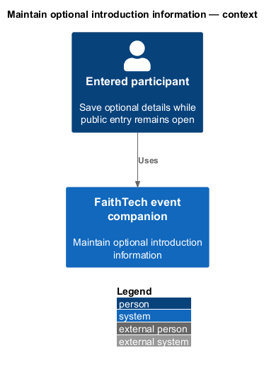
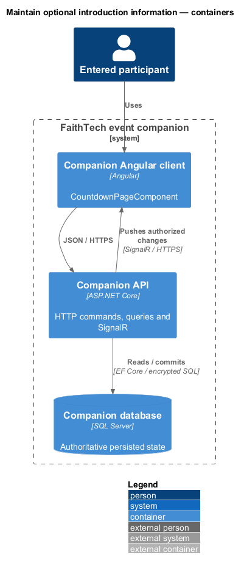
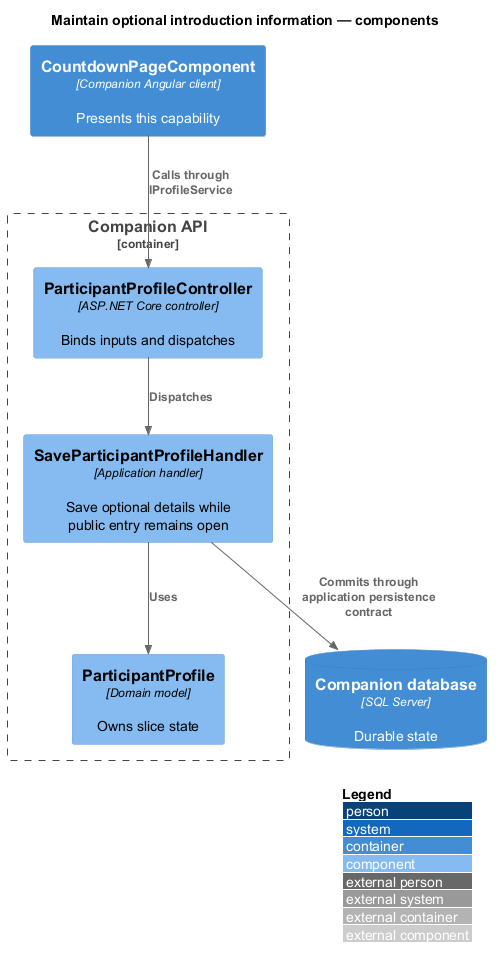
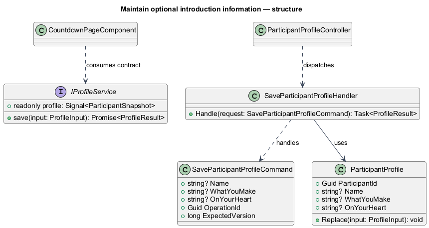
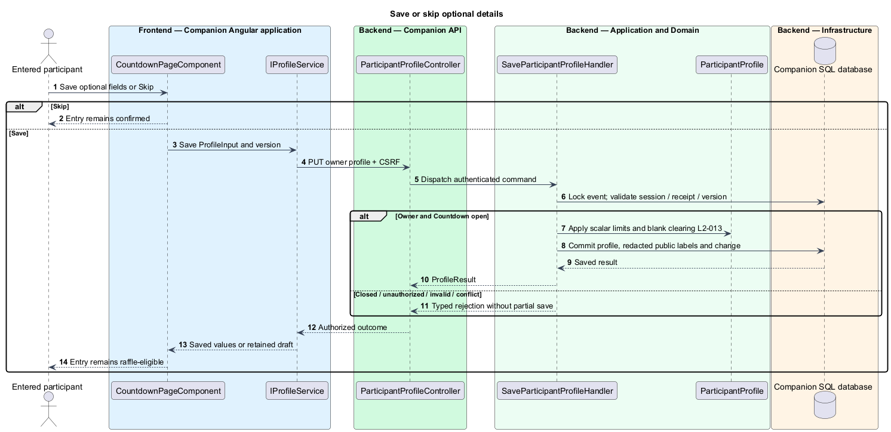
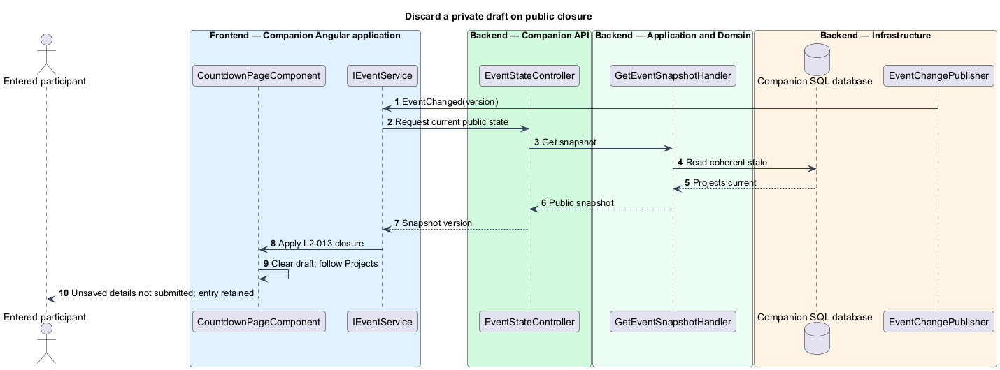

# Maintain optional introduction information

## Overview

An introduction is an optional name and two answers offered after email entry. Saving or skipping it does not affect raffle odds or grouping. The name accompanies a public label on teams and draws; email and answers remain owner/admin information.

## Description

The approved Countdown profile form retains Save and Skip actions and explains visibility before editing. Proposed `IProfileService` / `PROFILE_SERVICE`, implemented by `ProfileService`, expose owner-only signals. `ParticipantProfileController` dispatches `GetParticipantProfileQuery` and `SaveParticipantProfileCommand`. `SaveParticipantProfileHandler` derives identity from the participant session; the route never accepts a target participant ID.

`GET /api/participant/profile` returns saved optional fields and event version. `PUT /api/participant/profile` accepts name, whatYouMake, onYourHeart, and the operation envelope. The handler locks event state, rechecks the session and Countdown stage, validates Unicode scalar lengths and trimmed values, and commits all fields atomically. Empty optional values become null; profile data is held on the Participant row, with `ParticipantProfile` a domain value object. Name is at most 200 scalars and each answer at most 2,000. Rendered text uses interpolation, never HTML injection.

Skip changes only the local form state. Ordinary validation/storage/conflict errors retain the draft and explicitly preserve the successful raffle entry. Public Countdown closure discards the unsaved draft, follows Projects, and announces that unsaved details were not submitted. A closure racing with save uses the shared event lock: save before closure persists, save afterward is denied. Admin corrections use the roster feature after closure. A saved-name change also rewrites that participant's retained draw/candidate labels through the same privacy projection policy; email/answers never enter public notifications.

Commands and queries use the [shared architecture and protocol](../../README.md#shared-architecture-and-protocol). The following acceptance scenarios are design obligations, not executed test evidence.

- Given any subset of optional fields or Skip, when submitted, then entry and odds stay unchanged.
- Given a draft races with closure, when the transition arrives, then uncommitted details are discarded with notice and the participant follows Projects.
- Given another participant supplies a target identity, when private access is attempted, then it grants no additional authority.

## Requirements

The source text below is reproduced verbatim, including its original obligation wording.

| L2 ID | Refines (L1) | Requirement |
|---|---|---|
| [L2-013](../../../specs/L2.md#l2-013-optional-introduction-information) | L1-006 | After successful email entry on Countdown, the participant must be offered optional Name, “What you make”, and “What's on your heart” fields with Save and Skip actions. A short notice must explain that a name/public label appears on teams and raffle results, while email and the two answers are visible only to the participant's authorized entry session and administrators. Saving answers does not change raffle odds or grouping. The owner can edit while Countdown remains public; after closure, corrections are administrator-only. |
| [L2-039](../../../specs/L2.md#l2-039-public-and-private-data-boundaries) | L1-013 | Public HTTP/SignalR responses must contain only event copy, projects, team public labels/memberships, and public raffle state. Participant email and optional answers are visible only to that participant's valid entry session and administrators. Full roster access is administrator-only; administrator capability must not be inferred from public group membership. Name/public-label display must be explained before entry/profile save. Public responses must exclude passcodes, verifiers, session identifiers, and internal failure details. |
| [L2-040](../../../specs/L2.md#l2-040-validate-text-emails-and-links) | L1-013 | The server must validate all inputs. Email is required, at most 254 characters, with one nonempty local part and domain separated by @, no whitespace/control characters, and a syntactically valid domain; plus-tags and subdomains are accepted. Optional name and required project title are limited to 200 characters; each optional answer and required project description to 2,000; optional repository/demo URLs to 2,048. Text is trimmed and line endings normalized to LF; limits count Unicode scalar values. Optional blank values clear a field. All free text is rendered literally, never executable HTML. URLs must be absolute HTTPS without embedded credentials. The API must never fetch submitted project URLs. No file upload feature is required. |

## Diagrams

The context identifies the actor and the capability within the companion.

The container view distinguishes browser or operator execution from durable server state.

The component view scopes the named building blocks to this feature.

The class view shows the proposed contract, request, state, and dependencies.

The server derives ownership and serializes profile saving with Countdown closure.

An authoritative closure changes the route and clears only unsubmitted information.

