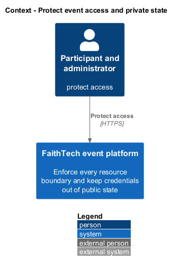
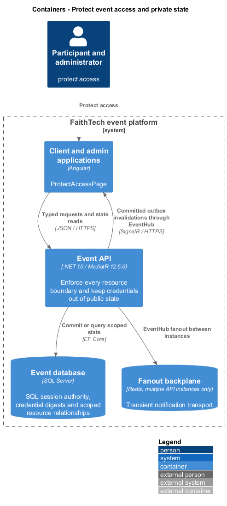
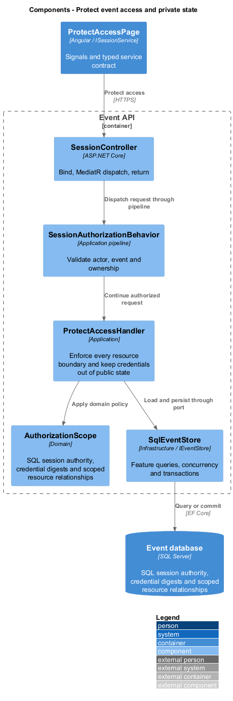
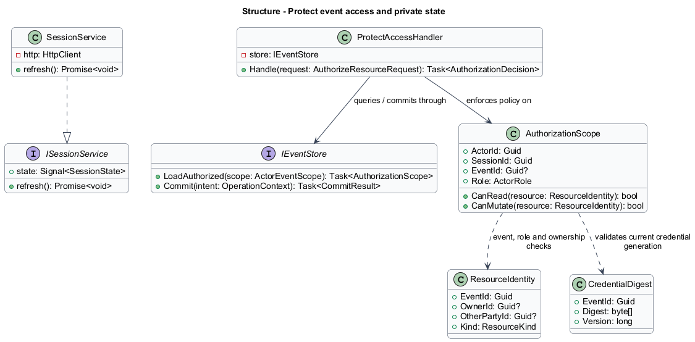
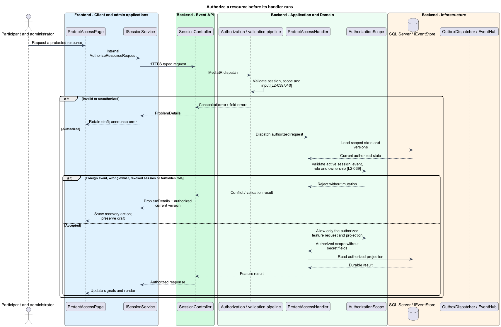
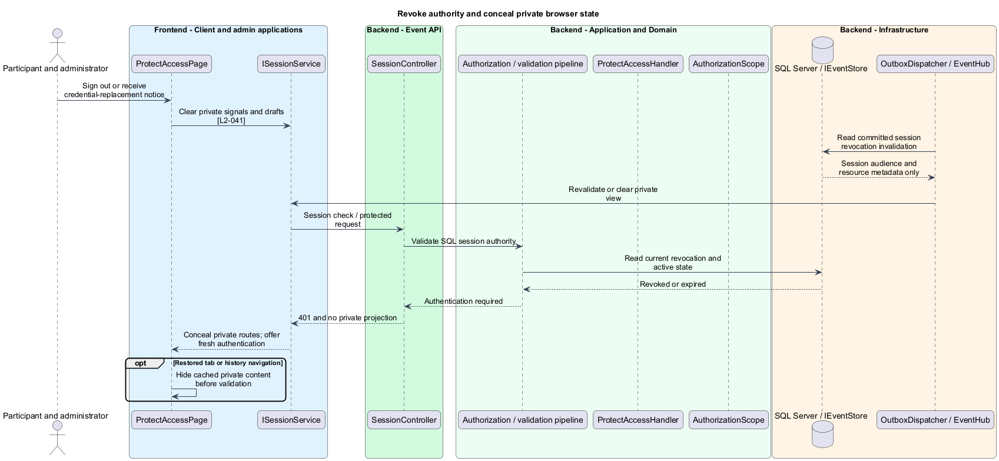

# Protect event access and private state

## Overview

Authorization decides which authenticated actor may read or change a resource. Event scope and ownership are checked at the API boundary for every request. Browser guards improve presentation but do not replace those checks.

## Description

This proposed cross-cutting slice adds no product page or general authorization endpoint. `ProtectAccessPage` represents existing guarded routes. `SessionController` supplies the session query described in access designs. `SessionAuthorizationBehavior` runs before every protected feature handler; `ProtectAccessHandler` is the internal resource-policy evaluator shown in the diagrams. Its `AuthorizeResourceRequest` is an application value passed directly by the behavior, avoiding recursive MediatR dispatch.

The evaluator loads authoritative session, registration, and target relationships through scoped infrastructure queries. Participant reads/mutations require the target event to match the validated event session. Profile writes require owner identity; team/build writes require current membership; answer writes derive the participant from the session. Conversation access compares event and both parties. Report creation requires received-message ownership. Administrator report reads expose only the reported snapshot. Administrator role applies to all events in this deployment but grants no ordinary chat-history browsing API.

Opaque IDs and foreign keys do not imply permission. SQL queries include event/owner predicates before projection; child IDs are checked against their parent resource. Inaccessible identities return generic unavailable responses rather than another person's name, email, or ownership information. Public participant DTOs exclude emails, codes, credential digests, session material, and private profile/report fields.

`EntryCredential` uses at least 128 random bits and stores a keyed one-way digest. Issuance reveals the secret once; replacement revokes prior credentials and sessions transactionally. Cookie tickets reference SQL session authority and use Secure, HttpOnly, SameSite attributes and event/admin API paths. ASP.NET Data Protection keys persist in protected shared operator storage so authorized sessions survive process restart. HTTPS terminates only at the trusted hosting boundary; forwarding headers are accepted only from configured proxies.

Unsafe cookie-authenticated requests validate same-origin antiforgery tokens supplied in a header. Missing/invalid tokens fail before mutation. Credential endpoints also use anonymous antiforgery issuance to prevent login CSRF. The antiforgery secret is held in memory, never in URLs or persistent browser storage. Credential request/response bodies, cookies, and sensitive headers are excluded from diagnostics and analytics.

`EventHub` derives event/private groups from the validated session and checks every invocation. Revocation produces a private invalidation and invalidates further API reads immediately. Messages contain no sensitive payload; an old connected group receives at most invalidation metadata and cannot fetch private state after revocation. On known expiry, sign-out, revocation, pageshow, or history restore, the client clears or conceals private signals and drafts before further display. Private responses use no-store caching.

Acceptance checks attempt direct foreign-ID reads/mutations across every resource type, bypass browser guards, spoof owner fields, invoke hub groups, omit CSRF headers, and replay receipts after deactivation. Browser checks inspect URL/storage/cache behavior, old tabs, back navigation, and private-state clearing. These behavioral checks verify boundaries without source-scanning architecture tests.

## Requirements

The following verbatim primary excerpts link to their complete normative definitions and Given–When–Then acceptance criteria. Shared constraints apply as specified in the [architecture contracts](../../README.md).

| L2 ID | Refines (L1) | Requirement excerpt |
|---|---|---|
| [L2-039](../../../specs/L2.md#l2-039-event-and-ownership-boundaries) | `L1-013` | Every server operation must validate the requester's event membership and resource ownership, independent of client routing. Profiles, messages, submissions, credentials, and moderation reports must expose only the fields authorized for that actor. Admin event management authority must not grant ordinary browsing of unreported private conversations. |
| [L2-041](../../../specs/L2.md#l2-041-credentials-transport-and-private-state) | `L1-013` | Production traffic must use HTTPS. Entry codes must be generated with at least 128 bits of cryptographic entropy, stored as nonrecoverable verifiers, and revealed only on issuance/replacement to administrators. Authentication secrets must not enter URLs, analytics, application logs, or browser local storage. Authenticated state changes must reject forged cross-site requests, and sign-out must remove displayed private state. |

## Diagrams

Participant and administrator uses the event platform to protect access. The context isolates this capability from unrelated event activities.

The Client and admin applications calls the API for authoritative state. SQL Server retains sql session authority, credential digests and scoped resource relationships; SignalR invalidations prompt authorized reads.

`SessionController` dispatches through the application pipeline. `ProtectAccessHandler` owns the feature policy and uses the persistence port.

`AuthorizationScope` carries stable identity and feature state. The service interface separates Angular consumers from HTTP; `IEventStore` represents the application persistence boundary. Method shapes are slice-specific views of the shared contracts.

Authorize a resource before its handler runs applies validate active session, event, role and ownership [l2-039]. Foreign event, wrong owner, revoked session or forbidden role leaves committed state unchanged; the client retains enough context to recover.

SQL revocation takes effect on every subsequent request. Connected and restored browsers clear or conceal private views before another authorized projection is shown.

