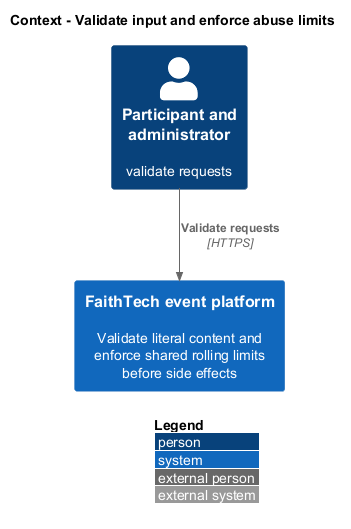
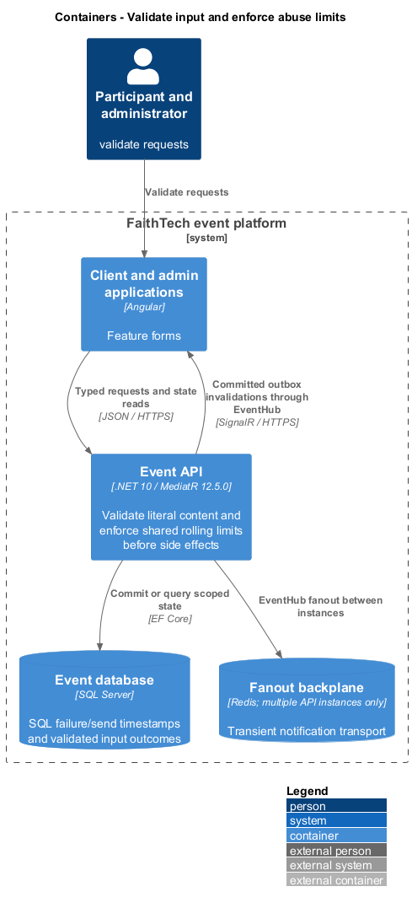
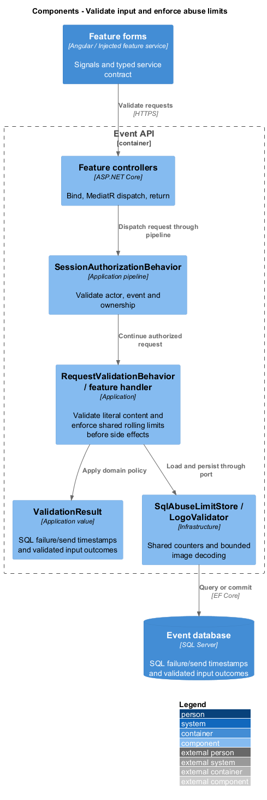
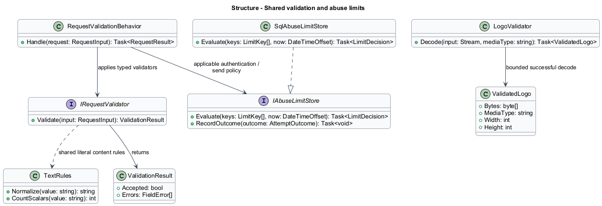
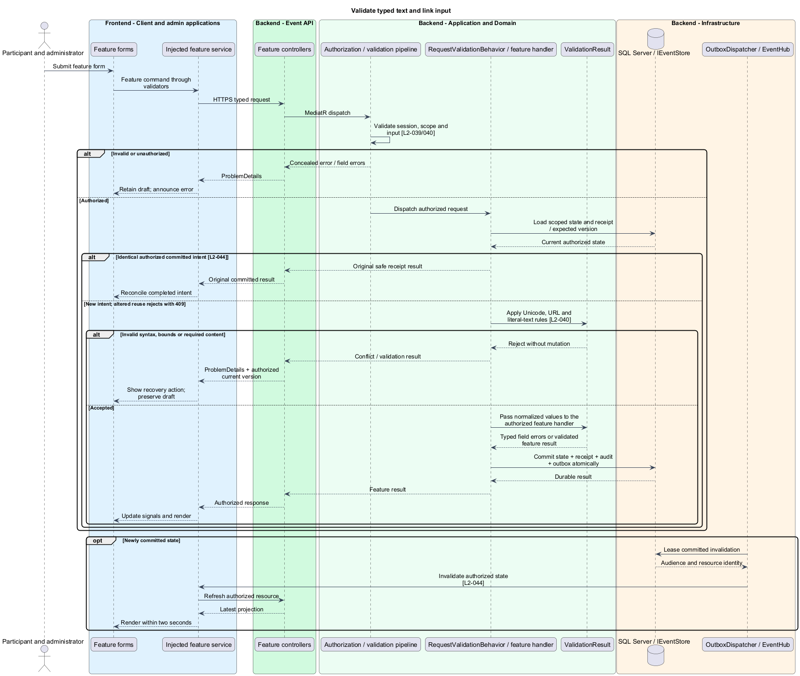
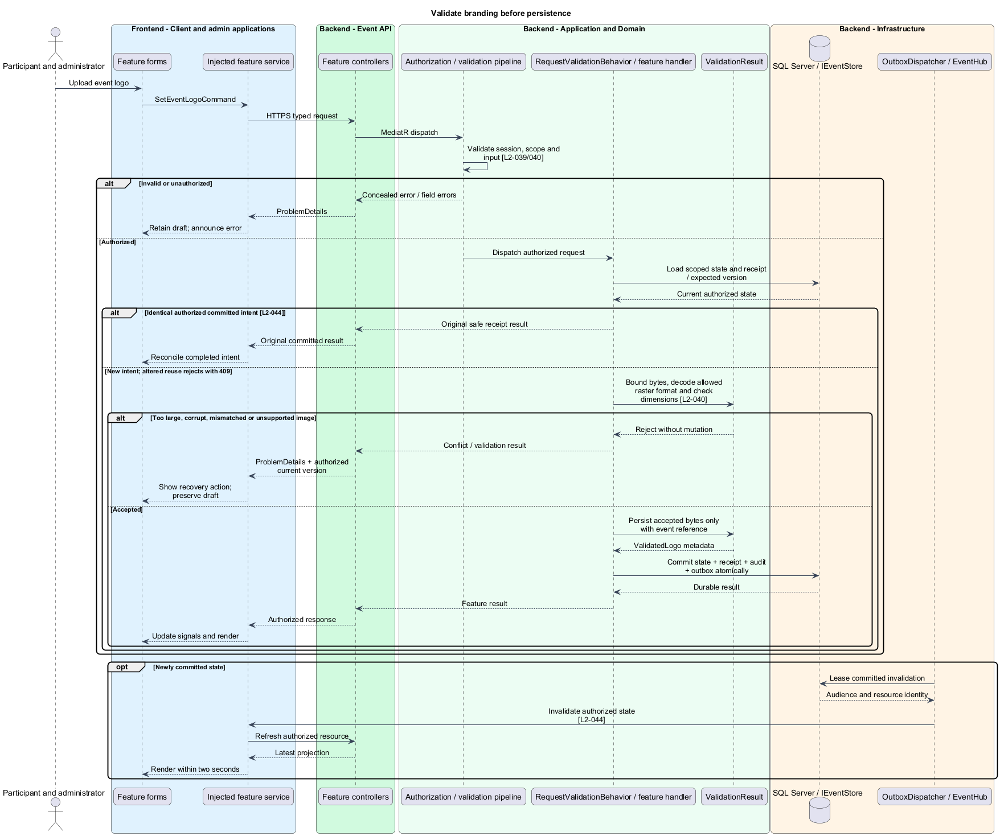
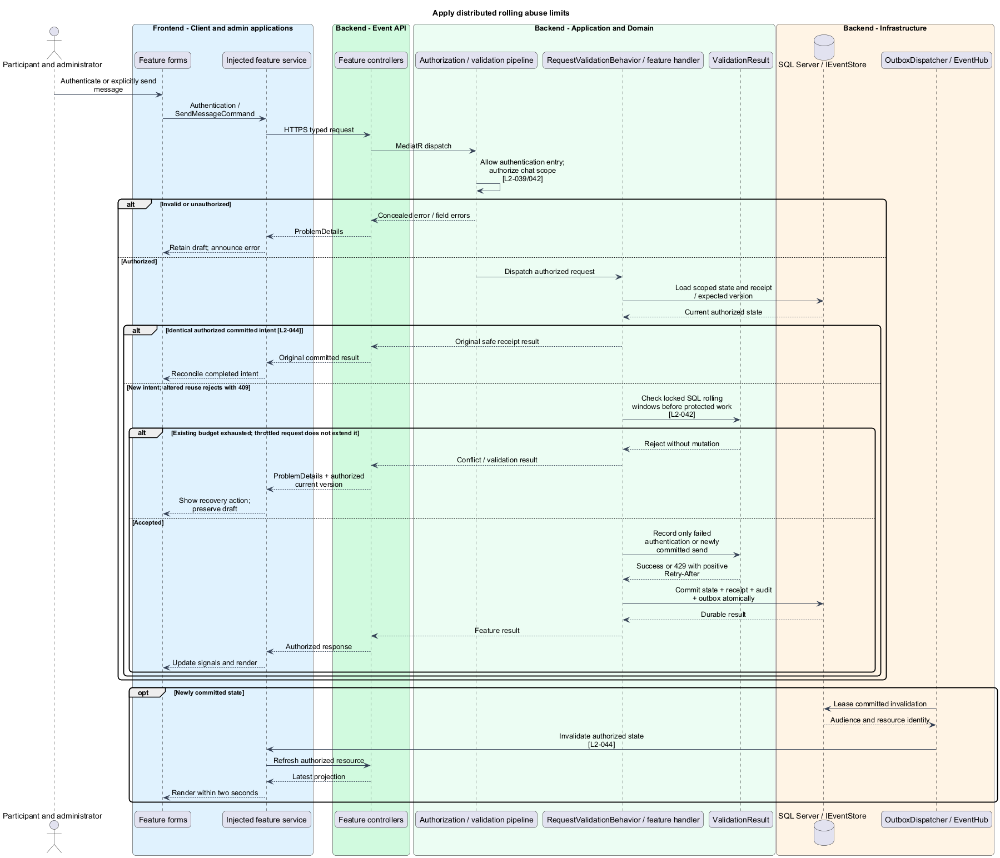

# Validate input and enforce abuse limits

## Overview

Validation prevents malformed content from becoming durable state. Abuse limits bound failed authentication and newly accepted chat sends across all API instances. A rejection supplies actionable feedback without leaking another identity or losing the caller's draft.

## Description

This proposed slice is part of existing endpoint pipelines and adds no product route. Ordinary feature forms consuming `ProblemDetails`. Each feature service maps transport errors into typed field feedback; no separate HTTP feedback service is required. `RequestValidationBehavior` invokes typed application validators; `SqlAbuseLimitStore` implements shared counters and `LogoValidator` performs bounded decoding.

`TextRules` trims surrounding whitespace, converts line endings to LF, and counts Unicode scalar values rather than UTF-16 code units. Required names and options contain 1–200 characters; ordinary prose is at most 5,000; messages contain 1–2,000. Optional values may be empty. Draft publication/question exceptions apply only where L2-001/L2-017 permit missing fields. Tags enforce 40-character values and at most 20 distinct normalized values across the three categories. Validation reports stable field paths, including question/option indices.

`HttpsLinkValidator` accepts only absolute HTTPS URLs at most 2,048 characters with no user information. The API never dereferences submitted links. Plain text containing markup-like characters remains literal text in Angular interpolation/native text nodes; it is not converted into executable HTML. Parameterized SQL receives all submitted text. Coordinates are finite latitude −90..90 and longitude −180..180.

`LogoValidator` limits input to 2 MiB before buffering, identifies and fully decodes PNG/JPEG/WebP, and checks detected media type against the declared type. Each dimension is at most 4,096 pixels. SVG, executable/mismatched content, malformed decoding, and excessive dimensions fail before asset persistence. Accepted bytes and decoded metadata enter the event transaction; serving uses detected content type and nosniff. Decoding is bounded in memory and time by those limits and an infrastructure cancellation budget.

`IAbuseLimitStore` uses SQL rolling timestamps and server time, shared by every API instance. Authentication checks both source and attempted code/admin-account keys before testing credentials: ten failed attempts per source and five per attempted identity within five minutes. Source addresses use trusted proxy configuration. Attempted identities, including nonexistent ones, become keyed hashes; raw codes and names are not counter keys in logs.

Short per-key SQL application locks are acquired in deterministic order across source and identity. The locked decision spans credential verification and recording its outcome, so concurrent requests cannot exceed a failure budget. Success does not erase earlier failures. Throttled attempts neither test credentials nor extend the window. `Retry-After` is the positive ceiling of the time until the blocking oldest retained failure expires; when both windows block, it reflects the longer remaining wait.

Chat limiting shares the send transaction: 30 committed new sends per sender in a rolling minute. An authorized identical committed retry returns its receipt before consuming a slot. Invalid, blocked, or failed sends add no accepted-send timestamp. SQL failure cannot fall back to a per-process counter that bypasses the limit.

Acceptance checks use astral Unicode, CRLF text, literal script strings, invalid URLs, decoded image boundaries, wrong MIME, and nonfinite coordinates. Concurrent requests across two API instances verify rolling-window edges, nonexistent identity consistency, positive retry delays, no throttle extension, and retry-free chat counting. Browser tests retain form values and announce linked errors.

## Requirements

The following verbatim primary excerpts link to their complete normative definitions and Given–When–Then acceptance criteria. Shared constraints apply as specified in the [architecture contracts](../../README.md).

| L2 ID | Refines (L1) | Requirement excerpt |
|---|---|---|
| [L2-040](../../../specs/L2.md#l2-040-input-links-and-uploaded-branding) | `L1-013` | The server must validate all content and settings. Names/titles must be 1-200 characters after trimming, biographies/descriptions/guidance at most 5,000, tags at most 40 characters each and 20 distinct normalized tags across all three profile categories, and URLs at most 2,048. Character limits count Unicode scalar values after trimming and normalizing line endings to LF, consistently in API and client validation. Required descriptions/question prompts must be nonblank and at most 5,000; quiz option labels must be 1-200. Optional blank values mean absent. Incomplete event drafts under L2-001 and inactive quiz drafts under L2-017 may omit required fields until publication/activation, but supplied nonblank values must obey these limits. Submitted links must be absolute HTTPS URLs without embedded credentials. All free text must be stored/rendered as plain text; markup, scripts, and CSS-like input have no executable or styling meaning. Venue logos must accept PNG, JPEG, or WebP up to 2 MiB and 4,096 pixels per dimension after decoding; executable or mismatched uploads must be rejected. |
| [L2-042](../../../specs/L2.md#l2-042-abuse-limits-and-actionable-denials) | `L1-013` | Authentication must allow at most ten failed attempts per source address per rolling five minutes and five per submitted code verifier per rolling five minutes. Failed admin sign-ins must also use the address limit and a five-failure account limit. Chat sends must allow at most 30 accepted messages per sender per rolling minute. Limits must persist across application instances; denials must be generic for authentication and must not permanently lock an account. |

## Diagrams

Participant and administrator uses the event platform to validate requests. The context isolates this capability from unrelated event activities.

The Client and admin applications calls the API for authoritative state. SQL Server retains sql failure/send timestamps and validated input outcomes; SignalR invalidations prompt authorized reads.

Existing feature controllers dispatch through request validation and authorization. Infrastructure adapters enforce distributed counters and decode accepted image formats.

`ValidationResult` carries stable identity and feature state. Typed validators share literal-content rules. Infrastructure implements the abuse-limit port and bounded image decoder without introducing a feedback HTTP service.

Validate typed text and link input applies apply unicode, url and literal-text rules [l2-040]. Invalid syntax, bounds or required content leaves committed state unchanged; the client retains enough context to recover.

Validate branding before persistence applies bound bytes, decode allowed raster format and check dimensions [l2-040]. Too large, corrupt, mismatched or unsupported image leaves committed state unchanged; the client retains enough context to recover.

Apply distributed rolling abuse limits applies check locked sql rolling windows before protected work [l2-042]. Existing budget exhausted; throttled request does not extend it leaves committed state unchanged; the client retains enough context to recover.

