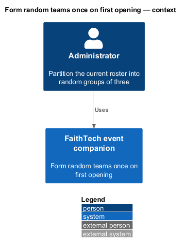
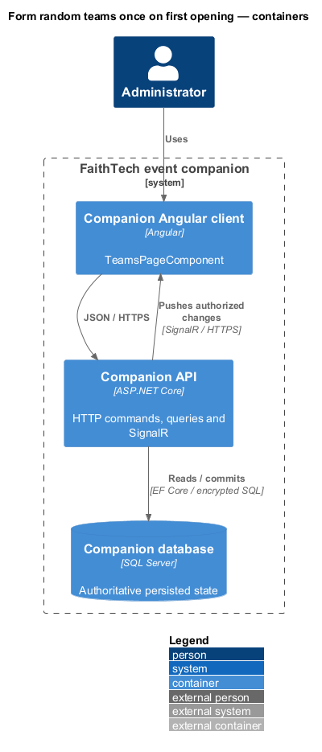
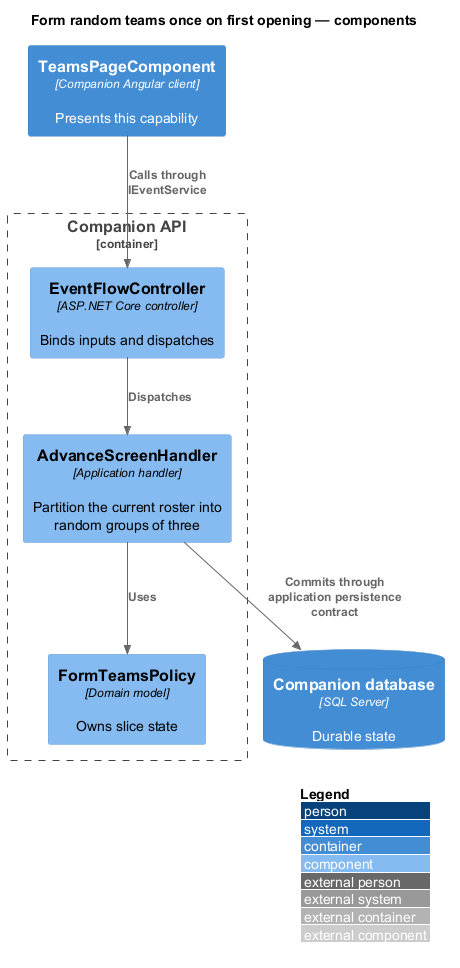
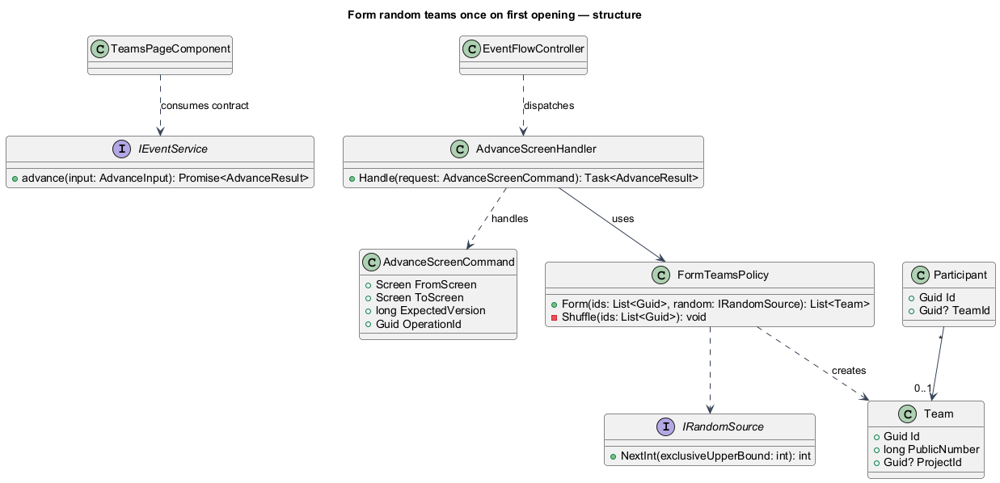
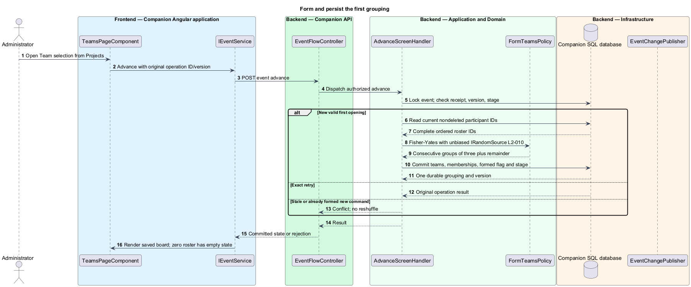

# Form random teams once on first opening

## Overview

Initial team formation is the one-time random assignment performed when the presenter opens Team selection. All current entrants participate, including administrators' additions. Groups contain three members except a final one- or two-person remainder.

## Description

The first Projects→Teams command invokes proposed `FormTeamsPolicy` inside `AdvanceScreenHandler`; no separate public formation endpoint exists. `IEventStateStore` loads participant IDs in stable ID order under the shared event transaction. A Fisher–Yates shuffle draws each index using `IRandomSource.NextInt`, whose production adapter calls `RandomNumberGenerator.GetInt32` for unbiased cryptographic samples. Integration fixtures substitute controlled randomness, not a production seed setting.

The shuffled list is partitioned consecutively in threes. Proposed `Team` rows receive new GUIDs and monotonic labels “Team 01”, “Team 02”, and so on; Participant.TeamId records each membership once. Initial ProjectId is null. Zero entrants produces no team rows and a clear empty board. Name, email, optional answers, run-sheet counts, and project preferences are not inputs to the shuffle.

`EventState.TeamsFormed`, all rows/memberships, CurrentScreen, receipt, audit, and event change commit together. An exact command retry returns the original result; another request at the old version conflicts. Snapshot reads and route visits never invoke formation. Later participants remain unassigned; manual corrections and empty teams survive restarts. A transaction failure rolls back both stage and grouping.

`TeamsPageComponent` maps the saved public projection to the upstream Cornerstone team-board input. Display grouping is never recomputed from client-side random numbers. The mock's browser-lock reducer demonstrates the experience but is not the production transaction mechanism.

Commands and queries use the [shared architecture and protocol](../../README.md#shared-architecture-and-protocol). The following acceptance scenarios are design obligations, not executed test evidence.

- Given 0, 1, 2, 3, 4, 8, or 13 entrants, when first opened, then sizes are [], [1], [2], [3], [3,1], [3,3,2], or [3,3,3,3,1].
- Given concurrent opening or response-loss retries, when processed, then exactly one persisted grouping exists.
- Given a restart after manual moves, when the page opens, then the saved grouping remains.

## Requirements

The source text below is reproduced verbatim, including its original obligation wording.

| L2 ID | Refines (L1) | Requirement |
|---|---|---|
| [L2-010](../../../specs/L2.md#l2-010-form-random-teams-once-on-first-opening) | L1-005 | The first successful global transition from Projects to Team selection must uniformly shuffle all currently entered, nondeleted participants and partition them into teams of three, with one final team of one or two for any remainder. No attendee is omitted, duplicated, or inferred from the run sheet's registration count. Optional answers do not influence selection. Team identities/memberships and the opened stage must commit together once. Later page loads, reconnects, and additional viewers must never reshuffle. Later administrator-added participants remain unassigned until an explicit move. |
| [L2-044](../../../specs/L2.md#l2-044-signalr-synchronization-persistence-and-conflicts) | L1-014 | SignalR must deliver screen changes, roster-derived public changes, private administrator roster changes, project edits, team updates, draws, and session invalidation to authorized connected clients. HTTP can load snapshots and submit commands, but polling alone does not satisfy realtime delivery. State must be durable before success/broadcast. Snapshots and events must carry ordering/version information so duplicate/out-of-order messages cannot regress state. Reconnect/resume must reauthorize and obtain a current snapshot. Show connection loss within ten seconds of a confirmed transport failure; while disconnected/synchronizing, disable server-changing controls and never claim fresh authority. Do not queue mutations for silent replay.  All mutations must reject stale conflicting versions. Retries retain operation identity and input, and return the original saved outcome after authorization without applying it again; changed input under that identity fails. Rejected edits retain drafts for explicit reapply, except privacy/session invalidation and the participant draft closure rule in L2-013. Initial-entry retries must retain an unguessable pre-submission operation receipt scoped to the creating browser so a lost response can recover that entry without letting knowledge of an email claim it. The receipt is a private session credential under L2-041, not a user-entered code. |

## Diagrams

The context identifies the actor and the capability within the companion.

The container view distinguishes browser or operator execution from durable server state.

The component view scopes the named building blocks to this feature.

The class view shows the proposed contract, request, state, and dependencies.

Uniform shuffle and stage opening share one commit; reads have no formation side effect.

