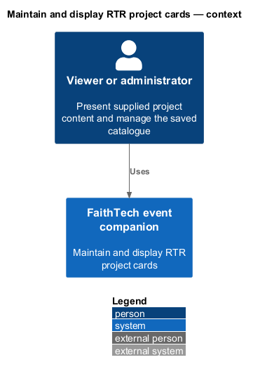
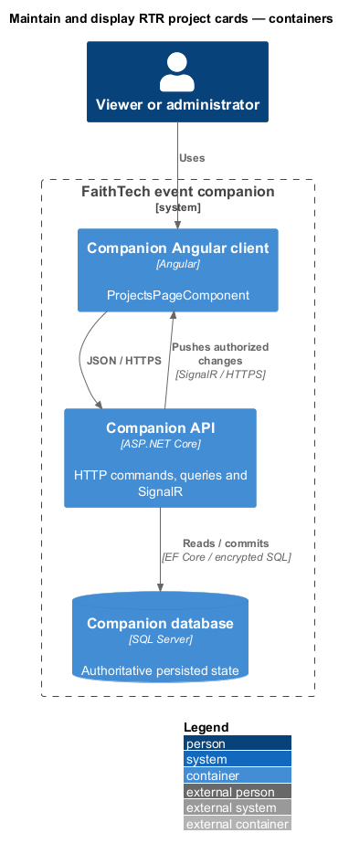
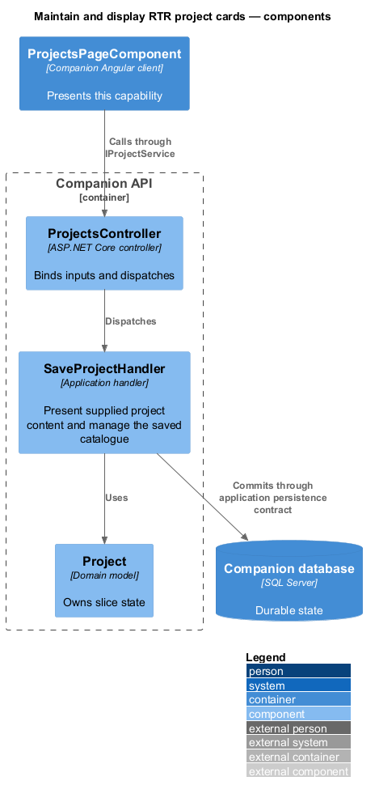
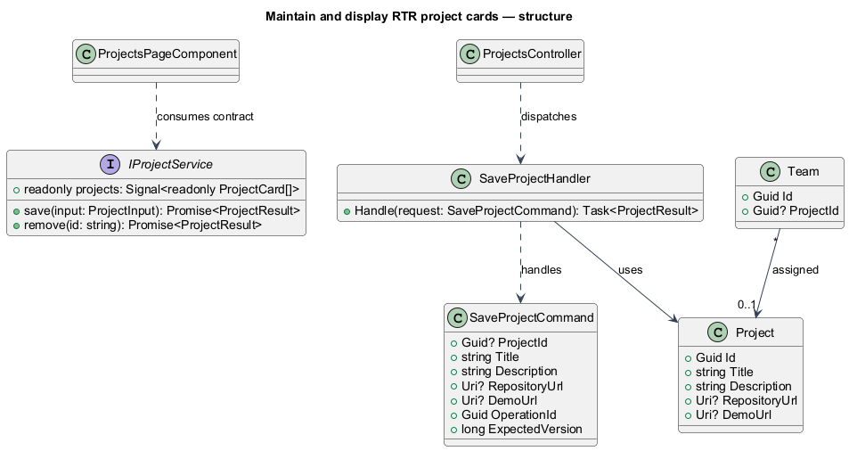
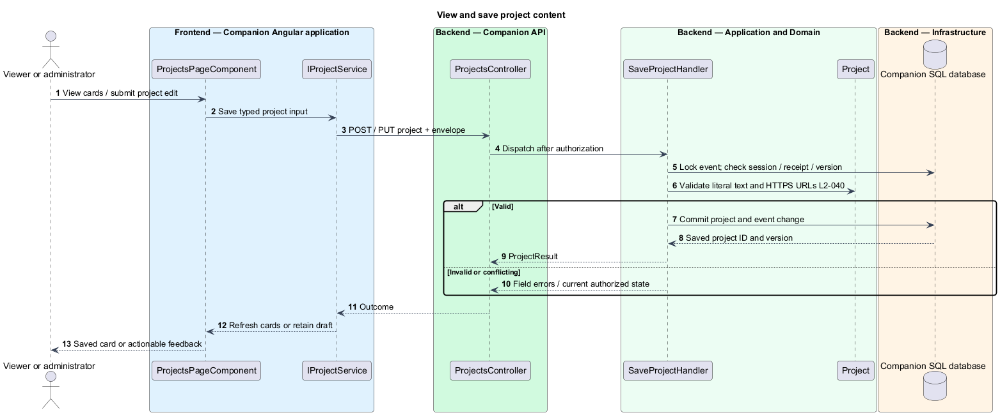
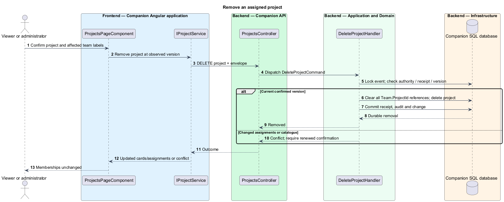

# Maintain and display RTR project cards

## Overview

A project card describes a build opportunity, with optional supplied repository and demo links. RTR means Reconciliation Through Relationships, the project introduced in the run sheet. Its shared-learning and relationship workflows describe that project; they do not expand the companion's features.

## Description

`ProjectsPageComponent` retains the mock cards, empty state, add/edit forms, and delete confirmation. Proposed `IProjectService` / `PROJECT_SERVICE` uses `ProjectService` to access `ProjectsController`; handlers use `IProjectStore` / `SqlProjectStore`. Public cards arrive in the public event snapshot, with `GET /api/event/projects` providing the same projection and version if the feature is loaded separately.

`POST /api/admin/projects` and `PUT /api/admin/projects/{id}` accept title, description, nullable repositoryUrl/demoUrl, and the command envelope. `SaveProjectValidator` enforces required trimmed title up to 200 scalars, description up to 2,000, and optional absolute HTTPS links up to 2,048 without credentials. Blank optional links clear values. No URL is fetched by the API. Cornerstone link controls open targets with noopener/noreferrer. Text remains literal.

`DELETE /api/admin/projects/{id}` accepts the same version/operation envelope. The confirmation identifies the project and all assigned team labels from current state. `DeleteProjectHandler` locks the event and rejects stale versions, so a newly assigned team cannot be silently omitted from an old confirmation. It nulls every referencing Team.ProjectId, deletes the project, and commits one version while preserving memberships and team IDs.

Fresh initialization inserts only the supplied RTR description, without invented repository/demo or guest content. Initialization records completion and never recreates a deleted seed on startup. Administrators may edit Projects when revisiting an opened stage. Participant write requests fail server authorization. Storage/conflict errors retain form values for deliberate reapply.

Commands and queries use the [shared architecture and protocol](../../README.md#shared-architecture-and-protocol). The following acceptance scenarios are design obligations, not executed test evidence.

- Given a project assigned to two teams, when removal is confirmed, then both assignments clear and all members remain.
- Given invalid HTTPS links or excessive scalar lengths, when saved, then field-specific errors appear and no partial change persists.
- Given RTR is deleted and the service restarts, when projects are read, then it remains deleted.

## Requirements

The source text below is reproduced verbatim, including its original obligation wording.

| L2 ID | Refines (L1) | Requirement |
|---|---|---|
| [L2-011](../../../specs/L2.md#l2-011-rtr-project-cards-and-team-project-assignment) | L1-005 | Projects must show a card for each saved project with title, plain-text description, and optional supplied repository/demo HTTPS links. The initial catalogue must include “RTR — Reconciliation Through Relationships” with a brief description drawn from the run sheet. Its project-specific workflows are descriptive content, never new companion features. The run sheet gives no repository/demo URL or guest-project details; absent links are omitted and no fictional guest card is seeded. Administrators assign, replace, or clear one project per team on Team selection. Multiple teams can share a project; participants cannot select or propose projects. |
| [L2-012](../../../specs/L2.md#l2-012-manage-projects-on-projects) | L1-005 | Administrators must add, update, and remove projects through forms on Projects, including when locally revisiting it. Title and description are required; repository and demo links are optional. Removal must identify the project and its assigned teams in a confirmation. Confirming removal must atomically delete the project and clear those teams' project assignments while preserving all memberships. Initial catalogue provisioning must not restore deleted projects on restart. |
| [L2-040](../../../specs/L2.md#l2-040-validate-text-emails-and-links) | L1-013 | The server must validate all inputs. Email is required, at most 254 characters, with one nonempty local part and domain separated by @, no whitespace/control characters, and a syntactically valid domain; plus-tags and subdomains are accepted. Optional name and required project title are limited to 200 characters; each optional answer and required project description to 2,000; optional repository/demo URLs to 2,048. Text is trimmed and line endings normalized to LF; limits count Unicode scalar values. Optional blank values clear a field. All free text is rendered literally, never executable HTML. URLs must be absolute HTTPS without embedded credentials. The API must never fetch submitted project URLs. No file upload feature is required. |

## Diagrams

The context identifies the actor and the capability within the companion.

The container view distinguishes browser or operator execution from durable server state.

The component view scopes the named building blocks to this feature.

The class view shows the proposed contract, request, state, and dependencies.

Published Cornerstone cards display the public projection; validated admin edits become durable before notification.

Version checking protects the confirmation's assignment list from becoming stale.

