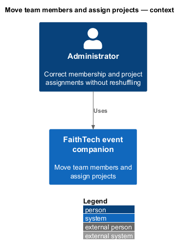
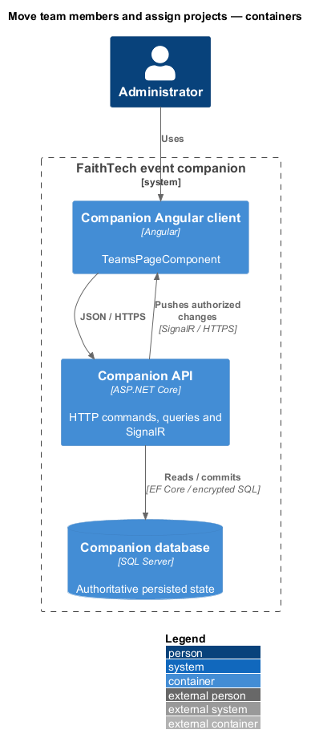
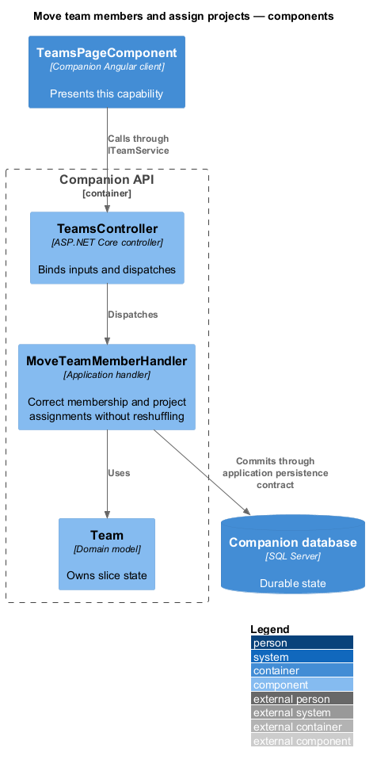
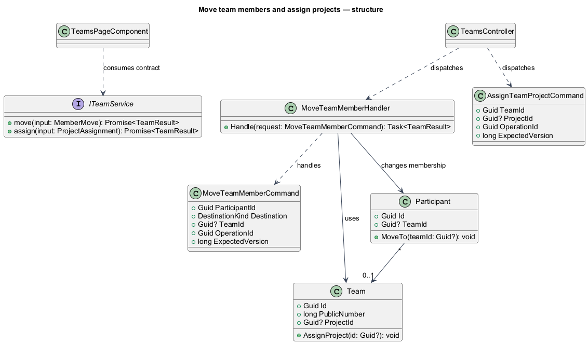
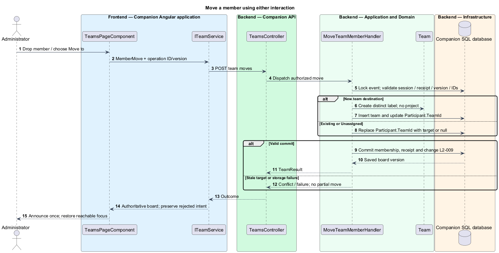
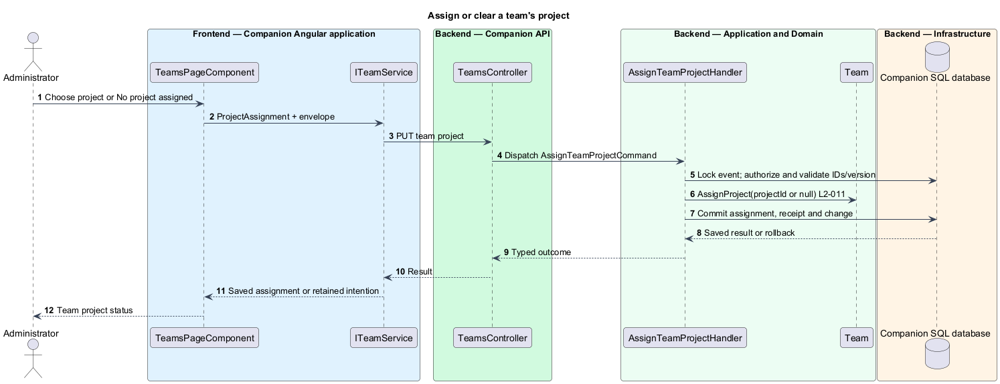

# Move team members and assign projects

## Overview

A team is a durable labeled group whose members build a selected project. An unassigned participant has no team. Administrators correct membership using drag and drop or an equivalent Move to control and assign one optional project to each team.

## Description

The approved `TeamsPageComponent` maps public board data and admin capability to the proposed upstream `TeamBoardComponent`. The library emits `MemberMove` and `ProjectAssignment` intents; it owns no service or persistence. `ITeamService` / `TEAM_SERVICE`, implemented by `TeamService`, sends server commands. Public viewers see names/public labels for both groups and unassigned members, never email or optional answers.

`POST /api/admin/teams/moves` takes participantId, destination (`existing`, `new`, `unassigned`), nullable teamId, and the command envelope. Existing requires a valid teamId; other destinations reject one. Proposed `MoveTeamMemberValidator` and `MoveTeamMemberHandler` require teams already formed, reauthorize under the event lock, check current IDs/version, and update the one nullable Participant.TeamId. New creates a fresh labeled team with no project in the same transaction. Existing membership moved to the same team is a confirmed no-op receipt, not a second membership. Empty teams remain with their project. Manual groups may exceed three members or become pairs; there is no team deletion endpoint.

`PUT /api/admin/teams/{id}/project` takes a nullable projectId and envelope. `AssignTeamProjectHandler` verifies team/project existence under the same lock, then replaces or clears Team.ProjectId. Multiple teams may share a project. There is no participant selection/proposal endpoint. Deleted/stale targets return a conflict or not-found result with authorized current board state.

Dragging shows temporary local feedback but saved membership changes only after success. A rejected move restores the authoritative board and retains the intended destination for explicit reapply. Keyboard/touch Move to and project controls dispatch identical intents. Busy/disconnected controls are disabled natively; focus follows the moved member where available and a single status announcement confirms the destination.

Commands and queries use the [shared architecture and protocol](../../README.md#shared-architecture-and-protocol). The following acceptance scenarios are design obligations, not executed test evidence.

- Given a member dragged or moved by keyboard, when committed, then every client shows exactly one membership.
- Given a new or unassigned destination, when selected, then group creation or membership clearing is atomic.
- Given two admins editing one version, when one wins, then the other sees a conflict with no silent overwrite.
- Given multiple teams share a project, when one changes assignment, then other assignments and all memberships remain.

## Requirements

The source text below is reproduced verbatim, including its original obligation wording.

| L2 ID | Refines (L1) | Requirement |
|---|---|---|
| [L2-009](../../../specs/L2.md#l2-009-administrator-member-rearrangement) | L1-005 | Team selection must display labeled team groups and an unassigned area. Administrators must move members between teams or from unassigned using drag and drop, with an equivalent keyboard/touch “Move to team” control. Moving to “New team” creates a group; moving to “Unassigned” removes membership. Manual corrections can exceed three members or produce pairs. Empty teams remain visible for reassignment and retain their selected project; no team deletion feature is required. |
| [L2-011](../../../specs/L2.md#l2-011-rtr-project-cards-and-team-project-assignment) | L1-005 | Projects must show a card for each saved project with title, plain-text description, and optional supplied repository/demo HTTPS links. The initial catalogue must include “RTR — Reconciliation Through Relationships” with a brief description drawn from the run sheet. Its project-specific workflows are descriptive content, never new companion features. The run sheet gives no repository/demo URL or guest-project details; absent links are omitted and no fictional guest card is seeded. Administrators assign, replace, or clear one project per team on Team selection. Multiple teams can share a project; participants cannot select or propose projects. |
| [L2-036](../../../specs/L2.md#l2-036-keyboard-semantics-and-feedback) | L1-012 | All controls must have accessible names, visible focus, and keyboard operation. Dialogs must contain focus and restore it to their trigger or current heading if the trigger is gone. Validation must preserve entered values and associate/announce field errors. Stage changes and winner results must be announced once; countdown ticks and cycling names must not create repeated screen-reader announcements. Text contrast must reach 4.5:1, or 3:1 for large text; meaningful control boundaries/focus indicators must reach 3:1. Fix missing accessibility upstream in Cornerstone. |
| [L2-044](../../../specs/L2.md#l2-044-signalr-synchronization-persistence-and-conflicts) | L1-014 | SignalR must deliver screen changes, roster-derived public changes, private administrator roster changes, project edits, team updates, draws, and session invalidation to authorized connected clients. HTTP can load snapshots and submit commands, but polling alone does not satisfy realtime delivery. State must be durable before success/broadcast. Snapshots and events must carry ordering/version information so duplicate/out-of-order messages cannot regress state. Reconnect/resume must reauthorize and obtain a current snapshot. Show connection loss within ten seconds of a confirmed transport failure; while disconnected/synchronizing, disable server-changing controls and never claim fresh authority. Do not queue mutations for silent replay.  All mutations must reject stale conflicting versions. Retries retain operation identity and input, and return the original saved outcome after authorization without applying it again; changed input under that identity fails. Rejected edits retain drafts for explicit reapply, except privacy/session invalidation and the participant draft closure rule in L2-013. Initial-entry retries must retain an unguessable pre-submission operation receipt scoped to the creating browser so a lost response can recover that entry without letting knowledge of an email claim it. The receipt is a private session credential under L2-041, not a user-entered code. |

## Diagrams

The context identifies the actor and the capability within the companion.

The container view distinguishes browser or operator execution from durable server state.

The component view scopes the named building blocks to this feature.

The class view shows the proposed contract, request, state, and dependencies.

Drag and keyboard actions converge on one transaction and one membership field.

Project assignment changes one nullable reference and leaves membership untouched.

