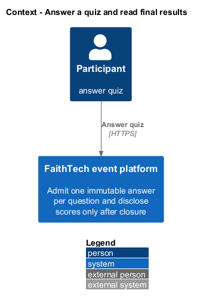
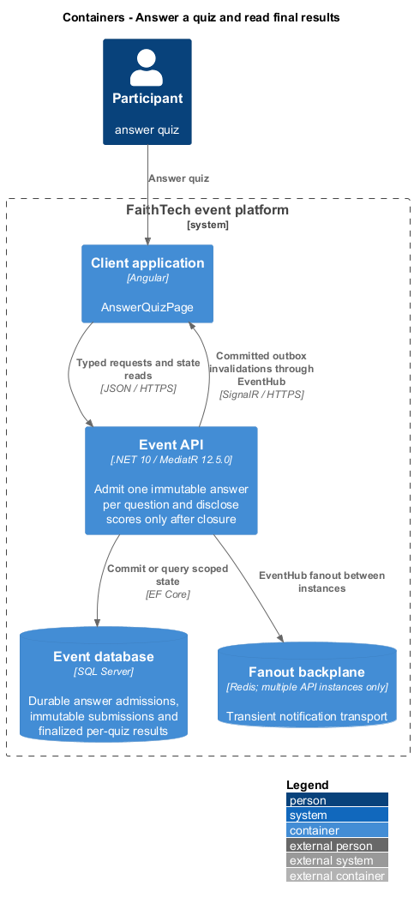
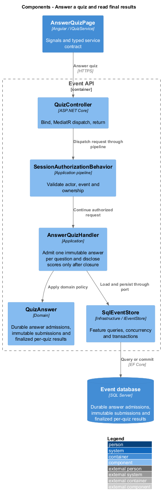
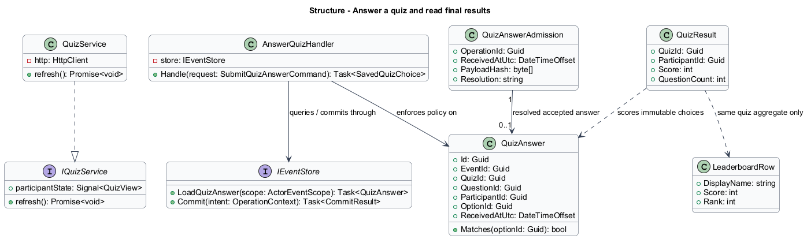
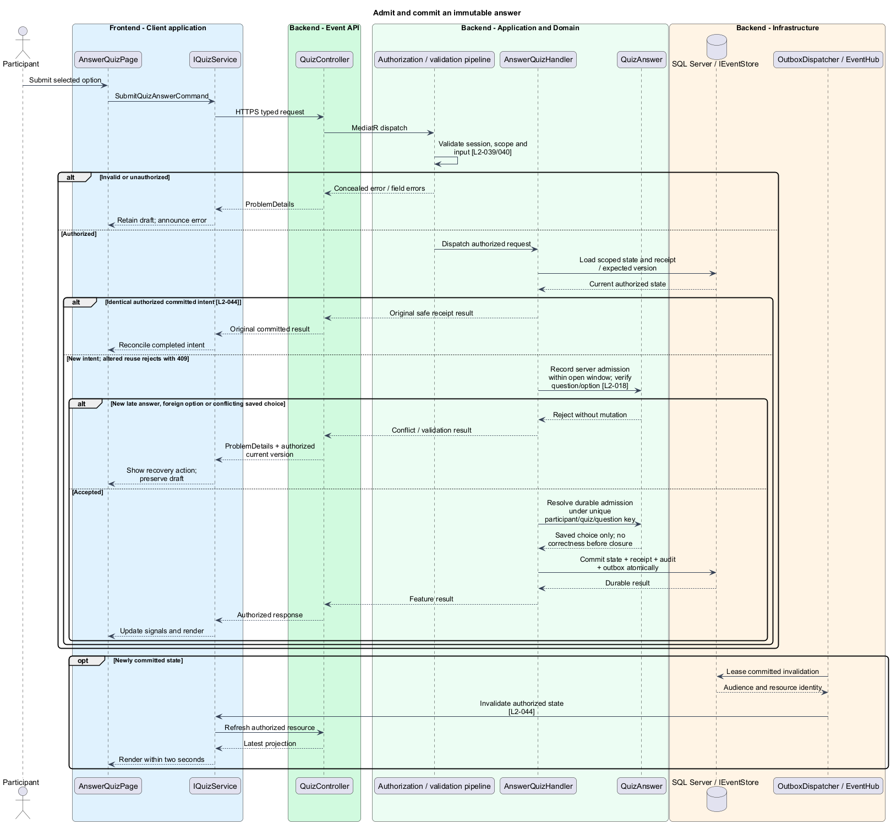
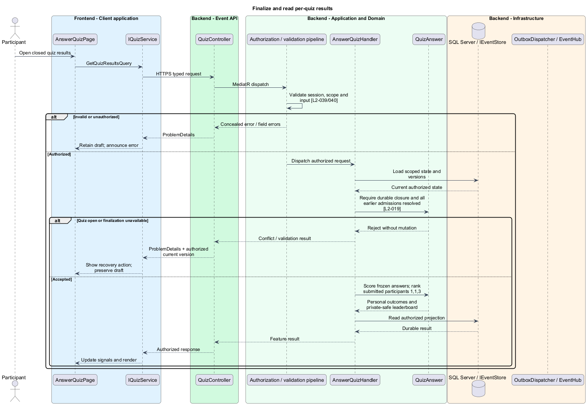
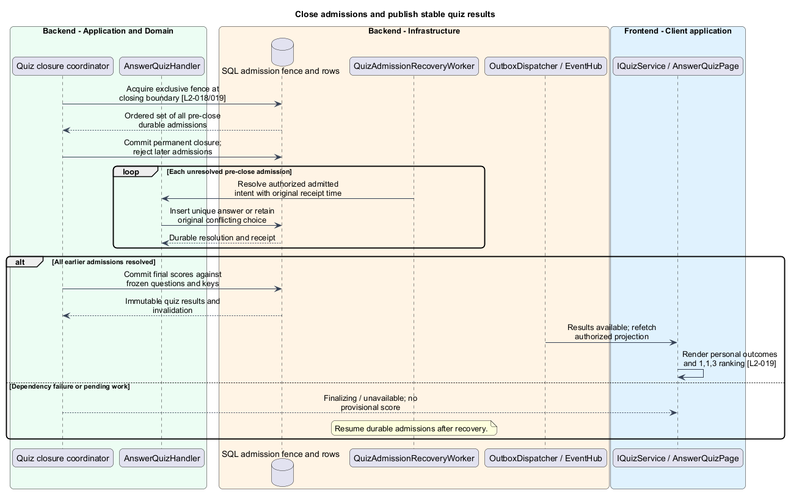

# Answer a quiz and read final results

## Overview

Participants answer ordered quiz questions during the answer window. A saved choice cannot be replaced. Closure reveals personal answers and correct options, plus a leaderboard of submitted participants for that quiz.

## Description

This proposed slice follows the [shared architecture contracts](../../README.md). `AnswerQuizPage` owns routing and dialogs; domain components consume `IQuizService` through `QUIZ_SERVICE`. `QuizService` implements HTTP access in `api`.

`/events/:eventId/quizzes` lists activated quizzes as upcoming/open/closed; inactive drafts are absent. `/:quizId` hosts `AnswerQuizPage`. `GET /api/events/{eventId}/quizzes/{quizId}` dispatches `GetQuizViewQuery`; `POST /quizzes/{quizId}/answers` dispatches `SubmitQuizAnswerCommand { questionId, optionId, operationId }`; `GET /quizzes/{quizId}/results` dispatches `GetQuizResultsQuery`. `IQuizService` exposes load, submit, reconcile, and results. Participant DTOs never reuse administrator answer-key definitions.

`QuizView` includes ordered question/option IDs and text, own submitted choices, opening/closing times, lifecycle, and progress. Before opening, title/time and disabled answer controls appear. Before closure, submitted feedback confirms the saved choice only: no correctness, points, or other participant answers. Questions remain navigable in configured order; skip/revisit is allowed while open. The last question shows submitted-count progress and closing time, without ending the quiz.

`QuizAdmissionBehavior` records authoritative SQL receipt time and a durable admission before application work can queue. The short admission transaction validates session, event, activated window, question/option ownership, and intent identity. A shared quiz admission fence orders admission against closure; SQL receipt time is sampled after acquiring that fence. Browser send time, earlier viewing, and pre-admission network/body-processing time do not reserve eligibility. `QuizAnswerAdmission` retains only the authorized IDs, choice, intent, receipt time, and processing state needed for recovery.

`AnswerQuizHandler` resolves the admission to one immutable `QuizAnswer`. Unique `(ParticipantId, QuizId, QuestionId)` prevents competing options. The committed original option is returned with an explanation for a conflicting answer; exact retries return the original receipt even after closure. An identical operation contributes once. Admission resolution, answer, operation receipt, and invalidation commit together; the HTTP response claims saved only after this commit.

Closure takes the exclusive admission fence, permanently stops new admissions, and drains every earlier durable admission before publishing final results. `QuizAdmissionRecoveryWorker` resumes unresolved admissions after interruption using the same handler and uniqueness rules. A result query shows finalizing/unavailable until the pre-close set is resolved; it never presents a score that later changes. Healthy operation shall drain within the two-second results/update target; backlog and failure are observable performance failures, not a relaxed deadline.

`QuizScoringPolicy` awards one point per correct answer and zero for incorrect/unanswered questions. It persists final scores against the frozen question/key set. Leaderboard rows include only submitted participants, with rank `1 + count(scores greater than this score)`. Equal-rank display sorts by normalized name then stable identity, never response speed. Names, scores, and ranks are the only public row fields; a participant with no answers sees personal zero and remains absent from the board. Results never aggregate different quizzes.

Acceptance checks race different answers, retry an accepted answer after close, interrupt between admission and resolution, and close during the 200-answer burst. Result checks use scores 3/3/2, unanswered questions, empty submissions, and key/answer privacy before closure. Browser page objects verify skip/revisit, progress, immutable saved controls, and explicit unknown-outcome recovery.

## Requirements

The following verbatim primary excerpts link to their complete normative definitions and Given–When–Then acceptance criteria. Shared constraints apply as specified in the [architecture contracts](../../README.md).

| L2 ID | Refines (L1) | Requirement excerpt |
|---|---|---|
| [L2-018](../../../specs/L2.md#l2-018-quiz-answer-submission) | `L1-007` | Each participant must submit at most one answer per question while its quiz is open. The server's receipt time determines eligibility; viewing a question earlier does not reserve a submission. Confirmed answers must be immutable and persist across refresh. |
| [L2-019](../../../specs/L2.md#l2-019-quiz-scoring-and-results) | `L1-007` | Closed quizzes must award one point per correct answer and zero per incorrect or unanswered question. Participants must see their answers, correct options, total score, and a same-event leaderboard for that quiz containing only display names, scores, and ranks. Leaderboards include participants with at least one submitted answer to that quiz and use competition ranking: 1, 1, 3 for a two-way first-place tie. No aggregate cross-quiz score is required. Equal-rank rows use the directory's name/identity ordering for display only. Participants with no answers see a personal zero score but do not enter the leaderboard. |

## Diagrams

Participant uses the event platform to answer quiz. The context isolates this capability from unrelated event activities.

The Client application calls the API for authoritative state. SQL Server retains durable answer admissions, immutable submissions and finalized per-quiz results; SignalR invalidations prompt authorized reads.

`QuizController` dispatches through the application pipeline. `AnswerQuizHandler` owns the feature policy and uses the persistence port.

`QuizAnswer` carries stable identity and feature state. The service interface separates Angular consumers from HTTP; `IEventStore` represents the application persistence boundary. Method shapes are slice-specific views of the shared contracts.

Admit and commit an immutable answer applies record server admission within open window; verify question/option [l2-018]. New late answer, foreign option or conflicting saved choice leaves committed state unchanged; the client retains enough context to recover.

Finalize and read per-quiz results applies require durable closure and all earlier admissions resolved [l2-019]. Quiz open or finalization unavailable leaves committed state unchanged; the client retains enough context to recover.

Closure permanently stops admission before final scores are published. Durable pre-close admissions resolve once, including after a worker restart, so no provisional score is presented as final.

