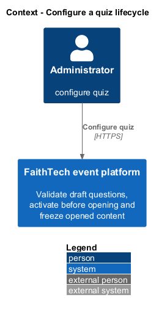
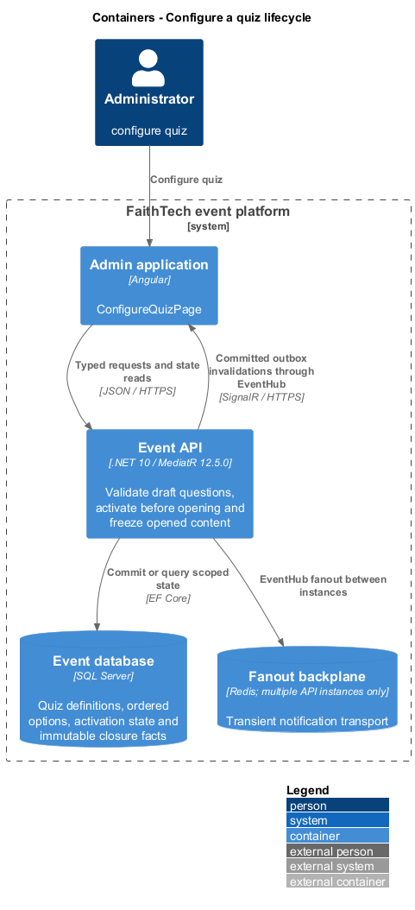
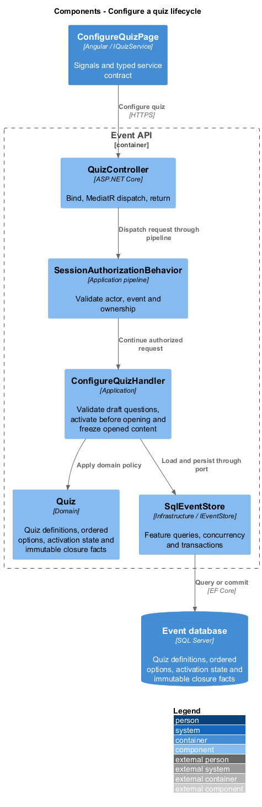
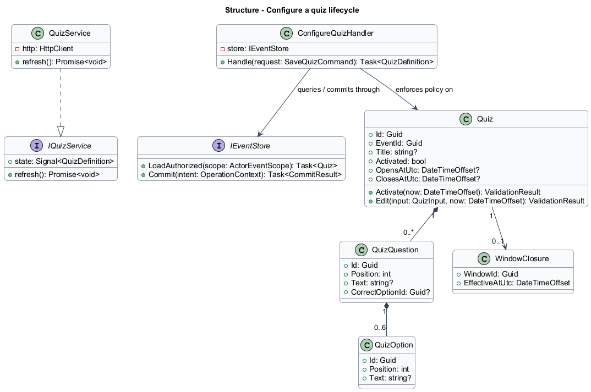
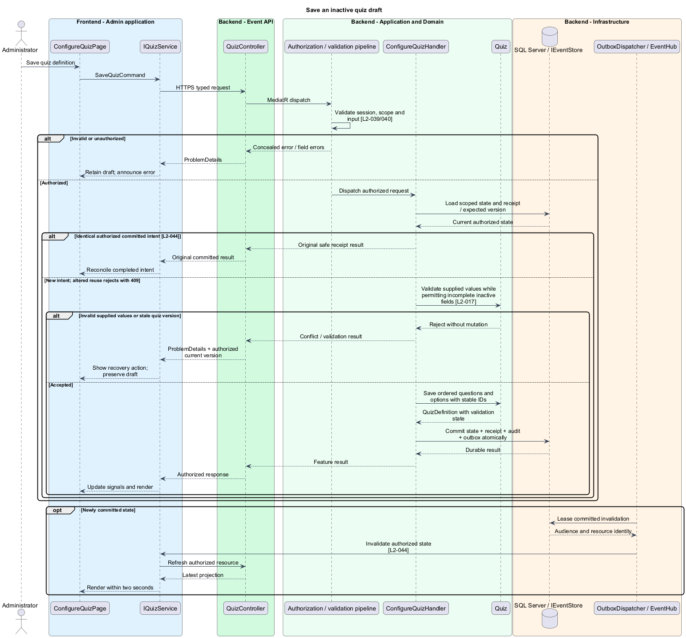
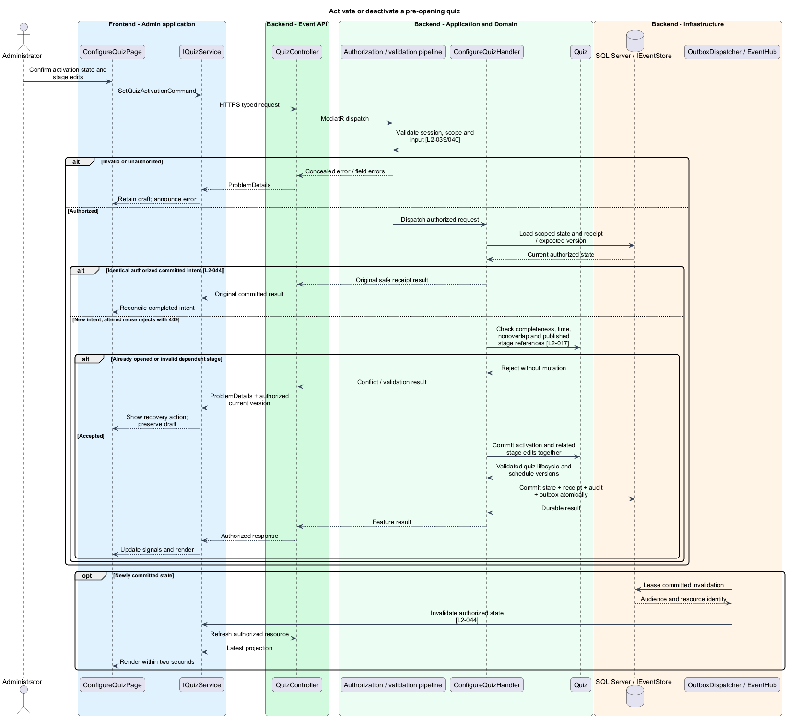
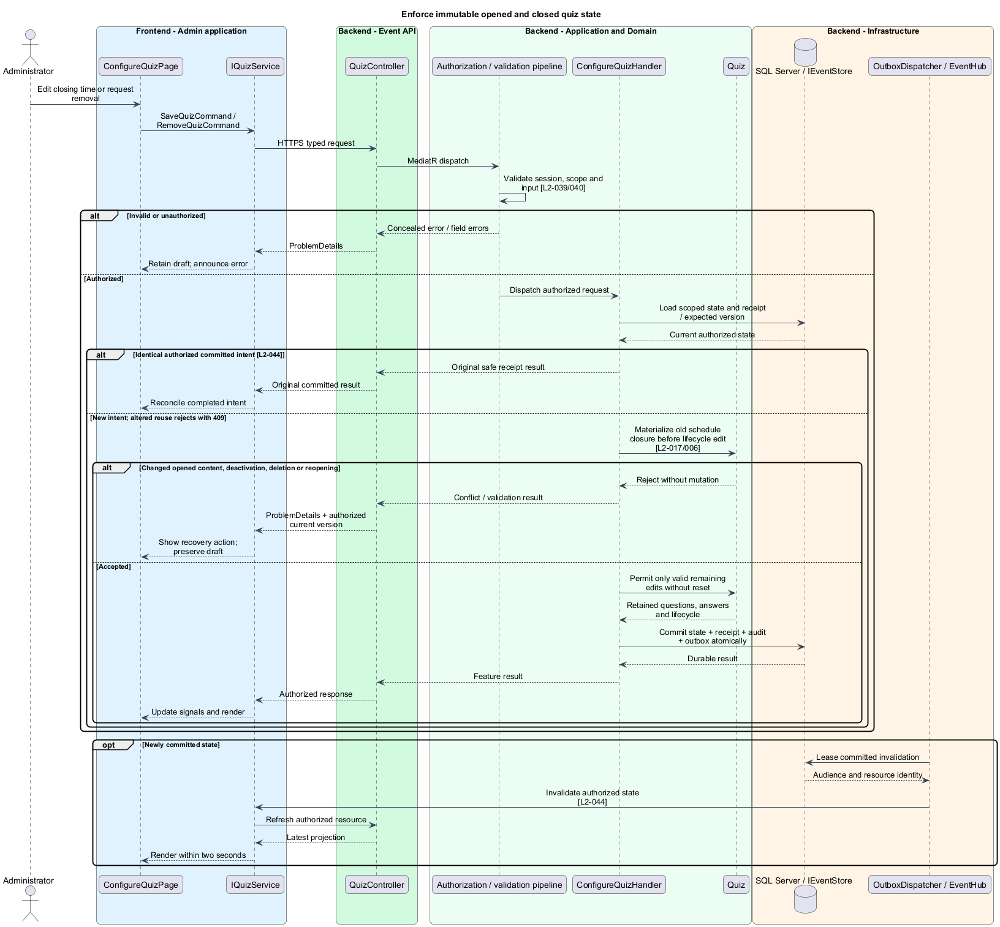

# Configure a quiz lifecycle

## Overview

A quiz is an ordered set of multiple-choice questions with one correct option per question. An inactive draft may be incomplete. Activation makes a valid quiz eligible to open at its configured time; closure permanently ends new submissions.

## Description

This proposed slice follows the [shared architecture contracts](../../README.md). `ConfigureQuizPage` owns routing and dialogs; domain components consume `IQuizService` through `QUIZ_SERVICE`. `QuizService` implements HTTP access in `api`.

`/admin/events/:eventId/quizzes` and `/:quizId` compose `ConfigureQuizPage`. Administrator `GET/POST /api/admin/events/{eventId}/quizzes` list/create; `GET/PUT/DELETE /quizzes/{quizId}` read/save/remove; `PUT /quizzes/{quizId}/activation` changes activation. `SaveQuizCommand` contains title, ordered questions/options, correct option IDs, dated open/close instants, and expected version. `SetQuizActivationCommand` may carry stage-reference edits for one atomic operation. `IQuizService` exposes administration methods and distinct participant projections used by the answering slice.

`ConfigureQuizHandler` and `QuizValidator` permit missing fields in inactive drafts but validate all supplied text and intervals. Activation requires a title, at least one complete question, two to six nonblank options per question, exactly one correct option belonging to that question, and a positive window within the event. Activated quiz windows cannot overlap. Activation occurs strictly before opening.

The event schedule guard serializes activation with schedule and other quiz-window edits. A published quiz stage references an activated same-event quiz and lies wholly within its window. Draft stages may reference inactive draft quizzes; publication rejects those references until activation or removal. Activation and related stage changes validate and commit together, avoiding a partially live configuration.

Before any edit, the handler resolves lifecycle from the old committed schedule and authoritative time. Once opened, question identities, ordering, text, options, answer keys, and opening instant are immutable. Opened quizzes cannot be deleted, deactivated, or reset. Closing edits remain subject to durable closure; a passed old close cannot be extended to reopen. Before opening, deactivation/removal requires related stage references to be removed or updated in the same transaction. A soft removal preserves internal identities where historical configuration references require them.

Administrator `QuizDefinition` includes answer keys. Participant `QuizView` omits them until closure; hiding a field in a template is insufficient. Shared receipts record safe IDs/version, and invalidations refresh authorized quiz/schedule views after commit. Field errors identify question/option positions; stale saves retain the edited draft.

Acceptance tests exercise incomplete draft saving, invalid supplied options, activation at the exact opening instant, overlapping activated windows, foreign/invalid stage references, atomic activation with publication dependencies, and edits after opening/closure without a running worker. Browser scenarios verify question ordering, errors, cancellation, and immutable opened controls.

## Requirements

The following verbatim primary excerpts link to their complete normative definitions and Given–When–Then acceptance criteria. Shared constraints apply as specified in the [architecture contracts](../../README.md).

| L2 ID | Refines (L1) | Requirement excerpt |
|---|---|---|
| [L2-017](../../../specs/L2.md#l2-017-quiz-configuration-and-lifecycle) | `L1-007` | Administrators must create event quizzes with an ordered set of single-choice questions, each with 2-6 nonblank options and exactly one correct option. Quizzes must have explicit opening and closing times within the event; the quiz stage must expose the active quiz. Questions and answer keys must become immutable once the quiz opens. |

## Diagrams

Administrator uses the event platform to configure quiz. The context isolates this capability from unrelated event activities.

The Admin application calls the API for authoritative state. SQL Server retains quiz definitions, ordered options, activation state and immutable closure facts; SignalR invalidations prompt authorized reads.

`QuizController` dispatches through the application pipeline. `ConfigureQuizHandler` owns the feature policy and uses the persistence port.

`Quiz` carries stable identity and feature state. The service interface separates Angular consumers from HTTP; `IEventStore` represents the application persistence boundary. Method shapes are slice-specific views of the shared contracts.

Save an inactive quiz draft applies validate supplied values while permitting incomplete inactive fields [l2-017]. Invalid supplied values or stale quiz version leaves committed state unchanged; the client retains enough context to recover.

Activate or deactivate a pre-opening quiz applies check completeness, time, nonoverlap and published stage references [l2-017]. Already opened or invalid dependent stage leaves committed state unchanged; the client retains enough context to recover.

Enforce immutable opened and closed quiz state applies materialize old schedule closure before lifecycle edit [l2-017/006]. Changed opened content, deactivation, deletion or reopening leaves committed state unchanged; the client retains enough context to recover.

