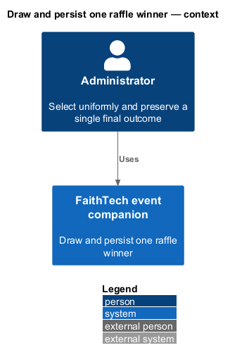
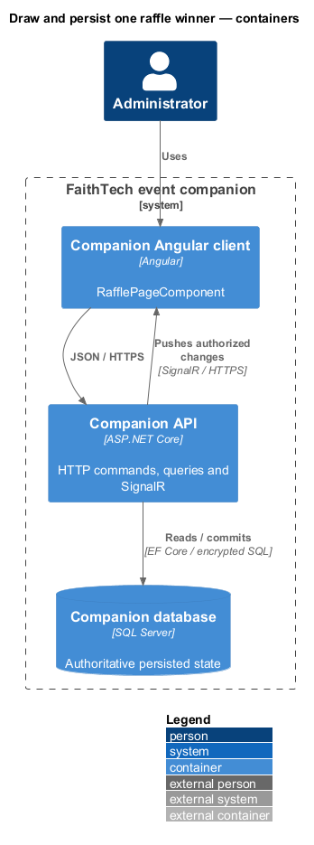
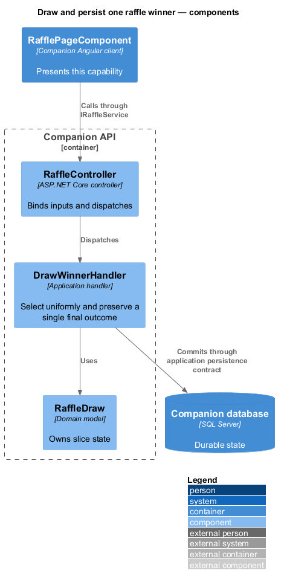
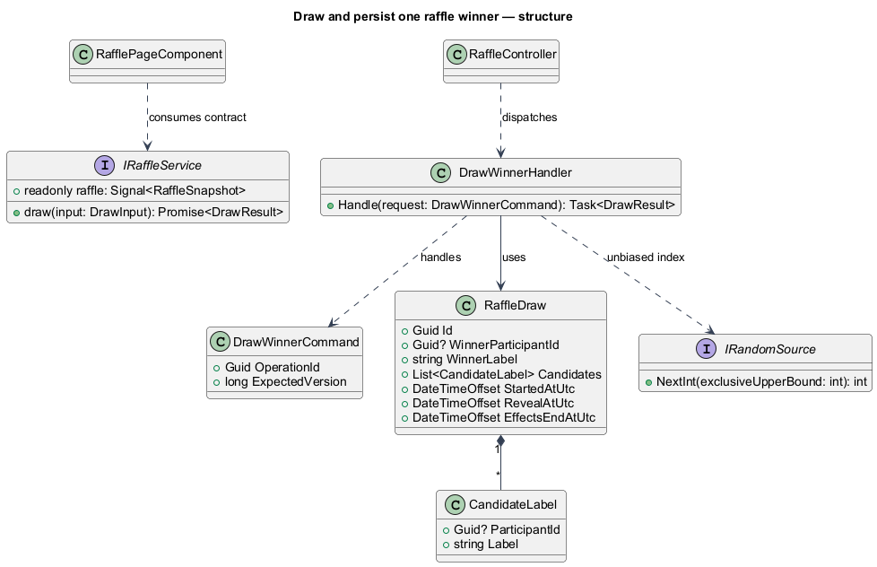
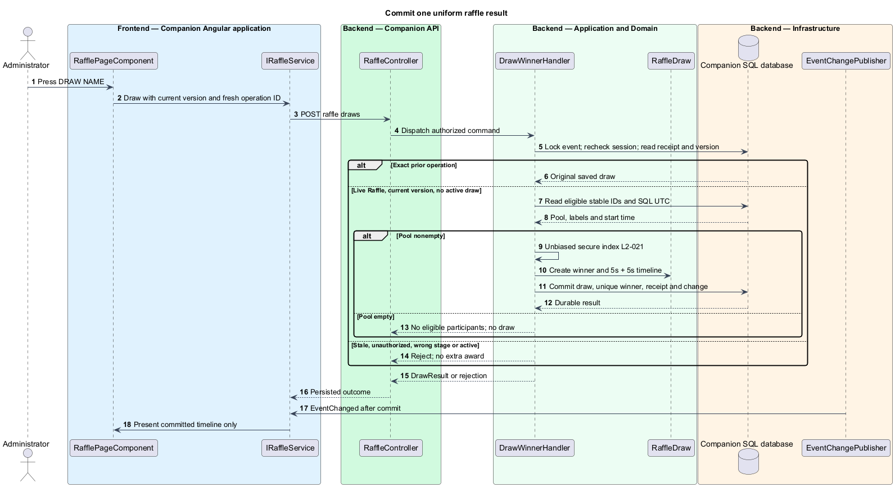
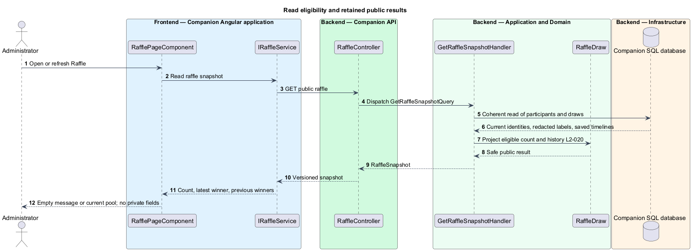

# Draw and persist one raffle winner

## Overview

The raffle pool contains every current entrant who has not won, including admin-added participants. Each stable identity has one chance per draw. A draw is an immutable award decision with a saved presentation timeline; changing an email or name never restores a prior winner's eligibility.

## Description

`RafflePageComponent` retains eligible count, current result, previous winners, and administrator DRAW NAME. Proposed `IRaffleService` / `RAFFLE_SERVICE`, implemented by `RaffleService`, reads `RaffleSnapshot` and sends `POST /api/admin/raffle/draws` with expected event version and operation ID. The event version is also the observed raffle version, deliberately conflicting on intervening roster changes. Public viewers have no draw command authority.

`RaffleController` dispatches proposed `DrawWinnerHandler`. `IRaffleStore` / `SqlRaffleStore` take the event lock and validate session revision, original receipt, expected version, live Raffle stage, and no active draw. Active lasts through `EffectsEndAtUtc`; both five-second intervals finish before a deliberate later draw is accepted. Eligible IDs are current Participant rows without a previous winning reference. An empty pool returns `409 no-eligible-participants` and creates no draw.

`IRandomSource.NextInt(count)` uses `RandomNumberGenerator.GetInt32(count)` in production. The handler selects one uniformly indexed ID, without weighting profile, team, project, or insertion order. It snapshots candidate IDs/public labels, winner, SQL server start time, reveal=start+5 seconds, and effectsEnd=reveal+5 seconds. The award, unique winner reference, receipt, audit, and new event version commit together before acknowledgement/SignalR notification. A database uniqueness constraint independently prevents two draws for one current identity.

A repeated authorized operation returns its saved draw even after animation completes; changed input fails. A delayed new operation with an old version conflicts and cannot consume a second entrant. A new draw requires a new operation ID and current version. Storage failure returns no award. Deletion serialized first excludes an entrant; deletion after draw redacts winner and candidate snapshots to “Removed participant” while retaining draw ID/time. Renames replace public labels in retained snapshots without changing the selected identity. The result is final, with no undo, redraw, prize catalogue, or winner override.

`GET /api/event/raffle` and the public event snapshot resolve the same safe projection. Empty state says “No eligible participants”. Candidate labels contain no email/answers. The saved winner is visible in the payload before reveal; timing is presentation coordination, not a secrecy boundary. The email-only design does not prevent one person entering different emails.

Commands and queries use the [shared architecture and protocol](../../README.md#shared-architecture-and-protocol). The following acceptance scenarios are design obligations, not executed test evidence.

- Given controlled random indices, when fresh pools are drawn, then each identity can be selected with no profile weighting.
- Given simultaneous clicks or a delayed stale click after effects finish, when processed, then only one award is consumed.
- Given a committed draw loses its response, when retried unchanged, then the same draw returns.
- Given deletion or rename after award, when history is read, then privacy labels update and the award remains final.

## Requirements

The source text below is reproduced verbatim, including its original obligation wording.

| L2 ID | Refines (L1) | Requirement |
|---|---|---|
| [L2-020](../../../specs/L2.md#l2-020-raffle-pool-and-public-results) | L1-008 | Raffle must display the eligible count, latest result, and previous winners within that same screen. Every nondeleted entered participant, including administrator-added participants, has one chance per draw until winning. Previous winners are excluded from later draws, including after email/name edits. Names are displayed with stable public labels; unnamed entrants use their public label alone. There is no prize-selection prerequisite or prize catalogue. Deletion removes an identity from future participation; registering an email again through the administrator creates a new identity rather than recovering a deleted profile. This email-only scheme does not verify a natural person's identity or prevent entry under multiple different emails. |
| [L2-021](../../../specs/L2.md#l2-021-fair-durable-single-result-draw) | L1-008 | Only an administrator on the live Raffle stage must be able to start a draw using **DRAW NAME**. The server must select uniformly among current eligible identities using cryptographically secure randomness and persist winner, draw ID, candidate-label snapshot, server start/reveal times, and exclusion before animation. Only one draw can run at a time. Requests must include the observed raffle version and an operation identity so concurrent clicks, delayed clicks, and retries do not consume extra winners. The result is final; there is no redraw/undo feature. Public changes to a selected winner's name or deletion follow current privacy rules even for retained snapshots. |
| [L2-044](../../../specs/L2.md#l2-044-signalr-synchronization-persistence-and-conflicts) | L1-014 | SignalR must deliver screen changes, roster-derived public changes, private administrator roster changes, project edits, team updates, draws, and session invalidation to authorized connected clients. HTTP can load snapshots and submit commands, but polling alone does not satisfy realtime delivery. State must be durable before success/broadcast. Snapshots and events must carry ordering/version information so duplicate/out-of-order messages cannot regress state. Reconnect/resume must reauthorize and obtain a current snapshot. Show connection loss within ten seconds of a confirmed transport failure; while disconnected/synchronizing, disable server-changing controls and never claim fresh authority. Do not queue mutations for silent replay.  All mutations must reject stale conflicting versions. Retries retain operation identity and input, and return the original saved outcome after authorization without applying it again; changed input under that identity fails. Rejected edits retain drafts for explicit reapply, except privacy/session invalidation and the participant draft closure rule in L2-013. Initial-entry retries must retain an unguessable pre-submission operation receipt scoped to the creating browser so a lost response can recover that entry without letting knowledge of an email claim it. The receipt is a private session credential under L2-041, not a user-entered code. |

## Diagrams

The context identifies the actor and the capability within the companion.

The container view distinguishes browser or operator execution from durable server state.

The component view scopes the named building blocks to this feature.

The class view shows the proposed contract, request, state, and dependencies.

Selection and exclusion precede every animation and share a serialized durable commit.

Current identity and privacy rules determine public labels and future eligibility.

