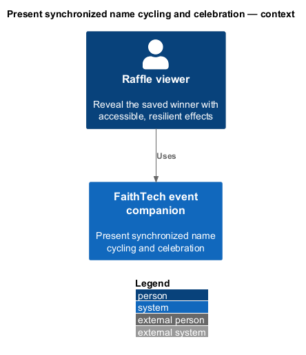
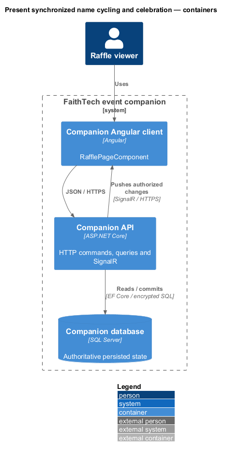
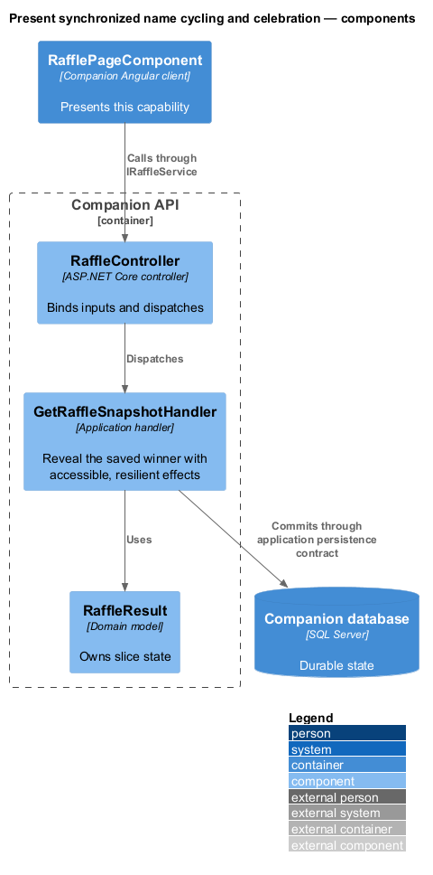
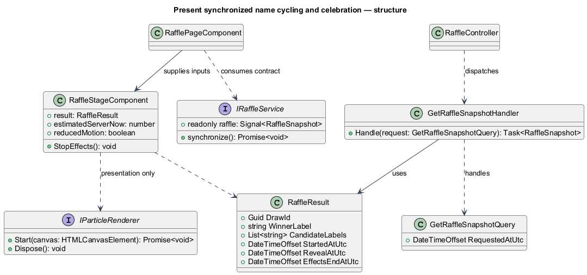
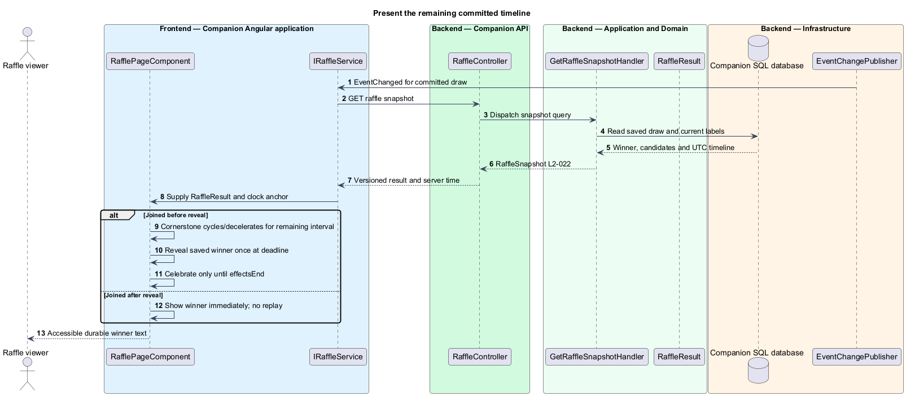
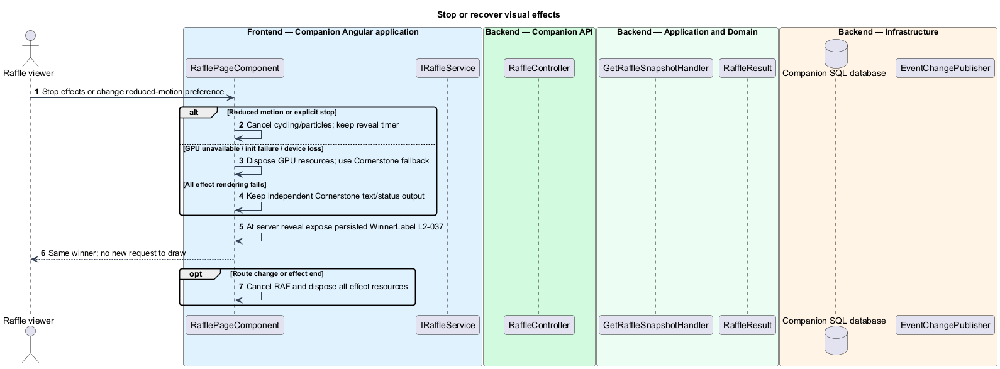

# Present synchronized name cycling and celebration

## Overview

Raffle presentation is the shared visual timeline of an already committed result. Name cycling builds anticipation, then the saved winner appears with falling particles. Rendering never selects a winner, changes eligibility, or retries a draw.

## Description

The mock's `RaffleStageComponent`, `start-confetti`, and WGSL shader supply an approved upstream proposal. Production consumes their completed Cornerstone release; `RafflePageComponent` only maps a server `RaffleResult` and synchronized time to input properties. `IRaffleService` supplies result state, while the same `ServerClock` used by Countdown estimates server UTC. The backend query returns the saved draw and current privacy-filtered candidate labels.

The Cornerstone component derives progress from timestamps, never from receipt time. For elapsed 0–5 seconds, candidate labels cycle with increasing dwell duration, then settle on WinnerLabel at RevealAtUtc. An injected timestamp input keeps examples deterministic. RafflePage owns a minimal accessible text fallback independent of the effect's success, composed from Cornerstone status/text UI. At reveal it exposes the winner even if the animation component throws. A single polite live-region announces the winner once per draw ID; cycling labels remain aria-hidden. Rendering cannot invoke `draw()`.

For a viewer connected before reveal, celebration lasts only until EffectsEndAtUtc, at most five further seconds. A viewer joining mid-cycle renders the remaining interval. A viewer joining or returning after reveal displays the winner immediately and does not replay particles, even if another client's celebration is still active. Each mounted view records whether it observed the active pre-reveal interval. Privacy label updates replace visible labels immediately without restarting effects.

Cornerstone's WebGPU renderer probes navigator.gpu, adapter and device; allocates an instanced particle pipeline; and derives timing/palette from package APIs/tokens. Particle canvas is decorative and ignores pointer input. Initialization rejection, unsupported capabilities, or device loss disposes resources and switches to the lightweight package fallback without resetting reveal time. All RAF callbacks, buffers, device subscriptions, and canvases are released on completion, stop, route change, or destruction.

Reduced-motion changes stop rapid cycling and particles immediately. Static “Drawing…” remains until reveal, then winner text appears. Stop effects affects only that viewer and retains the reveal deadline. There is no sound or permission prompt. A suspended tab resynchronizes before showing a current result; it never replays an ended timeline.

Commands and queries use the [shared architecture and protocol](../../README.md#shared-architecture-and-protocol). The following acceptance scenarios are design obligations, not executed test evidence.

- Given foreground synchronized clients, when reveal occurs, then all show the saved winner within one second and effects end within five more seconds.
- Given WebGPU denial/device loss or total effect failure, when rendering continues, then text still reveals the same winner without a new draw.
- Given reduced motion before or during animation, when active, then rapid cycling/particles stop and the timed text remains.
- Given reconnect after reveal, when synchronized, then the result appears immediately without replay.

## Requirements

The source text below is reproduced verbatim, including its original obligation wording.

| L2 ID | Refines (L1) | Requirement |
|---|---|---|
| [L2-022](../../../specs/L2.md#l2-022-animated-name-cycling-and-webgpu-celebration) | L1-008 | After the server commits a draw, connected Raffle views must cycle its candidate display labels, decelerate, and settle on the persisted winner at the server-defined reveal time, five seconds after draw start. Falling confetti-like particles must celebrate for at most five further seconds using a Cornerstone WebGPU effect where available. Controls and text remain usable; the winner remains visible after effects stop. The reveal timestamp coordinates presentation, not a secrecy guarantee against inspecting a committed result in network traffic. No sound is required. |
| [L2-034](../../../specs/L2.md#l2-034-supported-browser-and-capabilities) | L1-012 | Acceptance must use the latest stable Google Chrome available on the verification date and record its version and OS. Browser/GPU support must be detected at runtime. Basic participation, administrator actions, and winner text must work without WebGPU. |
| [L2-036](../../../specs/L2.md#l2-036-keyboard-semantics-and-feedback) | L1-012 | All controls must have accessible names, visible focus, and keyboard operation. Dialogs must contain focus and restore it to their trigger or current heading if the trigger is gone. Validation must preserve entered values and associate/announce field errors. Stage changes and winner results must be announced once; countdown ticks and cycling names must not create repeated screen-reader announcements. Text contrast must reach 4.5:1, or 3:1 for large text; meaningful control boundaries/focus indicators must reach 3:1. Fix missing accessibility upstream in Cornerstone. |
| [L2-037](../../../specs/L2.md#l2-037-reduced-motion-and-resilient-presentation) | L1-012 | The app must honor reduced-motion preferences throughout. Essential meaning must also appear in text rather than colour or movement alone. Long animations must offer a stop-effects control within Raffle without affecting the selected winner. No audio feature, permission prompt, or mute UI is required. |

## Diagrams

The context identifies the actor and the capability within the companion.

The container view distinguishes browser or operator execution from durable server state.

The component view scopes the named building blocks to this feature.

The class view shows the proposed contract, request, state, and dependencies.

The browser uses server timestamps and privacy-safe labels; animation has no award-selection path.

Capability failures and user motion preferences change only the local presentation.

