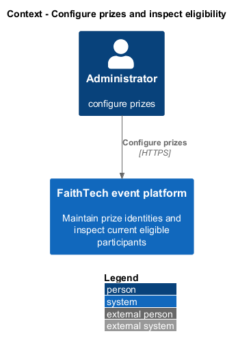
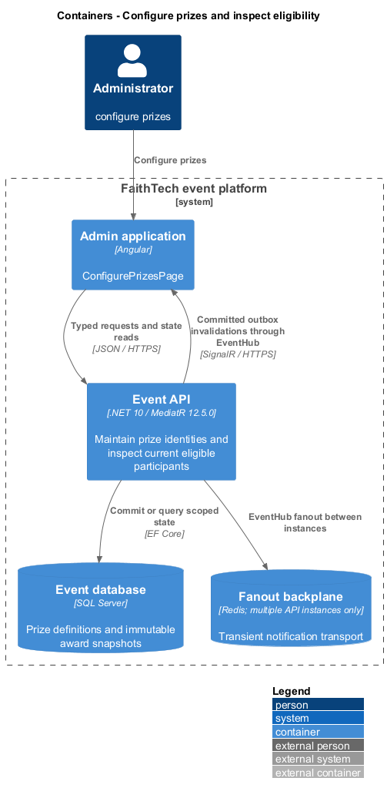
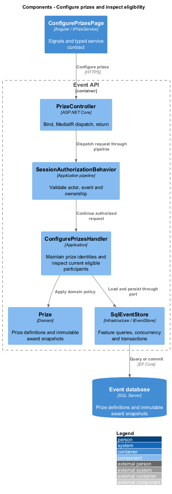
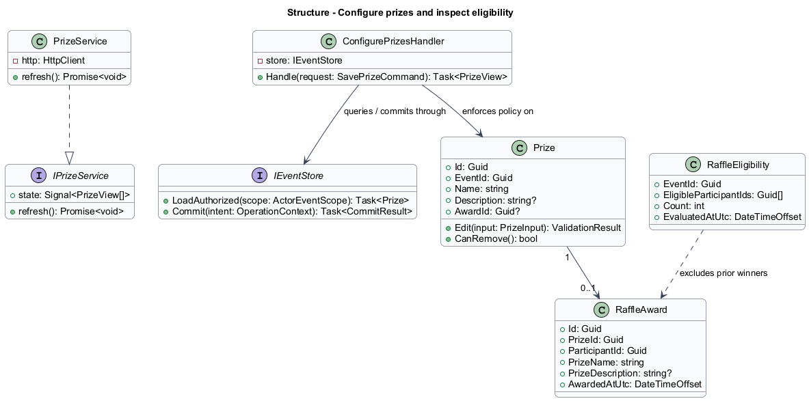
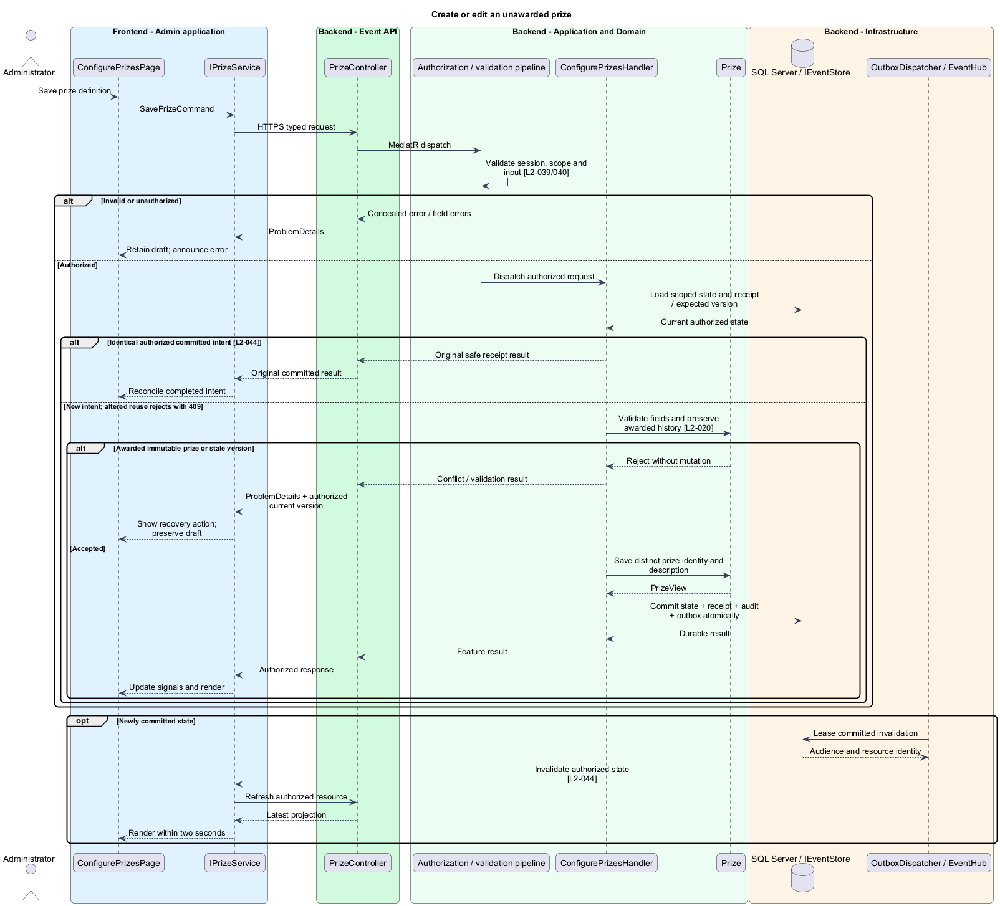
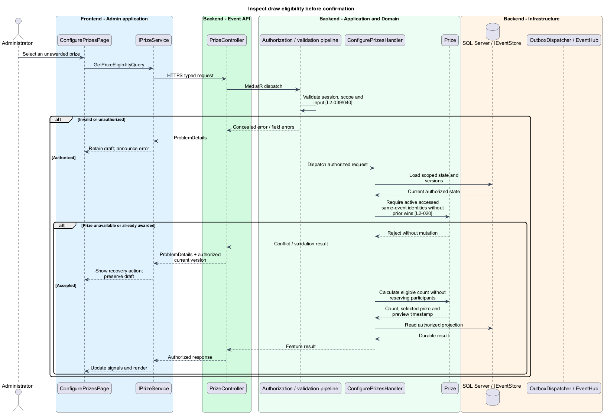

# Configure prizes and inspect eligibility

## Overview

A prize is one event-local item that can be awarded once. Eligibility includes active registrations that have successfully accessed the event and have not already won an event prize. Duplicate names do not make two prizes or two people the same identity.

## Description

This proposed slice follows the [shared architecture contracts](../../README.md). `ConfigurePrizesPage` owns routing and dialogs; domain components consume `IPrizeService` through `PRIZE_SERVICE`. `PrizeService` implements HTTP access in `api`.

`/admin/events/:eventId/raffle` composes `ConfigurePrizesPage`. `GET/POST /api/admin/events/{eventId}/prizes` and `PUT/DELETE /prizes/{prizeId}` dispatch list, create, edit, and remove commands. `GET /prizes/{prizeId}/eligibility` dispatches `GetPrizeEligibilityQuery`. `IPrizeService` exposes these methods. `PrizeInput` contains name/description; `PrizeView` includes ID, version, award status, and any retained award summary.

`ConfigurePrizesHandler` validates names and optional descriptions under common limits. Each prize has a fresh ID regardless of text duplication. Unawarded edits/removal use expected versions. Awarded identity, name/description snapshot, winner, and award time remain immutable history; removal or edits that alter that history are rejected. Participant renames never clear prior-win eligibility because awards reference stable registration IDs.

`RaffleEligibilityPolicy` selects same-event active registrations with `FirstAccessAtUtc` set and excludes every participant ID already in an award for that event. It returns a count and evaluation time to the administrator. The confirmation dialog identifies the selected unawarded prize and current count. Zero eligible participants produces an actionable empty state. Cancellation sends no draw request.

Eligibility preview creates no reservation and guarantees no particular winner. The draw handler rechecks the selected prize and eligible set inside its award transaction; a roster or award change after preview cannot award an ineligible identity. The next feature defines that transaction. Prize/configuration invalidations refresh connected administration and participant raffle views without exposing roster credentials.

Acceptance checks include never-accessed, inactive, reactivated, duplicate-name, and previously awarded registrations. A concurrent eligibility change between preview and confirmation is rechecked at commit. Award-history tests attempt prize edits/removal and participant renames; browser tests verify selected-prize clarity, empty eligibility, and cancellation.

## Requirements

The following verbatim primary excerpts link to their complete normative definitions and Given–When–Then acceptance criteria. Shared constraints apply as specified in the [architecture contracts](../../README.md).

| L2 ID | Refines (L1) | Requirement excerpt |
|---|---|---|
| [L2-020](../../../specs/L2.md#l2-020-raffle-prizes-and-eligibility) | `L1-008` | Administrators must configure prize names and descriptions, with each prize entry representing one award. The eligible pool must contain active participants who successfully accessed the event before the draw and have not won in that event. Duplicate display names must remain distinct identities. |

## Diagrams

Administrator uses the event platform to configure prizes. The context isolates this capability from unrelated event activities.

The Admin application calls the API for authoritative state. SQL Server retains prize definitions and immutable award snapshots; SignalR invalidations prompt authorized reads.

`PrizeController` dispatches through the application pipeline. `ConfigurePrizesHandler` owns the feature policy and uses the persistence port.

`Prize` carries stable identity and feature state. The service interface separates Angular consumers from HTTP; `IEventStore` represents the application persistence boundary. Method shapes are slice-specific views of the shared contracts.

Create or edit an unawarded prize applies validate fields and preserve awarded history [l2-020]. Awarded immutable prize or stale version leaves committed state unchanged; the client retains enough context to recover.

Inspect draw eligibility before confirmation applies require active accessed same-event identities without prior wins [l2-020]. Prize unavailable or already awarded leaves committed state unchanged; the client retains enough context to recover.

