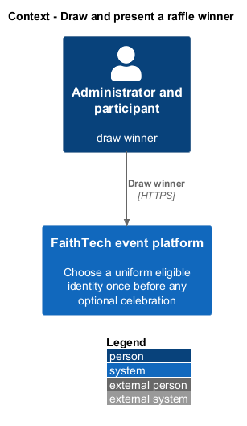
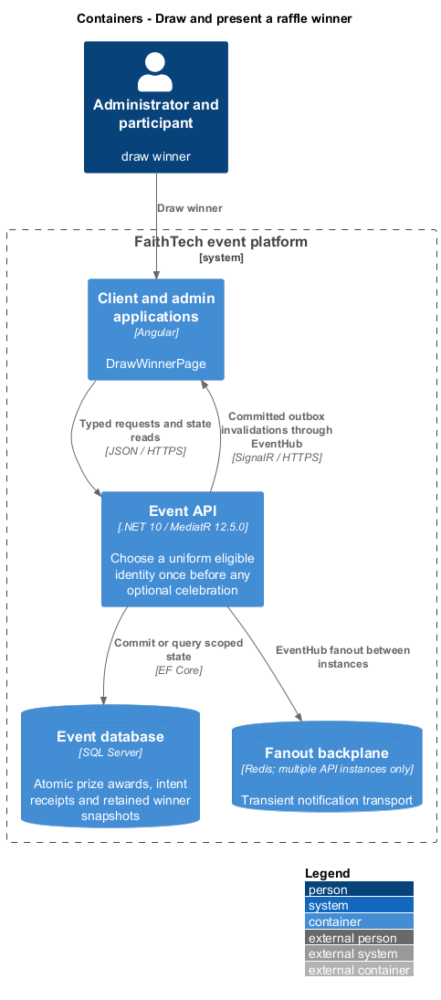
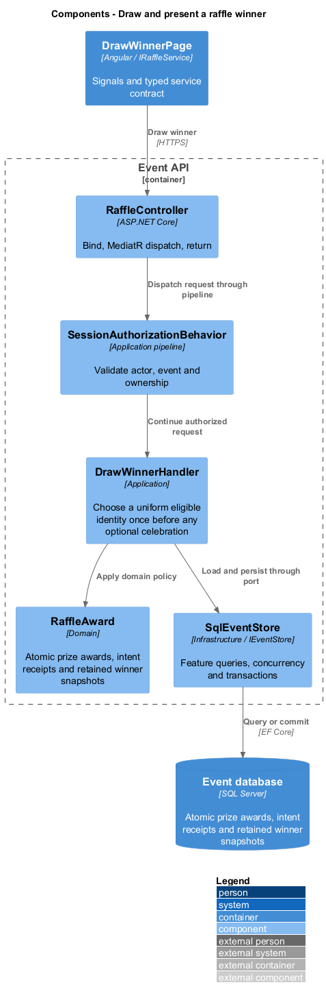
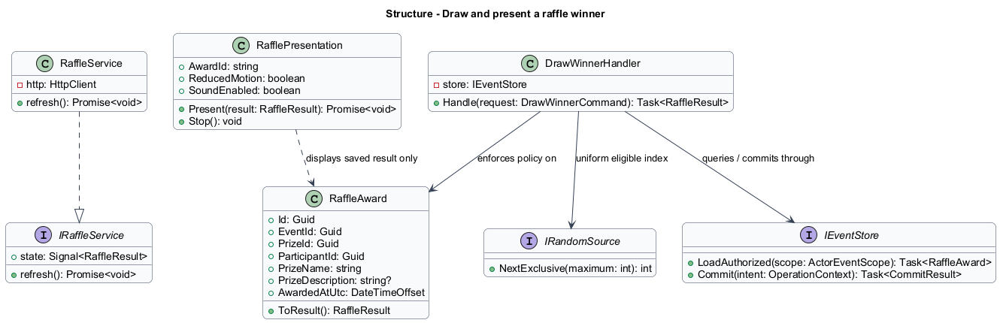
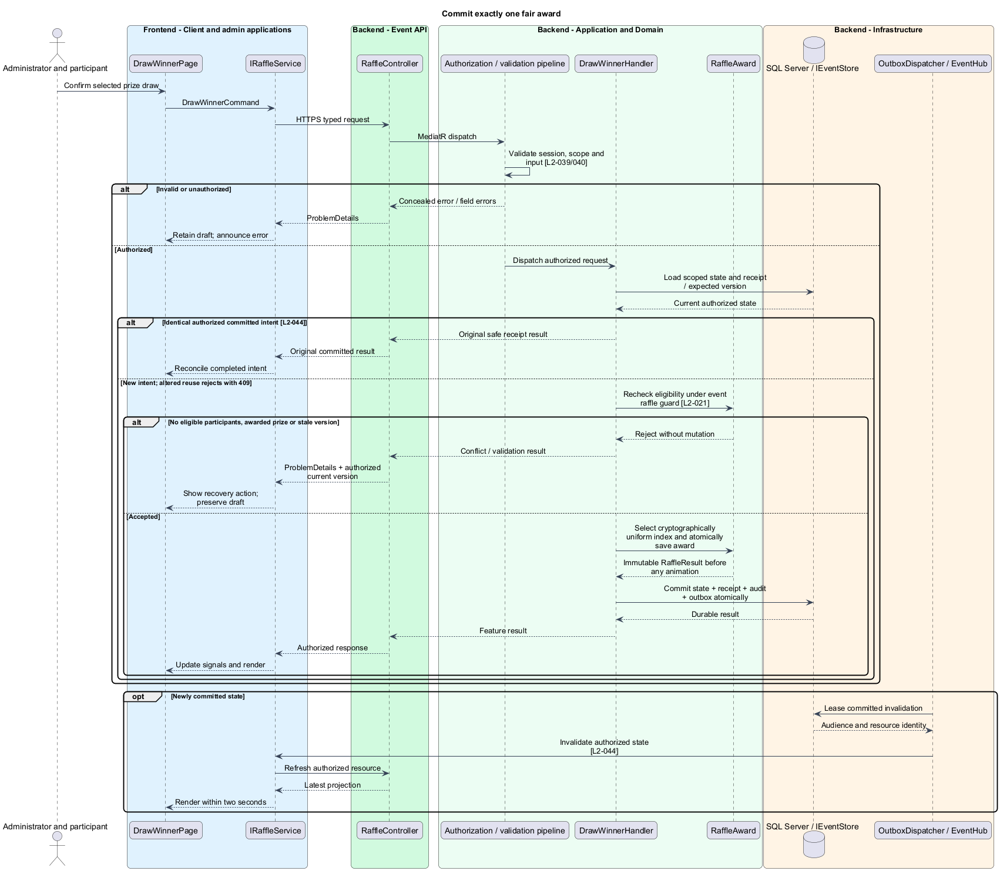
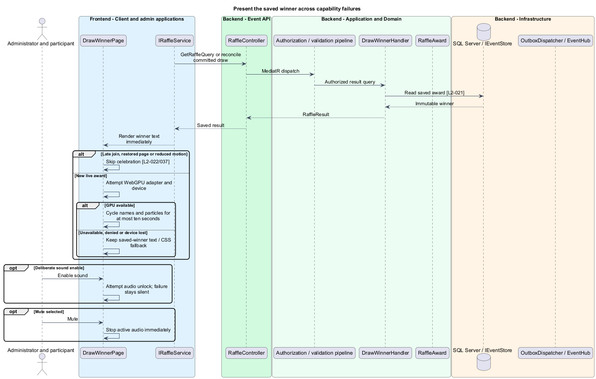

# Draw and present a raffle winner

## Overview

A draw commits one eligible participant as the winner of one prize. Celebration is a browser presentation of that saved result. GPU, audio, navigation, and retry failures cannot alter the winner.

## Description

This proposed slice follows the [shared architecture contracts](../../README.md). `DrawWinnerPage` owns routing and dialogs; domain components consume `IRaffleService` through `RAFFLE_SERVICE`. `RaffleService` implements HTTP access in `api`.

The administrator raffle page calls `POST /api/admin/events/{eventId}/prizes/{prizeId}/draw` with `DrawWinnerCommand { operationId, expectedPrizeVersion }`. Participant `GET /api/events/{eventId}/raffle` returns award history and current presentation data through `GetRaffleQuery`. `IRaffleService` exposes draw, history, and reconcile methods. `RaffleResult` contains award/prize/participant IDs, safe display names, saved prize description, and server award time.

`DrawWinnerHandler` acquires an event raffle guard that serializes award selection and coordinates eligibility-changing registration writes. It checks the receipt first, then the unawarded prize and current active/accessed/no-prior-win set. `IRandomSource` uses `RandomNumberGenerator.GetInt32(count)` to select a uniform index from a stable eligible-ID array, avoiding modulo bias. An empty set rejects without changing the prize.

Unique `(EventId, PrizeId)` and `(EventId, ParticipantId)` constraints protect one award per prize and one win per event. The transaction inserts the immutable award snapshot, receipt, audit, and outbox record before responding. Concurrent draws cannot share a prize or winner. A timeout reconciles the original operation; no automatic replacement draw occurs. SQL failure before commit reveals no winner and starts no celebration.

`RafflePresentation` in the domain library receives the committed result through the injected service. A presentational canvas component in `components` accepts animation inputs without API knowledge. Browser runtime checks attempt WebGPU adapter/device creation; denial, absence, initialization failure, or device loss immediately preserves the same saved winner in a text/CSS fallback. Name cycling and particles complete within ten seconds; the winner text is available independently throughout.

Reduced motion skips cycling and particles. Sound starts muted and is enabled only by deliberate interaction; failed audio unlock remains silent with a usable mute/enable control. Muting stops active audio immediately. A replayed duplicate invalidation does not restart celebration. A late join or restored page shows saved winner text without automatic animation or audio.

Acceptance tests race prizes and administrators, change eligibility before commit, and retry after a lost award response. Statistical checks test the injected uniform-index boundary behavior without treating a small random sample as proof of fairness. Browser capability cases cover denied/unavailable GPU, device loss, reduced motion, sound enable/mute, interruption, and late entry; all retain the exact committed winner.

## Requirements

The following verbatim primary excerpts link to their complete normative definitions and Given–When–Then acceptance criteria. Shared constraints apply as specified in the [architecture contracts](../../README.md).

| L2 ID | Refines (L1) | Requirement excerpt |
|---|---|---|
| [L2-021](../../../specs/L2.md#l2-021-fair-and-atomic-raffle-results) | `L1-008` | The server must select uniformly from the eligible participant identities using secure randomness and atomically save the draw, prize, and winner before clients animate. The award must be final; replaying an animation must not redraw. Concurrent draws must not award one participant twice in the same event or one prize twice. |
| [L2-022](../../../specs/L2.md#l2-022-raffle-animation-audio-and-celebration) | `L1-008` | With WebGPU available and reduced motion off, the raffle screen must cycle eligible participant names, play playful effects after the user enables sound, settle on the saved winner within ten seconds, and celebrate with particles. The winner must also be presented as accessible text and remain visible after effects finish. |

## Diagrams

Administrator and participant uses the event platform to draw winner. The context isolates this capability from unrelated event activities.

The Client and admin applications calls the API for authoritative state. SQL Server retains atomic prize awards, intent receipts and retained winner snapshots; SignalR invalidations prompt authorized reads.

`RaffleController` dispatches through the application pipeline. `DrawWinnerHandler` owns the feature policy and uses the persistence port.

`RaffleAward` carries stable identity and feature state. The service interface separates Angular consumers from HTTP; `IEventStore` represents the application persistence boundary. Method shapes are slice-specific views of the shared contracts.

Commit exactly one fair award applies recheck eligibility under event raffle guard [l2-021]. No eligible participants, awarded prize or stale version leaves committed state unchanged; the client retains enough context to recover.

The result arrives before presentation begins. Reduced motion, late entry, and GPU failure retain the same winner and keep audio under deliberate user control.

