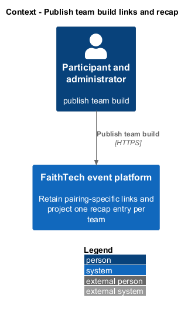
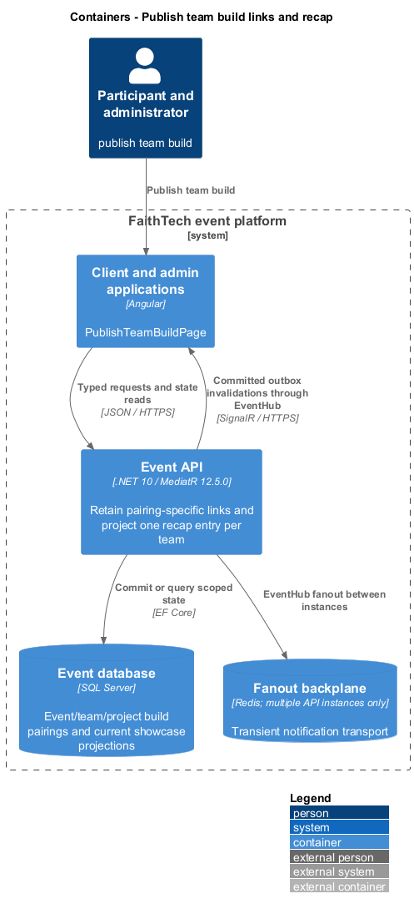
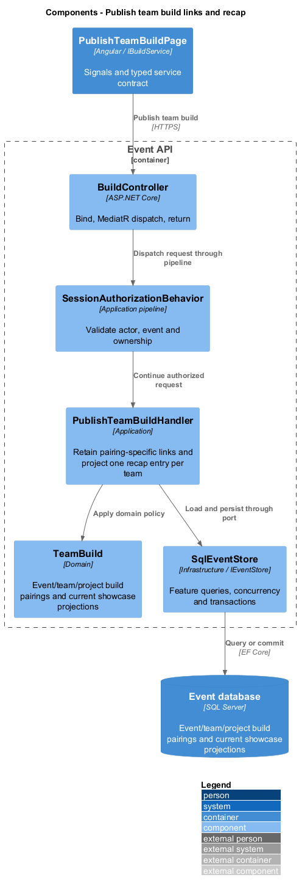
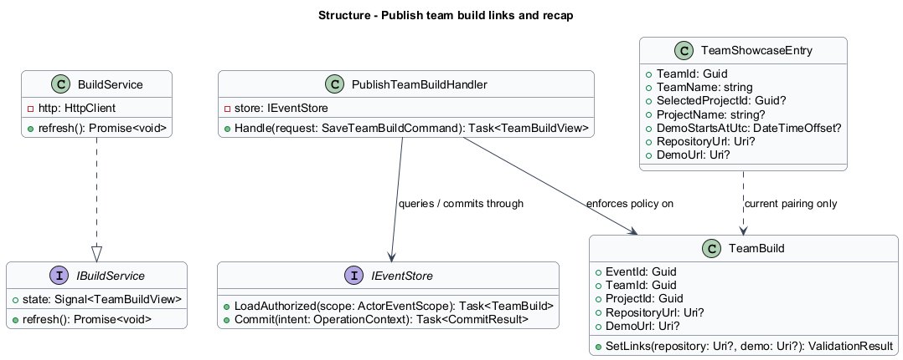
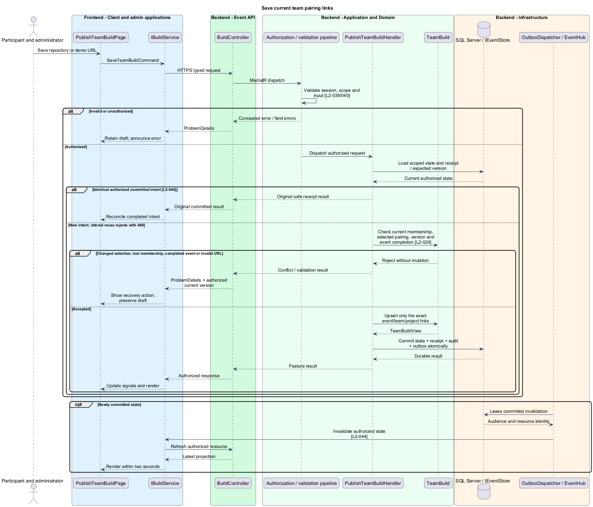
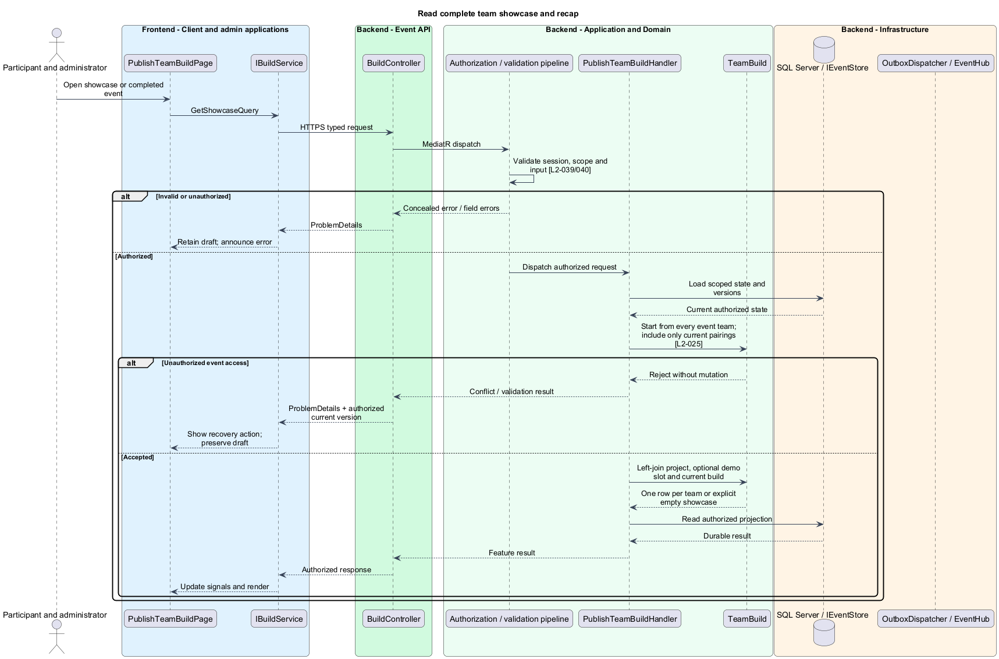

# Publish team build links and recap

## Overview

A team build stores repository and demo links for one event/team/project pairing. The showcase presents one entry for each team, including incomplete entries. Changing a selected project changes which pairing is visible without erasing earlier links.

## Description

This proposed slice follows the [shared architecture contracts](../../README.md). `PublishTeamBuildPage` owns routing and dialogs; domain components consume `IBuildService` through `BUILD_SERVICE`. `BuildService` implements HTTP access in `api`.

Project/team detail embeds a build editor; `/events/:eventId/showcase` and the completed-event screen host `PublishTeamBuildPage`. `GET/PUT /api/events/{eventId}/teams/{teamId}/build` dispatch `GetCurrentTeamBuildQuery` and `SaveTeamBuildCommand { projectId, repositoryUrl, demoUrl }`. Administrator correction uses the equivalent `/api/admin/events/{eventId}/teams/{teamId}/build`. `GET /api/events/{eventId}/showcase` dispatches `GetShowcaseQuery`.

`IBuildService` exposes current, save, and showcase. `TeamBuildView` contains the complete pairing key, optional URLs, and expected version. `PublishTeamBuildHandler` derives membership from the session and checks the selected project still equals the submitted project ID. Participant edits require current team membership and a not-completed event. Administrator corrections remain available afterward. A selection change or lost membership returns a conflict/denial while preserving the proposed draft.

Unique `(EventId, TeamId, ProjectId)` identifies `TeamBuild`. Optional repository/demo values accept only validated absolute HTTPS URLs without user information. Emptying a link clears that field on the current pairing. The transaction checks team selection and build version together, then stores links, receipt, audit, and invalidation. No URL is fetched by the API.

Selecting a previously unused pairing yields blank links without copying another team's work. Re-selecting an old pairing restores that exact team's retained links. Clearing a team's selection hides the pairing but does not delete it. A member moving to another team receives the destination team's context; stored links remain attached to their original team/project.

`GetShowcaseQuery` starts from every event team and left-joins its current selected project, current pairing, and optional demo slot. The response therefore contains one `TeamShowcaseEntry` per team, even with no project or demo. Two teams sharing one project remain separate rows. Unselected project choices and historical pairings never enter the showcase. Missing values have explicit unavailable/not-added states; zero teams produces an empty showcase while closing content still renders.

At event end the live-event route composes closing text and this same projection as recap. Corrected administrator content refreshes normally without reopening participant edits. External links are safe anchors and remain independent of optional Liturgy actions.

Acceptance tests switch A→B→A project pairings, use two teams on one project, move a member, clear selection, and race a link save with a selection change. Recap checks cover zero teams, missing projects/demos/links, retained histories, exact event-end denial, and allowed administrator corrections.

## Requirements

The following verbatim primary excerpts link to their complete normative definitions and Given–When–Then acceptance criteria. Shared constraints apply as specified in the [architecture contracts](../../README.md).

| L2 ID | Refines (L1) | Requirement excerpt |
|---|---|---|
| [L2-024](../../../specs/L2.md#l2-024-team-repository-and-demo-links) | `L1-009` | Team members and administrators must save optional repository and demo URLs on the team's event project entry, so multiple teams choosing one project can showcase different builds. Team members can edit these links until event end; administrators can correct them afterward. This version stores links and does not host repositories or uploaded demo videos. |
| [L2-025](../../../specs/L2.md#l2-025-showcase-and-event-recap) | `L1-009` | The showcase must list event teams, chosen project descriptions, and supplied repository/demo links. The event recap must become the default client screen at event end, include configured closing content and showcase entries, and remain available to active event registrations. Missing demos must not prevent other projects from appearing. |

## Diagrams

Participant and administrator uses the event platform to publish team build. The context isolates this capability from unrelated event activities.

The Client and admin applications calls the API for authoritative state. SQL Server retains event/team/project build pairings and current showcase projections; SignalR invalidations prompt authorized reads.

`BuildController` dispatches through the application pipeline. `PublishTeamBuildHandler` owns the feature policy and uses the persistence port.

`TeamBuild` carries stable identity and feature state. The service interface separates Angular consumers from HTTP; `IEventStore` represents the application persistence boundary. Method shapes are slice-specific views of the shared contracts.

Save current team pairing links applies check current membership, selected pairing, version and event completion [l2-024]. Changed selection, lost membership, completed event or invalid URL leaves committed state unchanged; the client retains enough context to recover.

Read complete team showcase and recap applies start from every event team; include only current pairings [l2-025]. Unauthorized event access leaves committed state unchanged; the client retains enough context to recover.

