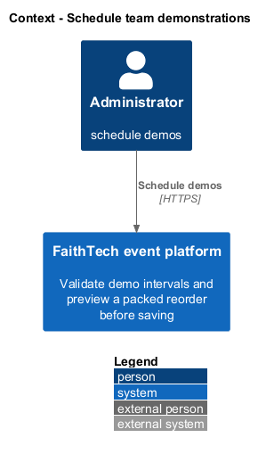
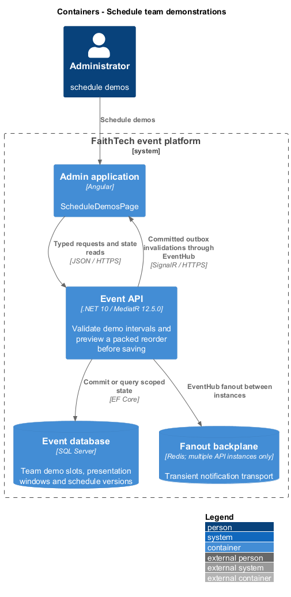
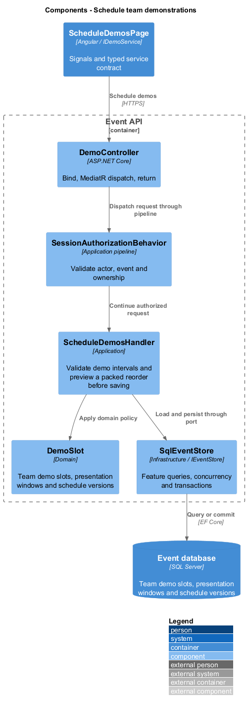
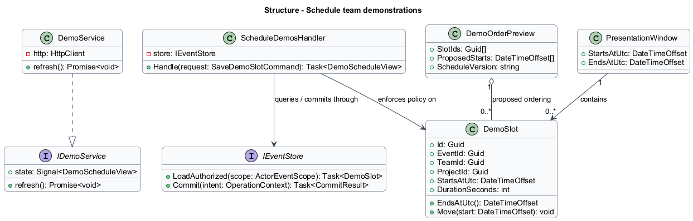
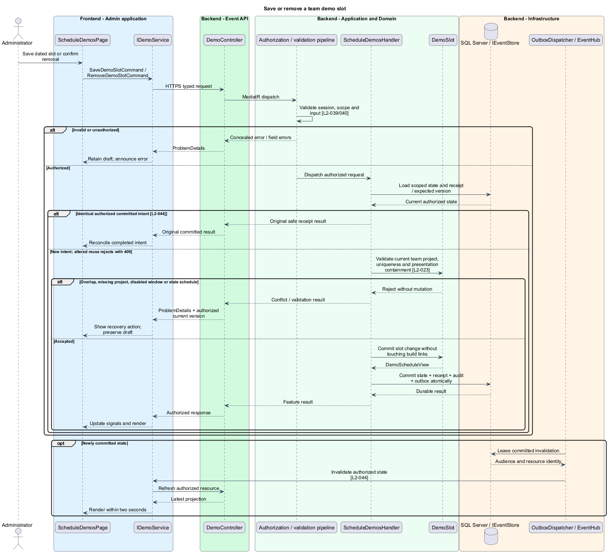
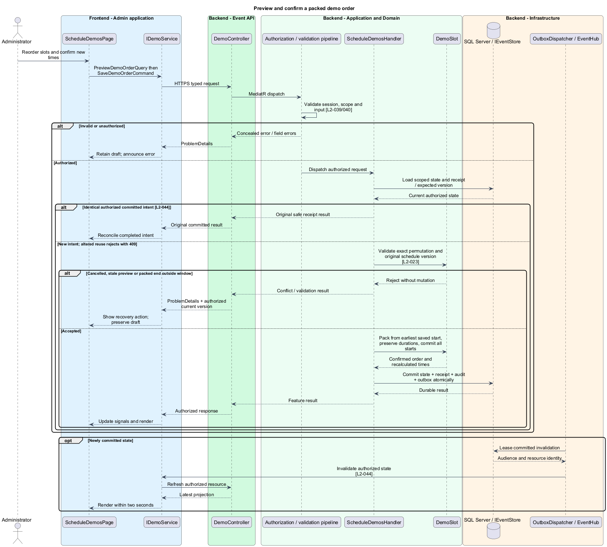

# Schedule team demonstrations

## Overview

A demo slot reserves a dated presentation interval for one team and its current project. The demo list exposes scheduled order and the currently presenting team. Reordering proposes new starts while preserving each slot's duration.

## Description

This proposed slice follows the [shared architecture contracts](../../README.md). `ScheduleDemosPage` owns routing and dialogs; domain components consume `IDemoService` through `DEMO_SERVICE`. `DemoService` implements HTTP access in `api`.

`/admin/events/:eventId/demos` hosts `ScheduleDemosPage`; the participant schedule consumes the read projection. `GET/POST /api/admin/events/{eventId}/demos`, `PUT/DELETE /demos/{slotId}`, and `POST /demos/order-preview` dispatch demo queries and commands. `PUT /demos/order` confirms `SaveDemoOrderCommand { slotIds, expectedScheduleVersion }`. Participant `GET /api/events/{eventId}/demos` returns `DemoScheduleView`.

`IDemoService` exposes list, save, remove, previewOrder, and saveOrder. `DemoSlotInput` contains team ID, resolved dated start, and positive duration; the server derives the current project ID. `DemoScheduleView` contains ordered slot IDs, team/project names, start/end, current slot ID, and version. Current-slot resolution uses inclusive start/exclusive end; gaps identify no current presenter.

`ScheduleDemosHandler` requires a same-event team with a selected project and an enabled presentation window. Unique `(EventId, TeamId)` permits one slot per team. Under the event schedule guard, it checks positive duration, full containment, and nonoverlap with every other slot. A schedule edit and affected demo intervals validate together. Removing a slot removes only presentation scheduling, never team membership, selection, or build links.

`DemoOrderPolicy` validates that the proposed ID list is an exact permutation of the current slots. It starts at the earliest currently saved slot start and packs slots consecutively in that order, retaining each duration. The preview presents old/new starts and highlights the resulting end. Confirmation checks the schedule version, recomputes the same mapping, validates containment, and commits all starts atomically. Cancellation leaves both order and gaps unchanged. Stale previews require refresh and a new confirmation.

Project selection changes share the team/demo transaction boundary: a new team project updates its slot project without changing team/start/duration. Clearing a selected project is blocked until the slot is removed. Participant demo views resolve repository/demo links from that team's current pairing, not from the project catalog alone.

Acceptance scenarios cover duplicate team slots, overlapping/overnight intervals, missing selection, disabled presentation, gaps, boundary transitions, exact-permutation validation, packed reorder overflow, cancellation, and concurrent project changes. Browser tests verify readable order, current presenter, explicit new timings, and stale-preview recovery.

## Requirements

The following verbatim primary excerpts link to their complete normative definitions and Given–When–Then acceptance criteria. Shared constraints apply as specified in the [architecture contracts](../../README.md).

| L2 ID | Refines (L1) | Requirement excerpt |
|---|---|---|
| [L2-023](../../../specs/L2.md#l2-023-demo-schedule) | `L1-009` | Administrators must create and reorder demo slots containing team, project, start time, and positive duration inside the demonstration interval. Slots must not overlap, and a team must appear at most once. Participants must see ordered slots with the current slot highlighted using server time. |

## Diagrams

Administrator uses the event platform to schedule demos. The context isolates this capability from unrelated event activities.

The Admin application calls the API for authoritative state. SQL Server retains team demo slots, presentation windows and schedule versions; SignalR invalidations prompt authorized reads.

`DemoController` dispatches through the application pipeline. `ScheduleDemosHandler` owns the feature policy and uses the persistence port.

`DemoSlot` carries stable identity and feature state. The service interface separates Angular consumers from HTTP; `IEventStore` represents the application persistence boundary. Method shapes are slice-specific views of the shared contracts.

Save or remove a team demo slot applies validate current team project, uniqueness and presentation containment [l2-023]. Overlap, missing project, disabled window or stale schedule leaves committed state unchanged; the client retains enough context to recover.

Preview and confirm a packed demo order applies validate exact permutation and original schedule version [l2-023]. Cancelled, stale preview or packed end outside window leaves committed state unchanged; the client retains enough context to recover.

